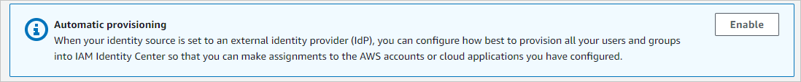
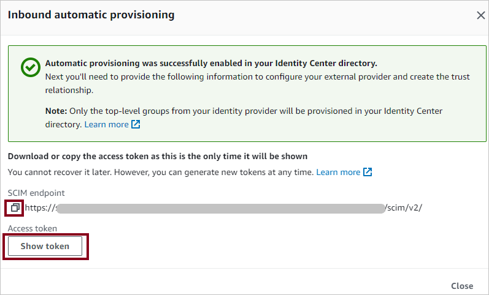

# Tutorial: Configure AWS IAM Identity Center for automatic user provisioning

This tutorial describes the steps you need to perform in both AWS IAM Identity Center(successor to AWS single sign-On) and Microsoft Entra ID to configure automatic user provisioning. When configured, Microsoft Entra ID automatically provisions and de-provisions users and groups to [AWS IAM Identity Center](https://console.aws.amazon.com/singlesignon) using the Microsoft Entra provisioning service. For important details on what this service does, how it works, and frequently asked questions, see [Automate user provisioning and deprovisioning to SaaS applications with Microsoft Entra ID](../app-provisioning/user-provisioning.md). 

## Capabilities Supported
> [!div class="checklist"]
> * Create users in AWS IAM Identity Center
> * Remove users in AWS IAM Identity Center when they no longer require access
> * Keep user attributes synchronized between Microsoft Entra ID and AWS IAM Identity Center
> * Provision groups and group memberships in AWS IAM Identity Center
> * [IAM Identity Center](aws-single-sign-on-tutorial.md) to AWS IAM Identity Center

## Prerequisites

The scenario outlined in this tutorial assumes that you already have the following prerequisites:

* [A Microsoft Entra tenant](../develop/quickstart-create-new-tenant.md) 
* A user account in Microsoft Entra ID with [permission](../roles/permissions-reference.md) to configure provisioning (for example, Application Administrator, Cloud Application administrator, Application Owner, or Global Administrator). 
* A SAML connection from your Microsoft Entra account to AWS IAM Identity Center, as described in Tutorial

## Step 1: Plan your provisioning deployment
1. Learn about [how the provisioning service works](../app-provisioning/user-provisioning.md).
2. Determine who will be in [scope for provisioning](../app-provisioning/define-conditional-rules-for-provisioning-user-accounts.md).
3. Determine what data to [map between Microsoft Entra ID and AWS IAM Identity Center](../app-provisioning/customize-application-attributes.md). 

## Step 2: Configure AWS IAM Identity Center to support provisioning with Microsoft Entra ID

1. Open the [AWS IAM Identity Center](https://console.aws.amazon.com/singlesignon).

2. Choose **Settings** in the left navigation pane

3. In **Settings**, click on Enable in the Automatic provisioning section.

	

4. In the Inbound automatic provisioning dialog box, copy and save the **SCIM endpoint** and **Access Token** (visible after clicking on Show Token). These values will be entered in the **Tenant URL** and **Secret Token** field in the Provisioning tab of your AWS IAM Identity Center application.
	

## Step 3: Add AWS IAM Identity Center from the Microsoft Entra application gallery

Add AWS IAM Identity Center from the Microsoft Entra application gallery to start managing provisioning to AWS IAM Identity Center. If you have previously setup AWS IAM Identity Center for SSO, you can use the same application. Learn more about adding an application from the gallery [here](../manage-apps/add-application-portal.md). 

## Step 4: Define who will be in scope for provisioning 

The Microsoft Entra provisioning service allows you to scope who will be provisioned based on assignment to the application and or based on attributes of the user / group. If you choose to scope who will be provisioned to your app based on assignment, you can use the following [steps](../manage-apps/assign-user-or-group-access-portal.md) to assign users and groups to the application. If you choose to scope who will be provisioned based solely on attributes of the user or group, you can use a scoping filter as described [here](../app-provisioning/define-conditional-rules-for-provisioning-user-accounts.md). 

* Start small. Test with a small set of users and groups before rolling out to everyone. When scope for provisioning is set to assigned users and groups, you can control this by assigning one or two users or groups to the app. When scope is set to all users and groups, you can specify an [attribute based scoping filter](../app-provisioning/define-conditional-rules-for-provisioning-user-accounts.md).

* If you need additional roles, you can [update the application manifest](../develop/howto-add-app-roles-in-azure-ad-apps.md) to add new roles.

## Step 5: Configure automatic user provisioning to AWS IAM Identity Center 

This section guides you through the steps to configure the Microsoft Entra provisioning service to create, update, and disable users and/or groups in TestApp based on user and/or group assignments in Microsoft Entra ID.

### To configure automatic user provisioning for AWS IAM Identity Center in Microsoft Entra ID:

1. Sign in to the [Microsoft Entra admin center](https://entra.microsoft.com) as at least a [Cloud Application Administrator](../roles/permissions-reference.md#cloud-application-administrator).
1. Browse to **Identity** > **Applications** > **Enterprise applications**

	

1. In the applications list, select **AWS IAM Identity Center**.

	

3. Select the **Provisioning** tab.

	

4. Set the **Provisioning Mode** to **Automatic**.

	

5. Under the **Admin Credentials** section, input your AWS IAM Identity Center **Tenant URL** and **Secret Token** retrieved earlier in Step 2. Click **Test Connection** to ensure Microsoft Entra ID can connect to AWS IAM Identity Center.

 	

6. In the **Notification Email** field, enter the email address of a person or group who should receive the provisioning error notifications and select the **Send an email notification when a failure occurs** check box.

	

7. Select **Save**.

8. Under the **Mappings** section, select **Synchronize Microsoft Entra users to AWS IAM Identity Center**.

9. Review the user attributes that are synchronized from Microsoft Entra ID to AWS IAM Identity Center in the **Attribute-Mapping** section. The attributes selected as **Matching** properties are used to match the user accounts in AWS IAM Identity Center for update operations. If you choose to change the [matching target attribute](../app-provisioning/customize-application-attributes.md), you'll need to ensure that the AWS IAM Identity Center API supports filtering users based on that attribute. Select the **Save** button to commit any changes.

   |Attribute|Type|Supported for Filtering|
   |---|---|---|
   |userName|String|&check;|
   |active|Boolean|
   |displayName|String|
   |title|String|
   |emails[type eq "work"].value|String|
   |preferredLanguage|String|
   |name.givenName|String|
   |name.familyName|String|
   |name.formatted|String|
   |addresses[type eq "work"].formatted|String|
   |addresses[type eq "work"].streetAddress|String|
   |addresses[type eq "work"].locality|String|
   |addresses[type eq "work"].region|String|
   |addresses[type eq "work"].postalCode|String|
   |addresses[type eq "work"].country|String|
   |phoneNumbers[type eq "work"].value|String|
   |externalId|String|
   |locale|String|
   |timezone|String|
   |urn:ietf:params:scim:schemas:extension:enterprise:2.0:User:employeeNumber|String|
   |urn:ietf:params:scim:schemas:extension:enterprise:2.0:User:department|String|
   |urn:ietf:params:scim:schemas:extension:enterprise:2.0:User:division|String|
   |urn:ietf:params:scim:schemas:extension:enterprise:2.0:User:costCenter|String|
   |urn:ietf:params:scim:schemas:extension:enterprise:2.0:User:organization|String|
   |urn:ietf:params:scim:schemas:extension:enterprise:2.0:User:manager|Reference|

10. Under the **Mappings** section, select **Synchronize Microsoft Entra groups to AWS IAM Identity Center**.

11. Review the group attributes that are synchronized from Microsoft Entra ID to AWS IAM Identity Center in the **Attribute-Mapping** section. The attributes selected as **Matching** properties are used to match the groups in AWS IAM Identity Center for update operations. Select the **Save** button to commit any changes.

      |Attribute|Type|Supported for Filtering|
      |---|---|---|
      |displayName|String|&check;|
      |externalId|String|
      |members|Reference|

12. To configure scoping filters, refer to the following instructions provided in the [Scoping filter tutorial](../app-provisioning/define-conditional-rules-for-provisioning-user-accounts.md).

13. To enable the Microsoft Entra provisioning service for AWS IAM Identity Center, change the **Provisioning Status** to **On** in the **Settings** section.

	

14. Define the users and/or groups that you would like to provision to AWS IAM Identity Center by choosing the desired values in **Scope** in the **Settings** section.

	

15. When you are ready to provision, click **Save**.

	

This operation starts the initial synchronization cycle of all users and groups defined in **Scope** in the **Settings** section. The initial cycle takes longer to perform than subsequent cycles, which occur approximately every 40 minutes as long as the Microsoft Entra provisioning service is running. 

## Step 6: Monitor your deployment
Once you've configured provisioning, use the following resources to monitor your deployment:

1. Use the [provisioning logs](../reports-monitoring/concept-provisioning-logs.md) to determine which users have been provisioned successfully or unsuccessfully
2. Check the [progress bar](../app-provisioning/application-provisioning-when-will-provisioning-finish-specific-user.md) to see the status of the provisioning cycle and how close it is to completion
3. If the provisioning configuration seems to be in an unhealthy state, the application goes into quarantine. Learn more about quarantine states [here](../app-provisioning/application-provisioning-quarantine-status.md).

## Just-in-time (JIT) application access with PIM for groups (preview)
With PIM for Groups, you can provide just-in-time access to groups in Amazon Web Services and reduce the number of users that have permanent access to privileged groups in AWS. 

**Configure your enterprise application for SSO and provisioning**
1. Add AWS IAM Identity Center to your tenant, configure it for provisioning as described in the tutorial above, and start provisioning. 
1. Configure [single sign-on](aws-single-sign-on-provisioning-tutorial.md) for AWS IAM Identity Center.
1. Create a [group](/azure/active-directory/fundamentals/how-to-manage-groups) that will provide all users access to the application.
1. Assign the group to the AWS Identity Center application.
1. Assign your test user as a direct member of the group created in the previous step, or provide them access to the group through an access package. This group can be used for persistent, non-admin access in AWS.

**Enable PIM for groups**
1. Create a second group in Microsoft Entra ID. This group will provide access to admin permissions in AWS.
1. Bring the group under [management in Microsoft Entra PIM](/azure/active-directory/privileged-identity-management/groups-discover-groups).
1. Assign your test user as [eligible for the group in PIM](/azure/active-directory/privileged-identity-management/groups-assign-member-owner) with the role set to member.
1. Assign the second group to the AWS IAM Identity Center application.
1. Use on-demand provisioning to create the group in AWS IAM Identity Center.
1. Sign-in to AWS IAM Identity Center and assign the second group the necessary permissions to perform admin tasks.  

Now any end user that was made eligible for the group in PIM can get JIT access to the group in AWS by [activating their group membership](/azure/active-directory/privileged-identity-management/groups-activate-roles#activate-a-role).

> [!IMPORTANT]
> The group membership is provisioned roughly a minute after the activation is complete. Please wait before attempting to sign-in to AWS. If the user is unable to access the necessary group in AWS, please review the troubleshooting tips below and provisioning logs to ensure that the user was successfully provisioned. 

>[!VIDEO https://www.youtube.com/embed/aXp2CUFe7vk]

## Troubleshooting Tips

### Missing attributes
When provisioning a user to AWS, they're required to have the following attributes

* firstName
* lastName
* displayName
* userName 

Users who don't have these attributes will fail with the following error

### Multi-valued attributes
AWS doesn't support the following multi-valued attributes:

* email
* phone numbers

Trying to flow the above as multi-valued attributes will result in the following error message

There are two ways to resolve this

1. Ensure the user only has one value for phoneNumber/email
2. Remove the duplicate attributes. For example, having two different attributes being mapped from Microsoft Entra ID both mapped to "phoneNumber___" on the AWS side  would result in the error if both attributes have values in Microsoft Entra ID. Only having one attribute mapped to a "phoneNumber____ " attribute would resolve the error.

### Invalid characters
Currently AWS IAM Identity Center is not allowing some other characters that Microsoft Entra ID supports like tab (\t), new line (\n), return carriage (\r), and characters such as " <|>|;|:% ".

You can also check the AWS IAM Identity Center  troubleshooting tips [here](https://docs.aws.amazon.com/singlesignon/latest/userguide/azure-ad-idp.html#azure-ad-troubleshooting) for more troubleshooting tips

## Additional resources

* [Managing user account provisioning for Enterprise Apps](../app-provisioning/configure-automatic-user-provisioning-portal.md)
* [What is application access and IAM Identity Center with Microsoft Entra ID?](../manage-apps/what-is-single-sign-on.md)

## Next steps

* [Learn how to review logs and get reports on provisioning activity](../app-provisioning/check-status-user-account-provisioning.md)
