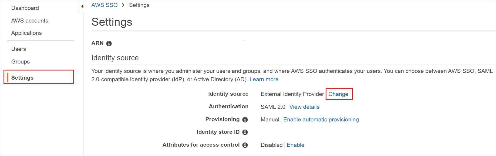
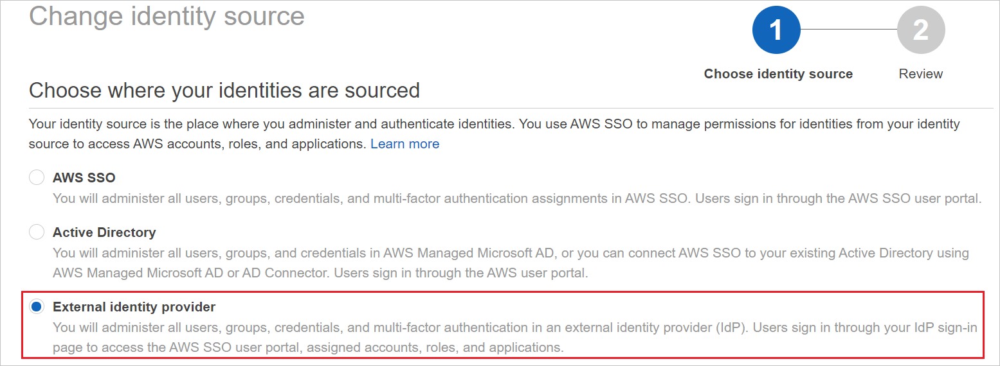

# Tutorial: Azure AD SSO integration with AWS IAM Identity Center

In this tutorial, you'll learn how to integrate AWS IAM Identity Center (successor to AWS Single Sign-On) with Azure Active Directory (Azure AD). When you integrate AWS IAM Identity Center with Azure AD, you can:

* Control in Azure AD who has access to AWS IAM Identity Center.
* Enable your users to be automatically signed-in to AWS IAM Identity Center with their Azure AD accounts.
* Manage your accounts in one central location - the Azure portal.

## Prerequisites

To get started, you need the following items:

* An Azure AD subscription. If you don't have a subscription, you can get a [free account](https://azure.microsoft.com/free/).
* AWS IAM Identity Center enabled subscription.

## Scenario description

In this tutorial, you configure and test Azure AD SSO in a test environment.

* AWS IAM Identity Center supports **SP and IDP** initiated SSO.

* AWS IAM Identity Center supports [**Automated user provisioning**](./aws-single-sign-on-provisioning-tutorial.md).

## Add AWS IAM Identity Center from the gallery

To configure the integration of AWS IAM Identity Center into Azure AD, you need to add AWS IAM Identity Center from the gallery to your list of managed SaaS apps.

1. Sign in to the Azure portal using either a work or school account, or a personal Microsoft account.
1. On the left navigation pane, select the **Azure Active Directory** service.
1. Navigate to **Enterprise Applications** and then select **All Applications**.
1. To add new application, select **New application**.
1. In the **Add from the gallery** section, type **AWS IAM Identity Center** in the search box.
1. Select **AWS IAM Identity Center** from results panel and then add the app. Wait a few seconds while the app is added to your tenant.

 Alternatively, you can also use the [Enterprise App Configuration Wizard](https://portal.office.com/AdminPortal/home?Q=Docs#/azureadappintegration). In this wizard, you can add an application to your tenant, add users/groups to the app, assign roles, as well as walk through the SSO configuration as well. [Learn more about Microsoft 365 wizards.](/microsoft-365/admin/misc/azure-ad-setup-guides)

## Configure and test Azure AD SSO for AWS IAM Identity Center

Configure and test Azure AD SSO with AWS IAM Identity Center using a test user called **B.Simon**. For SSO to work, you need to establish a link relationship between an Azure AD user and the related user in AWS IAM Identity Center.

To configure and test Azure AD SSO with AWS IAM Identity Center, perform the following steps:

1. **[Configure Azure AD SSO](#configure-azure-ad-sso)** - to enable your users to use this feature.
    1. **[Create an Azure AD test user](#create-an-azure-ad-test-user)** - to test Azure AD single sign-on with B.Simon.
    1. **[Assign the Azure AD test user](#assign-the-azure-ad-test-user)** - to enable B.Simon to use Azure AD single sign-on.
1. **[Configure AWS IAM Identity Center SSO](#configure-aws-iam-identity-center-sso)** - to configure the single sign-on settings on application side.
    1. **[Create AWS IAM Identity Center test user](#create-aws-iam-identity-center-test-user)** - to have a counterpart of B.Simon in AWS IAM Identity Center that is linked to the Azure AD representation of user.
1. **[Test SSO](#test-sso)** - to verify whether the configuration works.

## Configure Azure AD SSO

Follow these steps to enable Azure AD SSO in the Azure portal.

1. In the Azure portal, on the **AWS IAM Identity Center** application integration page, find the **Manage** section and select **single sign-on**.
1. On the **Select a single sign-on method** page, select **SAML**.
1. On the **Set up single sign-on with SAML** page, click the pencil icon for **Basic SAML Configuration** to edit the settings.

   

1. If you have **Service Provider metadata file**, on the **Basic SAML Configuration** section, perform the following steps:

	a. Click **Upload metadata file**.

	b. Click on **folder logo**  to select metadata file which is explained to download in **[Configure AWS IAM Identity Center SSO](#configure-aws-iam-identity-center-sso)** section and click **Add**.

	

	c. Once the metadata file is successfully uploaded, the **Identifier** and **Reply URL** values get auto populated in Basic SAML Configuration section.

	> [!Note]
	> If the **Identifier** and **Reply URL** values are not getting auto populated, then fill in the values manually according to your requirement.

    > [!Note]
    > When changing identity provider in AWS (i.e. from AD to external provider such as Azure AD) the AWS metadata will change and need to be reuploaded to Azure for SSO to function correctly.

1. If you don't have **Service Provider metadata file**, perform the following steps on the **Basic SAML Configuration** section, if you wish to configure the application in **IDP** initiated mode, perform the following steps:

    a. In the **Identifier** text box, type a URL using the following pattern:
    `https://<REGION>.signin.aws.amazon.com/platform/saml/<ID>`

    b. In the **Reply URL** text box, type a URL using the following pattern:
    `https://<REGION>.signin.aws.amazon.com/platform/saml/acs/<ID>`

1. Click **Set additional URLs** and perform the following step if you wish to configure the application in **SP** initiated mode:

    In the **Sign-on URL** text box, type a URL using the following pattern:
    `https://portal.sso.<REGION>.amazonaws.com/saml/assertion/<ID>`

	> [!NOTE]
	> These values are not real. Update these values with the actual Identifier, Reply URL and Sign-on URL. Contact [AWS IAM Identity Center Client support team](mailto:aws-sso-partners@amazon.com) to get these values. You can also refer to the patterns shown in the **Basic SAML Configuration** section in the Azure portal.

1. AWS IAM Identity Center application expects the SAML assertions in a specific format, which requires you to add custom attribute mappings to your SAML token attributes configuration. The following screenshot shows the list of default attributes.

	

    > [!NOTE]
    > If ABAC is enabled in AWS IAM Identity Center, the additional attributes may be passed as session tags directly into AWS accounts.

1. On the **Set up single sign-on with SAML** page, in the **SAML Signing Certificate** section,  find **Certificate(Base64)** and select **Download** to download the certificate and save it on your computer.

	

1. On the **Set up AWS IAM Identity Center** section, copy the appropriate URL(s) based on your requirement.

	

### Create an Azure AD test user

In this section, you'll create a test user in the Azure portal called B.Simon.

1. From the left pane in the Azure portal, select **Azure Active Directory**, select **Users**, and then select **All users**.
1. Select **New user** at the top of the screen.
1. In the **User** properties, follow these steps:
   1. In the **Name** field, enter `B.Simon`.  
   1. In the **User name** field, enter the username@companydomain.extension. For example, `B.Simon@contoso.com`.
   1. Select the **Show password** check box, and then write down the value that's displayed in the **Password** box.
   1. Click **Create**.

### Assign the Azure AD test user

In this section, you'll enable B.Simon to use Azure single sign-on by granting access to AWS IAM Identity Center.

1. In the Azure portal, select **Enterprise Applications**, and then select **All applications**.
1. In the applications list, select **AWS IAM Identity Center**.
1. In the app's overview page, find the **Manage** section and select **Users and groups**.
1. Select **Add user**, then select **Users and groups** in the **Add Assignment** dialog.
1. In the **Users and groups** dialog, select **B.Simon** from the Users list, then click the **Select** button at the bottom of the screen.
1. If you are expecting a role to be assigned to the users, you can select it from the **Select a role** dropdown. If no role has been set up for this app, you see "Default Access" role selected.
1. In the **Add Assignment** dialog, click the **Assign** button.

## Configure AWS IAM Identity Center SSO

1. To automate the configuration within AWS IAM Identity Center, you need to install **My Apps Secure Sign-in browser extension** by clicking **Install the extension**.

	

2. After adding extension to the browser, click on **Set up AWS IAM Identity Center** will direct you to the AWS IAM Identity Center application. From there, provide the admin credentials to sign into AWS IAM Identity Center. The browser extension will automatically configure the application for you and automate steps 3-10.

	

3. If you want to setup AWS IAM Identity Center manually, in a different web browser window, sign in to your AWS IAM Identity Center company site as an administrator.

1. Go to the **Services -> Security, Identity, & Compliance -> AWS IAM Identity Center**.
2. In the left navigation pane, choose **Settings**.
3. On the **Settings** page, find **Identity source**, click on **Actions** pull-down menu, and select Change **identity source**.

    

4. On the Change identity source page, choose **External identity provider**.

    
    

1. Perform the below steps in the **Configure external identity provider** section:

    

    a. In the **Service provider metadata** section, find **AWS SSO SAML metadata**, select **Download metadata file** to download the metadata file and save it on your computer and use this metadata file to upload on Azure portal.

    b. Copy **AWS access portal sign-in URL** value, paste this value into the **Sign on URL** text box in the **Basic SAML Configuration section** in the Azure portal.

    c. In the **Identity provider metadata** section, select **Choose file** to upload the metadata file which you have downloaded from the Azure portal.

    d. Choose **Next: Review**.

8. In the text box, type **ACCEPT** to change the identity source.

    

9. Click **Change identity source**.

### Create AWS IAM Identity Center test user

1. Open the **AWS IAM Identity Center console**.

2. In the left navigation pane, choose **Users**.

3. On the Users page, choose **Add user**.

4. On the Add user page, follow these steps:

    a. In the **Username** field, enter B.Simon.

    b. In the **Email address** field, enter the `username@companydomain.extension`. For example, `B.Simon@contoso.com`.

    c. In the **Confirm email address** field, re-enter the email address from the previous step.

    d. In the First name field, enter `Jane`.

    e. In the Last name field, enter `Doe`.

    f. In the Display name field, enter `Jane Doe`.

    g. Choose **Next**, and then **Next** again.

    > [!NOTE]
    > Make sure the username entered in AWS IAM Identity Center  matches the user’s Azure AD sign-in name. This will you help avoid any authentication problems.

5. Choose **Add user**.
6. Next, you will assign the user to your AWS account. To do so, in the left navigation pane of the
AWS IAM Identity Center console, choose **AWS accounts**.
7. On the AWS Accounts page, select the AWS organization tab, check the box next to the AWS
account you want to assign to the user. Then choose **Assign users**.
8. On the Assign Users page, find and check the box next to the user B.Simon. Then choose **Next:
Permission sets**.
9. Under the select permission sets section, check the box next to the permission set you want to
assign to the user B.Simon. If you don’t have an existing permission set, choose **Create new
permission set**.

    > [!NOTE]
    > Permission sets define the level of access that users and groups have to an AWS account. To learn more
about permission sets, see the **AWS IAM Identity Center Multi Account Permissions** page.
10. Choose **Finish**.

> [!NOTE]
> AWS IAM Identity Center also supports automatic user provisioning, you can find more details [here](./aws-single-sign-on-provisioning-tutorial.md) on how to configure automatic user provisioning.

## Test SSO 

In this section, you test your Azure AD single sign-on configuration with following options. 

#### SP initiated:

* Click on **Test this application** in Azure portal. This will redirect to AWS IAM Identity Center sign-in URL where you can initiate the login flow.  

* Go to AWS IAM Identity Center sign-in URL directly and initiate the login flow from there.

#### IDP initiated:

* Click on **Test this application** in Azure portal and you should be automatically signed in to the AWS IAM Identity Center for which you set up the SSO. 

You can also use Microsoft My Apps to test the application in any mode. When you click the AWS IAM Identity Center tile in the My Apps, if configured in SP mode you would be redirected to the application sign on page for initiating the login flow and if configured in IDP mode, you should be automatically signed in to the AWS IAM Identity Center for which you set up the SSO. For more information about the My Apps, see [Introduction to the My Apps](https://support.microsoft.com/account-billing/sign-in-and-start-apps-from-the-my-apps-portal-2f3b1bae-0e5a-4a86-a33e-876fbd2a4510).

## Next steps

Once you configure AWS IAM Identity Center you can enforce session control, which protects exfiltration and infiltration of your organization’s sensitive data in real time. Session control extends from Conditional Access. [Learn how to enforce session control with Microsoft Defender for Cloud Apps](/cloud-app-security/proxy-deployment-any-app).
