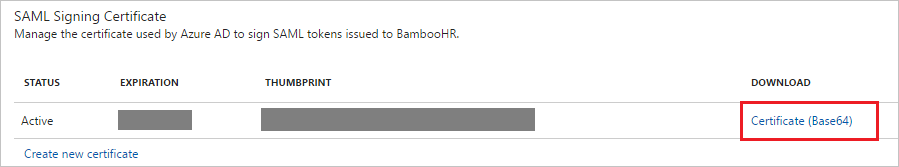
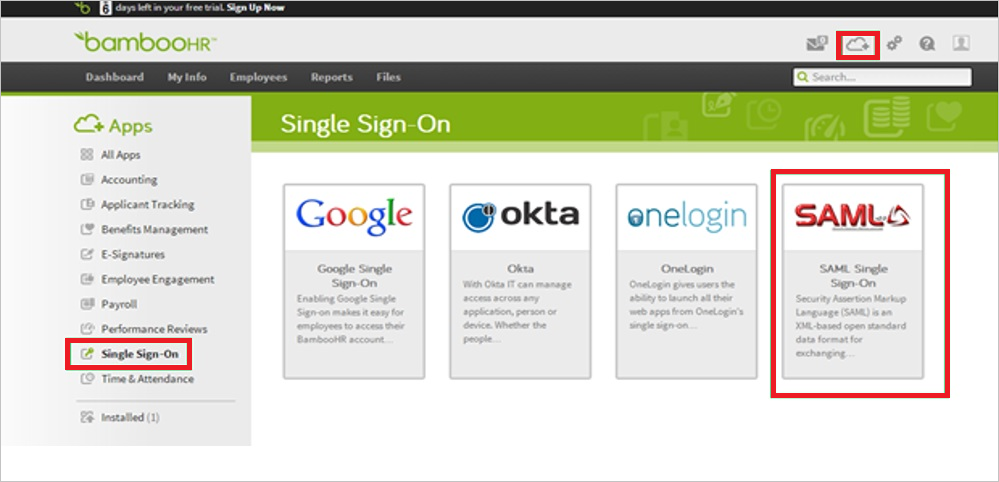

---
title: 'Tutorial: Azure Active Directory integration with BambooHR | Microsoft Docs'
description: Learn how to configure single sign-on between Azure Active Directory and BambooHR.
services: active-directory
documentationCenter: na
author: jeevansd
manager: femila
ms.reviewer: joflore

ms.assetid: f826b5d2-9c64-47df-bbbf-0adf9eb0fa71
ms.service: active-directory
ms.component: saas-app-tutorial
ms.workload: identity
ms.tgt_pltfrm: na
ms.devlang: na
ms.topic: article
ms.date: 01/18/2018
ms.author: jeedes

---
# Tutorial: Azure Active Directory integration with BambooHR

In this tutorial, you learn how to integrate BambooHR with Azure Active Directory (Azure AD).

Integrating BambooHR with Azure AD provides the following benefits:

- You can control in Azure AD who has access to BambooHR.
- You can enable your users to automatically get signed in to BambooHR by using single sign-on (SSO) with their Azure AD accounts.
- You can manage your accounts in one central location, the Azure portal.

For more information about SaaS app integration with Azure AD, see [What is application access and single sign-on with Azure Active Directory?](../manage-apps/what-is-single-sign-on.md).

## Prerequisites

To configure Azure AD integration with BambooHR, you need the following items:

- An Azure AD subscription
- A BambooHR SSO-enabled subscription

> [!NOTE]
> When you test the steps in this tutorial, we recommend that you not use a production environment.

To test the steps in this tutorial, follow these recommendations:

- Do not use your production environment, unless it is necessary.
- If you don't have an Azure AD trial environment, you can [get a free, one-month trial](https://azure.microsoft.com/pricing/free-trial/).

## Scenario description
In this tutorial, you test Azure AD single sign-on in a test environment. 

The scenario that this tutorial outlines consists of two main building blocks:

1. Adding BambooHR from the gallery
1. Configuring and testing Azure AD single sign-on

## Add BambooHR from the gallery
To configure the integration of BambooHR into Azure AD, add BambooHR from the gallery to your list of managed SaaS apps by doing the following:

1. In the [Azure portal](https://portal.azure.com), in the left pane, select **Azure Active Directory**. 

	![The Azure Active Directory button][1]

1. Select **Enterprise applications** > **All applications**.

	![The Enterprise applications pane][2]
	
1. To add an application, select **New application**.

	![The "New application" button][3]

1. In the search box, type **BambooHR**. In the results list, select **BambooHR**, and then select **Add**.

	

## Configure and test Azure AD single sign-on

In this section, you configure and test Azure AD SSO with BambooHR by using test user "Britta Simon."

For SSO to work, Azure AD needs to know what its counterpart user is in BambooHR. In other words, you must establish a link relationship between the Azure AD user and the related user in BambooHR.

To establish the link relationship in BambooHR, assign the Azure AD **user name** value as the BambooHR **Username** value.

To configure and test Azure AD SSO with BambooHR, complete the building blocks in the next five sections.

### Configure Azure AD single sign-on

In this section, you enable Azure AD SSO in the Azure portal and configure SSO in your BambooHR application by doing the following:

1. In the Azure portal, on the **BambooHR** application integration page, select **Single sign-on**.

	![Configure single sign-on link][4]

1. In the **Single sign-on** window, in the **Mode** drop-down list, select **SAML-based Sign-on**.
 
	

1. Under **BambooHR Domain and URLs**, do the following:

	

    a. In the **Sign on URL** box, type a URL in the following format: `https://<company>.bamboohr.com`.

	b. In the **Identifier** box, type a value: `BambooHR-SAML`.

	> [!NOTE] 
	> The **Sign on URL** value is not real. Update it with your actual sign-on URL. To obtain the value, contact the [BambooHR client support team](https://www.bamboohr.com/contact.php). 
 
1. Under **SAML Signing Certificate**, select **Certificate (Base64)**, and then save the certificate file on your computer.

	 

1. Select **Save**.

	

1. Under **BambooHR Configuration**, select **Configure BambooHR** to open the **Configure sign-on** window. In the **Quick Reference** section, copy the **SAML Single Sign-On Service URL** for later use.

	 

1. In a new window, sign in to your BambooHR company site as an administrator.

1. On the home page, do the following:
   
       

    a. Select **Apps**.
   
    b. In the **Apps** pane, select **Single Sign-On**.
   
    c. Select **SAML Single Sign-On**.

1. In the **SAML Single Sign-On** pane, do the following:
   
    
   
    a. Into the **SSO Login Url** box, paste the **SAML Single Sign-On Service URL** that you copied from the Azure portal in step 6.
      
    b. In Notepad, open the base-64 encoded certificate that you downloaded from the Azure portal, copy its content, and then paste it into the **X.509 Certificate** box.
   
    c. Select **Save**.

> [!TIP]
> While you're setting up the app, you can read a concise version of these instructions in the [Azure portal](https://portal.azure.com). After you add the app from the **Active Directory** > **Enterprise Applications** section, simply select the **Single Sign-On** tab, and then access the embedded documentation through the **Configuration** section at the bottom. For information, see [Azure AD embedded documentation]( https://go.microsoft.com/fwlink/?linkid=845985).
> 

### Create an Azure AD test user

The objective of this section is to create a test user called Britta Simon in the Azure portal.

   ![Create Azure AD test user Britta Simon][100]

To create a test user in Azure AD, do the following:

1. In the Azure portal, in the left pane, select **Azure Active Directory**.

    

1. To display the list of users, go to **Users and groups**, and then select **All users**.

    

1. At the top of the **All Users** pane, select **Add**.

    

1. In the **User** window, do the following:

    

    a. In the **Name** box, type **BrittaSimon**.

    b. In the **User name** box, type the email address of user Britta Simon.

    c. Select the **Show Password** check box, and then write down the value that's displayed in the **Password** box.

    d. Select **Create**.
 
### Create a BambooHR test user

To enable Azure AD users to sign in to BambooHR, set them up manually in BambooHR by doing the following:

1. Sign in to your **BambooHR** site as an administrator.

1. In the toolbar at the top, select **Settings**.
   
    

1. Select **Overview**.

1. In the left pane, select **Security** > **Users**.

1. Type the username, password, and email address of the valid Azure AD account that you want to set up.

1. Select **Save**.
		
>[!NOTE]
>To set up Azure AD user accounts, you can also use BambooHR user account-creation tools or APIs.

### Assign the Azure AD test user

Enable user Britta Simon to use Azure SSO by granting access to BambooHR.

![Assign the user role][200] 

To assign user Britta Simon to BambooHR, do the following:

1. In the Azure portal, open the applications view, go to the directory view, and then select **Enterprise applications** > **All applications**.

	![Assign User][201] 

1. In the **Enterprise Applications** list, select **BambooHR**.

	  

1. In the left pane, select **Users and groups**.

	![The "Users and groups" link][202]

1. Select the **Add** button and then, in the **Add Assignment** pane, select **Users and groups**.

	![The Add Assignment pane][203]

1. In the **Users and groups** window, in the **Users** list, select **Britta Simon**.

1. Select the **Select** button.

1. In the **Add Assignment** window, select the **Assign** button.
	
### Test single sign-on

Test your Azure AD SSO configuration by using the Access Panel.

When you select the **BambooHR** tile in the Access Panel, you should get automatically signed in to your BambooHR application.

For more information about the Access Panel, see [Introduction to the Access Panel](../user-help/active-directory-saas-access-panel-introduction.md). 

## Additional resources

* [List of tutorials on integrating SaaS apps with Azure Active Directory](tutorial-list.md)
* [What is application access and single sign-on with Azure Active Directory?](../manage-apps/what-is-single-sign-on.md)

<!--Image references-->

[1]: ./media/bamboo-hr-tutorial/tutorial_general_01.png
[2]: ./media/bamboo-hr-tutorial/tutorial_general_02.png
[3]: ./media/bamboo-hr-tutorial/tutorial_general_03.png
[4]: ./media/bamboo-hr-tutorial/tutorial_general_04.png

[100]: ./media/bamboo-hr-tutorial/tutorial_general_100.png

[200]: ./media/bamboo-hr-tutorial/tutorial_general_200.png
[201]: ./media/bamboo-hr-tutorial/tutorial_general_201.png
[202]: ./media/bamboo-hr-tutorial/tutorial_general_202.png
[203]: ./media/bamboo-hr-tutorial/tutorial_general_203.png

