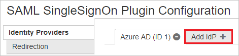
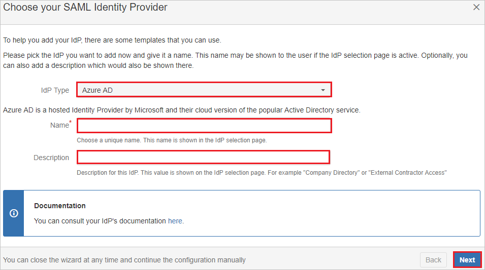

# Tutorial: Microsoft Entra integration with SAML SSO for Bamboo by resolution GmbH

In this tutorial, you'll learn how to integrate SAML SSO for Bamboo by resolution GmbH with Microsoft Entra ID. When you integrate SAML SSO for Bamboo by resolution GmbH with Microsoft Entra ID, you can:

* Control in Microsoft Entra ID who has access to SAML SSO for  Bamboo by resolution GmbH.
* Enable your users to be automatically signed in to SAML SSO for Bamboo by resolution GmbH with their Microsoft Entra accounts.
* Manage your accounts in one central location: the Azure portal.

## Prerequisites

To configure Microsoft Entra integration with SAML SSO for Bamboo by resolution GmbH, you need the following items:

* A Microsoft Entra subscription. If you don't have a Microsoft Entra environment, you can get a [free account](https://azure.microsoft.com/free/).
* SAML SSO for Bamboo by resolution GmbH single sign-on enabled subscription.

## Scenario description

In this tutorial, you configure and test Microsoft Entra single sign-on in a test environment.

* SAML SSO for Bamboo by resolution GmbH supports **SP and IDP** initiated SSO.
* SAML SSO for Bamboo by resolution GmbH supports **Just In Time** user provisioning.

## Add SAML SSO for Bamboo by resolution GmbH from the gallery

To configure the integration of SAML SSO for Bamboo by resolution GmbH into Microsoft Entra ID, you need to add SAML SSO for Bamboo by resolution GmbH from the gallery to your list of managed SaaS apps.

1. Sign in to the [Microsoft Entra admin center](https://entra.microsoft.com) as at least a [Cloud Application Administrator](../roles/permissions-reference.md#cloud-application-administrator).
1. Browse to **Identity** > **Applications** > **Enterprise applications** > **New application**.
1. In the **Add from the gallery** section, type **SAML SSO for Bamboo by resolution GmbH** in the search box.
1. Select **SAML SSO for Bamboo by resolution GmbH** from results panel and then add the app. Wait a few seconds while the app is added to your tenant.

 Alternatively, you can also use the [Enterprise App Configuration Wizard](https://portal.office.com/AdminPortal/home?Q=Docs#/azureadappintegration). In this wizard, you can add an application to your tenant, add users/groups to the app, assign roles, as well as walk through the SSO configuration as well. [Learn more about Microsoft 365 wizards.](/microsoft-365/admin/misc/azure-ad-setup-guides)

## Configure and test Microsoft Entra SSO with SAML SSO for Bamboo by resolution GmbH

Configure and test Microsoft Entra SSO with SAML SSO for Bamboo by resolution GmbH, by using a test user called **B.Simon**. For SSO to work, you need to establish a linked relationship between a Microsoft Entra user and the related user in SAML SSO for Bamboo by resolution GmbH.

To configure and test Microsoft Entra SSO with SAML SSO for Bamboo by resolution GmbH, perform the following steps:

1. **[Configure Microsoft Entra SSO](#configure-azure-ad-sso)** - to enable your users to use this feature.
     1. **[Create a Microsoft Entra test user](#create-an-azure-ad-test-user)** - to test Microsoft Entra single sign-on with Britta Simon.
     1. **[Assign the Microsoft Entra test user](#assign-the-azure-ad-test-user)** - to enable Britta Simon to use Microsoft Entra single sign-on.
2. **[Configure SAML SSO for  Bamboo by resolution GmbH SSO](#configure-saml-sso-for-bamboo-by-resolution-gmbh-sso)** - to configure the Single Sign-On settings on application side.
    1. **[Create SAML SSO for  Bamboo by resolution GmbH test user](#create-saml-sso-for-bamboo-by-resolution-gmbh-test-user)** - to have a counterpart of Britta Simon in SAML SSO for  Bamboo by resolution GmbHby resolution GmbH that is linked to the Microsoft Entra representation of user.
6. **[Test SSO](#test-sso)** - to verify whether the configuration works.

### Configure Microsoft Entra SSO

In this section, you enable Microsoft Entra SSO.
 
1. Sign in to the [Microsoft Entra admin center](https://entra.microsoft.com) as at least a [Cloud Application Administrator](../roles/permissions-reference.md#cloud-application-administrator).
1. Browse to **Identity** > **Applications** > **Enterprise applications** > **SAML SSO for  Bamboo by resolution GmbH** application integration page, find the **Manage** section and select **Single Sign-On**.
1. On the **Select a Single Sign-On Method** page, select **SAML**.
1. On the **Set up Single Sign-On with SAML** page, select the pencil icon for **Basic SAML Configuration** to edit the settings.

    
1. On the **Basic SAML Configuration** section, if you wish to configure the application in **IDP** initiated mode, perform the following steps:

    a. In the **Identifier** text box, type a URL using the following pattern:
    `https://<server-base-url>/plugins/servlet/samlsso`

    b. In the **Reply URL** text box, type a URL using the following pattern:
    `https://<server-base-url>/plugins/servlet/samlsso`

1. Click **Set additional URLs** and perform the following step if you wish to configure the application in **SP** initiated mode:

     In the **Sign-on URL** text box, type a URL using the following pattern:
    `https://<server-base-url>/plugins/servlet/samlsso`

	> [!NOTE]
	> These values are not real. Update these values with the actual Identifier, Reply URL and Sign-on URL. Contact [SAML SSO for Bamboo by resolution GmbH Client support team](https://marketplace.atlassian.com/plugins/com.resolution.atlasplugins.samlsso-bamboo/server/support) to get these values. You can also refer to the patterns shown in the **Basic SAML Configuration** section.

1. On the **Set up Single Sign-On with SAML** page, in the **SAML Signing Certificate** section, click **Download** to download the **Federation Metadata XML** from the given options as per your requirement and save it on your computer.

	

1. On the **Set up SAML SSO for Bamboo by resolution GmbH** section, copy the appropriate URL(s) as per your requirement.

	

### Create a Microsoft Entra test user

In this section, you create a test user called B.Simon.

1. Sign in to the [Microsoft Entra admin center](https://entra.microsoft.com) as at least a [User Administrator](../roles/permissions-reference.md#user-administrator).
1. Browse to **Identity** > **Users** > **All users**.
1. Select **New user** > **Create new user**, at the top of the screen.
1. In the **User** properties, follow these steps:
   1. In the **Display name** field, enter `B.Simon`.  
   1. In the **User principal name** field, enter the username@companydomain.extension. For example, `B.Simon@contoso.com`.
   1. Select the **Show password** check box, and then write down the value that's displayed in the **Password** box.
   1. Select **Review + create**.
1. Select **Create**.

### Assign the Microsoft Entra test user

In this section, you enable B.Simon to use Azure single sign-on by granting access to SAML SSO for bamboo by resolution GmbH.

1. Browse to **Identity** > **Applications** > **Enterprise applications**.
1. In the applications list, select **SAML SSO for bamboo by resolution GmbH**.
1. In the app's overview page, find the **Manage** section, and select **Users and groups**.
1. Select **Add user**. Then, in the **Add Assignment** dialog box, select **Users and groups**.
1. In the **Users and groups** dialog box, select **B.Simon** from the list of users. Then choose **Select** at the bottom of the screen.
1. If you are expecting a role to be assigned to the users, you can select it from the **Select a role** dropdown. If no role has been set up for this app, you see "Default Access" role selected.
1. In the **Add Assignment** dialog box, select **Assign**.

### Configure SAML SSO for Bamboo by resolution GmbH SSO

1. Sign-on to your SAML SSO for Bamboo by resolution GmbH company site as administrator.

1. On the right side of the main toolbar, click **Settings** > **Add-ons**.

	

1. Go to SECURITY section, click on **SAML SingleSignOn** on the Menubar.

	

1. On the **SAML SIngleSignOn Plugin Configuration page**, click **Add idp**.

	

1. On the **Choose your SAML Identity Provider** Page, perform the following steps:

	

	a. Select **Idp Type** as **Microsoft Entra ID**.

	b. In the **Name** textbox, type the name.

	c. In the **Description** textbox, type the description.

	d. Click **Next**.

1. On the **Identity provider configuration** page click **Next**.

	

1. On the **Import SAML Idp Metadata** Page, click **Load File** to upload the **METADATA XML** file which you have downloaded previously.

	

1. Click **Next**.

1. Click **Save settings**.

### Create SAML SSO for Bamboo by resolution GmbH test user

The objective of this section is to create a user called Britta Simon in SAML SSO for Bamboo by resolution GmbH. SAML SSO for Bamboo by resolution GmbH supports just-in-time provisioning and also users can be created manually, contact [SAML SSO for Bamboo by resolution GmbH Client support team](https://marketplace.atlassian.com/plugins/com.resolution.atlasplugins.samlsso-bamboo/server/support) as per your requirement.

### Test SSO

In this section, you test your Microsoft Entra single sign-on configuration with following options. 

#### SP initiated:

* Click on **Test this application**, this will redirect to SAML SSO for  Bamboo by resolution GmbH Sign on URL where you can initiate the login flow.  

* Go to SAML SSO for  Bamboo by resolution GmbH Sign-on URL directly and initiate the login flow from there.

#### IDP initiated:

* Click on **Test this application**, and you should be automatically signed in to the SAML SSO for Bamboo by resolution GmbH for which you set up the SSO.

You can also use Microsoft My Apps to test the application in any mode. When you click the SAML SSO for Bamboo by resolution GmbH tile in the My Apps, if configured in SP mode you would be redirected to the application sign on page for initiating the login flow and if configured in IDP mode, you should be automatically signed in to the SAML SSO for  Bamboo by resolution GmbH for which you set up the SSO. For more information about the My Apps, see [Introduction to the My Apps](https://support.microsoft.com/account-billing/sign-in-and-start-apps-from-the-my-apps-portal-2f3b1bae-0e5a-4a86-a33e-876fbd2a4510).

## Next steps

Once you configure SAML SSO for Bamboo by resolution GmbH you can enforce session control, which protects exfiltration and infiltration of your organization’s sensitive data in real time. Session control extends from Conditional Access. [Learn how to enforce session control with Microsoft Defender for Cloud Apps](/cloud-app-security/proxy-deployment-any-app).
