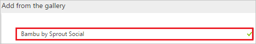
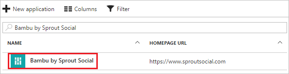

---
title: 'Tutorial: Azure Active Directory integration with Bambu by Sprout Social | Microsoft Docs'
description: Learn how to configure single sign-on between Azure Active Directory and Bambu by Sprout Social.
services: active-directory
documentationCenter: na
author: jeevansd
manager: mtillman

ms.assetid: d2b9ddbc-cab7-40d6-aca1-5b171cab4199
ms.service: active-directory
ms.component: saas-app-tutorial
ms.workload: identity
ms.tgt_pltfrm: na
ms.devlang: na
ms.topic: article
ms.date: 04/17/2017
ms.author: jeedes

---
# Tutorial: Azure Active Directory integration with Bambu by Sprout Social

In this tutorial, you learn how to integrate Bambu by Sprout Social with Azure Active Directory (Azure AD).

Integrating Bambu by Sprout Social with Azure AD provides you with the following benefits:

- You can control in Azure AD who has access to Bambu by Sprout Social
- You can enable your users to automatically get signed-on to Bambu by Sprout Social (Single Sign-On) with their Azure AD accounts
- You can manage your accounts in one central location - the Azure portal

If you want to know more details about SaaS app integration with Azure AD, see [What is application access and single sign-on with Azure Active Directory](../manage-apps/what-is-single-sign-on.md).

## Prerequisites

To configure Azure AD integration with Bambu by Sprout Social, you need the following items:

- An Azure AD subscription
- A Bambu by Sprout Social single-sign on enabled subscription

> [!NOTE]
> To test the steps in this tutorial, we do not recommend using a production environment.

To test the steps in this tutorial, you should follow these recommendations:

- You should not use your production environment, unless this is necessary.
- If you don't have an Azure AD trial environment, you can get a one-month trial [here](https://azure.microsoft.com/pricing/free-trial/).

## Scenario description
In this tutorial, you test Azure AD single sign-on in a test environment. 
The scenario outlined in this tutorial consists of two main building blocks:

1. Adding Bambu by Sprout Social from the gallery
1. Configuring and testing Azure AD single sign-on

## Adding Bambu by Sprout Social from the gallery
To configure the integration of Bambu by Sprout Social into Azure AD, you need to add Bambu by Sprout Social from the gallery to your list of managed SaaS apps.

**To add Bambu by Sprout Social from the gallery, perform the following steps:**

1. In the **[Azure Portal](https://portal.azure.com)**, on the left navigation panel, click **Azure Active Directory** icon. 

	![Active Directory][1]

1. Navigate to **Enterprise applications**. Then go to **All applications**.

	![Applications][2]
	
1. Click **New application** button on the top of the dialog to add new application.

	![Applications][3]

1. In the search box, type **Bambu by Sprout Social**.

	

1. In the results panel, select **Bambu by Sprout Social**, and then click **Add** button to add the application.

	

##  Configuring and testing Azure AD single sign-on
In this section, you configure and test Azure AD single sign-on with Bambu by Sprout Social based on a test user called "Britta Simon".

For single sign-on to work, Azure AD needs to know what the counterpart user in Bambu by Sprout Social is to a user in Azure AD. In other words, a link relationship between an Azure AD user and the related user in Bambu by Sprout Social needs to be established.

This link relationship is established by assigning the value of the **user name** in Azure AD as the value of the **Username** in Bambu by Sprout Social.

To configure and test Azure AD single sign-on with Bambu by Sprout Social, you need to complete the following building blocks:

1. **[Configuring Azure AD Single Sign-On](#configuring-azure-ad-single-sign-on)** - to enable your users to use this feature.
1. **[Creating an Azure AD test user](#creating-an-azure-ad-test-user)** - to test Azure AD single sign-on with Britta Simon.
1. **[Creating a Bambu by Sprout Social test user](#creating-a-bambu-by-sprout-social-test-user)** - to have a counterpart of Britta Simon in Bambu by Sprout Social that is linked to the Azure AD representation of her.
1. **[Assigning the Azure AD test user](#assigning-the-azure-ad-test-user)** - to enable Britta Simon to use Azure AD single sign-on.
1. **[Testing Single Sign-On](#testing-single-sign-on)** - to verify whether the configuration works.

### Configuring Azure AD single sign-on

In this section, you enable Azure AD single sign-on in the Azure portal and configure single sign-on in your Bambu by Sprout Social application.

**To configure Azure AD single sign-on with Bambu by Sprout Social, perform the following steps:**

1. In the Azure portal, on the **Bambu by Sprout Social** application integration page, click **Single sign-on**.

	![Configure Single Sign-On][4]

1. On the **Single sign-on** dialog, as **Mode** select **SAML-based Sign-on** to enable single sign on.
 
	

1. On the **Bambu by Sprout Social Domain and URLs** section, the user does not have to perform any steps as the app is already pre-integrated with Azure. 

	

1. On the **SAML Signing Certificate** section, click **Metadata XML** and then save the XML file on your computer.

	 

1. Click **Save** button.

	
	
1. On the **Bambu by Sprout Social Configuration** section, click **Configure Bambu by Sprout Social** to open **Configure sign-on** window. Copy the **SAML Single Sign-On Service URL** from the **Quick Reference section.**

	 

1. To configure single sign-on on **Bambu by Sprout Social** side, you need to send the downloaded **Metadata XML** and **SAML Single Sign-On Service URL** to [Bambu by Sprout Social support](mailto:support@getbambu.com). They will set this up in order to have the SAML SSO connection set properly on both sides.

> [!TIP]
> You can now read a concise version of these instructions inside the [Azure portal](https://portal.azure.com), while you are setting up the app!  After adding this app from the **Active Directory > Enterprise Applications** section, simply click on the **Single Sign-On** tab and access the embedded documentation through the **Configuration** section at the bottom. You can read more about the embedded documentation feature here: [Azure AD embedded documentation]( https://go.microsoft.com/fwlink/?linkid=845985)
> 

<!--### Next steps

To ensure users can sign-in to Bambu by Sprout Social after it has been configured to use Azure Active Directory, review the following tasks and topics:

- User accounts must be pre-provisioned into Bambu by Sprout Social prior to sign-in. To set this up, see Provisioning.
 
- Users must be assigned access to Bambu by Sprout Social in Azure AD to sign-in. To assign users, see Users.
 
- To configure access polices for Bambu by Sprout Social users, see Access Policies.
 
- For additional information on deploying single sign-on to users, see [this article](https://docs.microsoft.com/azure/active-directory/active-directory-appssoaccess-whatis#deploying-azure-ad-integrated-applications-to-users).-->

### Creating an Azure AD test user
The objective of this section is to create a test user in the Azure portal called Britta Simon.

![Create Azure AD User][100]

**To create a test user in Azure AD, perform the following steps:**

1. In the **Azure portal**, on the left navigation pane, click **Azure Active Directory** icon.

	 

1. Go to **Users and groups** and click **All users** to display the list of users.
	
	 

1. At the top of the dialog click **Add** to open the **User** dialog.
 
	 

1. On the **User** dialog page, perform the following steps:
 
	 

    a. In the **Name** textbox, type **Britta Simon**.

    b. In the **User name** textbox, type the **email address** of Britta Simon.

	c. Select **Show Password** and write down the value of the **Password**.

    d. Click **Create**.
 
### Creating a Bambu by Sprout Social test user

Application supports Just in time user provisioning and after authentication users will be created in the application automatically.

### Assigning the Azure AD test user

In this section, you enable Britta Simon to use Azure single sign-on by granting her access to Bambu by Sprout Social.

![Assign User][200] 

**To assign Britta Simon to Bambu by Sprout Social, perform the following steps:**

1. In the Azure portal, open the applications view, and then navigate to the directory view and go to **Enterprise applications** then click **All applications**.

	![Assign User][201] 

1. In the applications list, select **Bambu by Sprout Social**.

	 

1. In the menu on the left, click **Users and groups**.

	![Assign User][202] 

1. Click **Add** button. Then select **Users and groups** on **Add Assignment** dialog.

	![Assign User][203]

1. On **Users and groups** dialog, select **Britta Simon** in the Users list.

1. Click **Select** button on **Users and groups** dialog.

1. Click **Assign** button on **Add Assignment** dialog.
	
### Testing single sign-on

In this section, you test your Azure AD single sign-on configuration using the Access Panel.

When you click the Bambu by Sprout Social tile in the Access Panel, you should get automatically signed-on to your Bambu by Sprout Social application. For more details about the Access Panel, see [Introduction to the Access Panel](../user-help/active-directory-saas-access-panel-introduction.md). 

## Additional resources

* [List of Tutorials on How to Integrate SaaS Apps with Azure Active Directory](tutorial-list.md)
* [What is application access and single sign-on with Azure Active Directory?](../manage-apps/what-is-single-sign-on.md)

<!--Image references-->

[1]: ./media/bambubysproutsocial-tutorial/tutorial_general_01.png
[2]: ./media/bambubysproutsocial-tutorial/tutorial_general_02.png
[3]: ./media/bambubysproutsocial-tutorial/tutorial_general_03.png
[4]: ./media/bambubysproutsocial-tutorial/tutorial_general_04.png

[100]: ./media/bambubysproutsocial-tutorial/tutorial_general_100.png

[200]: ./media/bambubysproutsocial-tutorial/tutorial_general_200.png
[201]: ./media/bambubysproutsocial-tutorial/tutorial_general_201.png
[202]: ./media/bambubysproutsocial-tutorial/tutorial_general_202.png
[203]: ./media/bambubysproutsocial-tutorial/tutorial_general_203.png
