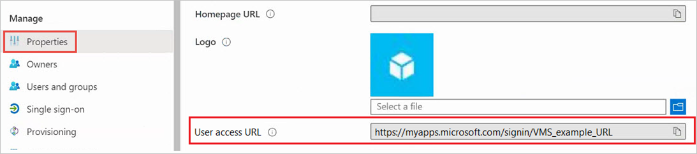

# Tutorial: Azure Active Directory integration with Beeline

In this tutorial, you'll learn how to integrate Beeline with Azure Active Directory (Azure AD). When you integrate Beeline with Azure AD, you can:

* Control in Azure AD who has access to Beeline.
* Enable your users to be automatically signed-in to Beeline with their Azure AD accounts.
* Manage your accounts in one central location - the Azure portal.

## Prerequisites

To get started, you need the following items:

* An Azure AD subscription. If you don't have a subscription, you can get a [free account](https://azure.microsoft.com/free/).
* Beeline single sign-on (SSO) enabled subscription.

## Scenario description

In this tutorial, you configure and test Azure AD single sign-on in a test environment.

* Beeline only supports **IDP** initiated SSO.

## Add Beeline from the gallery

To configure the integration of Beeline into Azure AD, you need to add Beeline from the gallery to your list of managed SaaS apps.

1. Sign in to the Azure portal using either a work or school account, or a personal Microsoft account.
1. On the left navigation pane, select the **Azure Active Directory** service.
1. Navigate to **Enterprise Applications** and then select **All Applications**.
1. To add new application, select **New application**.
1. In the **Add from the gallery** section, type **Beeline** in the search box.
1. Select **Beeline** from results panel and then add the app. Wait a few seconds while the app is added to your tenant.

 Alternatively, you can also use the [Enterprise App Configuration Wizard](https://portal.office.com/AdminPortal/home?Q=Docs#/azureadappintegration). In this wizard, you can add an application to your tenant, add users/groups to the app, assign roles, as well as walk through the SSO configuration as well. [Learn more about Microsoft 365 wizards.](/microsoft-365/admin/misc/azure-ad-setup-guides)

## Configure and test Azure AD SSO for Beeline

Configure and test Azure AD SSO with Beeline using a test user called **B.Simon**. For SSO to work, you need to establish a link relationship between an Azure AD user and the related user in Beeline.

To configure and test Azure AD SSO with Beeline, perform the following steps:

1. **[Configure Azure AD SSO](#configure-azure-ad-sso)** - to enable your users to use this feature.
    1. **[Create an Azure AD test user](#create-an-azure-ad-test-user)** - to test Azure AD single sign-on with B.Simon.
    1. **[Assign the Azure AD test user](#assign-the-azure-ad-test-user)** - to enable B.Simon to use Azure AD single sign-on.
1. **[Configure Beeline SSO](#configure-beeline-sso)** - to configure the single sign-on settings on application side.
    1. **[Create Beeline test user](#create-beeline-test-user)** - to have a counterpart of B.Simon in Beeline that is linked to the Azure AD representation of user.
1. **[Test SSO](#test-sso)** - to verify whether the configuration works.

## Configure Azure AD SSO

Follow these steps to enable Azure AD SSO in the Azure portal.

1. In the Azure portal, on the **Beeline** application integration page, find the **Manage** section and select **single sign-on**.
1. On the **Select a single sign-on method** page, select **SAML**.
1. On the **Set up single sign-on with SAML** page, click the pencil icon for **Basic SAML Configuration** to edit the settings.

   

4. On the **Set up Single Sign-On with SAML** page, perform the following steps:

    a. In the **Identifier** text box, type a URL using the following pattern:
    `https://projects.beeline.com/<ProjInstance_Name>`

    b. In the **Reply URL** text box, type a URL using the following pattern: 
    `https://azure-prj.auth.beeline.com/login/callback?connection=<ProjInstance_Namee>-SSO`

    > [!NOTE]
    > These values are not real. Update these values with the actual Identifier and Reply URL. Contact [Beeline Client support team](https://www.beeline.com/contact-support/) to get these values. You can also refer to the patterns shown in the **Basic SAML Configuration** section in the Azure portal.

5. The Beeline application expects the SAML assertions in a specific format. Please work with [Beeline support team](https://www.beeline.com/contact-support/) first to identify the correct user identifier which will be mapped into the application. Also please take the guidance from [Beeline support team](https://www.beeline.com/contact-support/) about the attribute which they want to use for this mapping. You can manage the value of this attribute from the **User Attributes** tab of the application. The following screenshot shows an example for this. Here we have mapped the **User Identifier** claim with the **userprincipalname** attribute, which provides unique user ID, which will be sent to the Beeline application in every successful SAML response.

    

6. On the **Set up Single Sign-On with SAML** page, in the **SAML Signing Certificate** section, click **Download** to download the **Federation Metadata XML** from the given options as per your requirement and save it on your computer.

    

7. In the [Azure portal](https://portal.azure.com/), on the **Beeline** application integration page, select **Properties** and copy the User Access URL.

    

### Create an Azure AD test user

In this section, you'll create a test user in the Azure portal called B.Simon.

1. From the left pane in the Azure portal, select **Azure Active Directory**, select **Users**, and then select **All users**.
1. Select **New user** at the top of the screen.
1. In the **User** properties, follow these steps:
   1. In the **Name** field, enter `B.Simon`.  
   1. In the **User name** field, enter the username@companydomain.extension. For example, `B.Simon@contoso.com`.
   1. Select the **Show password** check box, and then write down the value that's displayed in the **Password** box.
   1. Click **Create**.

### Assign the Azure AD test user

In this section, you'll enable B.Simon to use Azure single sign-on by granting access to Beeline.

1. In the Azure portal, select **Enterprise Applications**, and then select **All applications**.
1. In the applications list, select **Beeline**.
1. In the app's overview page, find the **Manage** section and select **Users and groups**.
1. Select **Add user**, then select **Users and groups** in the **Add Assignment** dialog.
1. In the **Users and groups** dialog, select **B.Simon** from the Users list, then click the **Select** button at the bottom of the screen.
1. If you are expecting a role to be assigned to the users, you can select it from the **Select a role** dropdown. If no role has been set up for this app, you see "Default Access" role selected.
1. In the **Add Assignment** dialog, click the **Assign** button.

## Configure Beeline SSO

To configure single sign-on on **Beeline** side, you need to send the downloaded **Federation Metadata XML** and the User Access URL from the Azure portal properties to [Beeline support team](https://www.beeline.com/contact-support/). They require the metadata and User Access URL so that the SAML SSO connection is configured properly on both sides.

### Create Beeline test user

In this section, you will create a user, Britta Simon, in Beeline. The Beeline application needs all users to be provisioned in the application before doing Single Sign On. So work with the [Beeline support team](https://www.beeline.com/contact-support/) to provision all these users into the application.

## Test SSO

In this section, you test your Azure AD single sign-on configuration with following options.

* Click on Test this application in Azure portal and you should be automatically signed in to the Beeline for which you set up the SSO.

* You can use Microsoft My Apps. When you click the Beeline tile in the My Apps, you should be automatically signed in to the Beeline for which you set up the SSO. For more information about the My Apps, see [Introduction to the My Apps](https://support.microsoft.com/account-billing/sign-in-and-start-apps-from-the-my-apps-portal-2f3b1bae-0e5a-4a86-a33e-876fbd2a4510).

## Next steps

Once you configure Beeline you can enforce session control, which protects exfiltration and infiltration of your organization’s sensitive data in real time. Session control extends from Conditional Access. [Learn how to enforce session control with Microsoft Defender for Cloud Apps](/cloud-app-security/proxy-deployment-aad).
