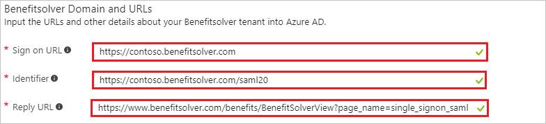
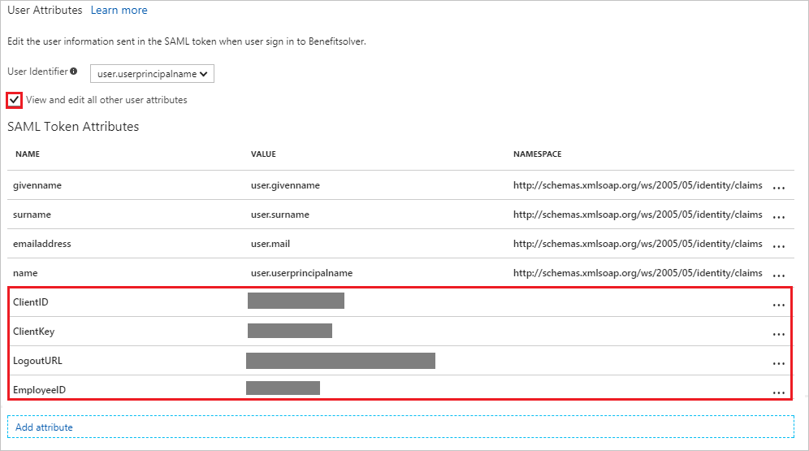
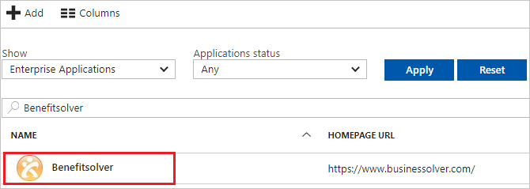

---
title: 'Tutorial: Azure Active Directory integration with Benefitsolver | Microsoft Docs'
description: Learn how to configure single sign-on between Azure Active Directory and Benefitsolver.
services: active-directory
documentationCenter: na
author: jeevansd
manager: mtillman
ms.reviewer: joflore

ms.assetid: 333394c1-b5a7-489c-8f7b-d1a5b4e782ea
ms.service: active-directory
ms.component: saas-app-tutorial
ms.workload: identity
ms.tgt_pltfrm: na
ms.devlang: na
ms.topic: article
ms.date: 08/30/2017
ms.author: jeedes

---
# Tutorial: Azure Active Directory integration with Benefitsolver

In this tutorial, you learn how to integrate Benefitsolver with Azure Active Directory (Azure AD).

Integrating Benefitsolver with Azure AD provides you with the following benefits:

- You can control in Azure AD who has access to Benefitsolver.
- You can enable your users to automatically get signed-on to Benefitsolver (Single Sign-On) with their Azure AD accounts.
- You can manage your accounts in one central location - the Azure portal.

If you want to know more details about SaaS app integration with Azure AD, see [what is application access and single sign-on with Azure Active Directory](../manage-apps/what-is-single-sign-on.md).

## Prerequisites

To configure Azure AD integration with Benefitsolver, you need the following items:

- An Azure AD subscription
- A Benefitsolver single sign-on enabled subscription

> [!NOTE]
> To test the steps in this tutorial, we do not recommend using a production environment.

To test the steps in this tutorial, you should follow these recommendations:

- Do not use your production environment, unless it is necessary.
- If you don't have an Azure AD trial environment, you can [get a one-month trial](https://azure.microsoft.com/pricing/free-trial/).

## Scenario description
In this tutorial, you test Azure AD single sign-on in a test environment. 
The scenario outlined in this tutorial consists of two main building blocks:

1. Adding Benefitsolver from the gallery
1. Configuring and testing Azure AD single sign-on

## Adding Benefitsolver from the gallery
To configure the integration of Benefitsolver into Azure AD, you need to add Benefitsolver from the gallery to your list of managed SaaS apps.

**To add Benefitsolver from the gallery, perform the following steps:**

1. In the **[Azure portal](https://portal.azure.com)**, on the left navigation panel, click **Azure Active Directory** icon. 

	![The Azure Active Directory button][1]

1. Navigate to **Enterprise applications**. Then go to **All applications**.

	![The Enterprise applications blade][2]
	
1. To add new application, click **New application** button on the top of dialog.

	![The New application button][3]

1. In the search box, type **Benefitsolver**, select **Benefitsolver** from result panel then click **Add** button to add the application.

	

## Configure and test Azure AD single sign-on

In this section, you configure and test Azure AD single sign-on with Benefitsolver based on a test user called "Britta Simon".

For single sign-on to work, Azure AD needs to know what the counterpart user in Benefitsolver is to a user in Azure AD. In other words, a link relationship between an Azure AD user and the related user in Benefitsolver needs to be established.

In Benefitsolver, assign the value of the **user name** in Azure AD as the value of the **Username** to establish the link relationship.

To configure and test Azure AD single sign-on with Benefitsolver, you need to complete the following building blocks:

1. **[Configure Azure AD Single Sign-On](#configure-azure-ad-single-sign-on)** - to enable your users to use this feature.
1. **[Create an Azure AD test user](#create-an-azure-ad-test-user)** - to test Azure AD single sign-on with Britta Simon.
1. **[Create a Benefitsolver test user](#create-a-benefitsolver-test-user)** - to have a counterpart of Britta Simon in Benefitsolver that is linked to the Azure AD representation of user.
1. **[Assign the Azure AD test user](#assign-the-azure-ad-test-user)** - to enable Britta Simon to use Azure AD single sign-on.
1. **[Test single sign-on](#test-single-sign-on)** - to verify whether the configuration works.

### Configure Azure AD single sign-on

In this section, you enable Azure AD single sign-on in the Azure portal and configure single sign-on in your Benefitsolver application.

**To configure Azure AD single sign-on with Benefitsolver, perform the following steps:**

1. In the Azure portal, on the **Benefitsolver** application integration page, click **Single sign-on**.

	![Configure single sign-on link][4]

1. On the **Single sign-on** dialog, select **Mode** as	**SAML-based Sign-on** to enable single sign-on.
 
	

1. On the **Benefitsolver Domain and URLs** section, perform the following steps:

	

    a. In the **Sign-on URL** textbox, type a URL using the following pattern: `http://<companyname>.benefitsolver.com`

	b. In the **Identifier** textbox, type a URL using the following pattern: `https://<companyname>.benefitsolver.com/saml20`

	c. In the **Reply URL** textbox, type the URL: `https://www.benefitsolver.com/benefits/BenefitSolverView?page_name=single_signon_saml`

	> [!NOTE] 
	> These values are not real. Update these values with the actual Sign-On URL,Identifier and Reply URL. Contact [Benefitsolver Client support team](https://www.businessolver.com/contact) to get these values.

1. Your Benefitsolver application expects the SAML assertions in a specific format, which requires you to add custom attribute mappings to your **saml token attributes** configuration.

	

1. In the **User Attributes** section on the **Single sign-on** dialog, configure SAML token attribute as shown in the image and perform the following steps:
	
	| Attribute Name| Attribute Value|
	|---------------|----------------|
	| ClientID | You need to get this value from your [Benefitsolver Client support team](https://www.businessolver.com/contact).|
	| ClientKey | You need to get this value from your [Benefitsolver Client support team](https://www.businessolver.com/contact).|
	| LogoutURL | You need to get this value from your [Benefitsolver Client support team](https://www.businessolver.com/contact).|
	| EmployeeID | You need to get this value from your [Benefitsolver Client support team](https://www.businessolver.com/contact).|

	a. Click Add attribute to open the Add Attribute dialog.

	
	
	

	b. In the **Name** textbox, type the attribute name shown for that row.
	
	c. From the **Value** list, type the attribute value shown for that row.
	
	d. Click **Ok**.

1. On the **SAML Signing Certificate** section, click **Metadata XML** and then save the metadata file on your computer.

	 

1. Click **Save** button.

	

1. To configure single sign-on on **Benefitsolver** side, you need to send the downloaded **Metadata XML** to [Benefitsolver support team](https://www.businessolver.com/contact).

	> [!NOTE]
	> Your Benefitsolver support team has to do the actual SSO configuration. You will get a notification when SSO has been enabled for your subscription.

> [!TIP]
> You can now read a concise version of these instructions inside the [Azure portal](https://portal.azure.com), while you are setting up the app!  After adding this app from the **Active Directory > Enterprise Applications** section, simply click the **Single Sign-On** tab and access the embedded documentation through the **Configuration** section at the bottom. You can read more about the embedded documentation feature here: [Azure AD embedded documentation]( https://go.microsoft.com/fwlink/?linkid=845985)
> 

### Create an Azure AD test user

The objective of this section is to create a test user in the Azure portal called Britta Simon.

   ![Create an Azure AD test user][100]

**To create a test user in Azure AD, perform the following steps:**

1. In the Azure portal, in the left pane, click the **Azure Active Directory** button.

    

1. To display the list of users, go to **Users and groups**, and then click **All users**.

    

1. To open the **User** dialog box, click **Add** at the top of the **All Users** dialog box.

    

1. In the **User** dialog box, perform the following steps:

    

    a. In the **Name** box, type **BrittaSimon**.

    b. In the **User name** box, type the email address of user Britta Simon.

    c. Select the **Show Password** check box, and then write down the value that's displayed in the **Password** box.

    d. Click **Create**.
 
### Create a Benefitsolver test user

In order to enable Azure AD users to log into Benefitsolver, they must be provisioned into Benefitsolver. In the case of Benefitsolver, employee data is in your application populated through a Census file from your HRIS system (typically nightly).

> [!NOTE]
> You can use any other Benefitsolver user account creation tools or APIs provided by Benefitsolver to provision AAD user accounts.

### Assign the Azure AD test user

In this section, you enable Britta Simon to use Azure single sign-on by granting access to Benefitsolver.

![Assign the user role][200] 

**To assign Britta Simon to Benefitsolver, perform the following steps:**

1. In the Azure portal, open the applications view, and then navigate to the directory view and go to **Enterprise applications** then click **All applications**.

	![Assign User][201] 

1. In the applications list, select **Benefitsolver**.

	  

1. In the menu on the left, click **Users and groups**.

	![The "Users and groups" link][202]

1. Click **Add** button. Then select **Users and groups** on **Add Assignment** dialog.

	![The Add Assignment pane][203]

1. On **Users and groups** dialog, select **Britta Simon** in the Users list.

1. Click **Select** button on **Users and groups** dialog.

1. Click **Assign** button on **Add Assignment** dialog.
	
### Test single sign-on

In this section, you test your Azure AD single sign-on configuration using the Access Panel.

When you click the Benefitsolver tile in the Access Panel, you should get automatically signed-on to your Benefitsolver application.
For more information about the Access Panel, see [Introduction to the Access Panel](../user-help/active-directory-saas-access-panel-introduction.md). 

## Additional resources

* [List of Tutorials on How to Integrate SaaS Apps with Azure Active Directory](tutorial-list.md)
* [What is application access and single sign-on with Azure Active Directory?](../manage-apps/what-is-single-sign-on.md)

<!--Image references-->

[1]: ./media/benefitsolver-tutorial/tutorial_general_01.png
[2]: ./media/benefitsolver-tutorial/tutorial_general_02.png
[3]: ./media/benefitsolver-tutorial/tutorial_general_03.png
[4]: ./media/benefitsolver-tutorial/tutorial_general_04.png

[100]: ./media/benefitsolver-tutorial/tutorial_general_100.png

[200]: ./media/benefitsolver-tutorial/tutorial_general_200.png
[201]: ./media/benefitsolver-tutorial/tutorial_general_201.png
[202]: ./media/benefitsolver-tutorial/tutorial_general_202.png
[203]: ./media/benefitsolver-tutorial/tutorial_general_203.png

