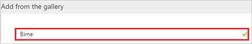
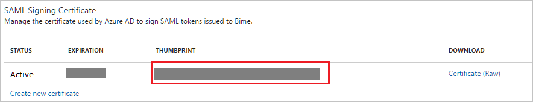
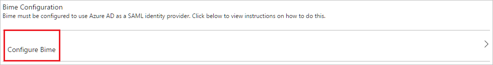
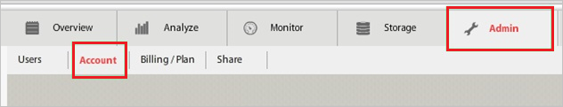
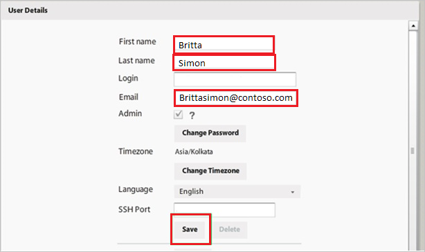

---
title: 'Tutorial: Azure Active Directory integration with Bime | Microsoft Docs'
description: Learn how to configure single sign-on between Azure Active Directory and Bime.
services: active-directory
documentationCenter: na
author: jeevansd
manager: mtillman

ms.assetid: bdcf0729-c880-4c95-b739-0f6345b17dd8
ms.service: active-directory
ms.component: saas-app-tutorial
ms.workload: identity
ms.tgt_pltfrm: na
ms.devlang: na
ms.topic: article
ms.date: 07/13/2017
ms.author: jeedes

---
# Tutorial: Azure Active Directory integration with Bime

In this tutorial, you learn how to integrate Bime with Azure Active Directory (Azure AD).

Integrating Bime with Azure AD provides you with the following benefits:

- You can control in Azure AD who has access to Bime
- You can enable your users to automatically get signed-on to Bime (Single Sign-On) with their Azure AD accounts
- You can manage your accounts in one central location - the Azure portal

If you want to know more details about SaaS app integration with Azure AD, see [what is application access and single sign-on with Azure Active Directory](../manage-apps/what-is-single-sign-on.md).

## Prerequisites

To configure Azure AD integration with Bime, you need the following items:

- An Azure AD subscription
- A Bime single sign-on enabled subscription

> [!NOTE]
> To test the steps in this tutorial, we do not recommend using a production environment.

To test the steps in this tutorial, you should follow these recommendations:

- Do not use your production environment, unless it is necessary.
- If you don't have an Azure AD trial environment, you can get a one-month trial here: [Trial offer](https://azure.microsoft.com/pricing/free-trial/).

## Scenario description
In this tutorial, you test Azure AD single sign-on in a test environment. 
The scenario outlined in this tutorial consists of two main building blocks:

1. Adding Bime from the gallery
1. Configuring and testing Azure AD single sign-on

## Adding Bime from the gallery
To configure the integration of Bime into Azure AD, you need to add Bime from the gallery to your list of managed SaaS apps.

**To add Bime from the gallery, perform the following steps:**

1. In the **[Azure portal](https://portal.azure.com)**, on the left navigation panel, click **Azure Active Directory** icon. 

	![Active Directory][1]

1. Navigate to **Enterprise applications**. Then go to **All applications**.

	![Applications][2]
	
1. To add new application, click **New application** button on the top of dialog.

	![Applications][3]

1. In the search box, type **Bime**.

	

1. In the results panel, select **Bime**, and then click **Add** button to add the application.

	

##  Configuring and testing Azure AD single sign-on
In this section, you configure and test Azure AD single sign-on with Bime based on a test user called "Britta Simon".

For single sign-on to work, Azure AD needs to know what the counterpart user in Bime is to a user in Azure AD. In other words, a link relationship between an Azure AD user and the related user in Bime needs to be established.

In Bime, assign the value of the **user name** in Azure AD as the value of the **Username** to establish the link relationship.

To configure and test Azure AD single sign-on with Bime, you need to complete the following building blocks:

1. **[Configuring Azure AD Single Sign-On](#configuring-azure-ad-single-sign-on)** - to enable your users to use this feature.
1. **[Creating an Azure AD test user](#creating-an-azure-ad-test-user)** - to test Azure AD single sign-on with Britta Simon.
1. **[Creating a Bime test user](#creating-a-bime-test-user)** - to have a counterpart of Britta Simon in Bime that is linked to the Azure AD representation of user.
1. **[Assigning the Azure AD test user](#assigning-the-azure-ad-test-user)** - to enable Britta Simon to use Azure AD single sign-on.
1. **[Testing Single Sign-On](#testing-single-sign-on)** - to verify whether the configuration works.

### Configuring Azure AD single sign-on

In this section, you enable Azure AD single sign-on in the Azure portal and configure single sign-on in your Bime application.

**To configure Azure AD single sign-on with Bime, perform the following steps:**

1. In the Azure portal, on the **Bime** application integration page, click **Single sign-on**.

	![Configure Single Sign-On][4]

1. On the **Single sign-on** dialog, select **Mode** as	**SAML-based Sign-on** to enable single sign-on.
 
	

1. On the **Bime Domain and URLs** section, perform the following steps:

	

    a. In the **Sign-on URL** textbox, type a URL using the following pattern: `https://<tenant-name>.Bimeapp.com`

	b. In the **Identifier** textbox, type a URL using the following pattern: `https://<tenant-name>.Bimeapp.com`

	> [!NOTE] 
	> These values are not real. Update these values with the actual Sign-On URL and Identifier. Contact [Bime Client support team](https://bime.zendesk.com/hc/categories/202604307-Support-tech-notes-and-tips-) to get these values. 
 
1. On the **SAML Signing Certificate** section, copy the **THUMBPRINT** value from the certificate.

	 

1. Click **Save** button.

	

1. On the **Bime Configuration** section, click **Configure Bime** to open **Configure sign-on** window. Copy the **SAML Single Sign-On Service URL** from the **Quick Reference section.**

	 

1. In a different web browser window, log into your Bime company site as an administrator.

1. In the toolbar, click **Admin**, and then **Account**.
   
    

1. On the account configuration page, perform the following steps:
   
    
   
    a. Select **Enable SAML authentication**.

    b. In the **Remote Login URL** textbox, paste the value of **SAML Single Sign-On Service URL**, which you have copied from Azure portal.

    c.  Paste the **Thumbprint** value from Azure portal into the **Certificate Fingerprint** textbox.       
   
    d. Click **Save**.

> [!TIP]
> You can now read a concise version of these instructions inside the [Azure portal](https://portal.azure.com), while you are setting up the app!  After adding this app from the **Active Directory > Enterprise Applications** section, simply click the **Single Sign-On** tab and access the embedded documentation through the **Configuration** section at the bottom. You can read more about the embedded documentation feature here: [Azure AD embedded documentation]( https://go.microsoft.com/fwlink/?linkid=845985)
> 

### Creating an Azure AD test user
The objective of this section is to create a test user in the Azure portal called Britta Simon.

![Create Azure AD User][100]

**To create a test user in Azure AD, perform the following steps:**

1. In the **Azure portal**, on the left navigation pane, click **Azure Active Directory** icon.

	 

1. To display the list of users, go to **Users and groups** and click **All users**.
	
	 

1. To open the **User** dialog, click **Add** on the top of the dialog.
 
	 

1. On the **User** dialog page, perform the following steps:
 
	 

    a. In the **Name** textbox, type **BrittaSimon**.

    b. In the **User name** textbox, type the **email address** of BrittaSimon.

	c. Select **Show Password** and write down the value of the **Password**.

    d. Click **Create**.
 
### Creating a Bime test user

In order to enable Azure AD users to log in to Bime, they must be provisioned into Bime. In the case of Bime, provisioning is a manual task.

**To configure user provisioning, perform the following steps:**

1. Log in to your **Bime** tenant.

1. In the toolbar, click **Admin**, and then **Users**.
   
    

1. In the **Users List**, click **Add New User** (“+”).
   
    

1. On the **User Details** dialog page, perform the following steps:
   
    
   
    a. In the **First name** textbox, enter the first name of user like **Britta**.

    b. In the **Last name** textbox, enter the last name of user like **Simon**.
 
    c. In the **Email** textbox, enter the email of user like **brittasimon@contoso.com**.

    d. Click **Save**.

>[!NOTE]
>You can use any other Bime user account creation tools or APIs provided by Bime to provision AAD user accounts.
>  

### Assigning the Azure AD test user

In this section, you enable Britta Simon to use Azure single sign-on by granting access to Bime.

![Assign User][200] 

**To assign Britta Simon to Bime, perform the following steps:**

1. In the Azure portal, open the applications view, and then navigate to the directory view and go to **Enterprise applications** then click **All applications**.

	![Assign User][201] 

1. In the applications list, select **Bime**.

	 

1. In the menu on the left, click **Users and groups**.

	![Assign User][202] 

1. Click **Add** button. Then select **Users and groups** on **Add Assignment** dialog.

	![Assign User][203]

1. On **Users and groups** dialog, select **Britta Simon** in the Users list.

1. Click **Select** button on **Users and groups** dialog.

1. Click **Assign** button on **Add Assignment** dialog.
	
### Testing single sign-on

The objective of this section is to test your Azure AD single sign-on configuration using the Access Panel.

When you click the Bime tile in the Access Panel, you should get automatically signed-on to your Bime application.

## Additional resources

* [List of Tutorials on How to Integrate SaaS Apps with Azure Active Directory](tutorial-list.md)
* [What is application access and single sign-on with Azure Active Directory?](../manage-apps/what-is-single-sign-on.md)

<!--Image references-->

[1]: ./media/bime-tutorial/tutorial_general_01.png
[2]: ./media/bime-tutorial/tutorial_general_02.png
[3]: ./media/bime-tutorial/tutorial_general_03.png
[4]: ./media/bime-tutorial/tutorial_general_04.png

[100]: ./media/bime-tutorial/tutorial_general_100.png

[200]: ./media/bime-tutorial/tutorial_general_200.png
[201]: ./media/bime-tutorial/tutorial_general_201.png
[202]: ./media/bime-tutorial/tutorial_general_202.png
[203]: ./media/bime-tutorial/tutorial_general_203.png

