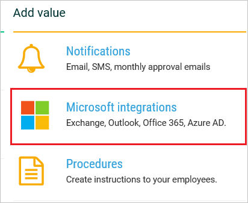
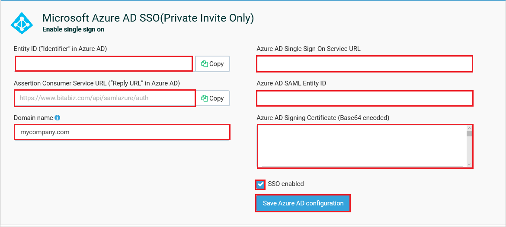
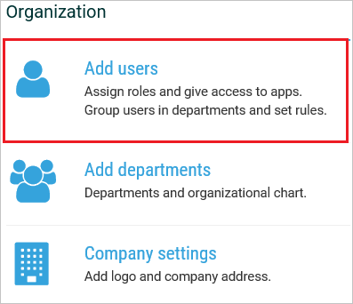
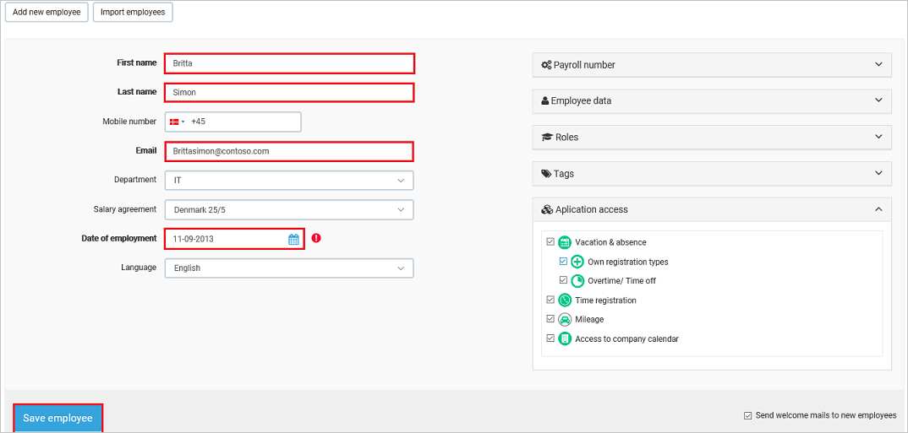

# Tutorial: Microsoft Entra integration with BitaBIZ

In this tutorial, you'll learn how to integrate BitaBIZ with Microsoft Entra ID. When you integrate BitaBIZ with Microsoft Entra ID, you can:

* Control in Microsoft Entra ID who has access to BitaBIZ.
* Enable your users to be automatically signed-in to BitaBIZ with their Microsoft Entra accounts.
* Manage your accounts in one central location.

## Prerequisites

To configure Microsoft Entra integration with BitaBIZ, you need the following items:

* A Microsoft Entra subscription. If you don't have a Microsoft Entra environment, you can get a [free account](https://azure.microsoft.com/free/).
* BitaBIZ single sign-on enabled subscription.

## Scenario description

In this tutorial, you configure and test Microsoft Entra single sign-on in a test environment.

* BitaBIZ supports **SP and IDP** initiated SSO.
* BitaBIZ supports [Automated user provisioning](bitabiz-provisioning-tutorial.md).

## Add BitaBIZ from the gallery

To configure the integration of BitaBIZ into Microsoft Entra ID, you need to add BitaBIZ from the gallery to your list of managed SaaS apps.

1. Sign in to the [Microsoft Entra admin center](https://entra.microsoft.com) as at least a [Cloud Application Administrator](../roles/permissions-reference.md#cloud-application-administrator).
1. Browse to **Identity** > **Applications** > **Enterprise applications** > **New application**.
1. In the **Add from the gallery** section, type **BitaBIZ** in the search box.
1. Select **BitaBIZ** from results panel and then add the app. Wait a few seconds while the app is added to your tenant.

 Alternatively, you can also use the [Enterprise App Configuration Wizard](https://portal.office.com/AdminPortal/home?Q=Docs#/azureadappintegration). In this wizard, you can add an application to your tenant, add users/groups to the app, assign roles, as well as walk through the SSO configuration as well. [Learn more about Microsoft 365 wizards.](/microsoft-365/admin/misc/azure-ad-setup-guides)

## Configure and test Microsoft Entra SSO for BitaBIZ

Configure and test Microsoft Entra SSO with BitaBIZ using a test user called **B.Simon**. For SSO to work, you need to establish a link relationship between a Microsoft Entra user and the related user in BitaBIZ.

To configure and test Microsoft Entra SSO with BitaBIZ, perform the following steps:

1. **[Configure Microsoft Entra SSO](#configure-azure-ad-sso)** - to enable your users to use this feature.
    1. **[Create a Microsoft Entra test user](#create-an-azure-ad-test-user)** - to test Microsoft Entra single sign-on with Britta Simon.
    1. **[Assign the Microsoft Entra test user](#assign-the-azure-ad-test-user)** - to enable Britta Simon to use Microsoft Entra single sign-on.
2. **[Configure BitaBIZ SSO](#configure-bitabiz-sso)** - to configure the Single Sign-On settings on application side.
    1. **[Create BitaBIZ test user](#create-bitabiz-test-user)** - to have a counterpart of Britta Simon in BitaBIZ that is linked to the Microsoft Entra representation of user.
1. **[Test SSO](#test-sso)** - to verify whether the configuration works.

## Configure Microsoft Entra SSO

Follow these steps to enable Microsoft Entra SSO.

1. Sign in to the [Microsoft Entra admin center](https://entra.microsoft.com) as at least a [Cloud Application Administrator](../roles/permissions-reference.md#cloud-application-administrator).
1. Browse to **Identity** > **Applications** > **Enterprise applications** > **BitaBIZ** > **Single sign-on**.
1. On the **Select a single sign-on method** page, select **SAML**.
1. On the **Set up single sign-on with SAML** page, click the pencil icon for **Basic SAML Configuration** to edit the settings.

   

1. On the **Basic SAML Configuration** section, if you wish to configure the application in **IDP initiated** mode perform the following steps:

    In the **Identifier** text box, type a URL using the following pattern:
    `https://www.bitabiz.com/<INSTANCE_ID>`

    > [!NOTE]
    > The value in the above URL is for demonstration only. Update the value with the actual identifier, which is explained later in the tutorial.

1. Click **Set additional URLs** and perform the following step if you wish to configure the application in **SP** initiated mode:

    In the **Sign-on URL** text box, type the URL:
    `https://www.bitabiz.com/dashboard`

1. On the **Set up Single Sign-On with SAML** page, in the **SAML Signing Certificate** section, click **Download** to download the **Certificate (Base64)** from the given options as per your requirement and save it on your computer.

    

1. On the **Set up BitaBIZ** section, copy the appropriate URL(s) as per your requirement.

    

### Create a Microsoft Entra test user

In this section, you'll create a test user called B.Simon.

1. Sign in to the [Microsoft Entra admin center](https://entra.microsoft.com) as at least a [User Administrator](../roles/permissions-reference.md#user-administrator).
1. Browse to **Identity** > **Users** > **All users**.
1. Select **New user** > **Create new user**, at the top of the screen.
1. In the **User** properties, follow these steps:
   1. In the **Display name** field, enter `B.Simon`.  
   1. In the **User principal name** field, enter the username@companydomain.extension. For example, `B.Simon@contoso.com`.
   1. Select the **Show password** check box, and then write down the value that's displayed in the **Password** box.
   1. Select **Review + create**.
1. Select **Create**.

### Assign the Microsoft Entra test user

In this section, you'll enable B.Simon to use single sign-on by granting access to BitaBIZ.

1. Sign in to the [Microsoft Entra admin center](https://entra.microsoft.com) as at least a [Cloud Application Administrator](../roles/permissions-reference.md#cloud-application-administrator).
1. Browse to **Identity** > **Applications** > **Enterprise applications** > **BitaBIZ**.
1. In the app's overview page, select **Users and groups**.
1. Select **Add user/group**, then select **Users and groups** in the **Add Assignment** dialog.
   1. In the **Users and groups** dialog, select **B.Simon** from the Users list, then click the **Select** button at the bottom of the screen.
   1. If you are expecting a role to be assigned to the users, you can select it from the **Select a role** dropdown. If no role has been set up for this app, you see "Default Access" role selected.
   1. In the **Add Assignment** dialog, click the **Assign** button.

## Configure BitaBIZ SSO

1. In a different web browser window, sign-on to your BitaBIZ tenant as an administrator.

2. Click on **SETUP ADMIN**.

    

3. Click on **Microsoft integrations** under **Add value** section.

    

4. Scroll down to the section **Microsoft Entra ID (Enable single sign on)** and perform following steps:

    

    a. Copy the value from the **Entity ID (”Identifier” in Microsoft Entra ID)** textbox and paste it into the **Identifier** textbox on the **Basic SAML Configuration** section in Azure portal. 

    b. In the **Microsoft Entra Single Sign-On Service URL** textbox, paste **Login URL**.

    c. In the **Microsoft Entra SAML Entity ID** textbox, paste **Microsoft Entra Identifier**.

    d. Open your downloaded **Certificate(Base64)** file in notepad, copy the content of it into your clipboard, and then paste it to the **Microsoft Entra ID Signing Certificate (Base64 encoded)** textbox.

    e. Add your business e-mail domain name that is, mycompany.com in **Domain name** textbox to assign SSO to the users in your company with this email domain (NOT MANDATORY).

    f. Mark **SSO enabled** the BitaBIZ account.

    g. Click **Save Microsoft Entra configuration** to save and activate the SSO configuration.

### Create BitaBIZ test user

To enable Microsoft Entra users to log in to BitaBIZ, they must be provisioned into BitaBIZ.  
In the case of BitaBIZ, provisioning is a manual task.

**To provision a user account, perform the following steps:**

1. Log in to your BitaBIZ company site as an administrator.

2. Click on **SETUP ADMIN**.

    

3. Click on **Add users** under **Organization** section.

    

4. Click **Add new employee**.

    

5. On the **Add new employee** dialog page, perform the following steps:

    

    a. In the **First Name** textbox, type the first name of user like Britta.

    b. In the **Last Name** textbox, type the last name of user like Simon.

    c. In the **Email** textbox, type the email address of user like Brittasimon@contoso.com.

    d. Select a date in **Date of employment**.

    e. There are other non-mandatory user attributes which can be set up for the user. Please refer the [Employee Setup Doc](https://help.bitabiz.dk/manage-or-set-up-your-account/on-boarding-employees/new-employee) for more details.

    f. Click **Save employee**.

    > [!NOTE]
    > The Microsoft Entra account holder receives an email and follows a link to confirm their account before it becomes active.

> [!NOTE]
>BitaBIZ also supports automatic user provisioning, you can find more details [here](./bitabiz-provisioning-tutorial.md) on how to configure automatic user provisioning.

## Test SSO

In this section, you test your Microsoft Entra single sign-on configuration with following options. 

#### SP initiated:

* Click on **Test this application**, this will redirect to BitaBIZ Sign on URL where you can initiate the login flow.  

* Go to BitaBIZ Sign-on URL directly and initiate the login flow from there.

#### IDP initiated:

* Click on **Test this application**, and you should be automatically signed in to the BitaBIZ for which you set up the SSO. 

You can also use Microsoft My Apps to test the application in any mode. When you click the BitaBIZ tile in the My Apps, if configured in SP mode you would be redirected to the application sign on page for initiating the login flow and if configured in IDP mode, you should be automatically signed in to the BitaBIZ for which you set up the SSO. For more information, see [Microsoft Entra My Apps](/azure/active-directory/manage-apps/end-user-experiences#azure-ad-my-apps).

## Next steps

Once you configure BitaBIZ you can enforce session control, which protects exfiltration and infiltration of your organization’s sensitive data in real time. Session control extends from Conditional Access. [Learn how to enforce session control with Microsoft Defender for Cloud Apps](/cloud-app-security/proxy-deployment-aad).
