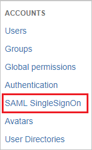
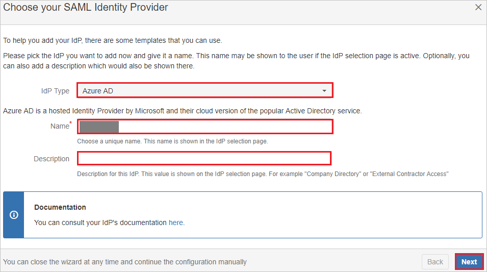

# Tutorial: Azure Active Directory integration with SAML SSO for Bitbucket by resolution GmbH

In this tutorial, you'll learn how to integrate SAML SSO for Bitbucket by resolution GmbH with Azure Active Directory (Azure AD). When you integrate SAML SSO for Bitbucket by resolution GmbH with Azure AD, you can:

* Control in Azure AD who has access toSAML SSO for Bitbucket by resolution GmbH.
* Enable your users to be automatically signed in toSAML SSO for Bitbucket by resolution GmbH with their Azure AD accounts.
* Manage your accounts in one central location: the Azure portal.

## Prerequisites

To configure Azure AD integration with SAML SSO for Bitbucket by resolution GmbH, you need the following items:

* An Azure AD subscription. If you don't have an Azure AD environment, you can get one-month trial [here](https://azure.microsoft.com/pricing/free-trial/)
* SAML SSO for Bitbucket by resolution GmbH single sign-on enabled subscription

## Scenario description

In this tutorial, you configure and test Azure AD single sign-on in a test environment.

* SAML SSO for Bitbucket by resolution GmbH supports **SP and IDP** initiated SSO
* SAML SSO for Bitbucket by resolution GmbH supports **Just In Time** user provisioning

## Add SAML SSO for Bitbucket by resolution GmbH from the gallery

To configure the integration of SAML SSO for Bitbucket by resolution GmbH into Azure AD, you need to add SAML SSO for Bitbucket by resolution GmbH from the gallery to your list of managed SaaS apps.

1. Sign in to the Azure portal by using either a work or school account, or a personal Microsoft account.
1. On the left pane, select **Azure Active Directory**.
1. Go to **Enterprise Applications**, and then select **All Applications**.
1. To add a new application, select **New application**.
1. In the **Add from the gallery** section, type **SAML SSO for Bitbucket by resolution GmbH** in the search box.
1. Select **SAML SSO for Bitbucket by resolution GmbH** from the results, and then add the app. Wait a few seconds while the app is added to your tenant.

 Alternatively, you can also use the [Enterprise App Configuration Wizard](https://portal.office.com/AdminPortal/home?Q=Docs#/azureadappintegration). In this wizard, you can add an application to your tenant, add users/groups to the app, assign roles, as well as walk through the SSO configuration as well. [Learn more about Microsoft 365 wizards.](/microsoft-365/admin/misc/azure-ad-setup-guides)

## Configure and test Azure AD SSO for SAML SSO for Bitbucket by resolution GmbH

Configure and test Azure AD SSO with SAML SSO for Bitbucket by resolution GmbH, by using a test user called **B.Simon**. For SSO to work, you need to establish a linked relationship between an Azure AD user and the related user in SAML SSO for Bitbucket by resolution GmbH.

To configure and test Azure AD SSO with SAML SSO for Bitbucket by resolution GmbH, perform the following steps:

1. **[Configure Azure AD SSO](#configure-azure-ad-sso)** - to enable your users to use this feature.
    1. **[Create an Azure AD test user](#create-an-azure-ad-test-user)** - to test Azure AD single sign-on with Britta Simon.
    1. **[Assign the Azure AD test user](#assign-the-azure-ad-test-user)** - to enable Britta Simon to use Azure AD single sign-on.
2. **[Configure SAML SSO for Bitbucket by resolution GmbH SSO](#configure-saml-sso-for-bitbucket-by-resolution-gmbh-sso)** - to configure the Single Sign-On settings on application side.
    1. **[Create SAML SSO for Bitbucket by resolution GmbH test user](#create-saml-sso-for-bitbucket-by-resolution-gmbh-test-user)** - to have a counterpart of Britta Simon in SAML SSO for Bitbucket by resolution GmbH that is linked to the Azure AD representation of user.
6. **[Test SSO](#test-sso)** - to verify whether the configuration works.

## Configure Azure AD SSO

In this section, you enable Azure AD SSO in the Azure portal.
 
1. In the Azure portal, on the **SAML SSO for Bitbucket by resolution GmbH** application integration page, find the **Manage** section and select **Single Sign-On**.
1. On the **Select a Single Sign-On Method** page, select **SAML**.
1. On the **Set up Single Sign-On with SAML** page, select the pencil icon for **Basic SAML Configuration** to edit the settings.

    

4. On the **Basic SAML Configuration** section, perform the following steps if you wish to configure the application in **IDP** initiated mode:

    a. In the **Identifier** text box, type a URL using the following pattern:
    `https://<server-base-url>/plugins/servlet/samlsso`

    b. In the **Reply URL** text box, type a URL using the following pattern:
    `https://<server-base-url>/plugins/servlet/samlsso`

    c. Click **Set additional URLs** and perform the following step if you wish to configure the application in **SP** initiated mode:
    
    In the **Sign-on URL** text box, type a URL using the following pattern:
    `https://<server-base-url>/plugins/servlet/samlsso`

    > [!NOTE]
    > These values are not real. Update these values with the actual Identifier, Reply URL and Sign-on URL. Contact [SAML SSO for Bitbucket by resolution GmbH Client support team](https://marketplace.atlassian.com/apps/1217045/saml-single-sign-on-sso-bitbucket?hosting=server&tab=support) to get these values. You can also refer to the patterns shown in the **Basic SAML Configuration** section in the Azure portal.

5. On the **Set up Single Sign-On with SAML** page, in the **SAML Signing Certificate** section, click **Download** to download the **Federation Metadata XML** from the given options as per your requirement and save it on your computer.

    

### Create an Azure AD test user

In this section, you create a test user in the Azure portal called B.Simon.

1. From the left pane in the Azure portal, select **Azure Active Directory** > **Users** > **All users**.
1. Select **New user** at the top of the screen.
1. In the **User** properties, follow these steps:
   1. In the **Name** field, enter `B.Simon`.  
   1. In the **User name** field, enter the username@companydomain.extension. For example, `B.Simon@contoso.com`.
   1. Select the **Show password** check box, and then write the password down.
   1. Select **Create**.

### Assign the Azure AD test user

In this section, you enable B.Simon to use Azure single sign-on by granting access to SAML SSO for Bitbucket by resolution GmbH.

1. In the Azure portal, select **Enterprise Applications** > **All applications**.
1. In the applications list, select **SAML SSO for Bitbucket by resolution GmbH**.
1. In the app's overview page, find the **Manage** section, and select **Users and groups**.
1. Select **Add user**. Then, in the **Add Assignment** dialog box, select **Users and groups**.
1. In the **Users and groups** dialog box, select **B.Simon** from the list of users. Then choose **Select** at the bottom of the screen.
1. If you are expecting a role to be assigned to the users, you can select it from the **Select a role** dropdown. If no role has been set up for this app, you see "Default Access" role selected.
1. In the **Add Assignment** dialog box, select **Assign**.

## Configure SAML SSO for Bitbucket by resolution GmbH SSO

1. Sign-on to your SAML SSO for Bitbucket by resolution GmbH company site as administrator.

2. On the right side of the main toolbar, click **Settings**.

3. Go to ACCOUNTS section, click on **SAML SingleSignOn** on the Menubar.

    

4. On the **SAML SIngleSignOn Plugin Configuration page**, click **Add idp**. 

    

5. On the **Choose your SAML Identity Provider** Page, perform the following steps:

    

    a. Select **Idp Type** as **AZURE AD**.

    b. In the **Name** textbox, type the name.

    c. In the **Description** textbox, type the description.

    d. Click **Next**.

6. On the **Identity provider configuration page**, click **Next**.

    

7.  On the **Import SAML Idp Metadata** Page, click **Load File** to upload the **METADATA XML** file which you have downloaded from Azure portal.

    

8. Click **Next**.

9. Click **Save settings**.

    

## Create SAML SSO for Bitbucket by resolution GmbH test user

The objective of this section is to create a user called Britta Simon in SAML SSO for Bitbucket by resolution GmbH. SAML SSO for Bitbucket by resolution GmbH supports just-in-time provisioning and also users can be created manually, contact [SAML SSO for Bitbucket by resolution GmbH Client support team](https://marketplace.atlassian.com/plugins/com.resolution.atlasplugins.samlsso-bitbucket/server/support) as per your requirement.

## Test SSO 

In this section, you test your Azure AD single sign-on configuration with following options. 

#### SP initiated:

* Click on **Test this application** in Azure portal. This will redirect to SAML SSO for Bitbucket by resolution GmbH Sign on URL where you can initiate the login flow.  

* Go to SAML SSO for Bitbucket by resolution GmbH Sign-on URL directly and initiate the login flow from there.

#### IDP initiated:

* Click on **Test this application** in Azure portal and you should be automatically signed in to the SAML SSO for Bitbucket by resolution GmbH for which you set up the SSO.

You can also use Microsoft My Apps to test the application in any mode. When you click the SAML SSO for Bitbucket by resolution GmbH tile in the My Apps, if configured in SP mode you would be redirected to the application sign on page for initiating the login flow and if configured in IDP mode, you should be automatically signed in to the SAML SSO for Bitbucket by resolution GmbH for which you set up the SSO. For more information about the My Apps, see [Introduction to the My Apps](https://support.microsoft.com/account-billing/sign-in-and-start-apps-from-the-my-apps-portal-2f3b1bae-0e5a-4a86-a33e-876fbd2a4510).

## Next steps

Once you configure the SAML SSO for Bitbucket by resolution GmbH you can enforce session controls, which protects exfiltration and infiltration of your organization’s sensitive data in real time. Session controls extends from Conditional Access. [Learn how to enforce session control with Microsoft Defender for Cloud Apps](/cloud-app-security/proxy-deployment-any-app).
