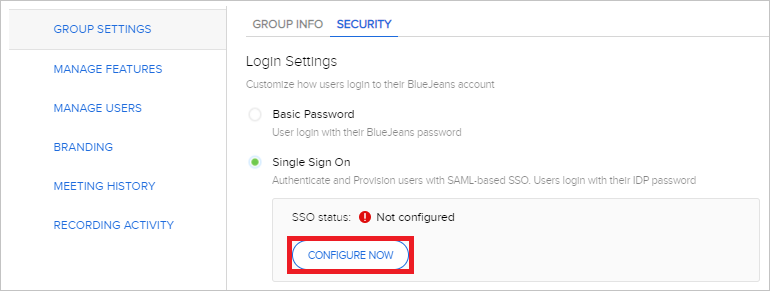
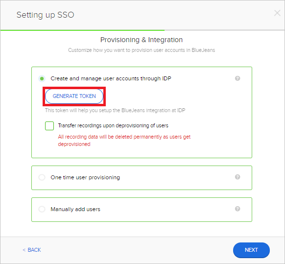

# Tutorial: Configure BlueJeans for automatic user provisioning

This tutorial describes the steps you need to perform in both BlueJeans and Microsoft Entra ID to configure automatic user provisioning. When configured, Microsoft Entra ID automatically provisions and de-provisions users to [BlueJeans](https://www.bluejeans.com) using the Microsoft Entra provisioning service. For important details on what this service does, how it works, and frequently asked questions, see [Automate user provisioning and deprovisioning to SaaS applications with Microsoft Entra ID](../app-provisioning/user-provisioning.md). 

## Capabilities supported
> [!div class="checklist"]
> * Create users in BlueJeans
> * Remove users in BlueJeans when they do not require access anymore
> * Keep user attributes synchronized between Microsoft Entra ID and BlueJeans
> * [Single sign-on](./bluejeans-tutorial.md) to BlueJeans (recommended)

## Prerequisites

The scenario outlined in this tutorial assumes that you already have the following prerequisites:

* [A Microsoft Entra tenant](../develop/quickstart-create-new-tenant.md).
* A user account in Microsoft Entra ID with [permission](../roles/permissions-reference.md) to configure provisioning (for example, Application Administrator, Cloud Application administrator, Application Owner, or Global Administrator). 
* A BlueJeans tenant with [My Company](https://www.bluejeans.com) plan or better enabled.
* A user account in BlueJeans with Admin permissions.
* SCIM provisioning enabled in BlueJeans Enterprise.

> [!NOTE]
> The Microsoft Entra provisioning integration relies on the [BlueJeans API](https://BlueJeans.github.io/developer), which is available to BlueJeans teams on the Standard plan or better.

## Step 1: Plan your provisioning deployment
1. Learn about [how the provisioning service works](../app-provisioning/user-provisioning.md).
2. Determine who will be in [scope for provisioning](../app-provisioning/define-conditional-rules-for-provisioning-user-accounts.md).
3. Determine what data to [map between Microsoft Entra ID and BlueJeans](../app-provisioning/customize-application-attributes.md).

## Step 2: Configure BlueJeans to support provisioning with Microsoft Entra ID

1. Login to BlueJeans admin console. Navigate to Group Settings > Security.
2. Select **Single Sign On** and **Configure Now**.

	

3. In the **Provision & Integration** window, select **Create and manage user accounts through IDP** and click **GENERATE TOKEN**.

	
	
4. Copy and save the Token. 
5. The BlueJeans Tenant URL is `https://api.bluejeans.com/v2/scim`. The **Tenant URL** and the **Secret Token** from the previous step will be entered in the Provisioning tab of your BlueJeans application.

## Step 3: Add BlueJeans from the Microsoft Entra application gallery

Add BlueJeans from the Microsoft Entra application gallery to start managing provisioning to BlueJeans. If you have previously setup BlueJeans for SSO you can use the same application. However it is recommended that you create a separate app when testing out the integration initially. Learn more about adding an application from the gallery [here](../manage-apps/add-application-portal.md).

## Step 4: Define who will be in scope for provisioning 

The Microsoft Entra provisioning service allows you to scope who will be provisioned based on assignment to the application and or based on attributes of the user. If you choose to scope who will be provisioned to your app based on assignment, you can use the following [steps](../manage-apps/assign-user-or-group-access-portal.md) to assign users to the application. If you choose to scope who will be provisioned based solely on attributes of the user, you can use a scoping filter as described [here](../app-provisioning/define-conditional-rules-for-provisioning-user-accounts.md). 

* Start small. Test with a small set of users and groups before rolling out to everyone. When scope for provisioning is set to assigned users and groups, you can control this by assigning one or two users or groups to the app. When scope is set to all users and groups, you can specify an [attribute based scoping filter](../app-provisioning/define-conditional-rules-for-provisioning-user-accounts.md).

* Start small. Test with a small set of users before rolling out to everyone. When scope for provisioning is set to assigned users, you can control this by assigning one or two users to the app. When scope is set to all users, you can specify an [attribute based scoping filter](../app-provisioning/define-conditional-rules-for-provisioning-user-accounts.md). 

## Step 5: Configure automatic user provisioning to BlueJeans

This section guides you through the steps to configure the Microsoft Entra provisioning service to create, update, and disable users in TestApp based on user assignments in Microsoft Entra ID.

### To configure automatic user provisioning for BlueJeans in Microsoft Entra ID:

1. Sign in to the [Microsoft Entra admin center](https://entra.microsoft.com) as at least a [Cloud Application Administrator](../roles/permissions-reference.md#cloud-application-administrator).
1. Browse to **Identity** > **Applications** > **Enterprise applications**

	

1. In the applications list, select **BlueJeans**.

	

3. Select the **Provisioning** tab.

	

4. Set the **Provisioning Mode** to **Automatic**.

	

5. Under the **Admin Credentials** section, input your BlueJeans Tenant URL and Secret Token retrieved in Step 2. Click **Test Connection** to ensure Microsoft Entra ID can connect to BlueJeans. If the connection fails, ensure your BlueJeans account has Admin permissions and try again.

 	

6. In the **Notification Email** field, enter the email address of a person who should receive the provisioning error notifications and check the checkbox - **Send an email notification when a failure occurs**.

	

7. Select **Save**.

8. Under the **Mappings** section, select **Synchronize Microsoft Entra users to BlueJeans**.

9. Review the user attributes that are synchronized from Microsoft Entra ID to BlueJeans in the **Attribute Mapping** section. The attributes selected as **Matching** properties are used to match the user accounts in BlueJeans for update operations. If you choose to change the [matching target attribute](../app-provisioning/customize-application-attributes.md), you will need to ensure that the BlueJeans API supports filtering users based on that attribute. Select the **Save** button to commit any changes.

|Attribute|Type|Supported for filtering|
|---|---|---|
|userName|String|&check;|
|active|Boolean|
|title|String|
|emails[type eq "work"].value|String|
|name.givenName|String|
|name.familyName|String|
|phoneNumbers[type eq "work"].value|String|
|urn:ietf:params:scim:schemas:extension:enterprise:2.0:User:manager|String|

10. To configure scoping filters, refer to the following instructions provided in the [Scoping filter tutorial](../app-provisioning/define-conditional-rules-for-provisioning-user-accounts.md).

11. To enable the Microsoft Entra provisioning service for BlueJeans, change the **Provisioning Status** to **On** in the **Settings** section.

	

12. Define the users that you would like to provision to BlueJeans by choosing the desired values in **Scope** in the **Settings** section.

	

13. When you are ready to provision, click **Save**.

	

This operation starts the initial synchronization of all users defined in **Scope** in the **Settings** section. The initial sync takes longer to perform than subsequent syncs, which occur approximately every 40 minutes as long as the Microsoft Entra provisioning service is running. 

## Step 6: Monitor your deployment
Once you've configured provisioning, use the following resources to monitor your deployment:

1. Use the [provisioning logs](../reports-monitoring/concept-provisioning-logs.md) to determine which users have been provisioned successfully or unsuccessfully
2. Check the [progress bar](../app-provisioning/application-provisioning-when-will-provisioning-finish-specific-user.md) to see the status of the provisioning cycle and how close it is to completion
3. If the provisioning configuration seems to be in an unhealthy state, the application will go into quarantine. Learn more about quarantine states [here](../app-provisioning/application-provisioning-quarantine-status.md).  

## Connector Limitations

* Bluejeans does not allow userNames that exceed 30 characters.

## Additional resources

* [Managing user account provisioning for Enterprise Apps](../app-provisioning/configure-automatic-user-provisioning-portal.md)
* [What is application access and single sign-on with Microsoft Entra ID?](../manage-apps/what-is-single-sign-on.md)

## Next steps

* [Learn how to review logs and get reports on provisioning activity](../app-provisioning/check-status-user-account-provisioning.md)
