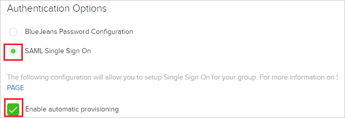
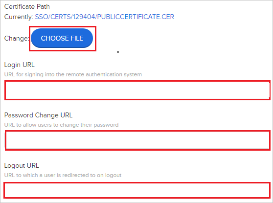
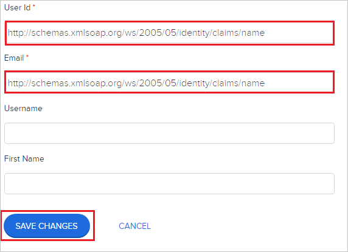
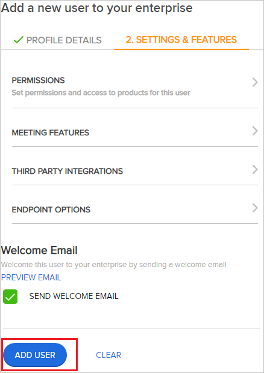

# Tutorial: Microsoft Entra single sign-on (SSO) integration with BlueJeans for Microsoft Entra ID

In this tutorial, you'll learn how to integrate BlueJeans for Microsoft Entra ID with Microsoft Entra ID. When you integrate BlueJeans for Microsoft Entra ID with Microsoft Entra ID, you can:

* Control in Microsoft Entra ID who has access to BlueJeans for Microsoft Entra ID.
* Enable your users to be automatically signed-in to BlueJeans for Microsoft Entra ID with their Microsoft Entra accounts.
* Manage your accounts in one central location.

## Prerequisites

To get started, you need the following items:

* A Microsoft Entra subscription. If you don't have a subscription, you can get a [free account](https://azure.microsoft.com/free/).
* BlueJeans for Microsoft Entra single sign-on (SSO) enabled subscription.

> [!NOTE]
> This integration is also available to use from Microsoft Entra US Government Cloud environment. You can find this application in the Microsoft Entra US Government Cloud Application Gallery and configure it in the same way as you do from public cloud.

## Scenario description

In this tutorial, you configure and test Microsoft Entra SSO in a test environment.

* BlueJeans for Microsoft Entra ID supports **SP** initiated SSO.

* BlueJeans for Microsoft Entra ID supports [**Automated** user provisioning](bluejeans-provisioning-tutorial.md).

> [!NOTE]
> Identifier of this application is a fixed string value so only one instance can be configured in one tenant.

## Add BlueJeans for Microsoft Entra ID from the gallery

To configure the integration of BlueJeans for Microsoft Entra ID into Microsoft Entra ID, you need to add BlueJeans for Microsoft Entra ID from the gallery to your list of managed SaaS apps.

1. Sign in to the [Microsoft Entra admin center](https://entra.microsoft.com) as at least a [Cloud Application Administrator](../roles/permissions-reference.md#cloud-application-administrator).
1. Browse to **Identity** > **Applications** > **Enterprise applications** > **New application**.
1. In the **Add from the gallery** section, type **BlueJeans for Microsoft Entra ID** in the search box.
1. Select **BlueJeans for Microsoft Entra ID** from results panel and then add the app. Wait a few seconds while the app is added to your tenant.

 Alternatively, you can also use the [Enterprise App Configuration Wizard](https://portal.office.com/AdminPortal/home?Q=Docs#/azureadappintegration). In this wizard, you can add an application to your tenant, add users/groups to the app, assign roles, as well as walk through the SSO configuration as well. [Learn more about Microsoft 365 wizards.](/microsoft-365/admin/misc/azure-ad-setup-guides)

## Configure and test Microsoft Entra SSO for BlueJeans for Microsoft Entra ID

Configure and test Microsoft Entra SSO with BlueJeans for Microsoft Entra ID using a test user called **B.Simon**. For SSO to work, you need to establish a link relationship between a Microsoft Entra user and the related user in BlueJeans for Microsoft Entra ID.

To configure and test Microsoft Entra SSO with BlueJeans for Microsoft Entra ID, perform the following steps:

1. **[Configure Microsoft Entra SSO](#configure-azure-ad-sso)** - to enable your users to use this feature.
    1. **[Create a Microsoft Entra test user](#create-an-azure-ad-test-user)** - to test Microsoft Entra single sign-on with B.Simon.
    1. **[Assign the Microsoft Entra test user](#assign-the-azure-ad-test-user)** - to enable B.Simon to use Microsoft Entra single sign-on.
1. **[Configure BlueJeans for Microsoft Entra SSO](#configure-bluejeans-for-azure-ad-sso)** - to configure the single sign-on settings on application side.
    1. **[Create BlueJeans for Microsoft Entra test user](#create-bluejeans-for-azure-ad-test-user)** - to have a counterpart of B.Simon in BlueJeans for Microsoft Entra ID that is linked to the Microsoft Entra representation of user.
1. **[Test SSO](#test-sso)** - to verify whether the configuration works.

## Configure Microsoft Entra SSO

Follow these steps to enable Microsoft Entra SSO.

1. Sign in to the [Microsoft Entra admin center](https://entra.microsoft.com) as at least a [Cloud Application Administrator](../roles/permissions-reference.md#cloud-application-administrator).
1. Browse to **Identity** > **Applications** > **Enterprise applications** > **BlueJeans for Microsoft Entra ID** > **Single sign-on**.
1. On the **Select a single sign-on method** page, select **SAML**.
1. On the **Set up single sign-on with SAML** page, click the pencil icon for **Basic SAML Configuration** to edit the settings.

   

1. On the **Basic SAML Configuration** section, enter the values for the following fields:

    a. In the **Sign-on URL** text box, type a URL using the following pattern:
    `https://<companyname>.bluejeans.com`

    a. In the **Identifier (Entity ID)** text box, type the URL:
    `http://samlsp.bluejeans.com`

    a. In the **Reply URL** text box, type the URL:
    `https://bluejeans.com/sso/saml2/`

	> [!NOTE]
	> The Sign-On URL value is not real. Update the value with the actual Sign-On URL. Contact [BlueJeans for Microsoft Entra Client support team](https://support.bluejeans.com/contact) to get the value. You can also refer to the patterns shown in the **Basic SAML Configuration** section.

1. BlueJeans application expects the SAML assertions in a specific format, which requires you to add custom attribute mappings to your SAML token attributes configuration. The following screenshot shows the list of default attributes.

	

1. In addition to above, BlueJeans application expects few more attributes to be passed back in SAML response which are shown below. These attributes are also pre populated but you can review them as per your requirements.

	| Name |  Source Attribute|
	| ---------| --------- |
	| Phone | user.telephonenumber |
    | title | user.jobtitle |

1. On the **Set up single sign-on with SAML** page, in the **SAML Signing Certificate** section,  find **Certificate (Base64)** and select **Download** to download the certificate and save it on your computer.

	

1. On the **Set up BlueJeans for Microsoft Entra ID** section, copy the appropriate URL(s) based on your requirement.

	

### Create a Microsoft Entra test user

In this section, you'll create a test user called B.Simon.

1. Sign in to the [Microsoft Entra admin center](https://entra.microsoft.com) as at least a [User Administrator](../roles/permissions-reference.md#user-administrator).
1. Browse to **Identity** > **Users** > **All users**.
1. Select **New user** > **Create new user**, at the top of the screen.
1. In the **User** properties, follow these steps:
   1. In the **Display name** field, enter `B.Simon`.  
   1. In the **User principal name** field, enter the username@companydomain.extension. For example, `B.Simon@contoso.com`.
   1. Select the **Show password** check box, and then write down the value that's displayed in the **Password** box.
   1. Select **Review + create**.
1. Select **Create**.

### Assign the Microsoft Entra test user

In this section, you'll enable B.Simon to use single sign-on by granting access to BlueJeans for Microsoft Entra ID.

1. Sign in to the [Microsoft Entra admin center](https://entra.microsoft.com) as at least a [Cloud Application Administrator](../roles/permissions-reference.md#cloud-application-administrator).
1. Browse to **Identity** > **Applications** > **Enterprise applications** > **BlueJeans for Microsoft Entra ID**.
1. In the app's overview page, select **Users and groups**.
1. Select **Add user/group**, then select **Users and groups** in the **Add Assignment** dialog.
   1. In the **Users and groups** dialog, select **B.Simon** from the Users list, then click the **Select** button at the bottom of the screen.
   1. If you are expecting a role to be assigned to the users, you can select it from the **Select a role** dropdown. If no role has been set up for this app, you see "Default Access" role selected.
   1. In the **Add Assignment** dialog, click the **Assign** button.

## Configure BlueJeans for Microsoft Entra SSO

1. In a different web browser window, sign in to your **BlueJeans for Microsoft Entra ID** company site as an administrator.

2. Go to **ADMIN \> GROUP SETTINGS \> SECURITY**.

	

3. In the **SECURITY** section, perform the following steps:

	

	a. Select **SAML Single Sign On**.

	b. Select **Enable automatic provisioning**.

4. Move on with the following steps:

	

	a. Click **Choose File**, to upload the base-64 encoded certificate that you have downloaded.

    b. In the **Login URL** textbox, paste the value of **Login URL**..

    c. In the **Password Change URL** textbox, paste the value of **Change Password URL**..

    d. In the **Logout URL** textbox, paste the value of **Logout URL**..

5. Move on with the following steps:

	

	a. In the **User Id** textbox, type `http://schemas.xmlsoap.org/ws/2005/05/identity/claims/name`.

    b. In the **Email** textbox, type `http://schemas.xmlsoap.org/ws/2005/05/identity/claims/name`.

    c. Click **SAVE CHANGES**.

### Create BlueJeans for Microsoft Entra test user

The objective of this section is to create a user called B.Simon in BlueJeans for Microsoft Entra ID. BlueJeans for Microsoft Entra ID supports automatic user provisioning, which is by default enabled. You can find more details [here](bluejeans-provisioning-tutorial.md) on how to configure automatic user provisioning.

**If you need to create user manually, perform following steps:**

1. Sign in to your **BlueJeans for Microsoft Entra ID** company site as an administrator.

2. Go to **ADMIN \> MANAGE USERS \> ADD USER**.

	

	> [!IMPORTANT]
	> The **ADD USER** tab is only available if, in the **SECUTIRY tab**, **Enable automatic provisioning** is unchecked.

3. In the **ADD USER** section, perform the following steps:

	

	a. In **First Name** text box, enter the first name of user like **B**.

	b. In **Last Name** text box, enter the last name of user like **Simon**.

	c. In **Pick a BlueJeans for Microsoft Entra Username** text box, enter the username of user like **Brittasimon**

	d. In **Create a Password** text box, enter your password.

	e. In **Company** text box, enter your Company.

	f. In **Email Address** text box, enter the email of user like `b.simon@contoso.com`.

	g. In **Create a BlueJeans for Microsoft Entra Meeting I.D** text box, enter your meeting ID.

	h. In **Pick a Moderator Passcode** text box, enter your passcode.

	i. Click **CONTINUE**.

	

	J. Click **ADD USER**.

> [!NOTE]
> You can use any other BlueJeans for Microsoft Entra user account creation tools or APIs provided by BlueJeans for Microsoft Entra ID to provision Microsoft Entra user accounts.

## Test SSO 

In this section, you test your Microsoft Entra single sign-on configuration with following options. 

* Click on **Test this application**, this will redirect to BlueJeans for Microsoft Entra Sign-on URL where you can initiate the login flow. 

* Go to BlueJeans for Microsoft Entra Sign-on URL directly and initiate the login flow from there.

* You can use Microsoft My Apps. When you click the BlueJeans for Microsoft Entra ID tile in the My Apps, this will redirect to BlueJeans for Microsoft Entra Sign-on URL. For more information about the My Apps, see [Introduction to the My Apps](https://support.microsoft.com/account-billing/sign-in-and-start-apps-from-the-my-apps-portal-2f3b1bae-0e5a-4a86-a33e-876fbd2a4510).

## Next steps

Once you configure BlueJeans for Microsoft Entra ID you can enforce session control, which protects exfiltration and infiltration of your organization’s sensitive data in real time. Session control extends from Conditional Access. [Learn how to enforce session control with Microsoft Defender for Cloud Apps](/cloud-app-security/proxy-deployment-aad).
