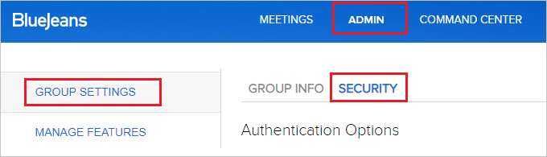
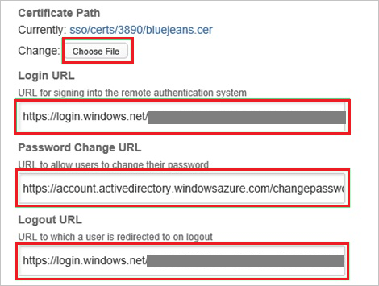
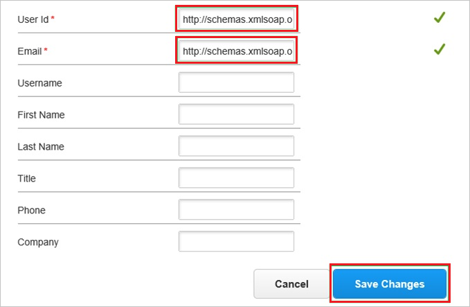
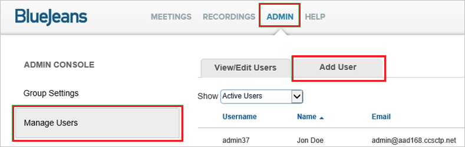
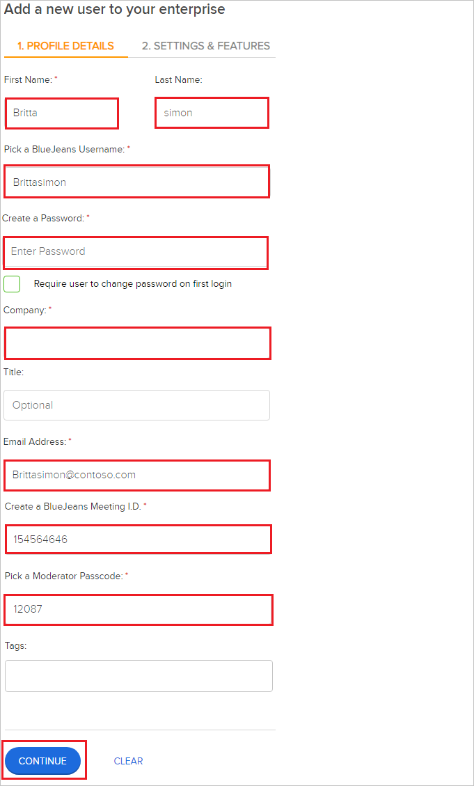

# Tutorial: Azure Active Directory single sign-on (SSO) integration with BlueJeans for Azure AD

In this tutorial, you'll learn how to integrate BlueJeans for Azure AD with Azure Active Directory (Azure AD). When you integrate BlueJeans for Azure AD with Azure AD, you can:

* Control in Azure AD who has access to BlueJeans for Azure AD.
* Enable your users to be automatically signed-in to BlueJeans for Azure AD with their Azure AD accounts.
* Manage your accounts in one central location - the Azure portal.

To learn more about SaaS app integration with Azure AD, see [What is application access and single sign-on with Azure Active Directory](https://docs.microsoft.com/azure/active-directory/active-directory-appssoaccess-whatis).

## Prerequisites

To get started, you need the following items:

* An Azure AD subscription. If you don't have a subscription, you can get a [free account](https://azure.microsoft.com/free/).
* BlueJeans for Azure AD single sign-on (SSO) enabled subscription.

## Scenario description

In this tutorial, you configure and test Azure AD SSO in a test environment.

* BlueJeans for Azure AD supports **SP** initiated SSO

* BlueJeans for Azure AD supports [**Automated** user provisioning](bluejeans-provisioning-tutorial.md)

> [!NOTE]
> Identifier of this application is a fixed string value so only one instance can be configured in one tenant.

## Adding BlueJeans for Azure AD from the gallery

To configure the integration of BlueJeans for Azure AD into Azure AD, you need to add BlueJeans for Azure AD from the gallery to your list of managed SaaS apps.

1. Sign in to the [Azure portal](https://portal.azure.com) using either a work or school account, or a personal Microsoft account.
1. On the left navigation pane, select the **Azure Active Directory** service.
1. Navigate to **Enterprise Applications** and then select **All Applications**.
1. To add new application, select **New application**.
1. In the **Add from the gallery** section, type **BlueJeans for Azure AD** in the search box.
1. Select **BlueJeans for Azure AD** from results panel and then add the app. Wait a few seconds while the app is added to your tenant.

## Configure and test Azure AD single sign-on for BlueJeans for Azure AD

Configure and test Azure AD SSO with BlueJeans for Azure AD using a test user called **B.Simon**. For SSO to work, you need to establish a link relationship between an Azure AD user and the related user in BlueJeans for Azure AD.

To configure and test Azure AD SSO with BlueJeans for Azure AD, complete the following building blocks:

1. **[Configure Azure AD SSO](#configure-azure-ad-sso)** - to enable your users to use this feature.
    1. **[Create an Azure AD test user](#create-an-azure-ad-test-user)** - to test Azure AD single sign-on with B.Simon.
    1. **[Assign the Azure AD test user](#assign-the-azure-ad-test-user)** - to enable B.Simon to use Azure AD single sign-on.
1. **[Configure BlueJeans for Azure AD SSO](#configure-bluejeans-for-azure-ad-sso)** - to configure the single sign-on settings on application side.
    1. **[Create BlueJeans for Azure AD test user](#create-bluejeans-for-azure-ad-test-user)** - to have a counterpart of B.Simon in BlueJeans for Azure AD that is linked to the Azure AD representation of user.
1. **[Test SSO](#test-sso)** - to verify whether the configuration works.

## Configure Azure AD SSO

Follow these steps to enable Azure AD SSO in the Azure portal.

1. In the [Azure portal](https://portal.azure.com/), on the **BlueJeans for Azure AD** application integration page, find the **Manage** section and select **single sign-on**.
1. On the **Select a single sign-on method** page, select **SAML**.
1. On the **Set up single sign-on with SAML** page, click the edit/pen icon for **Basic SAML Configuration** to edit the settings.

   

1. On the **Basic SAML Configuration** section, enter the values for the following fields:

    a. In the **Sign-on URL** text box, type a URL using the following pattern:
    `https://<companyname>.bluejeans.com`

    a. In the **Identifier (Entity ID)** text box, type a URL:
    `http://samlsp.bluejeans.com`

    a. In the **Reply URL** text box, type a URL:
    `https://bluejeans.com/sso/saml2/`

	> [!NOTE]
	> The Sign-On URL value is not real. Update the value with the actual Sign-On URL. Contact [BlueJeans for Azure AD Client support team](https://support.bluejeans.com/contact) to get the value. You can also refer to the patterns shown in the **Basic SAML Configuration** section in the Azure portal.

1. BlueJeans application expects the SAML assertions in a specific format, which requires you to add custom attribute mappings to your SAML token attributes configuration. The following screenshot shows the list of default attributes.

	

1. In addition to above, BlueJeans application expects few more attributes to be passed back in SAML response which are shown below. These attributes are also pre populated but you can review them as per your requirements.

	| Name |  Source Attribute|
	| ---------| --------- |
	| Phone | user.telephonenumber |
    | title | user.jobtitle |

1. On the **Set up single sign-on with SAML** page, in the **SAML Signing Certificate** section,  find **Certificate (Base64)** and select **Download** to download the certificate and save it on your computer.

	

1. On the **Set up BlueJeans for Azure AD** section, copy the appropriate URL(s) based on your requirement.

	

### Create an Azure AD test user

In this section, you'll create a test user in the Azure portal called B.Simon.

1. From the left pane in the Azure portal, select **Azure Active Directory**, select **Users**, and then select **All users**.
1. Select **New user** at the top of the screen.
1. In the **User** properties, follow these steps:
   1. In the **Name** field, enter `B.Simon`.  
   1. In the **User name** field, enter the username@companydomain.extension. For example, `B.Simon@contoso.com`.
   1. Select the **Show password** check box, and then write down the value that's displayed in the **Password** box.
   1. Click **Create**.

### Assign the Azure AD test user

In this section, you'll enable B.Simon to use Azure single sign-on by granting access to BlueJeans for Azure AD.

1. In the Azure portal, select **Enterprise Applications**, and then select **All applications**.
1. In the applications list, select **BlueJeans for Azure AD**.
1. In the app's overview page, find the **Manage** section and select **Users and groups**.

   

1. Select **Add user**, then select **Users and groups** in the **Add Assignment** dialog.

	

1. In the **Users and groups** dialog, select **B.Simon** from the Users list, then click the **Select** button at the bottom of the screen.
1. If you're expecting any role value in the SAML assertion, in the **Select Role** dialog, select the appropriate role for the user from the list and then click the **Select** button at the bottom of the screen.
1. In the **Add Assignment** dialog, click the **Assign** button.

## Configure BlueJeans for Azure AD SSO

1. In a different web browser window, sign in to your **BlueJeans for Azure AD** company site as an administrator.

2. Go to **ADMIN \> GROUP SETTINGS \> SECURITY**.

	

3. In the **SECURITY** section, perform the following steps:

	

	a. Select **SAML Single Sign On**.

	b. Select **Enable automatic provisioning**.

4. Move on with the following steps:

	

	a. Click **Choose File**, to upload the base-64 encoded certificate that you have downloaded from the Azure portal.

    b. In the **Login URL** textbox, paste the value of **Login URL** which you have copied from Azure portal.

    c. In the **Password Change URL** textbox, paste the value of **Change Password URL** which you have copied from Azure portal.

    d. In the **Logout URL** textbox, paste the value of **Logout URL** which you have copied from Azure portal.

5. Move on with the following steps:

	

	a. In the **User Id** textbox, type `http://schemas.xmlsoap.org/ws/2005/05/identity/claims/name`.

    b. In the **Email** textbox, type `http://schemas.xmlsoap.org/ws/2005/05/identity/claims/name`.

    c. Click **SAVE CHANGES**.

### Create BlueJeans for Azure AD test user

The objective of this section is to create a user called B.Simon in BlueJeans for Azure AD. BlueJeans for Azure AD supports automatic user provisioning, which is by default enabled. You can find more details [here](bluejeans-provisioning-tutorial.md) on how to configure automatic user provisioning.

**If you need to create user manually, perform following steps:**

1. Sign in to your **BlueJeans for Azure AD** company site as an administrator.

2. Go to **ADMIN \> MANAGE USERS \> ADD USER**.

	

	> [!IMPORTANT]
	> The **ADD USER** tab is only available if, in the **SECUTIRY tab**, **Enable automatic provisioning** is unchecked.

3. In the **ADD USER** section, perform the following steps:

	

	a. In **First Name** text box, enter the first name of user like **B**.

	b. In **Last Name** text box, enter the last name of user like **Simon**.

	c. In **Pick a BlueJeans for Azure AD Username** text box, enter the username of user like **Brittasimon**

	d. In **Create a Password** text box, enter your password.

	e. In **Company** text box, enter your Company.

	f. In **Email Address** text box, enter the email of user like `b.simon\@contoso.com`.

	g. In **Create a BlueJeans for Azure AD Meeting I.D** text box, enter your meeting ID.

	h. In **Pick a Moderator Passcode** text box, enter your passcode.

	i. Click **CONTINUE**.

	

	J. Click **ADD USER**.

> [!NOTE]
> You can use any other BlueJeans for Azure AD user account creation tools or APIs provided by BlueJeans for Azure AD to provision Azure AD user accounts.

## Test SSO 

In this section, you test your Azure AD single sign-on configuration using the Access Panel.

When you click the BlueJeans for Azure AD tile in the Access Panel, you should be automatically signed in to the BlueJeans for Azure AD for which you set up SSO. For more information about the Access Panel, see [Introduction to the Access Panel](https://docs.microsoft.com/azure/active-directory/active-directory-saas-access-panel-introduction).

## Additional resources

- [ List of Tutorials on How to Integrate SaaS Apps with Azure Active Directory ](https://docs.microsoft.com/azure/active-directory/active-directory-saas-tutorial-list)

- [What is application access and single sign-on with Azure Active Directory? ](https://docs.microsoft.com/azure/active-directory/active-directory-appssoaccess-whatis)

- [What is conditional access in Azure Active Directory?](https://docs.microsoft.com/azure/active-directory/conditional-access/overview)

- [Try BlueJeans for Azure AD with Azure AD](https://aad.portal.azure.com/)
