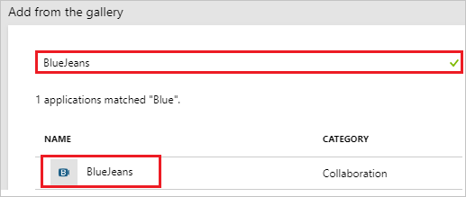
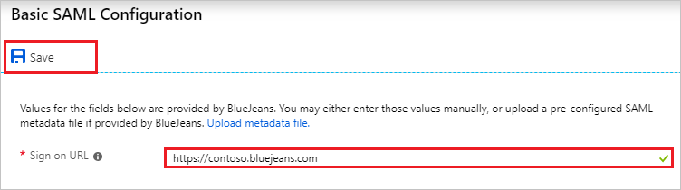

# Tutorial: Azure Active Directory integration with BlueJeans

In this tutorial, you learn how to integrate BlueJeans with Azure Active Directory (Azure AD).

Integrating BlueJeans with Azure AD provides you with the following benefits:

- You can control in Azure AD who has access to BlueJeans.
- You can enable your users to automatically get signed-on to BlueJeans (Single Sign-On) with their Azure AD accounts.
- You can manage your accounts in one central location - the Azure portal.

If you want to know more details about SaaS app integration with Azure AD, see [what is application access and single sign-on with Azure Active Directory](../manage-apps/what-is-single-sign-on.md)

## Prerequisites

To configure Azure AD integration with BlueJeans, you need the following items:

- An Azure AD subscription
- A BlueJeans single sign-on enabled subscription

> [!NOTE]
> To test the steps in this tutorial, we do not recommend using a production environment.

To test the steps in this tutorial, you should follow these recommendations:

- Do not use your production environment, unless it is necessary.
- If you don't have an Azure AD trial environment, you can [get a one-month trial](https://azure.microsoft.com/pricing/free-trial/).

## Scenario description

In this tutorial, you test Azure AD single sign-on in a test environment. 
The scenario outlined in this tutorial consists of two main building blocks:

1. Adding BlueJeans from the gallery
2. Configuring and testing Azure AD single sign-on

## Adding BlueJeans from the gallery

To configure the integration of BlueJeans into Azure AD, you need to add BlueJeans from the gallery to your list of managed SaaS apps.

**To add BlueJeans from the gallery, perform the following steps:**

1. In the **[Azure portal](https://portal.azure.com)**, on the left navigation panel, click **Azure Active Directory** icon. 

	![The Azure Active Directory button][1]

2. Navigate to **Enterprise applications**. Then go to **All applications**.

	![The Enterprise applications blade][2]

3. To add new application, click **New application** button on the top of dialog.

	![The New application button][3]

4. In the search box, type **BlueJeans**, select **BlueJeans** from result panel then click **Add** button to add the application.

	

## Configure and test Azure AD single sign-on

In this section, you configure and test Azure AD single sign-on with BlueJeans based on a test user called "Britta Simon".

For single sign-on to work, Azure AD needs to know what the counterpart user in BlueJeans is to a user in Azure AD. In other words, a link relationship between an Azure AD user and the related user in BlueJeans needs to be established.

To configure and test Azure AD single sign-on with BlueJeans, you need to complete the following building blocks:

1. **[Configuring Azure AD Single Sign-On](#configuring-azure-ad-single-sign-on)** - to enable your users to use this feature.
2. **[Creating an Azure AD test user](#creating-an-azure-ad-test-user)** - to test Azure AD single sign-on with Britta Simon.
3. **[Creating a BlueJeans test user](#creating-a-bluejeans-test-user)** - to have a counterpart of Britta Simon in BlueJeans that is linked to the Azure AD representation of user.
4. **[Assigning the Azure AD test user](#assigning-the-azure-ad-test-user)** - to enable Britta Simon to use Azure AD single sign-on.
5. **[Testing single sign-on](#testing-single-sign-on)** - to verify whether the configuration works.

### Configuring Azure AD single sign-on

In this section, you enable Azure AD single sign-on in the Azure portal and configure single sign-on in your BlueJeans application.

**To configure Azure AD single sign-on with BlueJeans, perform the following steps:**

1. In the Azure portal, on the **BlueJeans** application integration page, click **Single sign-on**.

	![Configure single sign-on link][4]

2. On the **Select a Single sign-on method** dialog, Click **Select** for **SAML** mode to enable single sign-on.

    

4. On the **Set up Single Sign-On with SAML** page, click **Edit** icon to open **Basic SAML Configuration** dialog.

	

5. On the **Basic SAML Configuration** section, perform the following steps:

	

    In the **Sign-on URL** textbox, type a URL using the following pattern: `https://<companyname>.BlueJeans.com`

	> [!NOTE]
	> The Sign-on value is not real. Update the value with the actual Sign-On URL. Contact [BlueJeans Client support team](https://support.bluejeans.com/contact) to get the value.

6. On the **SAML Signing Certificate** page, in the **SAML Signing Certificate** section, click **Download** to download **Certificate (Base64)** and then save certificate file on your computer.

	 

7. On the **Set up BlueJeans** section, copy the appropriate URL as per your requirement.

	a. Login URL

	b. Azure AD Identifier

	c. Logout URL

	 

8. In a different web browser window, log in to your **BlueJeans** company site as an administrator.

9. Go to **ADMIN \> GROUP SETTINGS \> SECURITY**.

	

10. In the **SECURITY** section, perform the following steps:

	

	a. Select **SAML Single Sign On**.

	b. Select **Enable automatic provisioning**.

11. Move on with the following steps:

	

	a. Click **Choose File**, to upload the base-64 encoded certificate that you have downloaded from the Azure portal.

    b. In the **Login URL** textbox, paste the value of **Login URL** which you have copied from Azure portal.

    c. In the **Password Change URL** textbox, paste the value of **Change Password URL** which you have copied from Azure portal.

    d. In the **Logout URL** textbox, paste the value of **Logout URL** which you have copied from Azure portal.

12. Move on with the following steps:

	

	a. In the **User id** textbox, type `http://schemas.xmlsoap.org/ws/2005/05/identity/claims/name`.

    b. In the **Email** textbox, type `http://schemas.xmlsoap.org/ws/2005/05/identity/claims/name`.

    c. Click **SAVE CHANGES**.

### Creating an Azure AD test user

The objective of this section is to create a test user in the Azure portal called Britta Simon.

1. In the Azure portal, in the left pane, select **Azure Active Directory**, select **Users**, and then select **All users**.

	![Create Azure AD User][100]

2. Select **New user** at the top of the screen.

	 

3. In the User properties, perform the following steps.

	

    a. In the **Name** field, enter **BrittaSimon**.
  
    b. In the **User name** field, type **brittasimon@yourcompanydomain.extension**  
    For example, BrittaSimon@contoso.com

    c. Select **Properties**, select the **Show password** check box, and then write down the value that's displayed in the Password box.

    d. Select **Create**.

### Creating a BlueJeans test user

The objective of this section is to create a user called Britta Simon in BlueJeans. BlueJeans supports automatic user provisioning, which is by default enabled. You can find more details [here](bluejeans-provisioning-tutorial.md) on how to configure automatic user provisioning.

**If you need to create user manually, perform following steps:**

1. Log in to your **BlueJeans** company site as an administrator.

2. Go to **ADMIN \> MANAGE USERS \> ADD USER**.

	

	>[!IMPORTANT]
	>The **ADD USER** tab is only available if, in the **SECUTIRY tab**, **Enable automatic provisioning** is unchecked. 

3. In the **ADD USER** section, perform the following steps:

	

	a. In **First Name** text box, enter the first name of user like **Britta**.

	b. In **Last Name** text box, enter the last name of user like **simon**.

	c. In **Pick a BlueJeans Username** text box, enter the username of user like **Brittasimon**

	d. In **Create a Password** text box, enter your password.

	e. In **Company** text box, enter your Company.

	f. In **Email Address** text box, enter the email of user like **brittasimon@contoso.com**.

	g. In **Create a BlueJeans Meeting I.D** text box, enter your meeting ID.

	h. In **Pick a Moderator Passcode** text box, enter your passcode.

	i. Click **CONTINUE**.

	

	J. Click **ADD USER**.

>[!NOTE]
>You can use any other BlueJeans user account creation tools or APIs provided by BlueJeans to provision Azure AD user accounts.

### Assigning the Azure AD test user

In this section, you enable Britta Simon to use Azure single sign-on by granting access to BlueJeans.

1. In the Azure portal, select **Enterprise Applications**, select **All applications**.

	![Assign User][201]

2. In the applications list, select **BlueJeans**.

	 

3. In the menu on the left, click **Users and groups**.

	![Assign User][202]

4. Click **Add** button. Then select **Users and groups** on **Add Assignment** dialog.

	![Assign User][203]

5. In the **Users and groups** dialog select **Britta Simon** in the Users list, then click the **Select** button at the bottom of the screen.

6. In the **Add Assignment** dialog select the **Assign** button.

### Testing single sign-on

In this section, you test your Azure AD single sign-on configuration using the Access Panel.

When you click the BlueJeans tile in the Access Panel, you should get automatically signed-on to your BlueJeans application.
For more information about the Access Panel, see [Introduction to the Access Panel](../user-help/active-directory-saas-access-panel-introduction.md).

## Additional resources

* [List of Tutorials on How to Integrate SaaS Apps with Azure Active Directory](tutorial-list.md)
* [What is application access and single sign-on with Azure Active Directory?](../manage-apps/what-is-single-sign-on.md)

<!--Image references-->

[1]: ./media/bluejeans-tutorial/tutorial_general_01.png
[2]: ./media/bluejeans-tutorial/tutorial_general_02.png
[3]: ./media/bluejeans-tutorial/tutorial_general_03.png
[4]: ./media/bluejeans-tutorial/tutorial_general_04.png

[100]: ./media/bluejeans-tutorial/tutorial_general_100.png

[200]: ./media/bluejeans-tutorial/tutorial_general_200.png
[201]: ./media/bluejeans-tutorial/tutorial_general_201.png
[202]: ./media/bluejeans-tutorial/tutorial_general_202.png
[203]: ./media/bluejeans-tutorial/tutorial_general_203.png
