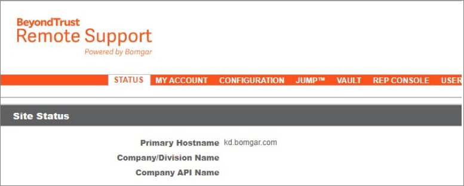
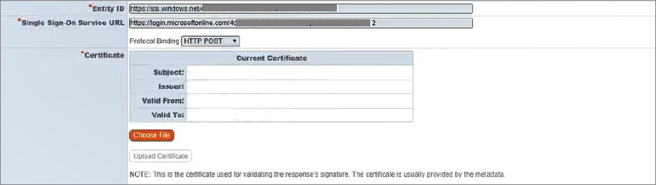
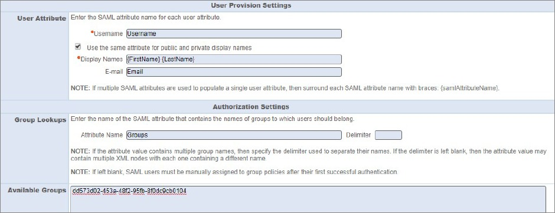
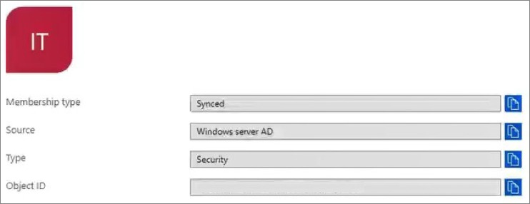
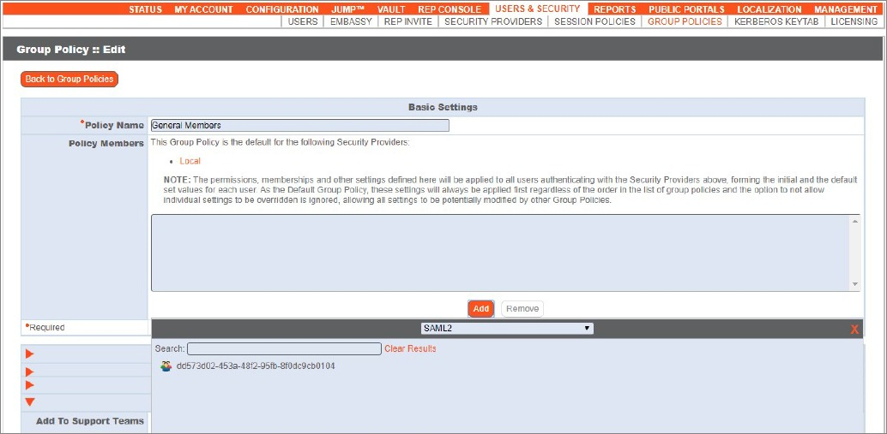

# Tutorial: Azure Active Directory single sign-on (SSO) integration with BeyondTrust Remote Support

In this tutorial, you'll learn how to integrate BeyondTrust Remote Support with Azure Active Directory (Azure AD). When you integrate BeyondTrust Remote Support with Azure AD, you can:

* Control in Azure AD who has access to BeyondTrust Remote Support.
* Enable your users to be automatically signed-in to BeyondTrust Remote Support with their Azure AD accounts.
* Manage your accounts in one central location - the Azure portal.

To learn more about SaaS app integration with Azure AD, see [What is application access and single sign-on with Azure Active Directory](https://docs.microsoft.com/azure/active-directory/active-directory-appssoaccess-whatis).

## Prerequisites

To get started, you need the following items:

* An Azure AD subscription. If you don't have a subscription, you can get a [free account](https://azure.microsoft.com/free/).
* BeyondTrust Remote Support single sign-on (SSO) enabled subscription.

## Scenario description

In this tutorial, you configure and test Azure AD SSO in a test environment.

* BeyondTrust Remote Support supports **SP** initiated SSO
* BeyondTrust Remote Support supports **Just In Time** user provisioning

## Adding BeyondTrust Remote Support from the gallery

To configure the integration of BeyondTrust Remote Support into Azure AD, you need to add BeyondTrust Remote Support from the gallery to your list of managed SaaS apps.

1. Sign in to the [Azure portal](https://portal.azure.com) using either a work or school account, or a personal Microsoft account.
1. On the left navigation pane, select the **Azure Active Directory** service.
1. Navigate to **Enterprise Applications** and then select **All Applications**.
1. To add new application, select **New application**.
1. In the **Add from the gallery** section, type **BeyondTrust Remote Support** in the search box.
1. Select **BeyondTrust Remote Support** from results panel and then add the app. Wait a few seconds while the app is added to your tenant.

## Configure and test Azure AD single sign-on for BeyondTrust Remote Support

Configure and test Azure AD SSO with BeyondTrust Remote Support using a test user called **B.Simon**. For SSO to work, you need to establish a link relationship between an Azure AD user and the related user in BeyondTrust Remote Support.

To configure and test Azure AD SSO with BeyondTrust Remote Support, complete the following building blocks:

1. **[Configure Azure AD SSO](#configure-azure-ad-sso)** - to enable your users to use this feature.
    * **[Create an Azure AD test user](#create-an-azure-ad-test-user)** - to test Azure AD single sign-on with B.Simon.
    * **[Assign the Azure AD test user](#assign-the-azure-ad-test-user)** - to enable B.Simon to use Azure AD single sign-on.
1. **[Configure BeyondTrust Remote Support SSO](#configure-beyondtrust-remote-support-sso)** - to configure the single sign-on settings on application side.
    * **[Create BeyondTrust Remote Support test user](#create-beyondtrust-remote-support-test-user)** - to have a counterpart of B.Simon in BeyondTrust Remote Support that is linked to the Azure AD representation of user.
1. **[Test SSO](#test-sso)** - to verify whether the configuration works.

## Configure Azure AD SSO

Follow these steps to enable Azure AD SSO in the Azure portal.

1. In the [Azure portal](https://portal.azure.com/), on the **BeyondTrust Remote Support** application integration page, find the **Manage** section and select **single sign-on**.
1. On the **Select a single sign-on method** page, select **SAML**.
1. On the **Set up single sign-on with SAML** page, click the edit/pen icon for **Basic SAML Configuration** to edit the settings.

   

1. On the **Basic SAML Configuration** section, enter the values for the following fields:

    a. In the **Sign-on URL** text box, type a URL using the following pattern:
    `https://<HOSTNAME>.bomgar.com/saml`

    b. In the **Identifier** box, type a URL using the following pattern:
    `https://<HOSTNAME>.bomgar.com`

    c. In the **Reply URL** text box, type a URL using the following pattern:
    `https://<HOSTNAME>.bomgar.com/saml/sso`

	> [!NOTE]
	> These values are not real. Update these values with the actual Sign-On URL, Identifier and Reply URL. You will get these values explained later in the tutorial.

1. BeyondTrust Remote Support application expects the SAML assertions in a specific format, which requires you to add custom attribute mappings to your SAML token attributes configuration. The following screenshot shows the list of default attributes.

	

1. In addition to above, BeyondTrust Remote Support application expects few more attributes to be passed back in SAML response which are shown below. These attributes are also pre populated but you can review them as per your requirements.

	| Name |  Source Attribute|
	| ---------------| ----------|
	| Givenname | user.givenname |
    | Emailaddress | user.mail |
    | Name | user.userprincipalname |
    | Username | user.userprincipalname |
    | Groups | user.groups |
    | Unique User Identifier | user.userprincipalname |

    > [!NOTE]
    > When assigning Azure AD Groups for the BeyondTrust Remote Support application, the ‘Groups returned in claim’ option will need to be modified from None to SecurityGroup. The Groups will be imported into the application as their Object IDs. The Object ID of the Azure AD Group can be found by checking the Properties in the Azure Active Directory interface. This will be required to reference and assign Azure AD Groups to the correct group policies.

1. When setting the Unique User Identifier, this value must be set to NameID-Format: **Persistent**. We require this to be a Persistent identifier to correctly identify and associate the user into the correct group policies for permissions. Click on the edit icon to open the **User Attributes & Claims** dialog to edit the Unique User Identifier value.

1. On the **Manage Claim** section, click on the **Choose name identifier format** and set the value to **Persistent** and click **Save**.

    

1. On the **Set up single sign-on with SAML** page, in the **SAML Signing Certificate** section,  find **Federation Metadata XML** and select **Download** to download the certificate and save it on your computer.

	

1. On the **Set up BeyondTrust Remote Support** section, copy the appropriate URL(s) based on your requirement.

	

### Create an Azure AD test user

In this section, you'll create a test user in the Azure portal called B.Simon.

1. From the left pane in the Azure portal, select **Azure Active Directory**, select **Users**, and then select **All users**.
1. Select **New user** at the top of the screen.
1. In the **User** properties, follow these steps:
   1. In the **Name** field, enter `B.Simon`.  
   1. In the **User name** field, enter the username@companydomain.extension. For example, `B.Simon@contoso.com`.
   1. Select the **Show password** check box, and then write down the value that's displayed in the **Password** box.
   1. Click **Create**.

### Assign the Azure AD test user

In this section, you'll enable B.Simon to use Azure single sign-on by granting access to BeyondTrust Remote Support.

1. In the Azure portal, select **Enterprise Applications**, and then select **All applications**.
1. In the applications list, select **BeyondTrust Remote Support**.
1. In the app's overview page, find the **Manage** section and select **Users and groups**.

   

1. Select **Add user**, then select **Users and groups** in the **Add Assignment** dialog.

	

1. In the **Users and groups** dialog, select **B.Simon** from the Users list, then click the **Select** button at the bottom of the screen.
1. If you're expecting any role value in the SAML assertion, in the **Select Role** dialog, select the appropriate role for the user from the list and then click the **Select** button at the bottom of the screen.
1. In the **Add Assignment** dialog, click the **Assign** button.

## Configure BeyondTrust Remote Support SSO

1. In a different web browser window, sign in to BeyondTrust Remote Support as an Administrator.

1. Click on the **STATUS** menu and copy the **Identifier**, **Reply URL** and **Sign on URL** and use these values in the **Basic SAML Configuration** section in the Azure portal.

    

1. Navigate to the BeyondTrust Remote Support /login interface at
`https://support.example.com/login` where **support.example.com** is the primary hostname of your appliance and authenticate using your administrative credentials.

1. Navigate to **Users & Security** > **Security Providers**.

1. In the drop-down menu, select **SAML** and click the **Create Provider** button.

1. Under the Identity Provider Settings section, there is an option to upload the Identity Provider Metadata. Locate the Metadata XML file that you have downloaded from the Azure portal and click the **Upload** button. The **Entity ID**, **Single Sign-On Service URL** and Certificate will automatically be uploaded, and the **Protocol Binding** will need to be changed to **HTTP POST**. See screenshot below:

    

### Create BeyondTrust Remote Support test user

We will be configuring the User Provision Settings here. The values used in this section will be referenced from the **User Attributes & Claims** section in the Azure portal. We configured this to be the default values which are already imported at the time of creation, however, the value can be customized if necessary.

> [!NOTE]
> The groups and e-mail attribute are not necessary for this
implementation. If utilizing Azure AD groups and assigning them to BeyondTrust Remote Support Group Policies for permissions, the Object ID of the group will need to be referenced via its properties in the Azure portal and placed in the ‘Available Groups’ section. Once this has been completed, the Object ID/AD Group will now be available for assignment to a group policy for permissions.

> [!NOTE]
> Alternatively, a default group policy can be set on the SAML2 Security Provider. By defining this option, this will assign all users who authenticate through SAML the permissions specified within the group policy. The General Members policy is included within BeyondTrust Remote Support/Privileged Remote Access with limited permissions, which can be used to test authentication and assign users to the correct policies. Users will not populate into the SAML2 Users list via /login > Users & Security until the first successful authentication attempt. Additional information on Group policies can be found at the following link: `https://www.beyondtrust.com/docs/remote-support/getting-started/admin/group-policies.htm`

## Test SSO

In this section, you test your Azure AD single sign-on configuration using the Access Panel.

When you click the BeyondTrust Remote Support tile in the Access Panel, you should be automatically signed in to the BeyondTrust Remote Support for which you set up SSO. For more information about the Access Panel, see [Introduction to the Access Panel](https://docs.microsoft.com/azure/active-directory/active-directory-saas-access-panel-introduction).

## Additional resources

- [ List of Tutorials on How to Integrate SaaS Apps with Azure Active Directory ](https://docs.microsoft.com/azure/active-directory/active-directory-saas-tutorial-list)

- [What is application access and single sign-on with Azure Active Directory? ](https://docs.microsoft.com/azure/active-directory/active-directory-appssoaccess-whatis)

- [What is conditional access in Azure Active Directory?](https://docs.microsoft.com/azure/active-directory/conditional-access/overview)

- [Try BeyondTrust Remote Support with Azure AD](https://aad.portal.azure.com/)
