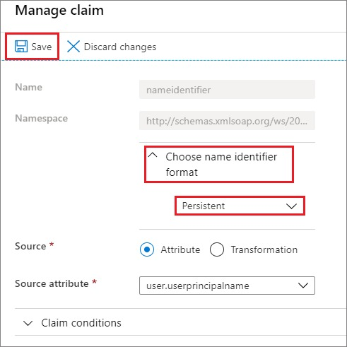
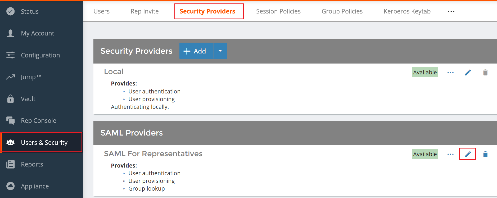
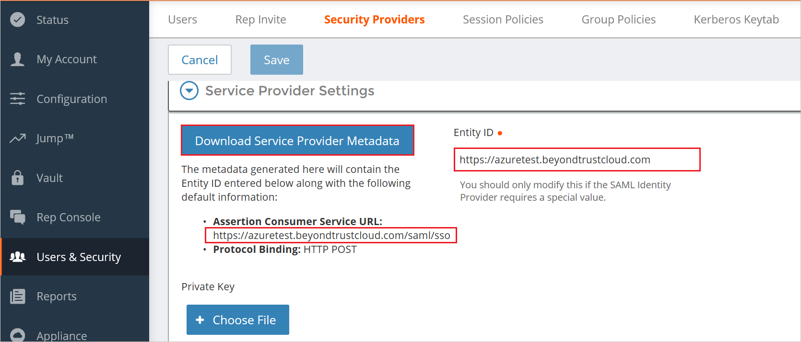
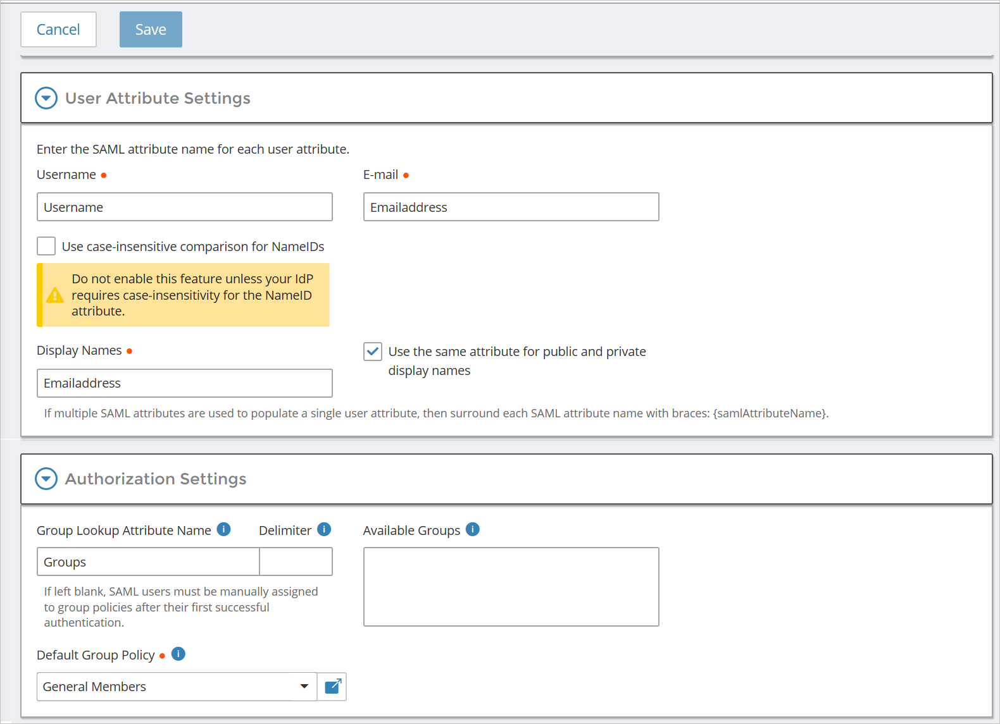
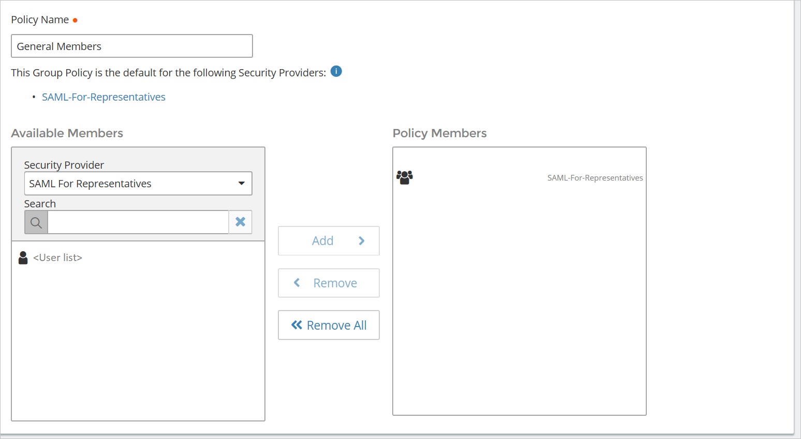

# Tutorial: Microsoft Entra single sign-on (SSO) integration with BeyondTrust Remote Support

In this tutorial, you'll learn how to integrate BeyondTrust Remote Support with Microsoft Entra ID. When you integrate BeyondTrust Remote Support with Microsoft Entra ID, you can:

* Control in Microsoft Entra ID who has access to BeyondTrust Remote Support.
* Enable your users to be automatically signed-in to BeyondTrust Remote Support with their Microsoft Entra accounts.
* Manage your accounts in one central location.

## Prerequisites

To get started, you need the following items:

* A Microsoft Entra subscription. If you don't have a subscription, you can get a [free account](https://azure.microsoft.com/free/).
* BeyondTrust Remote Support single sign-on (SSO) enabled subscription.

## Scenario description

In this tutorial, you configure and test Microsoft Entra SSO in a test environment.

* BeyondTrust Remote Support supports **SP** initiated SSO
* BeyondTrust Remote Support supports **Just In Time** user provisioning

## Adding BeyondTrust Remote Support from the gallery

To configure the integration of BeyondTrust Remote Support into Microsoft Entra ID, you need to add BeyondTrust Remote Support from the gallery to your list of managed SaaS apps.

1. Sign in to the [Microsoft Entra admin center](https://entra.microsoft.com) as at least a [Cloud Application Administrator](../roles/permissions-reference.md#cloud-application-administrator).
1. Browse to **Identity** > **Applications** > **Enterprise applications** > **New application**.
1. In the **Add from the gallery** section, type **BeyondTrust Remote Support** in the search box.
1. Select **BeyondTrust Remote Support** from results panel and then add the app. Wait a few seconds while the app is added to your tenant.

 Alternatively, you can also use the [Enterprise App Configuration Wizard](https://portal.office.com/AdminPortal/home?Q=Docs#/azureadappintegration). In this wizard, you can add an application to your tenant, add users/groups to the app, assign roles, as well as walk through the SSO configuration as well. [Learn more about Microsoft 365 wizards.](/microsoft-365/admin/misc/azure-ad-setup-guides)

## Configure and test Microsoft Entra SSO for BeyondTrust Remote Support

Configure and test Microsoft Entra SSO with BeyondTrust Remote Support using a test user called **B.Simon**. For SSO to work, you need to establish a link relationship between a Microsoft Entra user and the related user in BeyondTrust Remote Support.

To configure and test Microsoft Entra SSO with BeyondTrust Remote Support, perform the following steps:

1. **[Configure Microsoft Entra SSO](#configure-azure-ad-sso)** - to enable your users to use this feature.
    * **[Create a Microsoft Entra test user](#create-an-azure-ad-test-user)** - to test Microsoft Entra single sign-on with B.Simon.
    * **[Assign the Microsoft Entra test user](#assign-the-azure-ad-test-user)** - to enable B.Simon to use Microsoft Entra single sign-on.
1. **[Configure BeyondTrust Remote Support SSO](#configure-beyondtrust-remote-support-sso)** - to configure the single sign-on settings on application side.
    * **[Create BeyondTrust Remote Support test user](#create-beyondtrust-remote-support-test-user)** - to have a counterpart of B.Simon in BeyondTrust Remote Support that is linked to the Microsoft Entra representation of user.
1. **[Test SSO](#test-sso)** - to verify whether the configuration works.

## Configure Microsoft Entra SSO

Follow these steps to enable Microsoft Entra SSO.

1. Sign in to the [Microsoft Entra admin center](https://entra.microsoft.com) as at least a [Cloud Application Administrator](../roles/permissions-reference.md#cloud-application-administrator).
1. Browse to **Identity** > **Applications** > **Enterprise applications** > **BeyondTrust Remote Support** > **Single sign-on**.
1. On the **Select a single sign-on method** page, select **SAML**.
1. On the **Set up single sign-on with SAML** page, click the edit/pen icon for **Basic SAML Configuration** to edit the settings.

   

1. On the **Basic SAML Configuration** section, enter the values for the following fields:

    a. In the **Identifier** box, type a URL using the following pattern:
    `https://<HOSTNAME>.bomgar.com`

    b. In the **Reply URL** text box, type a URL using the following pattern:
    `https://<HOSTNAME>.bomgar.com/saml/sso`
    
    c. In the **Sign-on URL** text box, type a URL using the following pattern:
    `https://<HOSTNAME>.bomgar.com/saml`

	> [!NOTE]
	> These values are not real. Update these values with the actual Identifier, Reply URL and Sign-On URL. You will get these values explained later in the tutorial.

1. BeyondTrust Remote Support application expects the SAML assertions in a specific format, which requires you to add custom attribute mappings to your SAML token attributes configuration. The following screenshot shows the list of default attributes.

	

1. In addition to above, BeyondTrust Remote Support application expects few more attributes to be passed back in SAML response which are shown below. These attributes are also pre populated but you can review them as per your requirements.

	| Name |  Source Attribute|
	| ---------------| ----------|
	| Username | user.userprincipalname |
    | FirstName | user.givenname |
    | LastName | user.surname |
    | Email | user.mail |
    | Groups | user.groups |

    > [!NOTE]
    > When assigning Microsoft Entra groups for the BeyondTrust Remote Support application, the ‘Groups returned in claim’ option will need to be modified from None to SecurityGroup. The Groups will be imported into the application as their Object IDs. The Object ID of the Microsoft Entra group can be found by checking the Properties in the Microsoft Entra ID interface. This will be required to reference and assign Microsoft Entra groups to the correct group policies.

1. When setting the Unique User Identifier, this value must be set to NameID-Format: **Persistent**. We require this to be a Persistent identifier to correctly identify and associate the user into the correct group policies for permissions. Click on the edit icon to open the **User Attributes & Claims** dialog to edit the Unique User Identifier value.

1. On the **Manage Claim** section, click on the **Choose name identifier format** and set the value to **Persistent** and click **Save**.

    

1. On the **Set up single sign-on with SAML** page, in the **SAML Signing Certificate** section,  find **Federation Metadata XML** and select **Download** to download the certificate and save it on your computer.

	

1. On the **Set up BeyondTrust Remote Support** section, copy the appropriate URL(s) based on your requirement.

	

### Create a Microsoft Entra test user

In this section, you'll create a test user called B.Simon.

1. Sign in to the [Microsoft Entra admin center](https://entra.microsoft.com) as at least a [User Administrator](../roles/permissions-reference.md#user-administrator).
1. Browse to **Identity** > **Users** > **All users**.
1. Select **New user** > **Create new user**, at the top of the screen.
1. In the **User** properties, follow these steps:
   1. In the **Display name** field, enter `B.Simon`.  
   1. In the **User principal name** field, enter the username@companydomain.extension. For example, `B.Simon@contoso.com`.
   1. Select the **Show password** check box, and then write down the value that's displayed in the **Password** box.
   1. Select **Review + create**.
1. Select **Create**.

### Assign the Microsoft Entra test user

In this section, you'll enable B.Simon to use single sign-on by granting access to BeyondTrust Remote Support.

1. Sign in to the [Microsoft Entra admin center](https://entra.microsoft.com) as at least a [Cloud Application Administrator](../roles/permissions-reference.md#cloud-application-administrator).
1. Browse to **Identity** > **Applications** > **Enterprise applications** > **BeyondTrust Remote Support**.
1. In the app's overview page, select **Users and groups**.
1. Select **Add user/group**, then select **Users and groups** in the **Add Assignment** dialog.
   1. In the **Users and groups** dialog, select **B.Simon** from the Users list, then click the **Select** button at the bottom of the screen.
   1. If you are expecting a role to be assigned to the users, you can select it from the **Select a role** dropdown. If no role has been set up for this app, you see "Default Access" role selected.
   1. In the **Add Assignment** dialog, click the **Assign** button.

## Configure BeyondTrust Remote Support SSO

1. In a different web browser window, sign in to BeyondTrust Remote Support as an Administrator.

1. Navigate to **Users & Security** > **Security Providers**.

1. Click on **Edit** icon in the **SAML Providers**.

    

1. Expand the **Service Provider Settings** section.

1. Click on **Download Service Provider Metadata** or you can copy the **Entity ID** and **ACS URL** values and use these values in the **Basic SAML Configuration** section.

    

1. Under the Identity Provider Settings section, click on **Upload Identity Provider Metadata** and locate the Metadata XML file that you have downloaded.

1.  The **Entity ID**, **Single Sign-On Service URL** and **Server Certificate** will automatically be uploaded, and the **SSO URL Protocol Binding** will need to be changed to **HTTP POST**.

    

1. Click on **Save**.

### Create BeyondTrust Remote Support test user

In this section, a user called Britta Simon is created in BeyondTrust Remote Support. BeyondTrust Remote Support supports just-in-time user provisioning, which is enabled by default. There is no action item for you in this section. If a user doesn't already exist in BeyondTrust Remote Support, a new one is created after authentication.

Follow the below procedure, which is mandatory for configuring the BeyondTrust Remote Support.

We will be configuring the User Provision Settings here. The values used in this section will be referenced from the **User Attributes & Claims** section. We configured this to be the default values which are already imported at the time of creation, however, the value can be customized if necessary.

> [!NOTE]
> The groups and e-mail attribute are not necessary for this
implementation. If utilizing Microsoft Entra groups and assigning them to BeyondTrust Remote Support Group Policies for permissions, the Object ID of the group will need to be referenced via its properties in the Azure portal and placed in the ‘Available Groups’ section. Once this has been completed, the Object ID/AD Group will now be available for assignment to a group policy for permissions.

> [!NOTE]
> Alternatively, a default group policy can be set on the SAML2 Security Provider. By defining this option, this will assign all users who authenticate through SAML the permissions specified within the group policy. The General Members policy is included within BeyondTrust Remote Support/Privileged Remote Access with limited permissions, which can be used to test authentication and assign users to the correct policies. Users will not populate into the SAML2 Users list via /login > Users & Security until the first successful authentication attempt. Additional information on Group policies can be found at the following link: `https://www.beyondtrust.com/docs/remote-support/getting-started/admin/group-policies.htm`

## Test SSO

In this section, you test your Microsoft Entra single sign-on configuration with following options. 

* Click on **Test this application**, this will redirect to BeyondTrust Remote Support Sign-on URL where you can initiate the login flow. 

* Go to BeyondTrust Remote Support Sign-on URL directly and initiate the login flow from there.

* You can use Microsoft My Apps. When you click the BeyondTrust Remote Support tile in the My Apps, this will redirect to BeyondTrust Remote Support Sign-on URL. For more information about the My Apps, see [Introduction to the My Apps](https://support.microsoft.com/account-billing/sign-in-and-start-apps-from-the-my-apps-portal-2f3b1bae-0e5a-4a86-a33e-876fbd2a4510).

## Next steps

Once you configure the BeyondTrust Remote Support you can enforce session controls, which protects exfiltration and infiltration of your organization’s sensitive data in real time. Session controls extends from Conditional Access. [Learn how to enforce session control with Microsoft Defender for Cloud Apps](/cloud-app-security/proxy-deployment-aad).
