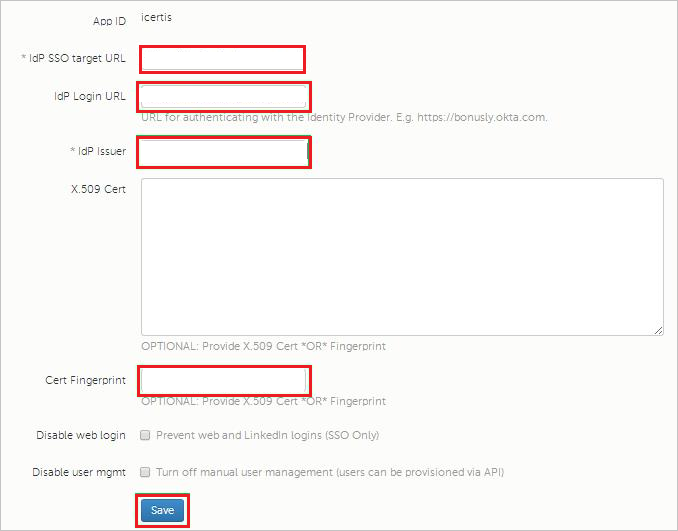
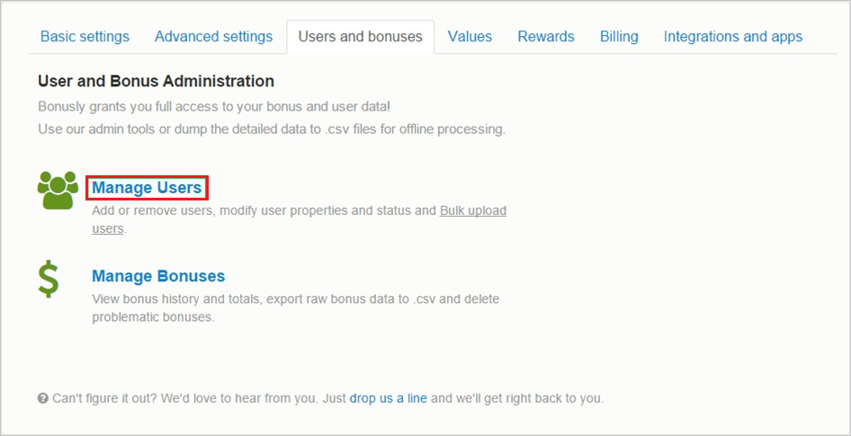
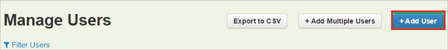

# Tutorial: Azure Active Directory integration with Bonusly

In this tutorial, you'll learn how to integrate Bonusly with Azure Active Directory (Azure AD). When you integrate Bonusly with Azure AD, you can:

* Control in Azure AD who has access to Bonusly.
* Enable your users to be automatically signed-in to Bonusly with their Azure AD accounts.
* Manage your accounts in one central location - the Azure portal.

## Prerequisites

To configure Azure AD integration with Bonusly, you need the following items:

* An Azure AD subscription. If you don't have an Azure AD environment, you can get a [free account](https://azure.microsoft.com/free/).
* Bonusly single sign-on enabled subscription.

## Scenario description

In this tutorial, you configure and test Azure AD single sign-on in a test environment.

* Bonusly supports **IDP** initiated SSO.

> [!NOTE]
> Identifier of this application is a fixed string value so only one instance can be configured in one tenant.

## Add Bonusly from the gallery

To configure the integration of Bonusly into Azure AD, you need to add Bonusly from the gallery to your list of managed SaaS apps.

1. Sign in to the Azure portal using either a work or school account, or a personal Microsoft account.
1. On the left navigation pane, select the **Azure Active Directory** service.
1. Navigate to **Enterprise Applications** and then select **All Applications**.
1. To add new application, select **New application**.
1. In the **Add from the gallery** section, type **Bonusly** in the search box.
1. Select **Bonusly** from results panel and then add the app. Wait a few seconds while the app is added to your tenant.

## Configure and test Azure AD SSO for Bonusly

Configure and test Azure AD SSO with Bonusly using a test user called **B.Simon**. For SSO to work, you need to establish a link relationship between an Azure AD user and the related user in Bonusly.

To configure and test Azure AD SSO with Bonusly, perform the following steps:

1. **[Configure Azure AD SSO](#configure-azure-ad-sso)** - to enable your users to use this feature.
    1. **[Create an Azure AD test user](#create-an-azure-ad-test-user)** - to test Azure AD single sign-on with B.Simon.
    1. **[Assign the Azure AD test user](#assign-the-azure-ad-test-user)** - to enable B.Simon to use Azure AD single sign-on.
1. **[Configure Bonusly SSO](#configure-bonusly-sso)** - to configure the single sign-on settings on application side.
    1. **[Create Bonusly test user](#create-bonusly-test-user)** - to have a counterpart of B.Simon in Bonusly that is linked to the Azure AD representation of user.
1. **[Test SSO](#test-sso)** - to verify whether the configuration works.

## Configure Azure AD SSO

Follow these steps to enable Azure AD SSO in the Azure portal.

1. In the Azure portal, on the **Bonusly** application integration page, find the **Manage** section and select **single sign-on**.
1. On the **Select a single sign-on method** page, select **SAML**.
1. On the **Set up single sign-on with SAML** page, click the pencil icon for **Basic SAML Configuration** to edit the settings.

   

4. On the **Basic SAML Configuration** section, perform the following step:

    In the **Reply URL** text box, type a URL using the following pattern:
    `https://Bonus.ly/saml/<TENANT_NAME>`

	> [!NOTE]
	> The value is not real. Update the value with the actual Reply URL. Contact [Bonusly Client support team](https://bonus.ly/contact) to get the value. You can also refer to the patterns shown in the **Basic SAML Configuration** section in the Azure portal.

5. In the **SAML Signing Certificate** section, click **Edit** button to open **SAML Signing Certificate** dialog.

	

6. In the **SAML Signing Certificate** section, copy the **THUMBPRINT** and save it on your computer.

    

7. On the **Set up Bonusly** section, copy the appropriate URL(s) as per your requirement.

	

### Create an Azure AD test user

In this section, you'll create a test user in the Azure portal called B.Simon.

1. From the left pane in the Azure portal, select **Azure Active Directory**, select **Users**, and then select **All users**.
1. Select **New user** at the top of the screen.
1. In the **User** properties, follow these steps:
   1. In the **Name** field, enter `B.Simon`.  
   1. In the **User name** field, enter the username@companydomain.extension. For example, `B.Simon@contoso.com`.
   1. Select the **Show password** check box, and then write down the value that's displayed in the **Password** box.
   1. Click **Create**.

### Assign the Azure AD test user

In this section, you'll enable B.Simon to use Azure single sign-on by granting access to Bonusly.

1. In the Azure portal, select **Enterprise Applications**, and then select **All applications**.
1. In the applications list, select **Bonusly**.
1. In the app's overview page, find the **Manage** section and select **Users and groups**.
1. Select **Add user**, then select **Users and groups** in the **Add Assignment** dialog.
1. In the **Users and groups** dialog, select **B.Simon** from the Users list, then click the **Select** button at the bottom of the screen.
1. If you are expecting a role to be assigned to the users, you can select it from the **Select a role** dropdown. If no role has been set up for this app, you see "Default Access" role selected.
1. In the **Add Assignment** dialog, click the **Assign** button.

## Configure Bonusly SSO

1. In a different browser window, sign in to your **Bonusly** tenant.

1. In the toolbar on the top, click **Settings** and then select **Integrations and apps**.

    
1. Under **Single Sign-On**, select **SAML**.

1. On the **SAML** dialog page, perform the following steps:

    

    a. In the **IdP SSO target URL** textbox, paste the value of **Login URL**, which you have copied from Azure portal.

    b. In the **IdP Login URL** textbox, paste the value of **Login URL**, which you have copied from Azure portal.

    c. In the **IdP Issuer** textbox, paste the value of **Azure AD Identifier**, which you have copied from Azure portal.
    
    d. Paste the **Thumbprint** value copied from Azure portal into the **Cert Fingerprint** textbox.
    
    e. Click **Save**.

### Create Bonusly test user

In order to enable Azure AD users to sign in to Bonusly, they must be provisioned into Bonusly. In the case of Bonusly, provisioning is a manual task.

> [!NOTE]
> You can use any other Bonusly user account creation tools or APIs provided by Bonusly to provision Azure AD user accounts. 

**To configure user provisioning, perform the following steps:**

1. In a web browser window, sign in to your Bonusly tenant.

1. Click **Settings**.

    

1. Click the **Users and bonuses** tab.

    

1. Click **Manage Users**.

    

1. Click **Add User**.

    

1. On the **Add User** dialog, perform the following steps:

      

    a. In the **First name** textbox, enter the first name of user like **Britta**.

    b. In the **Last name** textbox, enter the last name of user like **Simon**.

    c. In the **Email** textbox, enter the email of user like `brittasimon@contoso.com`.

    d. Click **Save**.

    > [!NOTE]
    > The Azure AD account holder receives an email that includes a link to confirm the account before it becomes active.  

## Test SSO

In this section, you test your Azure AD single sign-on configuration with following options.

* Click on Test this application in Azure portal and you should be automatically signed in to the Bonusly for which you set up the SSO.

* You can use Microsoft My Apps. When you click the Bonusly tile in the My Apps, you should be automatically signed in to the Bonusly for which you set up the SSO. For more information about the My Apps, see [Introduction to the My Apps](../user-help/my-apps-portal-end-user-access.md).

## Next steps

Once you configure Bonusly you can enforce session control, which protects exfiltration and infiltration of your organization’s sensitive data in real time. Session control extends from Conditional Access. [Learn how to enforce session control with Microsoft Cloud App Security](/cloud-app-security/proxy-deployment-aad).
