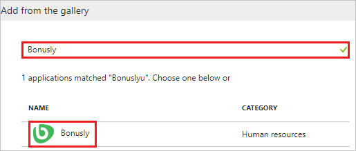
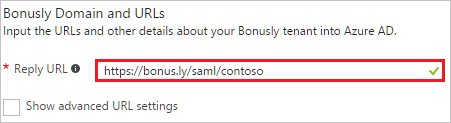
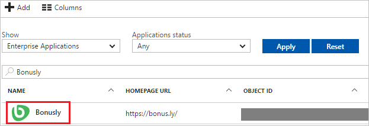

---
title: 'Tutorial: Azure Active Directory integration with Bonusly | Microsoft Docs'
description: Learn how to configure single sign-on between Azure Active Directory and Bonusly.
services: active-directory
documentationCenter: na
author: jeevansd
manager: mtillman
ms.reviewer: joflore

ms.assetid: 29fea32a-fa20-47b2-9e24-26feb47b0ae6
ms.service: active-directory
ms.component: saas-app-tutorial
ms.workload: identity
ms.tgt_pltfrm: na
ms.devlang: na
ms.topic: article
ms.date: 07/19/2017
ms.author: jeedes

---
# Tutorial: Azure Active Directory integration with Bonusly

In this tutorial, you learn how to integrate Bonusly with Azure Active Directory (Azure AD).

Integrating Bonusly with Azure AD provides you with the following benefits:

- You can control in Azure AD who has access to Bonusly
- You can enable your users to automatically get signed-on to Bonusly (Single Sign-On) with their Azure AD accounts
- You can manage your accounts in one central location - the Azure portal

If you want to know more details about SaaS app integration with Azure AD, see [what is application access and single sign-on with Azure Active Directory](../manage-apps/what-is-single-sign-on.md).

## Prerequisites

To configure Azure AD integration with Bonusly, you need the following items:

- An Azure AD subscription
- A Bonusly single sign-on enabled subscription

> [!NOTE]
> To test the steps in this tutorial, we do not recommend using a production environment.

To test the steps in this tutorial, you should follow these recommendations:

- Do not use your production environment, unless it is necessary.
- If you don't have an Azure AD trial environment, you can [get a one-month trial](https://azure.microsoft.com/pricing/free-trial/).

## Scenario description
In this tutorial, you test Azure AD single sign-on in a test environment. 
The scenario outlined in this tutorial consists of two main building blocks:

1. Adding Bonusly from the gallery
1. Configuring and testing Azure AD single sign-on

## Adding Bonusly from the gallery
To configure the integration of Bonusly into Azure AD, you need to add Bonusly from the gallery to your list of managed SaaS apps.

**To add Bonusly from the gallery, perform the following steps:**

1. In the **[Azure portal](https://portal.azure.com)**, on the left navigation panel, click **Azure Active Directory** icon. 

	![The Azure Active Directory button][1]

1. Navigate to **Enterprise applications**. Then go to **All applications**.

	![The Enterprise applications blade][2]
	
1. To add new application, click **New application** button on the top of dialog.

	![The New application button][3]

1. In the search box, type **Bonusly**, select **Bonusly** from result panel then click **Add** button to add the application.

	

##  Configure and test Azure AD single sign-on
In this section, you configure and test Azure AD single sign-on with Bonusly based on a test user called "Britta Simon".

For single sign-on to work, Azure AD needs to know what the counterpart user in Bonusly is to a user in Azure AD. In other words, a link relationship between an Azure AD user and the related user in Bonusly needs to be established.

In Bonusly, assign the value of the **user name** in Azure AD as the value of the **Username** to establish the link relationship.

To configure and test Azure AD single sign-on with Bonusly, you need to complete the following building blocks:

1. **[Configure Azure AD Single Sign-On](#configure-azure-ad-single-sign-on)** - to enable your users to use this feature.
1. **[Create an Azure AD test user](#create-an-azure-ad-test-user)** - to test Azure AD single sign-on with Britta Simon.
1. **[Create a Bonusly test user](#create-a-bonusly-test-user)** - to have a counterpart of Britta Simon in Bonusly that is linked to the Azure AD representation of user.
1. **[Assign the Azure AD test user](#assign-the-azure-ad-test-user)** - to enable Britta Simon to use Azure AD single sign-on.
1. **[Test Single Sign-On](#test-single-sign-on)** - to verify whether the configuration works.

### Configure Azure AD single sign-on

In this section, you enable Azure AD single sign-on in the Azure portal and configure single sign-on in your Bonusly application.

**To configure Azure AD single sign-on with Bonusly, perform the following steps:**

1. In the Azure portal, on the **Bonusly** application integration page, click **Single sign-on**.

	![Configure Single Sign-On][4]

1. On the **Single sign-on** dialog, select **Mode** as	**SAML-based Sign-on** to enable single sign-on.
 
	

1. On the **Bonusly Domain and URLs** section, perform the following steps:

	

	In the **Reply URL** textbox, type a URL using the following pattern: `https://Bonus.ly/saml/<tenant-name>`

	> [!NOTE] 
	> The value is not real. Update the value with the actual Reply URL. Contact [Bonusly support team](https://bonus.ly/contact) to get the value.
 
1. On the **SAML Signing Certificate** section, copy the **THUMBPRINT** value from the certificate.

	 

1. Click **Save** button.

	

1. On the **Bonusly Configuration** section, click **Configure Bonusly** to open **Configure sign-on** window. Copy the **SAML Entity ID, and SAML Single Sign-On Service URL** from the **Quick Reference section.**

	 

1. In a different browser window, log in to your **Bonusly** tenant.

1. In the toolbar on the top, click **Settings**, and then select **Integrations and apps**.
   
    
1. Under **Single Sign-On**, select **SAML**.

1. On the **SAML** dialog page, perform the following steps:
   
    
   
    a. In the **IdP SSO target URL** textbox, paste the value of **SAML Single Sign-On Service URL**, which you have copied from Azure portal.
   
    b. In the **IdP Issuer** textbox, paste the value of **SAML Entity ID**, which you have copied from Azure portal. 

    c. In the **IdP Login URL** textbox, paste the value of **SAML Single Sign-On Service URL**, which you have copied from Azure portal.

    d. Paste the **Thumbprint** value copied from Azure portal into the **Cert Fingerprint** textbox.
   
1. Click **Save**.

> [!TIP]
> You can now read a concise version of these instructions inside the [Azure portal](https://portal.azure.com), while you are setting up the app!  After adding this app from the **Active Directory > Enterprise Applications** section, simply click the **Single Sign-On** tab and access the embedded documentation through the **Configuration** section at the bottom. You can read more about the embedded documentation feature here: [Azure AD embedded documentation]( https://go.microsoft.com/fwlink/?linkid=845985)
> 

### Create an Azure AD test user
The objective of this section is to create a test user in the Azure portal called Britta Simon.

![Create an Azure AD test user][100]

**To create a test user in Azure AD, perform the following steps:**

1. In the **Azure portal**, on the left navigation pane, click **Azure Active Directory** icon.

	 

1. To display the list of users, go to **Users and groups** and click **All users**.
	
	 

1. To open the **User** dialog, click **Add** on the top of the dialog.
 
	 

1. On the **User** dialog page, perform the following steps:
 
	 

    a. In the **Name** textbox, type **BrittaSimon**.

    b. In the **User name** textbox, type the **email address** of BrittaSimon.

	c. Select **Show Password** and write down the value of the **Password**.

    d. Click **Create**.
 
### Create a Bonusly test user

In order to enable Azure AD users to log in to Bonusly, they must be provisioned into Bonusly. In the case of Bonusly, provisioning is a manual task.

>[!NOTE]
>You can use any other Bonusly user account creation tools or APIs provided by Bonusly to provision AAD user accounts.
>  

**To configure user provisioning, perform the following steps:**

1. In a web browser window, log in to your Bonusly tenant.

1. Click **Settings**.
 
    

1. Click the **Users and bonuses** tab.
   
    

1. Click **Manage Users**.
   
    

1. Click **Add User**.
   
    

1. On the **Add User** dialog, perform the following steps:
   
      

    a. In the **First name** textbox, enter the first name of user like **Britta**.

    b. In the **Last name** textbox, enter the last name of user like **Simon**.
 
    c. In the **Email** textbox, enter the email of user like **brittasimon@contoso.com**.

    d. Click **Save**.
   
     >[!NOTE]
     >The Azure AD account holder receives an email that includes a link to confirm the account before it becomes active.
     >  

### Assign the Azure AD test user

In this section, you enable Britta Simon to use Azure single sign-on by granting access to Bonusly.

![Assign the user role][200] 

**To assign Britta Simon to Bonusly, perform the following steps:**

1. In the Azure portal, open the applications view, and then navigate to the directory view and go to **Enterprise applications** then click **All applications**.

	![Assign User][201] 

1. In the applications list, select **Bonusly**.

	 

1. In the menu on the left, click **Users and groups**.

	![The "Users and groups" link][202] 

1. Click **Add** button. Then select **Users and groups** on **Add Assignment** dialog.

	![The Add Assignment pane][203]

1. On **Users and groups** dialog, select **Britta Simon** in the Users list.

1. Click **Select** button on **Users and groups** dialog.

1. Click **Assign** button on **Add Assignment** dialog.
	
### Test single sign-on

The objective of this section is to test your Azure AD single sign-on configuration using the Access Panel.

When you click the Bonusly tile in the Access Panel, you should get automatically signed-on to your Bonusly application.

## Additional resources

* [List of Tutorials on How to Integrate SaaS Apps with Azure Active Directory](tutorial-list.md)
* [What is application access and single sign-on with Azure Active Directory?](../manage-apps/what-is-single-sign-on.md)

<!--Image references-->

[1]: ./media/bonus-tutorial/tutorial_general_01.png
[2]: ./media/bonus-tutorial/tutorial_general_02.png
[3]: ./media/bonus-tutorial/tutorial_general_03.png
[4]: ./media/bonus-tutorial/tutorial_general_04.png

[100]: ./media/bonus-tutorial/tutorial_general_100.png

[200]: ./media/bonus-tutorial/tutorial_general_200.png
[201]: ./media/bonus-tutorial/tutorial_general_201.png
[202]: ./media/bonus-tutorial/tutorial_general_202.png
[203]: ./media/bonus-tutorial/tutorial_general_203.png

