# Tutorial: Configure Bonusly for automatic user provisioning

The objective of this tutorial is to demonstrate the steps to be performed in Bonusly and Azure Active Directory (Azure AD) to configure Azure AD to automatically provision and de-provision users and/or groups to Bonusly.

> [!NOTE]
> This tutorial describes a connector built on top of the Azure AD User Provisioning Service. For important details on what this service does, how it works, and frequently asked questions, see [Automate user provisioning and deprovisioning to SaaS applications with Azure Active Directory](../manage-apps/user-provisioning.md).

## Prerequisites

The scenario outlined in this tutorial assumes that you already have the following:

* An Azure AD tenant
* A [Bonusly tenant](https://bonus.ly/pricing)
* A user account in Bonusly with Admin permissions

> [!NOTE]
> The Azure AD provisioning integration relies on the [Bonusly Rest API](https://bonusly.gelato.io/reference), which is available to Bonusly developers.

## Adding Bonusly from the gallery

Before configuring Bonusly for automatic user provisioning with Azure AD, you need to add Bonusly from the Azure AD application gallery to your list of managed SaaS applications.

**To add Bonusly from the Azure AD application gallery, perform the following steps:**

1. In the **[Azure portal](https://portal.azure.com)**, on the left navigation panel, click **Azure Active Directory** icon.

	

2. Navigate to **Enterprise Applications** and then select the **All Applications** option.

	

3. To add new application, click **New application** button on the top of dialog.

	

4. In the search box, type **Bonusly**, select **Bonusly** from result panel then click **Add** button to add the application.

	

## Assigning users to Bonusly

Azure Active Directory uses a concept called "assignments" to determine which users should receive access to selected apps. In the context of automatic user provisioning, only the users and/or groups that have been "assigned" to an application in Azure AD are synchronized. 

Before configuring and enabling automatic user provisioning, you should decide which users and/or groups in Azure AD need access to Bonusly. Once decided, you can assign these users and/or groups to Bonusly by following the instructions here:

* [Assign a user or group to an enterprise app](https://docs.microsoft.com/azure/active-directory/active-directory-coreapps-assign-user-azure-portal)

### Important tips for assigning users to Bonusly

* It is recommended that a single Azure AD user is assigned to Bonusly to test the automatic user provisioning configuration. Additional users and/or groups may be assigned later.

* When assigning a user to Bonusly, you must select any valid application-specific role (if available) in the assignment dialog. Users with the **Default Access** role are excluded from provisioning.

## Configuring automatic user provisioning to Bonusly

This section guides you through the steps to configure the Azure AD provisioning service to create, update, and disable users and/or groups in Bonusly based on user and/or group assignments in Azure AD.

> [!TIP]
> You may also choose to enable SAML-based single sign-on for Bonusly, following the instructions provided in the [Bonusly single sign-on tutorial](bonus-tutorial.md). Single sign-on can be configured independently of automatic user provisioning, though these two features compliment each other.

### To configure automatic user provisioning for Bonusly in Azure AD:

1. Sign in to the [Azure portal](https://portal.azure.com) and select **Enterprise Applications**, select **All applications**, then select **Bonusly**.

	

2. In the applications list, select **Bonusly**.

	

3. Select the **Provisioning** tab.

	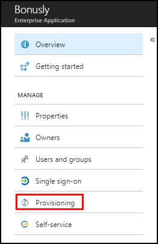

4. Set the **Provisioning Mode** to **Automatic**.

	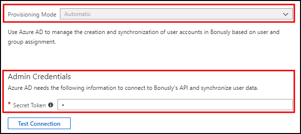

5. Under the **Admin Credentials** section, input the **Secret Token** of your Bonusly account as described in Step 6.

	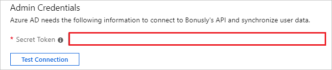

6. The **Secret Token** for your Bonusly account is located in **Admin > Company > Integrations**. In the **If you want to code** section, click on **API > Create New API Access Token** to create a new Secret Token.

	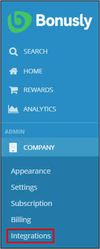

	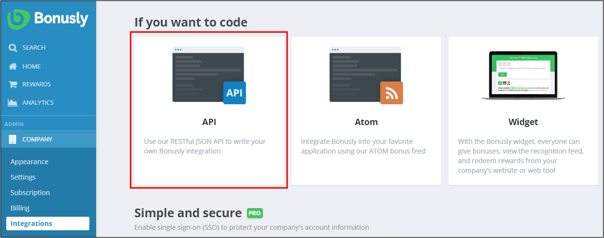

	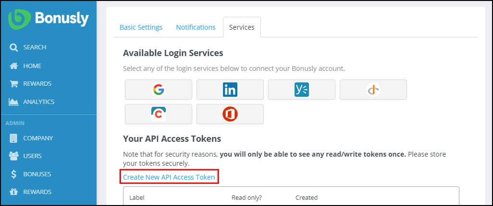

7. On the following screen, type a name for the access token in the provided text box, then press **Create Api Key**. The new access token will appear for a few seconds in a pop-up.

	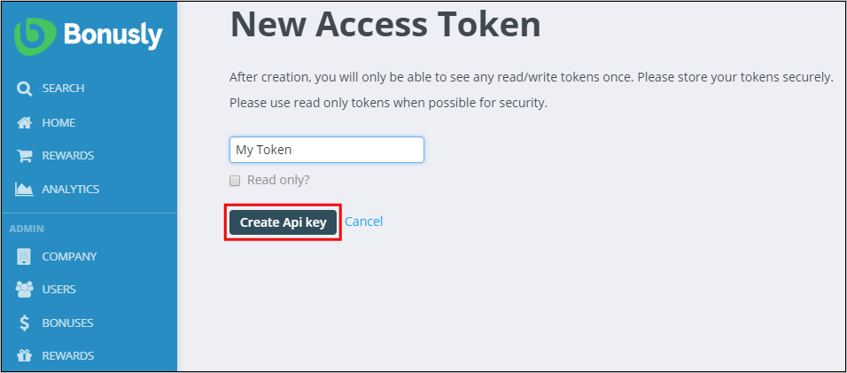

	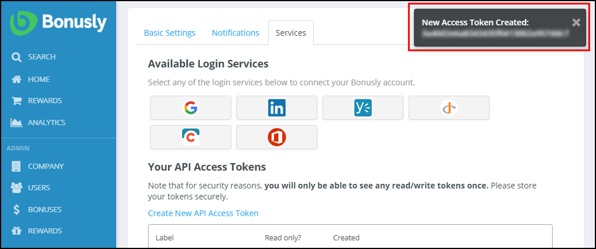

8. Upon populating the fields shown in Step 5, click **Test Connection** to ensure Azure AD can connect to Bonusly. If the connection fails, ensure your Bonusly account has Admin permissions and try again.

	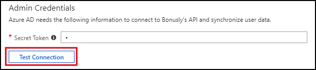

9. In the **Notification Email** field, enter the email address of a person or group who should receive the provisioning error notifications and check the checkbox **Send an email notification when a failure occurs**.

	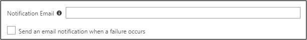

10. Click **Save**.

11. Under the **Mappings** section, select **Synchronize Azure Active Directory Users to Bonusly**.

	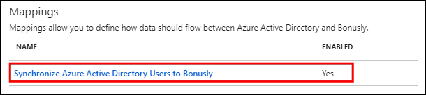

12. Review the user attributes that are synchronized from Azure AD to Bonusly in the **Attribute Mapping** section. The attributes selected as **Matching** properties are used to match the user accounts in Bonusly for update operations. Select the **Save** button to commit any changes.

	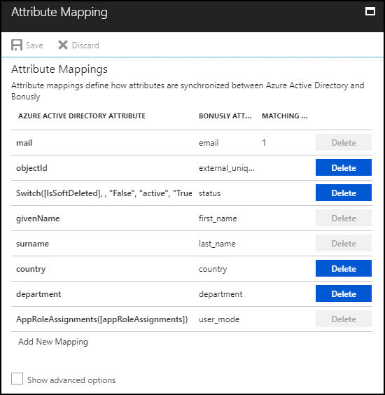

13. To configure scoping filters, refer to the following instructions provided in the [Scoping filter tutorial](../manage-apps/define-conditional-rules-for-provisioning-user-accounts.md).

14. To enable the Azure AD provisioning service for Bonusly, change the **Provisioning Status** to **On** in the **Settings** section.

	

15. Define the users and/or groups that you would like to provision to Bonusly by choosing the desired values in **Scope** in the **Settings** section.

	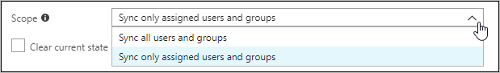

16. When you are ready to provision, click **Save**.

	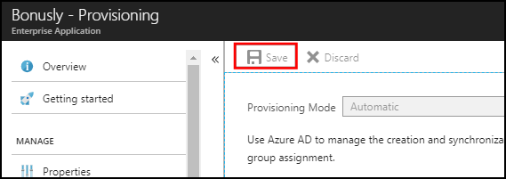

This operation starts the initial synchronization of all users and/or groups defined in **Scope** in the **Settings** section. The initial sync takes longer to perform than subsequent syncs, which occur approximately every 40 minutes as long as the Azure AD provisioning service is running. You can use the **Synchronization Details** section to monitor progress and follow links to provisioning activity report, which describes all actions performed by the Azure AD provisioning service on Bonusly.

For more information on how to read the Azure AD provisioning logs, see [Reporting on automatic user account provisioning](../manage-apps/check-status-user-account-provisioning.md).

## Additional resources

* [Managing user account provisioning for Enterprise Apps](../manage-apps/configure-automatic-user-provisioning-portal.md)
* [What is application access and single sign-on with Azure Active Directory?](../manage-apps/what-is-single-sign-on.md)

## Next steps

* [Learn how to review logs and get reports on provisioning activity](../manage-apps/check-status-user-account-provisioning.md)

<!--Image references-->
[1]: ./media/bonusly-provisioning-tutorial/tutorial_general_01.png
[2]: ./media/bonusly-provisioning-tutorial/tutorial_general_02.png
[3]: ./media/bonusly-provisioning-tutorial/tutorial_general_03.png
