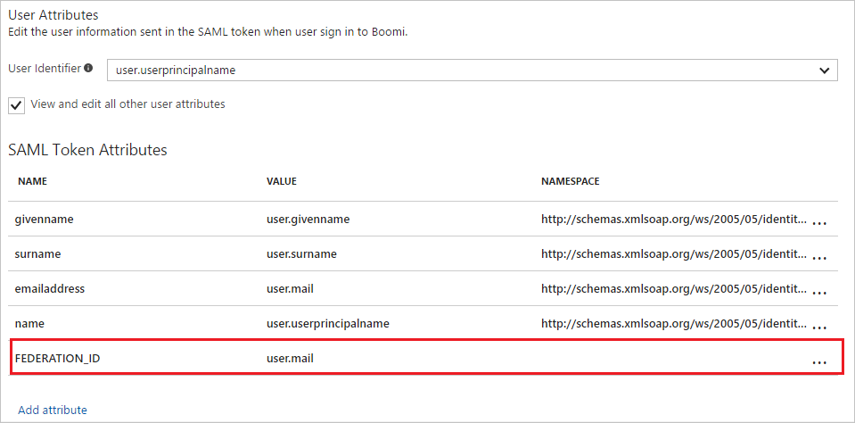
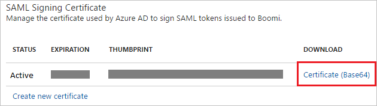
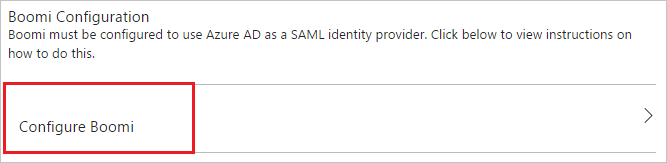

---
title: 'Tutorial: Azure Active Directory integration with Boomi | Microsoft Docs'
description: Learn how to configure single sign-on between Azure Active Directory and Boomi.
services: active-directory
documentationCenter: na
author: jeevansd
manager: femila
ms.reviewer: joflore

ms.assetid: 40d034ff-7394-4713-923d-1f8f2ed8bf36
ms.service: active-directory
ms.component: saas-app-tutorial
ms.workload: identity
ms.tgt_pltfrm: na
ms.devlang: na
ms.topic: article
ms.date: 01/03/2018
ms.author: jeedes

---
# Tutorial: Azure Active Directory integration with Boomi

In this tutorial, you learn how to integrate Boomi with Azure Active Directory (Azure AD).

Integrating Boomi with Azure AD provides you with the following benefits:

- You can control in Azure AD who has access to Boomi.
- You can enable your users to automatically get signed-on to Boomi (Single Sign-On) with their Azure AD accounts.
- You can manage your accounts in one central location - the Azure portal.

If you want to know more details about SaaS app integration with Azure AD, see [what is application access and single sign-on with Azure Active Directory](../manage-apps/what-is-single-sign-on.md).

## Prerequisites

To configure Azure AD integration with Boomi, you need the following items:

- An Azure AD subscription
- A Boomi single sign-on enabled subscription

> [!NOTE]
> To test the steps in this tutorial, we do not recommend using a production environment.

To test the steps in this tutorial, you should follow these recommendations:

- Do not use your production environment, unless it is necessary.
- If you don't have an Azure AD trial environment, you can [get a one-month trial](https://azure.microsoft.com/pricing/free-trial/).

## Scenario description
In this tutorial, you test Azure AD single sign-on in a test environment. 
The scenario outlined in this tutorial consists of two main building blocks:

1. Adding Boomi from the gallery
1. Configuring and testing Azure AD single sign-on

## Adding Boomi from the gallery
To configure the integration of Boomi into Azure AD, you need to add Boomi from the gallery to your list of managed SaaS apps.

**To add Boomi from the gallery, perform the following steps:**

1. In the **[Azure portal](https://portal.azure.com)**, on the left navigation panel, click **Azure Active Directory** icon. 

	![The Azure Active Directory button][1]

1. Navigate to **Enterprise applications**. Then go to **All applications**.

	![The Enterprise applications blade][2]
	
1. To add new application, click **New application** button on the top of dialog.

	![The New application button][3]

1. In the search box, type **Boomi**, select **Boomi** from result panel then click **Add** button to add the application.

	

## Configure and test Azure AD single sign-on

In this section, you configure and test Azure AD single sign-on with Boomi based on a test user called "Britta Simon".

For single sign-on to work, Azure AD needs to know what the counterpart user in Boomi is to a user in Azure AD. In other words, a link relationship between an Azure AD user and the related user in Boomi needs to be established.

In Boomi, assign the value of the **user name** in Azure AD as the value of the **Username** to establish the link relationship.

To configure and test Azure AD single sign-on with Boomi, you need to complete the following building blocks:

1. **[Configure Azure AD Single Sign-On](#configure-azure-ad-single-sign-on)** - to enable your users to use this feature.
1. **[Create an Azure AD test user](#create-an-azure-ad-test-user)** - to test Azure AD single sign-on with Britta Simon.
1. **[Create a Boomi test user](#create-a-boomi-test-user)** - to have a counterpart of Britta Simon in Boomi that is linked to the Azure AD representation of user.
1. **[Assign the Azure AD test user](#assign-the-azure-ad-test-user)** - to enable Britta Simon to use Azure AD single sign-on.
1. **[Test single sign-on](#test-single-sign-on)** - to verify whether the configuration works.

### Configure Azure AD single sign-on

In this section, you enable Azure AD single sign-on in the Azure portal and configure single sign-on in your Boomi application.

**To configure Azure AD single sign-on with Boomi, perform the following steps:**

1. In the Azure portal, on the **Boomi** application integration page, click **Single sign-on**.

	![Configure single sign-on link][4]

1. On the **Single sign-on** dialog, select **Mode** as	**SAML-based Sign-on** to enable single sign-on.
 
	

1. On the **Boomi Domain and URLs** section, perform the following steps:

	

    a. In the **Identifier** textbox, type a URL: `https://platform.boomi.com/`

	b. In the **Reply URL** textbox, type a URL using the following pattern: `https://platform.boomi.com/sso/<boomi-tenant>/saml`

	> [!NOTE] 
	> The Reply URL value is not real. Update the value with the actual Reply URL. Contact [Boomi support team](https://boomi.com/company/contact/) to get the value.
 
1. Boomi application expects the SAML assertions in a specific format. Please configure the following claims for this application. You can manage the values of these attributes from the "**User Attributes**" section on application integration page. The following screenshot shows an example for this.
	
	

1. In the **User Attributes** section on the **Single sign-on** dialog, for each row shown in the table below, perform the following steps:

	| Attribute Name | Attribute Value |
	| -------------- | --------------- |
	| FEDERATION_ID | user.mail |
	
	a. Click **Add attribute** to open the **Add Attribute** dialog.
	
	
	
	
	
	b. In the **Name** textbox, type the attribute name shown for that row.
	
	c. From the **Value** list, type the attribute value shown for that row.
	
	d. Click **Ok**.

1. On the **SAML Signing Certificate** section, click **Certificate(Base64)** and then save the certificate file on your computer.

	 

1. Click **Save** button.

	

1. On the **Boomi Configuration** section, click **Configure Boomi** to open **Configure sign-on** window. Copy the **SAML Single Sign-On Service URL** from the **Quick Reference section.**

	 

1. In a different web browser window, log into your Boomi company site as an administrator. 

1. Navigate to **Company Name** and go to **Set up**.

1. Click the **SSO Options** tab and perform below steps.

	

	a. Check **Enable SAML Single Sign-On** checkbox.

	b. Click **Import** to upload the downloaded certificate from Azure AD to **Identity Provider Certificate**.
	
	c. In the **Identity Provider Login URL** textbox, put the value of **SAML Single Sign-On Service URL** from Azure AD application configuration window.

	d. As **Federation Id Location**, select **Federation Id is in FEDERATION_ID Attribute element** radio button. 

	e. Click **Save** button.

> [!TIP]
> You can now read a concise version of these instructions inside the [Azure portal](https://portal.azure.com), while you are setting up the app!  After adding this app from the **Active Directory > Enterprise Applications** section, simply click the **Single Sign-On** tab and access the embedded documentation through the **Configuration** section at the bottom. You can read more about the embedded documentation feature here: [Azure AD embedded documentation]( https://go.microsoft.com/fwlink/?linkid=845985)

### Create an Azure AD test user

The objective of this section is to create a test user in the Azure portal called Britta Simon.

   ![Create an Azure AD test user][100]

**To create a test user in Azure AD, perform the following steps:**

1. In the Azure portal, in the left pane, click the **Azure Active Directory** button.

    

1. To display the list of users, go to **Users and groups**, and then click **All users**.

    

1. To open the **User** dialog box, click **Add** at the top of the **All Users** dialog box.

    

1. In the **User** dialog box, perform the following steps:

    

    a. In the **Name** box, type **BrittaSimon**.

    b. In the **User name** box, type the email address of user Britta Simon.

    c. Select the **Show Password** check box, and then write down the value that's displayed in the **Password** box.

    d. Click **Create**.
  
### Create a Boomi test user

In order to enable Azure AD users to log in to Boomi, they must be provisioned into Boomi. In the case of Boomi, provisioning is a manual task.

### To provision a user account, perform the following steps:

1. Log in to your Boomi company site as an administrator.

1. After logging in, navigate to **User Management** and go to **Users**.

	

1. Click **+**  icon and the **Add/Maintain User Roles** dialog opens.

	

	

	a. In the **User e-mail address** textbox, type the email of user like BrittaSimon@contoso.com.
	
	b. In the **First name** textbox, type the First name of user like Britta.

	c. In the **Last name** textbox, type the Last name of user like Simon.
	
	d. Enter the user's **Federation ID**. Each user must have a Federation ID that uniquely identifies the user within the account.
	
	e. Assign the **Standard User** role to the user. Do not assign the Administrator role because that would give him normal Atmosphere access as well as single sign-on access.
	
	f. Click **OK**.
	
	> [!NOTE]
	> The user will not receive a welcome notification email containing a password that can be used to log in to the AtomSphere account because his password is managed through the identity provider. You may use any other Boomi user account creation tools or APIs provided by Boomi to provision AAD user accounts.

### Assign the Azure AD test user

In this section, you enable Britta Simon to use Azure single sign-on by granting access to Boomi.

![Assign the user role][200] 

**To assign Britta Simon to Boomi, perform the following steps:**

1. In the Azure portal, open the applications view, and then navigate to the directory view and go to **Enterprise applications** then click **All applications**.

	![Assign User][201] 

1. In the applications list, select **Boomi**.

	  

1. In the menu on the left, click **Users and groups**.

	![The "Users and groups" link][202]

1. Click **Add** button. Then select **Users and groups** on **Add Assignment** dialog.

	![The Add Assignment pane][203]

1. On **Users and groups** dialog, select **Britta Simon** in the Users list.

1. Click **Select** button on **Users and groups** dialog.

1. Click **Assign** button on **Add Assignment** dialog.
	
### Test single sign-on

In this section, you test your Azure AD single sign-on configuration using the Access Panel.

When you click the Boomi tile in the Access Panel, you should get automatically signed-on to your Boomi application.
For more information about the Access Panel, see [Introduction to the Access Panel](../user-help/active-directory-saas-access-panel-introduction.md). 

## Additional resources

* [List of Tutorials on How to Integrate SaaS Apps with Azure Active Directory](tutorial-list.md)
* [What is application access and single sign-on with Azure Active Directory?](../manage-apps/what-is-single-sign-on.md)

<!--Image references-->

[1]: ./media/boomi-tutorial/tutorial_general_01.png
[2]: ./media/boomi-tutorial/tutorial_general_02.png
[3]: ./media/boomi-tutorial/tutorial_general_03.png
[4]: ./media/boomi-tutorial/tutorial_general_04.png

[100]: ./media/boomi-tutorial/tutorial_general_100.png

[200]: ./media/boomi-tutorial/tutorial_general_200.png
[201]: ./media/boomi-tutorial/tutorial_general_201.png
[202]: ./media/boomi-tutorial/tutorial_general_202.png
[203]: ./media/boomi-tutorial/tutorial_general_203.png

