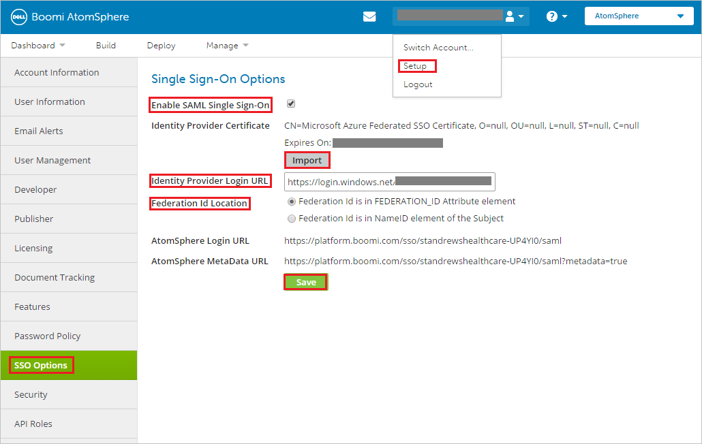
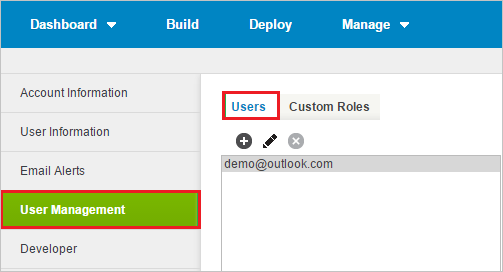

# Tutorial: Azure Active Directory single sign-on (SSO) integration with Boomi

In this tutorial, you'll learn how to integrate Boomi with Azure Active Directory (Azure AD). When you integrate Boomi with Azure AD, you can:

* Control in Azure AD who has access to Boomi.
* Enable your users to be automatically signed-in to Boomi with their Azure AD accounts.
* Manage your accounts in one central location - the Azure portal.

To learn more about SaaS app integration with Azure AD, see [What is application access and single sign-on with Azure Active Directory](https://docs.microsoft.com/azure/active-directory/manage-apps/what-is-single-sign-on).

## Prerequisites

To get started, you need the following items:

* An Azure AD subscription. If you don't have a subscription, you can get a [free account](https://azure.microsoft.com/free/).
* Boomi single sign-on (SSO) enabled subscription.

## Scenario description

In this tutorial, you configure and test Azure AD SSO in a test environment.

* Boomi supports **IDP** initiated SSO
* Once you configure the Boomi you can enforce session controls, which protect exfiltration and infiltration of your organization’s sensitive data in real-time. Session controls extend from Conditional Access. [Learn how to enforce session control with Microsoft Cloud App Security](https://docs.microsoft.com/cloud-app-security/proxy-deployment-any-app).

## Adding Boomi from the gallery

To configure the integration of Boomi into Azure AD, you need to add Boomi from the gallery to your list of managed SaaS apps.

1. Sign in to the [Azure portal](https://portal.azure.com) using either a work or school account, or a personal Microsoft account.
1. On the left navigation pane, select the **Azure Active Directory** service.
1. Navigate to **Enterprise Applications** and then select **All Applications**.
1. To add new application, select **New application**.
1. In the **Add from the gallery** section, type **Boomi** in the search box.
1. Select **Boomi** from results panel and then add the app. Wait a few seconds while the app is added to your tenant.

## Configure and test Azure AD single sign-on for Boomi

Configure and test Azure AD SSO with Boomi using a test user called **B.Simon**. For SSO to work, you need to establish a link relationship between an Azure AD user and the related user in Boomi.

To configure and test Azure AD SSO with Boomi, complete the following building blocks:

1. **[Configure Azure AD SSO](#configure-azure-ad-sso)** - to enable your users to use this feature.
    * **[Create an Azure AD test user](#create-an-azure-ad-test-user)** - to test Azure AD single sign-on with B.Simon.
    * **[Assign the Azure AD test user](#assign-the-azure-ad-test-user)** - to enable B.Simon to use Azure AD single sign-on.
1. **[Configure Boomi SSO](#configure-boomi-sso)** - to configure the single sign-on settings on application side.
    * **[Create Boomi test user](#create-boomi-test-user)** - to have a counterpart of B.Simon in Boomi that is linked to the Azure AD representation of user.
1. **[Test SSO](#test-sso)** - to verify whether the configuration works.

## Configure Azure AD SSO

Follow these steps to enable Azure AD SSO in the Azure portal.

1. In the [Azure portal](https://portal.azure.com/), on the **Boomi** application integration page, find the **Manage** section and select **single sign-on**.
1. On the **Select a single sign-on method** page, select **SAML**.
1. On the **Set up single sign-on with SAML** page, click the edit/pen icon for **Basic SAML Configuration** to edit the settings.

   

1. On the **Basic SAML Configuration** section, if you have **Service Provider metadata file** and wish to configure in **IDP** initiated mode, perform the following steps:

	a. Click **Upload metadata file**.

    

	b. Click on **folder logo** to select the metadata file and click **Upload**.

	

	c. After the metadata file is successfully uploaded, the **Identifier** and **Reply URL** values get auto populated in Basic SAML Configuration section.

	

	> [!Note]
	> You will get the **Service Provider metadata file** from the **Configure Boomi SSO** section, which is explained later in the tutorial. If the **Identifier** and **Reply URL** values do not get auto polulated, then fill in the values manually according to your requirement.

1. Boomi application expects the SAML assertions in a specific format, which requires you to add custom attribute mappings to your SAML token attributes configuration. The following screenshot shows the list of default attributes.

	

1. In addition to above, Boomi application expects few more attributes to be passed back in SAML response which are shown below. These attributes are also pre populated but you can review them as per your requirements.

	| Name |  Source Attribute|
	| ---------------|  --------- |
	| FEDERATION_ID | user.mail |

1. On the **Set up single sign-on with SAML** page, in the **SAML Signing Certificate** section,  find **Certificate (Base64)** and select **Download** to download the certificate and save it on your computer.

	

1. On the **Set up Boomi** section, copy the appropriate URL(s) based on your requirement.

	

### Create an Azure AD test user

In this section, you'll create a test user in the Azure portal called B.Simon.

1. From the left pane in the Azure portal, select **Azure Active Directory**, select **Users**, and then select **All users**.
1. Select **New user** at the top of the screen.
1. In the **User** properties, follow these steps:
   1. In the **Name** field, enter `B.Simon`.  
   1. In the **User name** field, enter the username@companydomain.extension. For example, `B.Simon@contoso.com`.
   1. Select the **Show password** check box, and then write down the value that's displayed in the **Password** box.
   1. Click **Create**.

### Assign the Azure AD test user

In this section, you'll enable B.Simon to use Azure single sign-on by granting access to Boomi.

1. In the Azure portal, select **Enterprise Applications**, and then select **All applications**.
1. In the applications list, select **Boomi**.
1. In the app's overview page, find the **Manage** section and select **Users and groups**.

   

1. Select **Add user**, then select **Users and groups** in the **Add Assignment** dialog.

	

1. In the **Users and groups** dialog, select **B.Simon** from the Users list, then click the **Select** button at the bottom of the screen.
1. If you're expecting any role value in the SAML assertion, in the **Select Role** dialog, select the appropriate role for the user from the list and then click the **Select** button at the bottom of the screen.
1. In the **Add Assignment** dialog, click the **Assign** button.

## Configure Boomi SSO

1. In a different web browser window, sign in to your Boomi company site as an administrator.

1. Navigate to **Company Name** and go to **Set up**.

1. Click the **SSO Options** tab and perform below steps.

	

	a. Check **Enable SAML Single Sign-On** checkbox.

	b. Click **Import** to upload the downloaded certificate from Azure AD to **Identity Provider Certificate**.

	c. In the **Identity Provider Login URL** textbox, put the value of **Login URL** from Azure AD application configuration window.

	d. For **Federation Id Location**, select the **Federation Id is in FEDERATION_ID Attribute element** radio button.

	e. Copy the **AtomSphere MetaData URL**, go to the **MetaData URL** via the browser of your choice, and save the output to a file. Upload the **MetaData URL** in the **Basic SAML Configuration** section in the Azure portal.

	f. Click **Save** button.

### Create Boomi test user

In order to enable Azure AD users to sign in to Boomi, they must be provisioned into Boomi. In the case of Boomi, provisioning is a manual task.

### To provision a user account, perform the following steps:

1. Sign in to your Boomi company site as an administrator.

1. After logging in, navigate to **User Management** and go to **Users**.

	

1. Click **+**  icon and the **Add/Maintain User Roles** dialog opens.

	

	

	a. In the **User e-mail address** textbox, type the email of user like B.Simon@contoso.com.

	b. In the **First name** textbox, type the First name of user like B.

	c. In the **Last name** textbox, type the Last name of user like Simon.

	d. Enter the user's **Federation ID**. Each user must have a Federation ID that uniquely identifies the user within the account.

	e. Assign the **Standard User** role to the user. Do not assign the Administrator role because that would give them normal Atmosphere access as well as single sign-on access.

	f. Click **OK**.

	> [!NOTE]
	> The user will not receive a welcome notification email containing a password that can be used to log in to the AtomSphere account because their password is managed through the identity provider. You may use any other Boomi user account creation tools or APIs provided by Boomi to provision AAD user accounts.

## Test SSO

In this section, you test your Azure AD single sign-on configuration using the Access Panel.

When you click the Boomi tile in the Access Panel, you should be automatically signed in to the Boomi for which you set up SSO. For more information about the Access Panel, see [Introduction to the Access Panel](https://docs.microsoft.com/azure/active-directory/active-directory-saas-access-panel-introduction).

## Additional resources

- [ List of Tutorials on How to Integrate SaaS Apps with Azure Active Directory ](https://docs.microsoft.com/azure/active-directory/active-directory-saas-tutorial-list)

- [What is application access and single sign-on with Azure Active Directory? ](https://docs.microsoft.com/azure/active-directory/manage-apps/what-is-single-sign-on)

- [What is conditional access in Azure Active Directory?](https://docs.microsoft.com/azure/active-directory/conditional-access/overview)

- [What is session control in Microsoft Cloud App Security?](https://docs.microsoft.com/cloud-app-security/proxy-intro-aad)

- [Try Boomi with Azure AD](https://aad.portal.azure.com/)
