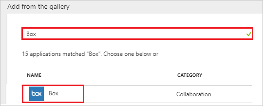
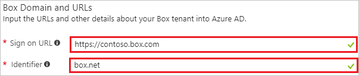

---
title: 'Tutorial: Azure Active Directory integration with Box | Microsoft Docs'
description: Learn how to configure single sign-on between Azure Active Directory and Box.
services: active-directory
documentationCenter: na
author: jeevansd
manager: femila
ms.reviewer: joflore

ms.assetid: 3b565c8d-35e2-482a-b2f4-bf8fd7d8731f
ms.service: active-directory
ms.component: saas-app-tutorial
ms.workload: identity
ms.tgt_pltfrm: na
ms.devlang: na
ms.topic: article
ms.date: 06/12/2018
ms.author: jeedes

---
# Integrate Azure Active Directory with Box

In this tutorial, you learn how to integrate Azure Active Directory (Azure AD) with Box.

By integrating Azure AD with Box, you get the following benefits:

- You can control in Azure AD who has access to Box.
- You can enable your users to get signed in automatically to Box (single sign-on, or SSO) with their Azure AD accounts.
- You can manage your accounts in one central location, the Azure portal.

To learn about SaaS app integration with Azure AD, see [What is application access and single sign-on with Azure Active Directory?](../manage-apps/what-is-single-sign-on.md).

## Prerequisites

To configure Azure AD integration with Box, you need the following items:

- An Azure AD subscription
- A Box SSO-enabled subscription

> [!NOTE]
> When you test the steps in this tutorial, we recommend that you do *not* use a production environment.

To test the steps in this tutorial, follow these recommendations:

- Do not use your production environment, unless it is necessary.
- If you don't have an Azure AD trial environment, you can [get a one-month trial](https://azure.microsoft.com/pricing/free-trial/).

## Scenario description
In this tutorial, you test Azure AD single sign-on in a test environment. 

The scenario that's outlined in this tutorial consists of two main building blocks:

1. Adding Box from the gallery
1. Configuring and testing Azure AD single sign-on

## Add Box from the gallery
To configure the integration of Azure AD with Box, add Box from the gallery to your list of managed SaaS apps by doing the following:

1. In the [Azure portal](https://portal.azure.com), in the left pane, select **Azure Active Directory**. 

    ![The Azure Active Directory button][1]

1. Select **Enterprise applications** > **All applications**.

	![The "Enterprise applications" window][2]
	
1. To add a new application, select the **New application** button at the top of window.

	![The "New application" button][3]

1. In the search box, type **Box**, select **Box** in the results list, and then select **Add**.

	
### Configure and test Azure AD single sign-on

In this section, you configure and test Azure AD single sign-on with Box, based on a test user called "Britta Simon."

For single sign-on to work, Azure AD needs to identify the Box user and its counterpart in Azure AD. In other words, a link relationship between an Azure AD user and the same user in Box must be established.

To establish the link relationship, assign as the Box *Username* the value of the *user name* in Azure AD.

To configure and test Azure AD single sign-on with Box, complete the building blocks in the next five sections.

### Configure Azure AD single sign-on

Enable Azure AD single sign-on in the Azure portal and configure single sign-on in your Box application by doing the following:

1. In the Azure portal, in the **Box** application integration window, select **Single sign-on**.

    ![The "Single sign-on" link][4]

1. In the **Single sign-on** window, in the **Single Sign-on Mode** box, select **SAML-based Sign-on**.
 
    

1. Under **Box Domain and URLs**, do the following:

	

	a. In the **Sign-on URL** box, type a URL in the following format: *https://\<subdomain>.box.com*.

	b. In the **Identifier** textbox, type **box.net**.
	 
	> [!NOTE] 
    > The preceding values are not real. Update them with the actual sign-on URL and identifier. To obtain the values, contact the [Box client support team](https://community.box.com/t5/custom/page/page-id/submit_sso_questionaire). 

1. Under **SAML Signing Certificate**, select **Metadata XML**, and then save the metadata file on your computer.

	 

1. Select **Save**.

	
	
1. To configure SSO for your application, follow the procedure in [Set up SSO on your own](https://community.box.com/t5/How-to-Guides-for-Admins/Setting-Up-Single-Sign-On-SSO-for-your-Enterprise/ta-p/1263#ssoonyourown).

> [!NOTE] 
> If you cannot enable the SSO settings for your Box account, you might need to contact the [Box client support team](https://community.box.com/t5/custom/page/page-id/submit_sso_questionaire) and provide the downloaded XML file.

> [!TIP]
> As you're setting up the app, you can read a concise version of the preceding instructions in the [Azure portal](https://portal.azure.com). After you've added the app in the **Active Directory** > **Enterprise Applications** section, select the **Single Sign-On** tab, and then access the embedded documentation in the **Configuration** section at the bottom. For more information about the embedded documentation feature, see [Azure AD embedded documentation]( https://go.microsoft.com/fwlink/?linkid=845985).
>

### Create an Azure AD test user

In this section, you create test user Britta Simon in the Azure portal by doing the following:

![Create an Azure AD test user][100]

1. In the Azure portal, in the left pane, select **Azure Active Directory**.

    

1. To display a list of current users, select **Users and groups** > **All users**.

    

1. At the top of the **All Users** window, select **Add**.

    

    The **User** window opens.

1. In the **User** window, do the following:

    

    a. In the **Name** box, type **BrittaSimon**.

    b. In the **User name** box, type the email address of user Britta Simon.

    c. Select the **Show Password** check box, and then write down the value that's displayed in the **Password** box.

    d. Select **Create**.
 
### Create a Box test user

In this section, you create test user Britta Simon in Box. Box supports just-in-time provisioning, which is enabled by default. If a user doesn't already exist, a new one is created when you attempt to access Box. No action is required from you to create the user.

### Assign the Azure AD test user

In this section, you enable user Britta Simon to use Azure single sign-on by granting access to Box. To do so, do the following:

![Assign the user role][200]

1. In the Azure portal, open the **Applications** view, go to the **Directory** view, and then select **Enterprise applications** > **All applications**.

    ![The "Enterprise applications" and "All applications" links][201] 

1. In the **Applications** list, select **Box**.

	  

1. In the left pane, select **Users and groups**.

	![The "Users and groups" link][202]

1. Select **Add** and then, in the **Add Assignment** pane, select **Users and groups**.

	![The Add Assignment pane][203]

1. In the **Users and groups** window, in the **Users** list, select **Britta Simon**.

1. Select the **Select** button.

1. In the **Add Assignment** window, select **Assign**.
	
### Test single sign-on

In this section, you test your Azure AD single sign-on configuration by using the Access Panel.

When you select the **Box** tile in the Access Panel, you open the sign-in page for signing in to your Box application.

## Additional resources

* [List of tutorials about integrating SaaS apps with Azure Active Directory](tutorial-list.md)
* [What is application access and single sign-on with Azure Active Directory?](../manage-apps/what-is-single-sign-on.md)
* [Configure user provisioning](box-userprovisioning-tutorial.md)

<!--Image references-->

[1]: ./media/box-tutorial/tutorial_general_01.png
[2]: ./media/box-tutorial/tutorial_general_02.png
[3]: ./media/box-tutorial/tutorial_general_03.png
[4]: ./media/box-tutorial/tutorial_general_04.png

[100]: ./media/box-tutorial/tutorial_general_100.png

[200]: ./media/box-tutorial/tutorial_general_200.png
[201]: ./media/box-tutorial/tutorial_general_201.png
[202]: ./media/box-tutorial/tutorial_general_202.png
[203]: ./media/box-tutorial/tutorial_general_203.png

