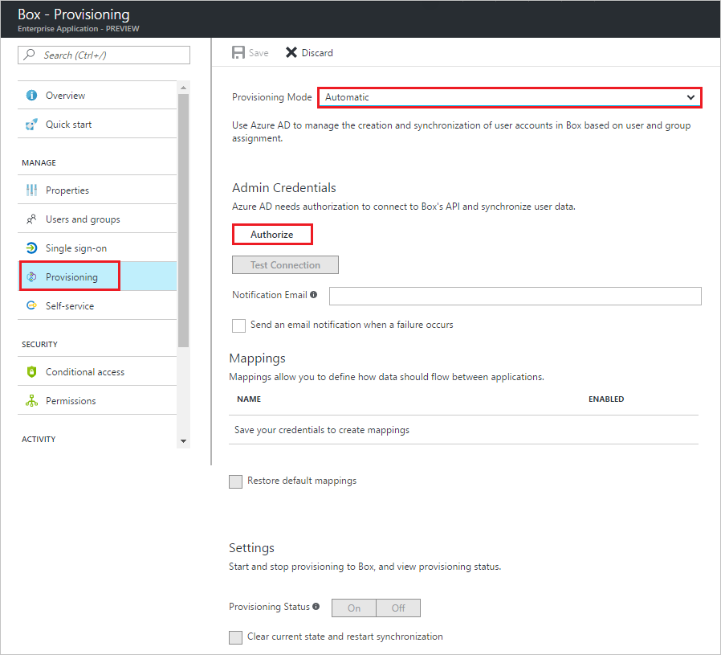

# Tutorial: Configure Box for automatic user provisioning

The objective of this tutorial is to show the steps you need to perform in Box and Microsoft Entra ID to automatically provision and de-provision user accounts from Microsoft Entra ID to Box.

> [!NOTE]
> This tutorial describes a connector built on top of the Microsoft Entra user Provisioning Service. For important details on what this service does, how it works, and frequently asked questions, see [Automate user provisioning and deprovisioning to SaaS applications with Microsoft Entra ID](../app-provisioning/user-provisioning.md).

## Prerequisites

To configure Microsoft Entra integration with Box, you need the following items:

- A Microsoft Entra tenant
- A Box Business plan or better

> [!NOTE]
> When you test the steps in this tutorial, we recommend that you do *not* use a production environment.

> [!NOTE]
> Apps need to be enabled in the Box application first.

> [!NOTE]
> This integration is also available to use from Microsoft Entra US Government Cloud environment. You can find this application in the Microsoft Entra US Government Cloud Application Gallery and configure it in the same way as you do from public cloud.

To test the steps in this tutorial, follow these recommendations:

- Do not use your production environment, unless it is necessary.
- If you don't have a Microsoft Entra trial environment, you can [get a one-month trial](https://azure.microsoft.com/pricing/free-trial/).

## Assigning users to Box 

Microsoft Entra ID uses a concept called "assignments" to determine which users should receive access to selected apps. In the context of automatic user account provisioning, only the users and groups that have been "assigned" to an application in Microsoft Entra ID is synchronized.

Before configuring and enabling the provisioning service, you need to decide what users and/or groups in Microsoft Entra ID represent the users who need access to your Box app. Once decided, you can assign these users to your Box app by following the instructions here:

[Assign a user or group to an enterprise app](../manage-apps/assign-user-or-group-access-portal.md)

## Assign users and groups
The **Box > Users and Groups** tab in the Azure portal allows you to specify which users and groups should be granted access to Box. Assignment of a user or group causes the following things to occur:

* Microsoft Entra ID permits the assigned user (either by direct assignment or group membership) to authenticate to Box. If a user is not assigned, then Microsoft Entra ID does not permit them to sign in to Box and returns an error on the Microsoft Entra sign-in page.
* An app tile for Box is added to the user's [application launcher](../manage-apps/end-user-experiences.md).
* If automatic provisioning is enabled, then the assigned users and/or groups are added to the provisioning queue to be automatically provisioned.
  
  * If only user objects were configured to be provisioned, then all directly assigned users are placed in the provisioning queue, and all users that are members of any assigned groups are placed in the provisioning queue. 
  * If group objects were configured to be provisioned, then all assigned group objects are provisioned to Box, and all users that are members of those groups. The group and user memberships are preserved upon being written to Box.

You can use the **Attributes > Single Sign-On** tab to configure which user attributes (or claims) are presented to Box during SAML-based authentication, and the **Attributes > Provisioning** tab to configure how user and group attributes flow from Microsoft Entra ID to Box during provisioning operations.

### Important tips for assigning users to Box 

*   It is recommended that a single Microsoft Entra user assigned to Box to test the provisioning configuration. Additional users and/or groups may be assigned later.

*   When assigning a user to box, you must select a valid user role. The "Default Access" role does not work for provisioning.

## Enable Automated User Provisioning

This section guides through connecting your Microsoft Entra ID to Box's user account provisioning API, and configuring the provisioning service to create, update, and disable assigned user accounts in Box based on user and group assignment in Microsoft Entra ID.

If automatic provisioning is enabled, then the assigned users and/or groups are added to the provisioning queue to be automatically provisioned.
	
 * If only user objects are configured to be provisioned, then directly assigned users are placed in the provisioning queue, and all users that are members of any assigned groups are placed in the provisioning queue. 
	
 * If group objects were configured to be provisioned, then all assigned group objects are provisioned to Box, and all users that are members of those groups. The group and user memberships are preserved upon being written to Box.

> [!TIP] 
> You may also choose to enabled SAML-based Single Sign-On for Box, following the instructions provided in the [Azure portal](https://portal.azure.com). Single sign-on can be configured independently of automatic provisioning, though these two features compliment each other.

### To configure automatic user account provisioning:

The objective of this section is to outline how to enable provisioning of Active Directory user accounts to Box.

1. Sign in to the [Microsoft Entra admin center](https://entra.microsoft.com) as at least a [Cloud Application Administrator](../roles/permissions-reference.md#cloud-application-administrator).
1. Browse to **Identity** > **Applications** > **Enterprise applications**.

2. If you have already configured Box for single sign-on, search for your instance of Box using the search field. Otherwise, select **Add** and search for **Box** in the application gallery. Select Box from the search results, and add it to your list of applications.

3. Select your instance of Box, then select the **Provisioning** tab.

4. Set the **Provisioning Mode** to **Automatic**. 

    

5. Under the **Admin Credentials** section, click **Authorize** to open a Box login dialog in a new browser window.

6. On the **Login to grant access to Box** page, provide the required credentials, and then click **Authorize**. 
   
    

7. Click **Grant access to Box** to authorize this operation and to return to the Azure portal. 
   
    

8. Select **Test Connection** to ensure Microsoft Entra ID can connect to your Box app. If the connection fails, ensure your Box account has Team Admin permissions and try the **"Authorize"** step again.

9. Enter the email address of a person or group who should receive provisioning error notifications in the **Notification Email** field, and check the checkbox.

10. Click **Save.**

11. Under the Mappings section, select **Synchronize Microsoft Entra users to Box.**

12. In the **Attribute Mappings** section, review the user attributes that are synchronized from Microsoft Entra ID to Box. The attributes selected as **Matching** properties are used to match the user accounts in Box for update operations. Select the Save button to commit any changes.

13. To enable the Microsoft Entra provisioning service for Box, change the **Provisioning Status** to **On** in the Settings section

14. Click **Save.**

That starts the initial synchronization of any users and/or groups assigned to Box in the Users and Groups section. The initial sync takes longer to perform than subsequent syncs, which occur approximately every 40 minutes as long as the service is running. You can use the **Synchronization Details** section to monitor progress and follow links to provisioning activity logs, which describe all actions performed by the provisioning service on your Box app.

For more information on how to read the Microsoft Entra provisioning logs, see [Reporting on automatic user account provisioning](../app-provisioning/check-status-user-account-provisioning.md).

In your Box tenant, synchronized users are listed under **Managed Users** in the **Admin Console**.

## Additional resources

* [Managing user account provisioning for Enterprise Apps](tutorial-list.md)
* [What is application access and single sign-on with Microsoft Entra ID?](../manage-apps/what-is-single-sign-on.md)
* [Configure Single Sign-on](box-tutorial.md)
