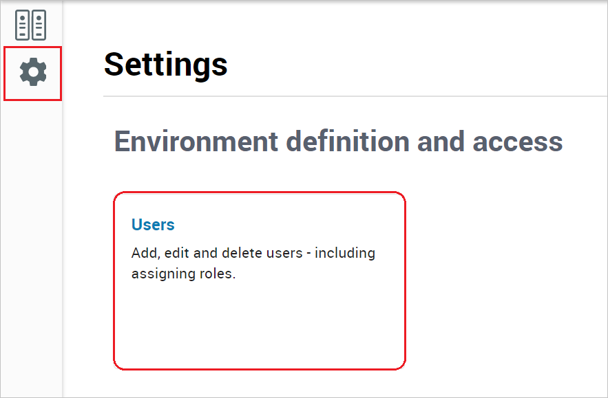
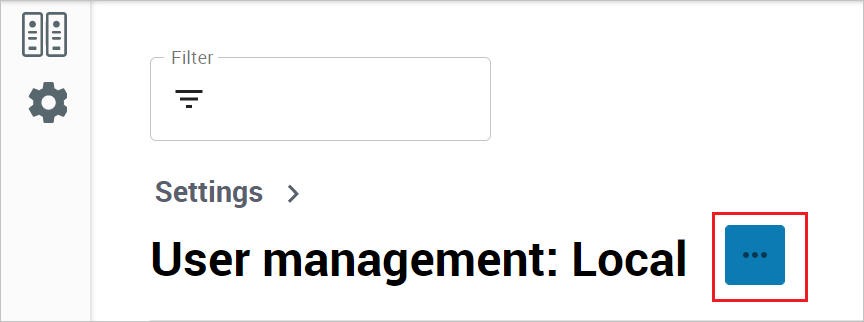
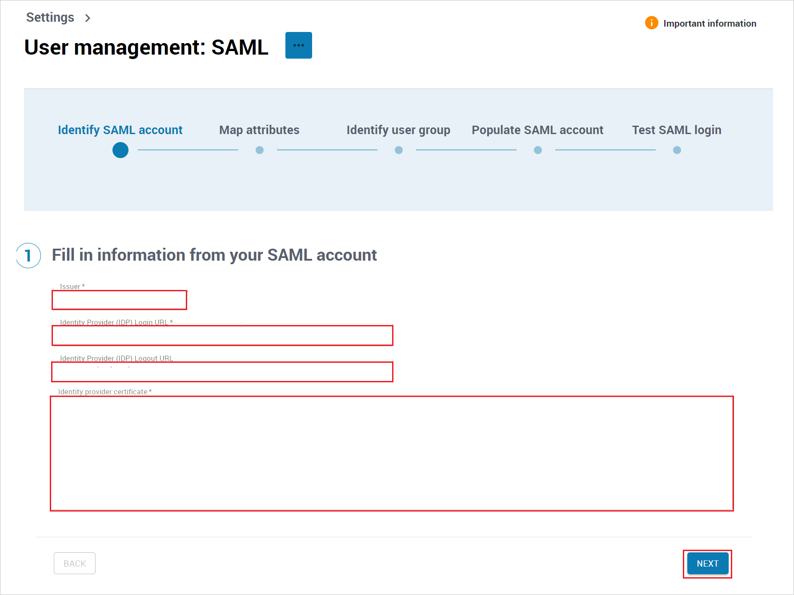
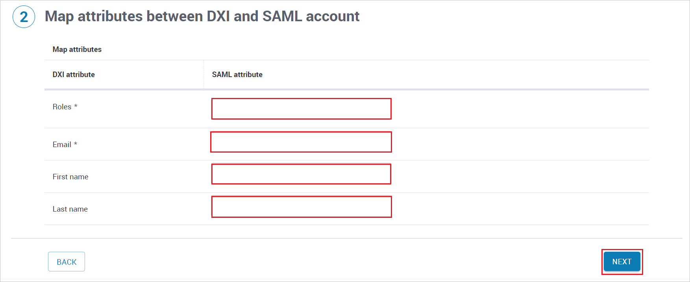
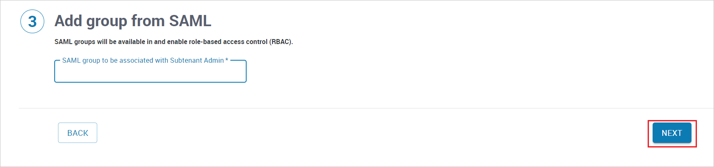
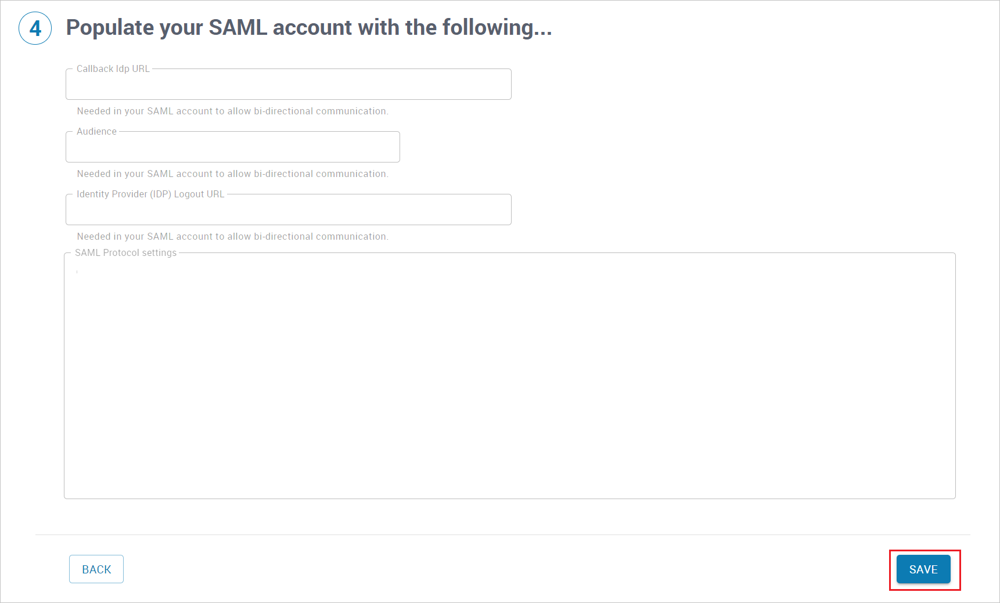

# Tutorial: Azure Active Directory single sign-on (SSO) integration with Broadcom DX SaaS

In this tutorial, you'll learn how to integrate Broadcom DX SaaS with Azure Active Directory (Azure AD). When you integrate Broadcom DX SaaS with Azure AD, you can:

* Control in Azure AD who has access to Broadcom DX SaaS.
* Enable your users to be automatically signed-in to Broadcom DX SaaS with their Azure AD accounts.
* Manage your accounts in one central location - the Azure portal.

## Prerequisites

To get started, you need the following items:

* An Azure AD subscription. If you don't have a subscription, you can get a [free account](https://azure.microsoft.com/free/).
* Broadcom DX SaaS single sign-on (SSO) enabled subscription.

## Scenario description

In this tutorial, you configure and test Azure AD SSO in a test environment.

* Broadcom DX SaaS supports **IDP** initiated SSO.

* Broadcom DX SaaS supports **Just In Time** user provisioning.

> [!NOTE]
> Identifier of this application is a fixed string value so only one instance can be configured in one tenant.

## Add Broadcom DX SaaS from the gallery

To configure the integration of Broadcom DX SaaS into Azure AD, you need to add Broadcom DX SaaS from the gallery to your list of managed SaaS apps.

1. Sign in to the Azure portal using either a work or school account, or a personal Microsoft account.
1. On the left navigation pane, select the **Azure Active Directory** service.
1. Navigate to **Enterprise Applications** and then select **All Applications**.
1. To add new application, select **New application**.
1. In the **Add from the gallery** section, type **Broadcom DX SaaS** in the search box.
1. Select **Broadcom DX SaaS** from results panel and then add the app. Wait a few seconds while the app is added to your tenant.

## Configure and test Azure AD SSO for Broadcom DX SaaS

Configure and test Azure AD SSO with Broadcom DX SaaS using a test user called **B.Simon**. For SSO to work, you need to establish a link relationship between an Azure AD user and the related user in Broadcom DX SaaS.

To configure and test Azure AD SSO with Broadcom DX SaaS, perform the following steps:

1. **[Configure Azure AD SSO](#configure-azure-ad-sso)** - to enable your users to use this feature.
    1. **[Create an Azure AD test user](#create-an-azure-ad-test-user)** - to test Azure AD single sign-on with B.Simon.
    1. **[Assign the Azure AD test user](#assign-the-azure-ad-test-user)** - to enable B.Simon to use Azure AD single sign-on.
1. **[Configure Broadcom DX SaaS SSO](#configure-broadcom-dx-saas-sso)** - to configure the single sign-on settings on application side.
    1. **[Create Broadcom DX SaaS test user](#create-broadcom-dx-saas-test-user)** - to have a counterpart of B.Simon in Broadcom DX SaaS that is linked to the Azure AD representation of user.
1. **[Test SSO](#test-sso)** - to verify whether the configuration works.

## Configure Azure AD SSO

Follow these steps to enable Azure AD SSO in the Azure portal.

1. In the Azure portal, on the **Broadcom DX SaaS** application integration page, find the **Manage** section and select **single sign-on**.
1. On the **Select a single sign-on method** page, select **SAML**.
1. On the **Set up single sign-on with SAML** page, click the edit/pen icon for **Basic SAML Configuration** to edit the settings.

   

1. On the **Set up single sign-on with SAML** page, enter the values for the following fields:

    a. In the **Identifier** text box, type a URL using the following pattern:
    `DXI_<TENANT_NAME>`

    b. In the **Reply URL** text box, type a URL using the following pattern:
    `https://axa.dxi-na1.saas.broadcom.com/ess/authn/<TENANT_NAME>`

	> [!NOTE]
	> These values are not real. Update these values with the actual Identifier and Reply URL. Contact [Broadcom DX SaaS Client support team](mailto:dxi-na1@saas.broadcom.com) to get these values. You can also refer to the patterns shown in the **Basic SAML Configuration** section in the Azure portal.

1. Broadcom DX SaaS application expects the SAML assertions in a specific format, which requires you to add custom attribute mappings to your SAML token attributes configuration. The following screenshot shows the list of default attributes.

	

1. In addition to above, Broadcom DX SaaS application expects few more attributes to be passed back in SAML response, which are shown below. These attributes are also pre populated but you can review them as per your requirements.
	
	| Name |  Source Attribute|
	| --------------- | --------- |
	| Group | user.groups |

1. On the **Set up single sign-on with SAML** page, in the **SAML Signing Certificate** section,  find **Certificate (Base64)** and select **Download** to download the certificate and save it on your computer.

	

1. On the **Set up Broadcom DX SaaS** section, copy the appropriate URL(s) based on your requirement.

	

### Create an Azure AD test user

In this section, you'll create a test user in the Azure portal called B.Simon.

1. From the left pane in the Azure portal, select **Azure Active Directory**, select **Users**, and then select **All users**.
1. Select **New user** at the top of the screen.
1. In the **User** properties, follow these steps:
   1. In the **Name** field, enter `B.Simon`.  
   1. In the **User name** field, enter the username@companydomain.extension. For example, `B.Simon@contoso.com`.
   1. Select the **Show password** check box, and then write down the value that's displayed in the **Password** box.
   1. Click **Create**.

### Assign the Azure AD test user

In this section, you'll enable B.Simon to use Azure single sign-on by granting access to Broadcom DX SaaS.

1. In the Azure portal, select **Enterprise Applications**, and then select **All applications**.
1. In the applications list, select **Broadcom DX SaaS**.
1. In the app's overview page, find the **Manage** section and select **Users and groups**.
1. Select **Add user**, then select **Users and groups** in the **Add Assignment** dialog.
1. In the **Users and groups** dialog, select **B.Simon** from the Users list, then click the **Select** button at the bottom of the screen.
1. If you are expecting a role to be assigned to the users, you can select it from the **Select a role** dropdown. If no role has been set up for this app, you see "Default Access" role selected.
1. In the **Add Assignment** dialog, click the **Assign** button.

## Configure Broadcom DX SaaS SSO

1. Log in to your Broadcom DX SaaS company site as an administrator.

2. Go to the **Settings** and click on **Users** tab.

    

3. In the **User management** section, click ellipses and select **SAML**.

    

4. In the **Identify SAML account** section, perform the  following steps.
   
     

    a. In the **Issuer** textbox, paste the **Azure AD Identifier** value which you have copied from the Azure portal.

    b. In the **Identity Provider (IDP) Login URL** textbox, paste the **Login URL** value which you have copied from the Azure portal.

    c. In the **Identity Provider (IDP) Logout URL** textbox, paste the **Logout URL** value which you have copied from the Azure portal.

    d. Open the downloaded **Certificate (Base64)** from the Azure portal into Notepad and paste the content into the **Identity provider certificate** textbox.

    e. Click **NEXT**.

5. In the **Map attributes** section, fill the required SAML attributes in the following page and click **NEXT**.

     

6. In the **Identify user group** section, enter the object ID of that group and click **NEXT**.

     

7. In the **Populate SAML Account** section, verify the populated values and click **SAVE**.

     

### Create Broadcom DX SaaS test user

In this section, a user called Britta Simon is created in Broadcom DX SaaS. Broadcom DX SaaS supports just-in-time user provisioning, which is enabled by default. There is no action item for you in this section. If a user doesn't already exist in Broadcom DX SaaS, a new one is created after authentication.

## Test SSO 

In this section, you test your Azure AD single sign-on configuration with following options.

* Click on Test this application in Azure portal and you should be automatically signed in to the Broadcom DX SaaS for which you set up the SSO.

* You can use Microsoft My Apps. When you click the Broadcom DX SaaS tile in the My Apps, you should be automatically signed in to the Broadcom DX SaaS for which you set up the SSO. For more information about the My Apps, see [Introduction to the My Apps](../user-help/my-apps-portal-end-user-access.md).

## Next Steps

Once you configure Broadcom DX SaaS you can enforce session control, which protects exfiltration and infiltration of your organization’s sensitive data in real time. Session control extends from Conditional Access. [Learn how to enforce session control with Microsoft Cloud App Security](/cloud-app-security/proxy-deployment-any-app).