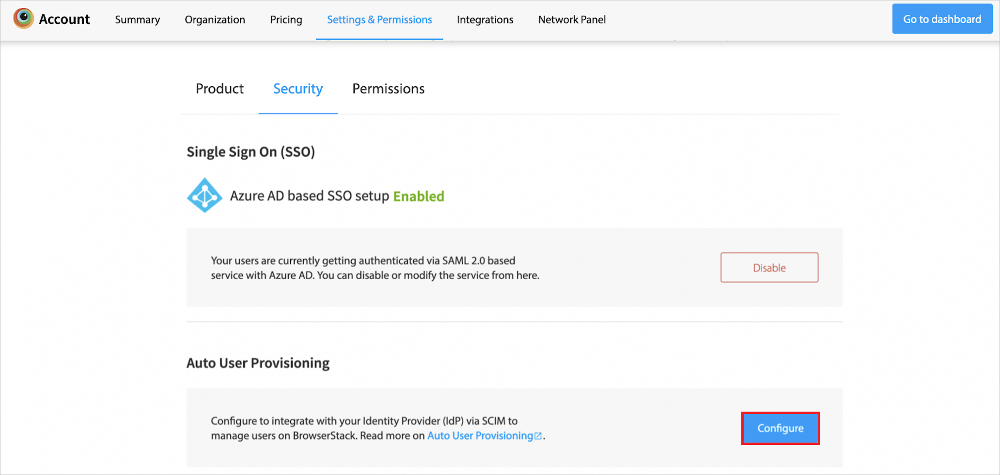
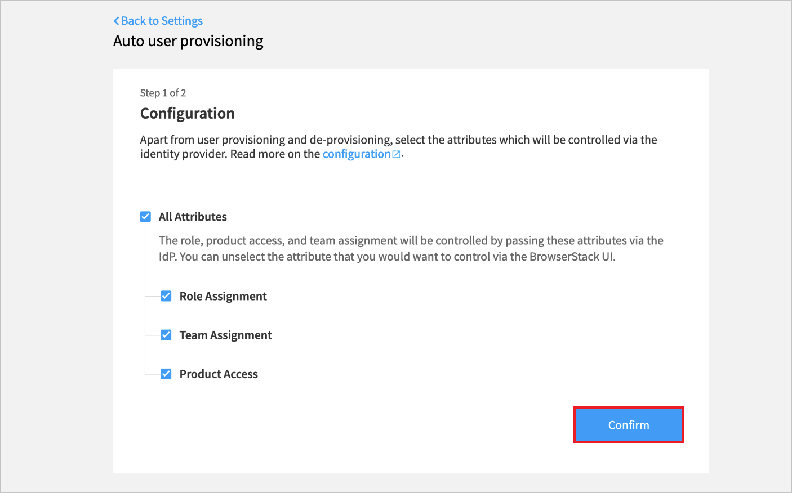
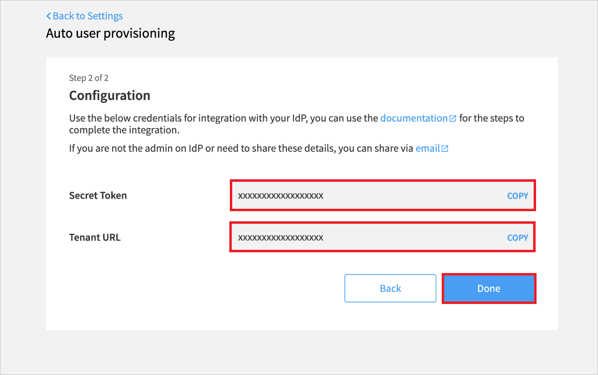
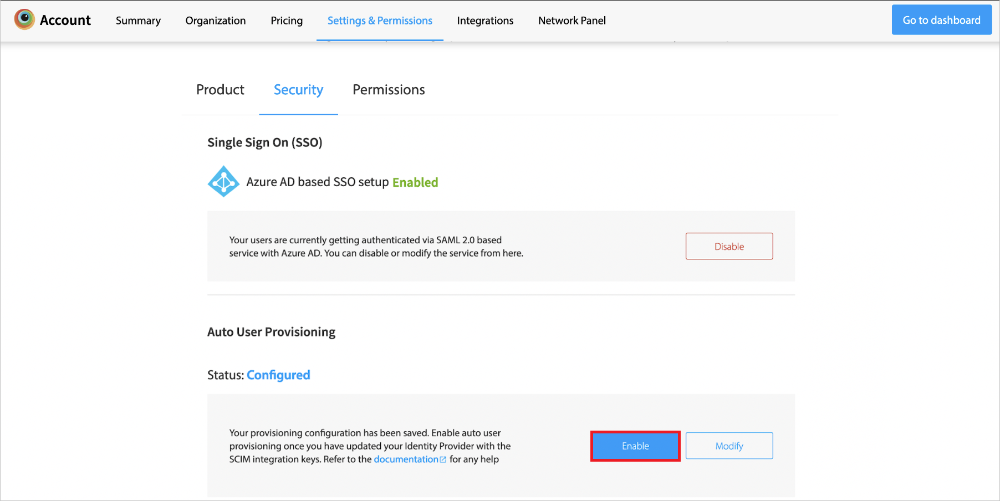
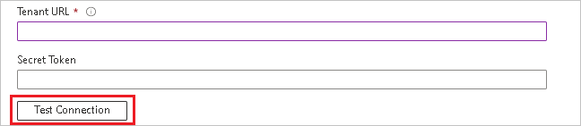

# Tutorial: Configure BrowserStack Single Sign-on for automatic user provisioning

This tutorial describes the steps you need to perform in both BrowserStack Single Sign-on and Microsoft Entra ID to configure automatic user provisioning. When configured, Microsoft Entra ID automatically provisions and de-provisions users to [BrowserStack Single Sign-on](https://www.browserstack.com) using the Microsoft Entra provisioning service. For important details on what this service does, how it works, and frequently asked questions, see [Automate user provisioning and deprovisioning to SaaS applications with Microsoft Entra ID](../app-provisioning/user-provisioning.md). 

## Capabilities supported
> [!div class="checklist"]
> * Create users in BrowserStack Single Sign-on
> * Remove users in BrowserStack Single Sign-on when they do not require access anymore
> * Keep user attributes synchronized between Microsoft Entra ID and BrowserStack Single Sign-on
> * [Single sign-on](./browserstack-single-sign-on-tutorial.md) to BrowserStack Single Sign-on (recommended)

## Prerequisites

The scenario outlined in this tutorial assumes that you already have the following prerequisites:

* [A Microsoft Entra tenant](../develop/quickstart-create-new-tenant.md) 
* A user account in Microsoft Entra ID with [permission](../roles/permissions-reference.md) to configure provisioning (for example, Application Administrator, Cloud Application administrator, Application Owner, or Global Administrator). 
* A user account in BrowserStack with **Owner** permissions.
* An [Enterprise plan](https://www.browserstack.com/pricing) with BrowserStack. 
* [Single Sign-on](https://www.browserstack.com/docs/enterprise/single-sign-on/azure-ad) integration with BrowserStack (mandatory).

## Step 1: Plan your provisioning deployment
1. Learn about [how the provisioning service works](../app-provisioning/user-provisioning.md).
2. Determine who will be in [scope for provisioning](../app-provisioning/define-conditional-rules-for-provisioning-user-accounts.md).
3. Determine what data to [map between Microsoft Entra ID and BrowserStack Single Sign-on](../app-provisioning/customize-application-attributes.md). 

## Step 2: Configure BrowserStack Single Sign-on to support provisioning with Microsoft Entra ID

1. Log in to [BrowserStack](https://www.browserstack.com/users/sign_in) as a user with **Owner** permissions.

2. Navigate to **Account** -> **Settings & Permissions**. Select the **Security** tab.

3. Under **Auto User Provisioning**, click **Configure**.

    

4. Select the user attributes that you want to control via Microsoft Entra ID and click **Confirm**.

    

5. Copy the **Tenant URL** and **Secret Token**. These values will be entered in the Tenant URL and Secret Token fields in the Provisioning tab of your BrowserStack Single Sign-on application. Click **Done**.

    

6. Your provisioning configuration has been saved on BrowserStack. **Enable** user provisioning in BrowserStack once **the provisioning setup on Microsoft Entra ID** is completed, to prevent blocking of inviting new users from BrowserStack [Account](https://www.browserstack.com/accounts/manage-users). 

    
    

## Step 3: Add BrowserStack Single Sign-on from the Microsoft Entra application gallery

Add BrowserStack Single Sign-on from the Microsoft Entra application gallery to start managing provisioning to BrowserStack Single Sign-on. If you have previously setup BrowserStack Single Sign-on for SSO, you can use the same application. However it is recommended that you create a separate app when testing out the integration initially. Learn more about adding an application from the gallery [here](../manage-apps/add-application-portal.md). 

## Step 4: Define who will be in scope for provisioning 

The Microsoft Entra provisioning service allows you to scope who will be provisioned based on assignment to the application and or based on attributes of the user. If you choose to scope who will be provisioned to your app based on assignment, you can use the following [steps](../manage-apps/assign-user-or-group-access-portal.md) to assign users to the application. If you choose to scope who will be provisioned based solely on attributes of the user, you can use a scoping filter as described [here](../app-provisioning/define-conditional-rules-for-provisioning-user-accounts.md). 

* Start small. Test with a small set of users and groups before rolling out to everyone. When scope for provisioning is set to assigned users and groups, you can control this by assigning one or two users or groups to the app. When scope is set to all users and groups, you can specify an [attribute based scoping filter](../app-provisioning/define-conditional-rules-for-provisioning-user-accounts.md).

* Start small. Test with a small set of users before rolling out to everyone. When scope for provisioning is set to assigned users, you can control this by assigning one or two users to the app. When scope is set to all users, you can specify an [attribute based scoping filter](../app-provisioning/define-conditional-rules-for-provisioning-user-accounts.md). 

## Step 5: Configure automatic user provisioning to BrowserStack Single Sign-on 

This section guides you through the steps to configure the Microsoft Entra provisioning service to create, update, and disable users in app based on user assignments in Microsoft Entra ID.

### To configure automatic user provisioning for BrowserStack Single Sign-on in Microsoft Entra ID:

1. Sign in to the [Microsoft Entra admin center](https://entra.microsoft.com) as at least a [Cloud Application Administrator](../roles/permissions-reference.md#cloud-application-administrator).
1. Browse to **Identity** > **Applications** > **Enterprise applications**

	

1. In the applications list, select **BrowserStack Single Sign-on**.

	

3. Select the **Provisioning** tab.

	

4. Set the **Provisioning Mode** to **Automatic**.

	

5. Under the **Admin Credentials** section, input your BrowserStack Single Sign-on Tenant URL and Secret Token. Click **Test Connection** to ensure Microsoft Entra ID can connect to BrowserStack Single Sign-on. If the connection fails, ensure your BrowserStack Single Sign-on account has Admin permissions and try again.

 	

6. In the **Notification Email** field, enter the email address of a person who should receive the provisioning error notifications and select the **Send an email notification when a failure occurs** check box.

	

7. Select **Save**.

8. Under the **Mappings** section, select **Synchronize Microsoft Entra users to BrowserStack Single Sign-on**.

9. Review the user attributes that are synchronized from Microsoft Entra ID to BrowserStack Single Sign-on in the **Attribute-Mapping** section. The attributes selected as **Matching** properties are used to match the user accounts in BrowserStack Single Sign-on for update operations. If you choose to change the [matching target attribute](../app-provisioning/customize-application-attributes.md), you will need to ensure that the BrowserStack Single Sign-on API supports filtering users based on that attribute. Select the **Save** button to commit any changes.

   |Attribute|Type|Supported for Filtering|
   |---|---|--|
   |userName|String|&check;|
   |name.givenName|String|
   |name.familyName|String|
   |urn:ietf:params:scim:schemas:extension:Bstack:2.0:User:bstack_role|String|
   |urn:ietf:params:scim:schemas:extension:Bstack:2.0:User:bstack_team|String|
   |urn:ietf:params:scim:schemas:extension:Bstack:2.0:User:bstack_product|String|

10. To configure scoping filters, refer to the following instructions provided in the [Scoping filter tutorial](../app-provisioning/define-conditional-rules-for-provisioning-user-accounts.md).

11. To enable the Microsoft Entra provisioning service for BrowserStack Single Sign-on, change the **Provisioning Status** to **On** in the **Settings** section.

	

12. Define the users that you would like to provision to BrowserStack Single Sign-on by choosing the desired values in **Scope** in the **Settings** section.

	

13. When you are ready to provision, click **Save**.

	

This operation starts the initial synchronization cycle of all users defined in **Scope** in the **Settings** section. The initial cycle takes longer to perform than subsequent cycles, which occur approximately every 40 minutes as long as the Microsoft Entra provisioning service is running. 

## Step 6: Monitor your deployment
Once you've configured provisioning, use the following resources to monitor your deployment:

- Use the [provisioning logs](../reports-monitoring/concept-provisioning-logs.md) to determine which users have been provisioned successfully or unsuccessfully
- Check the [progress bar](../app-provisioning/application-provisioning-when-will-provisioning-finish-specific-user.md) to see the status of the provisioning cycle and how close it is to completion
- If the provisioning configuration seems to be in an unhealthy state, the application will go into quarantine. Learn more about quarantine states [here](../app-provisioning/application-provisioning-quarantine-status.md).  

## Connector limitations

* BrowserStack Single Sign-on does not support group provisioning.
* BrowserStack Single Sign-on requires **emails[type eq "work"].value** and **userName** to have the same source value.

## Troubleshooting tips

* Refer to troubleshooting tips [here](https://www.browserstack.com/docs/enterprise/auto-user-provisioning/azure-ad#troubleshooting).

## Additional resources

* [Managing user account provisioning for Enterprise Apps](../app-provisioning/configure-automatic-user-provisioning-portal.md)
* [What is application access and single sign-on with Microsoft Entra ID?](../manage-apps/what-is-single-sign-on.md)
* [Configuring attribute-mappings in BrowserStack Single Sign-on](https://www.browserstack.com/docs/enterprise/auto-user-provisioning/azure-ad)
* [Setup and enable auto user provisioning in BrowserStack](https://www.browserstack.com/docs/enterprise/auto-user-provisioning/azure-ad#setup-and-enable-auto-user-provisioning)

## Next steps

* [Learn how to review logs and get reports on provisioning activity](../app-provisioning/check-status-user-account-provisioning.md)
