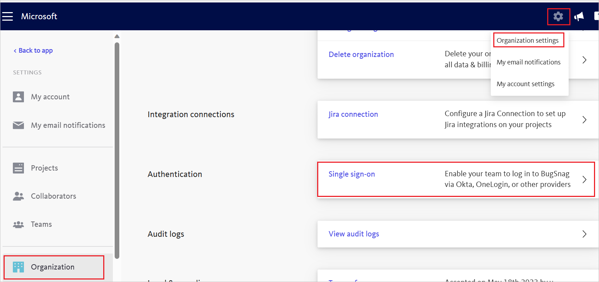
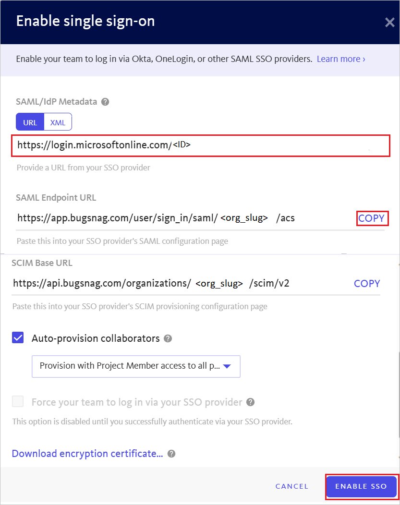

# Tutorial: Microsoft Entra integration with Bugsnag

In this tutorial, you learn how to integrate Bugsnag with Microsoft Entra ID. When you integrate Bugsnag with Microsoft Entra ID, you can:

* Control in Microsoft Entra ID who has access to Bugsnag.
* Enable your users to be automatically signed-in to Bugsnag with their Microsoft Entra accounts.
* Manage your accounts in one central location.

## Prerequisites

To get started, you need the following items:

* A Microsoft Entra subscription. If you don't have a subscription, you can get a [free account](https://azure.microsoft.com/free/).
* Bugsnag single sign-on (SSO) enabled subscription.

## Scenario description

In this tutorial, you configure and test Microsoft Entra single sign-on in a test environment.

* Bugsnag supports **SP and IDP** initiated SSO.
* Bugsnag supports **Just In Time** user provisioning.

> [!NOTE]
> Identifier of this application is a fixed string value so only one instance can be configured in one tenant.

## Add Bugsnag from the gallery

To configure the integration of Bugsnag into Microsoft Entra ID, you need to add Bugsnag from the gallery to your list of managed SaaS apps.

1. Sign in to the [Microsoft Entra admin center](https://entra.microsoft.com) as at least a [Cloud Application Administrator](../roles/permissions-reference.md#cloud-application-administrator).
1. Browse to **Identity** > **Applications** > **Enterprise applications** > **New application**.
1. In the **Add from the gallery** section, type **Bugsnag** in the search box.
1. Select **Bugsnag** from results panel and then add the app. Wait a few seconds while the app is added to your tenant.

 Alternatively, you can also use the [Enterprise App Configuration Wizard](https://portal.office.com/AdminPortal/home?Q=Docs#/azureadappintegration). In this wizard, you can add an application to your tenant, add users/groups to the app, assign roles, and walk through the SSO configuration as well. [Learn more about Microsoft 365 wizards.](/microsoft-365/admin/misc/azure-ad-setup-guides)

## Configure and test Microsoft Entra SSO for Bugsnag

Configure and test Microsoft Entra SSO with Bugsnag using a test user called **B.Simon**. For SSO to work, you need to establish a link relationship between a Microsoft Entra user and the related user in Bugsnag.

To configure and test Microsoft Entra SSO with Bugsnag, perform the following steps:

1. **[Configure Microsoft Entra SSO](#configure-azure-ad-sso)** - to enable your users to use this feature.
    1. **[Create a Microsoft Entra test user](#create-an-azure-ad-test-user)** - to test Microsoft Entra single sign-on with B.Simon.
    1. **[Assign the Microsoft Entra test user](#assign-the-azure-ad-test-user)** - to enable B.Simon to use Microsoft Entra single sign-on.
1. **[Configure Bugsnag SSO](#configure-bugsnag-sso)** - to configure the single sign-on settings on application side.
    1. **[Create Bugsnag test user](#create-bugsnag-test-user)** - to have a counterpart of B.Simon in Bugsnag that is linked to the Microsoft Entra representation of user.
1. **[Test SSO](#test-sso)** - to verify whether the configuration works.

## Configure Microsoft Entra SSO

Follow these steps to enable Microsoft Entra SSO.

1. Sign in to the [Microsoft Entra admin center](https://entra.microsoft.com) as at least a [Cloud Application Administrator](../roles/permissions-reference.md#cloud-application-administrator).
1. Browse to **Identity** > **Applications** > **Enterprise applications** > **Bugsnag** > **Single sign-on**.
1. On the **Select a single sign-on method** page, select **SAML**.
1. On the **Set up single sign-on with SAML** page, click the pencil icon for **Basic SAML Configuration** to edit the settings.

   

1. On the **Basic SAML Configuration** section, If you wish to configure the application in **IDP** initiated mode, perform the following step:

    In the **Reply URL** text box, type a URL using the following pattern:
    `https://app.bugsnag.com/user/sign_in/saml/<org_slug>/acs`

    > [!NOTE]
    > The Reply URL value is not real. Update this value with the actual Reply URL. Contact [Bugsnag Client support team](mailto:support@bugsnag.com) to get this value. You can also refer to the patterns shown in the **Basic SAML Configuration** section.

5. Click **Set additional URLs** and perform the following step if you wish to configure the application in **SP** initiated mode:

    In the **Sign-on URL** text box, type the URL:
    `https://app.bugsnag.com/user/identity_provider`

6. On the **Set up Single Sign-On with SAML** page, In the **SAML Signing Certificate** section, click copy button to copy **App Federation Metadata Url** and save it on your computer.

    

### Create a Microsoft Entra test user

In this section, you create a test user called B.Simon.

1. Sign in to the [Microsoft Entra admin center](https://entra.microsoft.com) as at least a [User Administrator](../roles/permissions-reference.md#user-administrator).
1. Browse to **Identity** > **Users** > **All users**.
1. Select **New user** > **Create new user**, at the top of the screen.
1. In the **User** properties, follow these steps:
   1. In the **Display name** field, enter `B.Simon`.  
   1. In the **User principal name** field, enter the username@companydomain.extension. For example, `B.Simon@contoso.com`.
   1. Select the **Show password** check box, and then write down the value that's displayed in the **Password** box.
   1. Select **Review + create**.
1. Select **Create**.

### Assign the Microsoft Entra test user

In this section, you enable B.Simon to use Azure single sign-on by granting access to Bugsnag.

1. Sign in to the [Microsoft Entra admin center](https://entra.microsoft.com) as at least a [Cloud Application Administrator](../roles/permissions-reference.md#cloud-application-administrator).
1. Browse to **Identity** > **Applications** > **Enterprise applications** > **Bugsnag**.
1. In the app's overview page, find the **Manage** section and select **Users and groups**.
1. Select **Add user**, then select **Users and groups** in the **Add Assignment** dialog.
1. In the **Users and groups** dialog, select **B.Simon** from the Users list, then click the **Select** button at the bottom of the screen.
1. If you're expecting a role to be assigned to the users, you can select it from the **Select a role** dropdown. If no role has been set up for this app, you see "Default Access" role selected.
1. In the **Add Assignment** dialog, click the **Assign** button.

## Configure Bugsnag SSO

1. Sign into the Bugsnag website as an administrator.

1. In BugSnag settings, select **Organization settings -> Single sign-on**.

    

1. Perform the following steps in the **Enable single sign-on** page:

    

    a. In the **SAML/IdP Metadata** field, enter the **App Federation Metadata Url** value, which you copied from Azure portal.

    b. Copy the **SAML Endpoint URL** value and paste this value into the **Reply URL** text box in the **Basic SAML Configuration** section.

    c. Click **ENABLE SSO**.

> [!NOTE]
> For more information on the Bugsnag SSO configuration, please follow [this](https://docs.bugsnag.com/product/single-sign-on/other/#setup-saml) guide.

### Create Bugsnag test user

In this section, a user called Britta Simon is created in Bugsnag. Bugsnag supports just-in-time user provisioning, which is enabled by default. There's no action item for you in this section. If a user doesn't already exist in Bugsnag, a new one is created after authentication.

## Test SSO

In this section, you test your Microsoft Entra single sign-on configuration with following options. 

#### SP initiated:

* Click on **Test this application**, this will redirect to Bugsnag Sign on URL where you can initiate the login flow.  

* Go to Bugsnag Sign-on URL directly and initiate the login flow from there.

#### IDP initiated:

* Click on **Test this application**, and you should be automatically signed in to the Bugsnag for which you set up the SSO. 

You can also use Microsoft My Apps to test the application in any mode. When you click the Bugsnag tile in the My Apps, if configured in SP mode you would be redirected to the application sign-on page for initiating the login flow and if configured in IDP mode, you should be automatically signed in to the Bugsnag for which you set up the SSO. For more information about the My Apps, see [Introduction to the My Apps](https://support.microsoft.com/account-billing/sign-in-and-start-apps-from-the-my-apps-portal-2f3b1bae-0e5a-4a86-a33e-876fbd2a4510).

## Next steps

Once you configure Bugsnag you can enforce session control, which protects exfiltration and infiltration of your organization’s sensitive data in real time. Session control extends from Conditional Access. [Learn how to enforce session control with Microsoft Defender for Cloud Apps](/cloud-app-security/proxy-deployment-aad).
