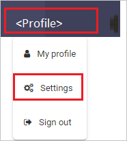
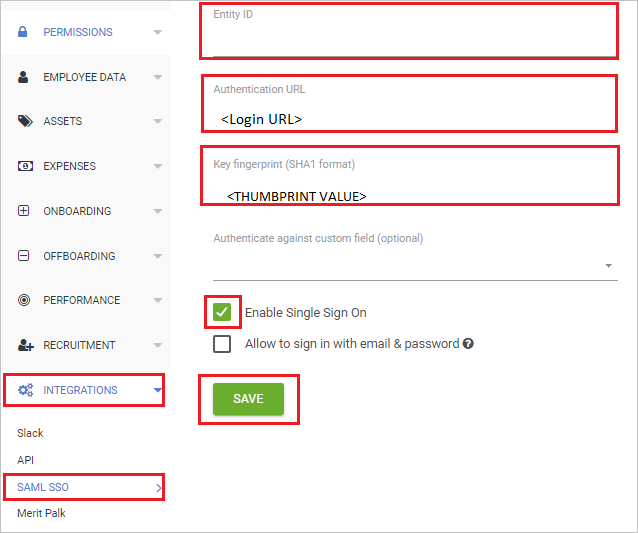
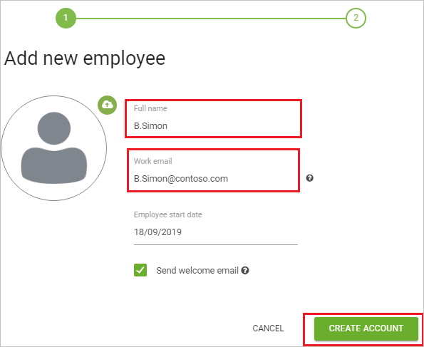

# Tutorial: Azure Active Directory single sign-on (SSO) integration with CakeHR

In this tutorial, you'll learn how to integrate CakeHR with Azure Active Directory (Azure AD). When you integrate CakeHR with Azure AD, you can:

* Control in Azure AD who has access to CakeHR.
* Enable your users to be automatically signed-in to CakeHR with their Azure AD accounts.
* Manage your accounts in one central location - the Azure portal.

## Prerequisites

To get started, you need the following items:

* An Azure AD subscription. If you don't have a subscription, you can get a [free account](https://azure.microsoft.com/free/).
* CakeHR single sign-on (SSO) enabled subscription.

## Scenario description

In this tutorial, you configure and test Azure AD SSO in a test environment.

* CakeHR supports **SP** initiated SSO.

> [!NOTE]
> Identifier of this application is a fixed string value so only one instance can be configured in one tenant.

## Add CakeHR from the gallery

To configure the integration of CakeHR into Azure AD, you need to add CakeHR from the gallery to your list of managed SaaS apps.

1. Sign in to the Azure portal using either a work or school account, or a personal Microsoft account.
1. On the left navigation pane, select the **Azure Active Directory** service.
1. Navigate to **Enterprise Applications** and then select **All Applications**.
1. To add new application, select **New application**.
1. In the **Add from the gallery** section, type **CakeHR** in the search box.
1. Select **CakeHR** from results panel and then add the app. Wait a few seconds while the app is added to your tenant.

## Configure and test Azure AD SSO for CakeHR

Configure and test Azure AD SSO with CakeHR using a test user called **B.Simon**. For SSO to work, you need to establish a link relationship between an Azure AD user and the related user in CakeHR.

To configure and test Azure AD SSO with CakeHR, perform the following steps:

1. **[Configure Azure AD SSO](#configure-azure-ad-sso)** - to enable your users to use this feature.
    1. **[Create an Azure AD test user](#create-an-azure-ad-test-user)** - to test Azure AD single sign-on with B.Simon.
    1. **[Assign the Azure AD test user](#assign-the-azure-ad-test-user)** - to enable B.Simon to use Azure AD single sign-on.
1. **[Configure CakeHR SSO](#configure-cakehr-sso)** - to configure the single sign-on settings on application side.
    1. **[Create CakeHR test user](#create-cakehr-test-user)** - to have a counterpart of B.Simon in CakeHR that is linked to the Azure AD representation of user.
1. **[Test SSO](#test-sso)** - to verify whether the configuration works.

## Configure Azure AD SSO

Follow these steps to enable Azure AD SSO in the Azure portal.

1. In the Azure portal, on the **CakeHR** application integration page, find the **Manage** section and select **single sign-on**.
1. On the **Select a single sign-on method** page, select **SAML**.
1. On the **Set up single sign-on with SAML** page, click the pencil icon for **Basic SAML Configuration** to edit the settings.

   

1. On the **Basic SAML Configuration** section, perform the following steps:

    a. In the **Sign-on URL** text box, type a URL using the following pattern:
    `https://<CAKE_DOMAIN>.cake.hr/`

    b. In the **Reply URL** text box, type a URL using the following pattern:
    `https://<CAKE_DOMAIN>.cake.hr/services/saml/consume`
    
	> [!NOTE]
	> These values are not real. Update these values with the actual Sign-On URL and Reply URL. Contact [CakeHR Client support team](mailto:info@cake.hr) to get these values. You can also refer to the patterns shown in the **Basic SAML Configuration** section in the Azure portal.

1. In the **SAML Signing Certificate** section, click **Edit** button to open **SAML Signing Certificate** dialog.

	

1. In the **SAML Signing Certificate** section, copy the **THUMBPRINT** value and save it on your Notepad.

    

1. On the **Set up CakeHR** section, copy the appropriate URL(s) based on your requirement.

	

### Create an Azure AD test user

In this section, you'll create a test user in the Azure portal called B.Simon.

1. From the left pane in the Azure portal, select **Azure Active Directory**, select **Users**, and then select **All users**.
1. Select **New user** at the top of the screen.
1. In the **User** properties, follow these steps:
   1. In the **Name** field, enter `B.Simon`.  
   1. In the **User name** field, enter the username@companydomain.extension. For example, `B.Simon@contoso.com`.
   1. Select the **Show password** check box, and then write down the value that's displayed in the **Password** box.
   1. Click **Create**.

### Assign the Azure AD test user

In this section, you'll enable B.Simon to use Azure single sign-on by granting access to CakeHR.

1. In the Azure portal, select **Enterprise Applications**, and then select **All applications**.
1. In the applications list, select **CakeHR**.
1. In the app's overview page, find the **Manage** section and select **Users and groups**.
1. Select **Add user**, then select **Users and groups** in the **Add Assignment** dialog.
1. In the **Users and groups** dialog, select **B.Simon** from the Users list, then click the **Select** button at the bottom of the screen.
1. If you are expecting a role to be assigned to the users, you can select it from the **Select a role** dropdown. If no role has been set up for this app, you see "Default Access" role selected.
1. In the **Add Assignment** dialog, click the **Assign** button.

## Configure CakeHR SSO

1. To automate the configuration within CakeHR, you need to install **My Apps Secure Sign-in browser extension** by clicking **Install the extension**.

	

1. After adding extension to the browser, click on **Set up CakeHR** will direct you to the CakeHR application. From there, provide the admin credentials to sign into CakeHR. The browser extension will automatically configure the application for you and automate steps 3-5.

	

1. If you want to setup CakeHR manually, open a new web browser window and sign into your CakeHR company site as an administrator and perform the following steps:

1. On the top-right corner of the page, click on **Profile** and then navigate to **Settings**.

    

1. From the left side of the menu bar, click on **INTEGRATIONS** > **SAML SSO** and perform the following steps:

    

    a. In the **Entity ID** text box, type `cake.hr`.

    b. In the **Authentication URL** text box, paste the value of **Login URL**, which you have copied from Azure portal.

    c. In the **Key fingerprint (SHA1 format)** text box, paste the **THUMBPRINT** value, which you have copied from Azure portal.

    d. Check the **Enable Single Sign on** box.

    e. Click **Save**.

### Create CakeHR test user

To enable Azure AD users to sign in to CakeHR, they must be provisioned into CakeHR. In CakeHR, provisioning is a manual task.

**To provision a user account, perform the following steps:**

1. Sign in to CakeHR as a Security Administrator.

2. From the left side of the menu bar, click on **COMPANY** > **ADD**.

    

3. On the **Add new employee** pop-up, perform the following steps:

     

    a. In **Full name** text box, enter the name of user like B.Simon.

    b. In **Work email** text box, enter the email of user like `B.Simon@contoso.com`.

    c. Click **CREATE ACCOUNT**.

## Test SSO 

In this section, you test your Azure AD single sign-on configuration with following options. 

* Click on **Test this application** in Azure portal. This will redirect to CakeHR Sign-on URL where you can initiate the login flow. 

* Go to CakeHR Sign-on URL directly and initiate the login flow from there.

* You can use Microsoft My Apps. When you click the CakeHR tile in the My Apps, this will redirect to CakeHR Sign-on URL. For more information about the My Apps, see [Introduction to the My Apps](../user-help/my-apps-portal-end-user-access.md).

## Next steps

Once you configure CakeHR you can enforce session control, which protects exfiltration and infiltration of your organization’s sensitive data in real time. Session control extends from Conditional Access. [Learn how to enforce session control with Microsoft Cloud App Security](/cloud-app-security/proxy-deployment-aad).
