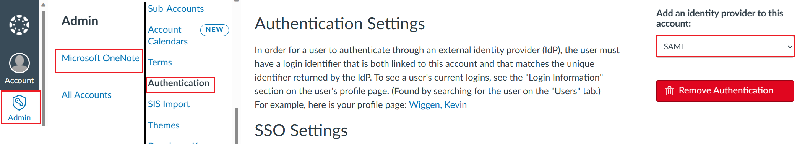
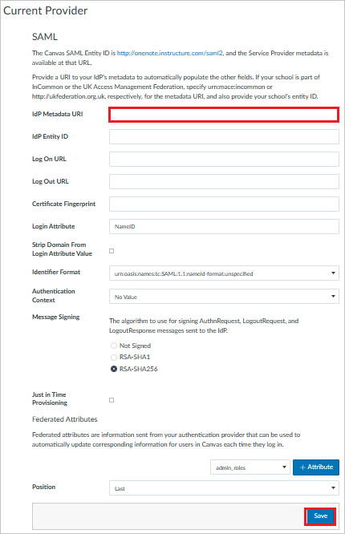
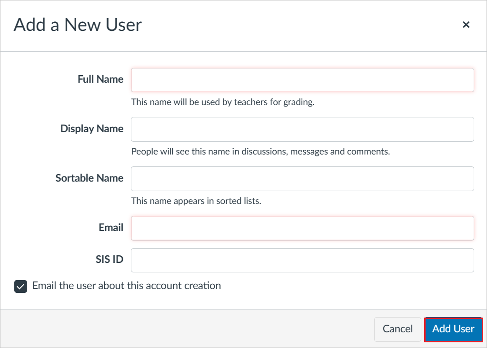

# Tutorial: Microsoft Entra SSO integration with Canvas

In this tutorial, you'll learn how to integrate Canvas with Microsoft Entra ID. When you integrate Canvas with Microsoft Entra ID, you can:

* Control in Microsoft Entra ID who has access to Canvas.
* Enable your users to be automatically signed-in to Canvas with their Microsoft Entra accounts.
* Manage your accounts in one central location.

## Prerequisites

To get started, you need the following items:
 
* A Microsoft Entra subscription. If you don't have a subscription, you can get a [free account](https://azure.microsoft.com/free/).
* Canvas single sign-on (SSO)-enabled subscription.

## Scenario description

In this tutorial, you configure and test Microsoft Entra single sign-on in a test environment.

* Canvas supports **SP** initiated SSO.

## Add Canvas from the gallery

To configure the integration of Canvas into Microsoft Entra ID, you need to add Canvas from the gallery to your list of managed SaaS apps.

1. Sign in to the [Microsoft Entra admin center](https://entra.microsoft.com) as at least a [Cloud Application Administrator](../roles/permissions-reference.md#cloud-application-administrator).
1. Browse to **Identity** > **Applications** > **Enterprise applications** > **New application**.
1. In the **Add from the gallery** section, type **Canvas** in the search box.
1. Select **Canvas** from results panel and then add the app. Wait a few seconds while the app is added to your tenant.

 Alternatively, you can also use the [Enterprise App Configuration Wizard](https://portal.office.com/AdminPortal/home?Q=Docs#/azureadappintegration). In this wizard, you can add an application to your tenant, add users/groups to the app, assign roles, as well as walk through the SSO configuration as well. [Learn more about Microsoft 365 wizards.](/microsoft-365/admin/misc/azure-ad-setup-guides)

## Configure and test Microsoft Entra SSO for Canvas

Configure and test Microsoft Entra SSO with Canvas using a test user called **B.Simon**. For SSO to work, you need to establish a link relationship between a Microsoft Entra user and the related user in Canvas.

To configure and test Microsoft Entra SSO with Canvas, perform the following steps:

1. **[Configure Microsoft Entra SSO](#configure-azure-ad-sso)** - to enable your users to use this feature.
    1. **[Create a Microsoft Entra test user](#create-an-azure-ad-test-user)** - to test Microsoft Entra single sign-on with B.Simon.
    1. **[Assign the Microsoft Entra test user](#assign-the-azure-ad-test-user)** - to enable B.Simon to use Microsoft Entra single sign-on.
1. **[Configure Canvas SSO](#configure-canvas-sso)** - to configure the single sign-on settings on application side.
    1. **[Create Canvas test user](#create-canvas-test-user)** - to have a counterpart of B.Simon in Canvas that is linked to the Microsoft Entra representation of user.
1. **[Test SSO](#test-sso)** - to verify whether the configuration works.

## Configure Microsoft Entra SSO

Follow these steps to enable Microsoft Entra SSO.

1. Sign in to the [Microsoft Entra admin center](https://entra.microsoft.com) as at least a [Cloud Application Administrator](../roles/permissions-reference.md#cloud-application-administrator).
1. Browse to **Identity** > **Applications** > **Enterprise applications** > **Canvas** > **Single sign-on**.
1. On the **Select a single sign-on method** page, select **SAML**.
1. On the **Set up single sign-on with SAML** page, click the pencil icon for **Basic SAML Configuration** to edit the settings.

   

1. On the **Basic SAML Configuration** section, perform the following steps:

    b. In the **Sign on URL** text box, type a URL using the following pattern:
    `https://<tenant-name>.instructure.com`

    a. In the **Identifier (Entity ID)** text box, type a URL using the following pattern:
    `https://<tenant-name>.instructure.com/saml2`

    > [!NOTE]
    > These values are not real. Update these values with the actual Identifier and Sign on URL. Contact [Canvas Client support team](https://community.canvaslms.com/community/help) to get these values. You can also refer to the patterns shown in the **Basic SAML Configuration** section.

1. On the **Set up single sign-on with SAML** page, In the **SAML Signing Certificate** section, click copy button to copy **App Federation Metadata Url** and save it on your computer.

	

### Create a Microsoft Entra test user

In this section, you'll create a test user called B.Simon.

1. Sign in to the [Microsoft Entra admin center](https://entra.microsoft.com) as at least a [User Administrator](../roles/permissions-reference.md#user-administrator).
1. Browse to **Identity** > **Users** > **All users**.
1. Select **New user** > **Create new user**, at the top of the screen.
1. In the **User** properties, follow these steps:
   1. In the **Display name** field, enter `B.Simon`.  
   1. In the **User principal name** field, enter the username@companydomain.extension. For example, `B.Simon@contoso.com`.
   1. Select the **Show password** check box, and then write down the value that's displayed in the **Password** box.
   1. Select **Review + create**.
1. Select **Create**.

### Assign the Microsoft Entra test user

In this section, you'll enable B.Simon to use single sign-on by granting access to Canvas.

1. Sign in to the [Microsoft Entra admin center](https://entra.microsoft.com) as at least a [Cloud Application Administrator](../roles/permissions-reference.md#cloud-application-administrator).
1. Browse to **Identity** > **Applications** > **Enterprise applications** > **Canvas**.
1. In the app's overview page, select **Users and groups**.
1. Select **Add user/group**, then select **Users and groups** in the **Add Assignment** dialog.
   1. In the **Users and groups** dialog, select **B.Simon** from the Users list, then click the **Select** button at the bottom of the screen.
   1. If you are expecting a role to be assigned to the users, you can select it from the **Select a role** dropdown. If no role has been set up for this app, you see "Default Access" role selected.
   1. In the **Add Assignment** dialog, click the **Assign** button.

## Configure Canvas SSO

1. In a different web browser window, log in to your Canvas company site as an administrator.

2. Go to **Admin > Microsoft OneNote > Authentication**.
3. Choose an authentication service as **SAML**. 

    

4. On the **Current Provider** page, perform the following steps:

    

    a. In **IdP Metadata URI** textbox, paste the value of **App Federation Metadata URL** value.

    b. Click **Save**.

### Create Canvas test user

To enable Microsoft Entra users to log in to Canvas, they must be provisioned into Canvas. In the case of Canvas, user provisioning is a manual task.

**To provision a user account, perform the following steps:**

1. Log in to your **Canvas** tenant.

2. Go to **Admin > Microsoft OneNote > People**.

3. Click **+People**.

4. On the Add a New User dialog page, perform the following steps:

   

   a. In the **Full Name** textbox, enter the name of user like **BrittaSimon**.

   b. In the **Email** textbox, enter the email of user like **brittasimon\@contoso.com**.

   c. Click **Add User**.

> [!NOTE]
> You can use any other Canvas user account creation tools or APIs provided by Canvas to provision Microsoft Entra user accounts.

## Test SSO

In this section, you test your Microsoft Entra single sign-on configuration with following options. 

* Click on **Test this application**, this will redirect to Canvas Sign on URL where you can initiate the login flow. 

* Go to Canvas Sign on URL directly and initiate the login flow from there.

* You can use Microsoft My Apps. When you click the Canvas tile in the My Apps, you should be automatically signed in to the Canvas for which you set up the SSO. For more information about the My Apps, see [Introduction to the My Apps](https://support.microsoft.com/account-billing/sign-in-and-start-apps-from-the-my-apps-portal-2f3b1bae-0e5a-4a86-a33e-876fbd2a4510).

## Next steps

Once you configure Canvas you can enforce session control, which protects exfiltration and infiltration of your organization’s sensitive data in real time. Session control extends from Conditional Access. [Learn how to enforce session control with Microsoft Defender for Cloud Apps](/cloud-app-security/proxy-deployment-any-app).
