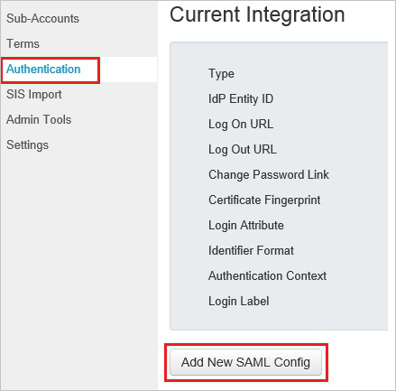
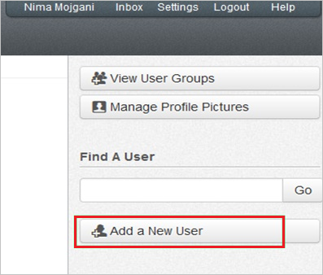

# Tutorial: Azure AD SSO integration with Canvas

In this tutorial, you'll learn how to integrate Canvas with Azure Active Directory (Azure AD). When you integrate Canvas with Azure AD, you can:

* Control in Azure AD who has access to Canvas.
* Enable your users to be automatically signed-in to Canvas with their Azure AD accounts.
* Manage your accounts in one central location - the Azure portal.

## Prerequisites

To get started, you need the following items:
 
* An Azure AD subscription. If you don't have a subscription, you can get a [free account](https://azure.microsoft.com/free/).
* Canvas single sign-on (SSO)-enabled subscription.

## Scenario description

In this tutorial, you configure and test Azure AD single sign-on in a test environment.

* Canvas supports **SP** initiated SSO.

## Add Canvas from the gallery

To configure the integration of Canvas into Azure AD, you need to add Canvas from the gallery to your list of managed SaaS apps.

1. Sign in to the Azure portal using either a work or school account, or a personal Microsoft account.
1. On the left navigation pane, select the **Azure Active Directory** service.
1. Navigate to **Enterprise Applications** and then select **All Applications**.
1. To add new application, select **New application**.
1. In the **Add from the gallery** section, type **Canvas** in the search box.
1. Select **Canvas** from results panel and then add the app. Wait a few seconds while the app is added to your tenant.

 Alternatively, you can also use the [Enterprise App Configuration Wizard](https://portal.office.com/AdminPortal/home?Q=Docs#/azureadappintegration). In this wizard, you can add an application to your tenant, add users/groups to the app, assign roles, as well as walk through the SSO configuration as well. [Learn more about Microsoft 365 wizards.](/microsoft-365/admin/misc/azure-ad-setup-guides)

## Configure and test Azure AD SSO for Canvas

Configure and test Azure AD SSO with Canvas using a test user called **B.Simon**. For SSO to work, you need to establish a link relationship between an Azure AD user and the related user in Canvas.

To configure and test Azure AD SSO with Canvas, perform the following steps:

1. **[Configure Azure AD SSO](#configure-azure-ad-sso)** - to enable your users to use this feature.
    1. **[Create an Azure AD test user](#create-an-azure-ad-test-user)** - to test Azure AD single sign-on with B.Simon.
    1. **[Assign the Azure AD test user](#assign-the-azure-ad-test-user)** - to enable B.Simon to use Azure AD single sign-on.
1. **[Configure Canvas SSO](#configure-canvas-sso)** - to configure the single sign-on settings on application side.
    1. **[Create Canvas test user](#create-canvas-test-user)** - to have a counterpart of B.Simon in Canvas that is linked to the Azure AD representation of user.
1. **[Test SSO](#test-sso)** - to verify whether the configuration works.

## Configure Azure AD SSO

Follow these steps to enable Azure AD SSO in the Azure portal.

1. In the Azure portal, on the **Canvas** application integration page, find the **Manage** section and select **single sign-on**.
1. On the **Select a single sign-on method** page, select **SAML**.
1. On the **Set up single sign-on with SAML** page, click the pencil icon for **Basic SAML Configuration** to edit the settings.

   

4. On the **Basic SAML Configuration** section, perform the following steps:

    b. In the **Sign on URL** text box, type a URL using the following pattern:
    `https://<tenant-name>.instructure.com`

    a. In the **Identifier (Entity ID)** text box, type a URL using the following pattern:
    `https://<tenant-name>.instructure.com/saml2`

    > [!NOTE]
    > These values are not real. Update these values with the actual Identifier and Sign on URL. Contact [Canvas Client support team](https://community.canvaslms.com/community/help) to get these values. You can also refer to the patterns shown in the **Basic SAML Configuration** section in the Azure portal.

5. In the **SAML Signing Certificate** section, click **Edit** button to open **SAML Signing Certificate** dialog.

    

6. In the **SAML Signing Certificate** section, copy the **THUMBPRINT** and save it on your computer.

    

7. On the **Set up Canvas** section, copy the appropriate URL(s) as per your requirement.

    

### Create an Azure AD test user

In this section, you'll create a test user in the Azure portal called B.Simon.

1. From the left pane in the Azure portal, select **Azure Active Directory**, select **Users**, and then select **All users**.
1. Select **New user** at the top of the screen.
1. In the **User** properties, follow these steps:
   1. In the **Name** field, enter `B.Simon`.  
   1. In the **User name** field, enter the username@companydomain.extension. For example, `B.Simon@contoso.com`.
   1. Select the **Show password** check box, and then write down the value that's displayed in the **Password** box.
   1. Click **Create**.

### Assign the Azure AD test user

In this section, you'll enable B.Simon to use Azure single sign-on by granting access to Canvas.

1. In the Azure portal, select **Enterprise Applications**, and then select **All applications**.
1. In the applications list, select **Canvas**.
1. In the app's overview page, find the **Manage** section and select **Users and groups**.
1. Select **Add user**, then select **Users and groups** in the **Add Assignment** dialog.
1. In the **Users and groups** dialog, select **B.Simon** from the Users list, then click the **Select** button at the bottom of the screen.
1. If you are expecting a role to be assigned to the users, you can select it from the **Select a role** dropdown. If no role has been set up for this app, you see "Default Access" role selected.
1. In the **Add Assignment** dialog, click the **Assign** button.

## Configure Canvas SSO

1. In a different web browser window, log in to your Canvas company site as an administrator.

2. Go to **Courses \> Managed Accounts \> Microsoft**.

    

3. In the navigation pane on the left, select **Authentication**, and then click **Add New SAML Config**.

    

4. On the Current Integration page, perform the following steps:

    

    a. In **IdP Entity ID** textbox, paste the value of **Azure Ad Identifier** which you have copied from Azure portal.

    b. In **Log On URL** textbox, paste the value of **Login URL** which you have copied from Azure portal .

    c. In **Log Out URL** textbox, paste the value of **Logout URL** which you have copied from Azure portal.

    d. In **Change Password Link** textbox, paste the value of **Change Password URL** which you have copied from Azure portal.

    e. In **Certificate Fingerprint** textbox, paste the **Thumbprint** value of certificate which you have copied from Azure portal.

    f. From the **Login Attribute** list, select **NameID**.

    g. From the **Identifier Format** list, select **emailAddress**.

    h. Click **Save Authentication Settings**.

### Create Canvas test user

To enable Azure AD users to log in to Canvas, they must be provisioned into Canvas. In the case of Canvas, user provisioning is a manual task.

**To provision a user account, perform the following steps:**

1. Log in to your **Canvas** tenant.

2. Go to **Courses \> Managed Accounts \> Microsoft**.

   

3. Click **Users**.

   

4. Click **Add New User**.

   

5. On the Add a New User dialog page, perform the following steps:

   

   a. In the **Full Name** textbox, enter the name of user like **BrittaSimon**.

   b. In the **Email** textbox, enter the email of user like **brittasimon\@contoso.com**.

   c. In the **Login** textbox, enter the user’s Azure AD email address like **brittasimon\@contoso.com**.

   d. Select **Email the user about this account creation**.

   e. Click **Add User**.

> [!NOTE]
> You can use any other Canvas user account creation tools or APIs provided by Canvas to provision Azure AD user accounts.

## Test SSO

In this section, you test your Azure AD single sign-on configuration with following options. 

* Click on **Test this application** in Azure portal. This will redirect to Canvas Sign-on URL where you can initiate the login flow. 

* Go to Canvas Sign-on URL directly and initiate the login flow from there.

* You can use Microsoft My Apps. When you click the Canvas tile in the My Apps, you should be automatically signed in to the Canvas for which you set up the SSO. For more information about the My Apps, see [Introduction to the My Apps](https://support.microsoft.com/account-billing/sign-in-and-start-apps-from-the-my-apps-portal-2f3b1bae-0e5a-4a86-a33e-876fbd2a4510).

## Next steps

Once you configure Canvas you can enforce session control, which protects exfiltration and infiltration of your organization’s sensitive data in real time. Session control extends from Conditional Access. [Learn how to enforce session control with Microsoft Defender for Cloud Apps](/cloud-app-security/proxy-deployment-any-app).
