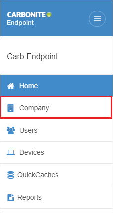
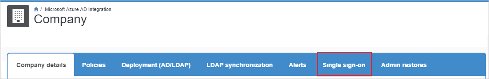
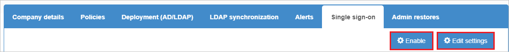
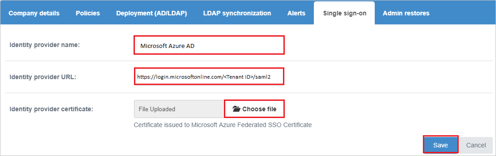
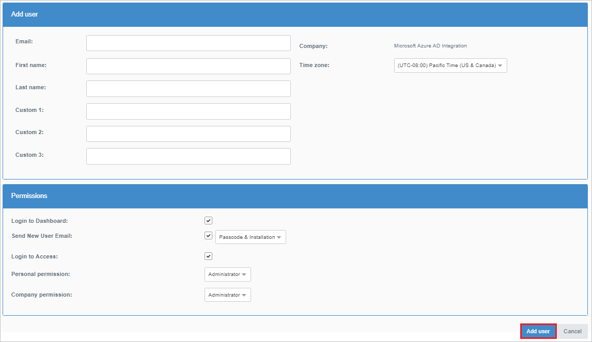

# Tutorial: Integrate Carbonite Endpoint Backup with Azure Active Directory

In this tutorial, you'll learn how to integrate Carbonite Endpoint Backup with Azure Active Directory (Azure AD). When you integrate Carbonite Endpoint Backup with Azure AD, you can:

* Control in Azure AD who has access to Carbonite Endpoint Backup.
* Enable your users to be automatically signed-in to Carbonite Endpoint Backup with their Azure AD accounts.
* Manage your accounts in one central location - the Azure portal.

To learn more about SaaS app integration with Azure AD, see [What is application access and single sign-on with Azure Active Directory](https://docs.microsoft.com/azure/active-directory/active-directory-appssoaccess-whatis).

## Prerequisites

To get started, you need the following items:

* An Azure AD subscription. If you don't have a subscription, you can get a [free account](https://azure.microsoft.com/free/).
* Carbonite Endpoint Backup single sign-on (SSO) enabled subscription.

## Scenario description

In this tutorial, you configure and test Azure AD SSO in a test environment.

* Carbonite Endpoint Backup supports **SP and IDP** initiated SSO

## Adding Carbonite Endpoint Backup from the gallery

To configure the integration of Carbonite Endpoint Backup into Azure AD, you need to add Carbonite Endpoint Backup from the gallery to your list of managed SaaS apps.

1. Sign in to the [Azure portal](https://portal.azure.com) using either a work or school account, or a personal Microsoft account.
1. On the left navigation pane, select the **Azure Active Directory** service.
1. Navigate to **Enterprise Applications** and then select **All Applications**.
1. To add new application, select **New application**.
1. In the **Add from the gallery** section, type **Carbonite Endpoint Backup** in the search box.
1. Select **Carbonite Endpoint Backup** from results panel and then add the app. Wait a few seconds while the app is added to your tenant.

## Configure and test Azure AD single sign-on

Configure and test Azure AD SSO with Carbonite Endpoint Backup using a test user called **B.Simon**. For SSO to work, you need to establish a link relationship between an Azure AD user and the related user in Carbonite Endpoint Backup.

To configure and test Azure AD SSO with Carbonite Endpoint Backup, complete the following building blocks:

1. **[Configure Azure AD SSO](#configure-azure-ad-sso)** - to enable your users to use this feature.
2. **[Configure Carbonite Endpoint Backup SSO](#configure-carbonite-endpoint-backup-sso)** - to configure the Single Sign-On settings on application side.
3. **[Create an Azure AD test user](#create-an-azure-ad-test-user)** - to test Azure AD single sign-on with B.Simon.
4. **[Assign the Azure AD test user](#assign-the-azure-ad-test-user)** - to enable B.Simon to use Azure AD single sign-on.
5. **[Create Carbonite Endpoint Backup test user](#create-carbonite-endpoint-backup-test-user)** - to have a counterpart of B.Simon in Carbonite Endpoint Backup that is linked to the Azure AD representation of user.
6. **[Test SSO](#test-sso)** - to verify whether the configuration works.

### Configure Azure AD SSO

Follow these steps to enable Azure AD SSO in the Azure portal.

1. In the [Azure portal](https://portal.azure.com/), on the **Carbonite Endpoint Backup** application integration page, find the **Manage** section and select **Single sign-on**.
1. On the **Select a Single sign-on method** page, select **SAML**.
1. On the **Set up Single Sign-On with SAML** page, click the edit/pen icon for **Basic SAML Configuration** to edit the settings.

   

1. On the **Basic SAML Configuration** section, if you wish to configure the application in **IDP** initiated mode, enter the values for the following fields:

    a. In the **Identifier** text box, type one of the following URLs:

    ```http
    https://red-us.mysecuredatavault.com
    https://red-apac.mysecuredatavault.com
    https://red-fr.mysecuredatavault.com
    https://red-emea.mysecuredatavault.com
    https://kamino.mysecuredatavault.com
    ```

    b. In the **Reply URL** text box, type one of the following URLs:

    ```http
    https://red-us.mysecuredatavault.com/AssertionConsumerService.aspx
    https://red-apac.mysecuredatavault.com/AssertionConsumerService.aspx
    https://red-fr.mysecuredatavault.com/AssertionConsumerService.aspx
    https://red-emea.mysecuredatavault.com/AssertionConsumerService.aspx
    ```

1. Click **Set additional URLs** and perform the following step if you wish to configure the application in **SP** initiated mode:

    In the **Sign-on URL** text box, type one of the following URLs:

    ```http
    https://red-us.mysecuredatavault.com/
    https://red-apac.mysecuredatavault.com/
    https://red-fr.mysecuredatavault.com/
    https://red-emea.mysecuredatavault.com/
    ```

1. On the **Set up Single Sign-On with SAML** page, in the **SAML Signing Certificate** section,  find **Certificate (Base64)** and select **Download** to download the certificate and save it on your computer.

	

1. On the **Set up Carbonite Endpoint Backup** section, copy the appropriate URL(s) based on your requirement.

	

### Configure Carbonite Endpoint Backup SSO

1. To automate the configuration within Carbonite Endpoint Backup, you need to install **My Apps Secure Sign-in browser extension** by clicking **Install the extension**.

	

2. After adding extension to the browser, click on **Setup Carbonite Endpoint Backup** will direct you to the Carbonite Endpoint Backup application. From there, provide the admin credentials to sign into Carbonite Endpoint Backup. The browser extension will automatically configure the application for you and automate steps 3-7.

	

3. If you want to setup Carbonite Endpoint Backup manually, open a new web browser window and sign into your Carbonite Endpoint Backup company site as an administrator and perform the following steps:

4. Click on the **Company** from the left pane.

    

5. Click on **Single sign-on**.

    

6. Click on **Enable** and then click **Edit settings** to configure.

    

7. On the **Single sign-on** settings page, perform the following steps:

    

    1. In the **Identity provider name** textbox, paste the **Azure AD Identifier** value, which you have copied from the Azure portal.

    1. In the **Identity provider URL** textbox, paste the **Login URL** value, which you have copied from the Azure portal.

    1. Click on **Choose file** to upload the downloaded **Certificate(Base64)** file from the Azure portal.

    1. Click **Save**.

### Create an Azure AD test user

In this section, you'll create a test user in the Azure portal called B.Simon.

1. From the left pane in the Azure portal, select **Azure Active Directory**, select **Users**, and then select **All users**.
1. Select **New user** at the top of the screen.
1. In the **User** properties, follow these steps:
   1. In the **Name** field, enter `B.Simon`.  
   1. In the **User name** field, enter the username@companydomain.extension. For example, `B.Simon@contoso.com`.
   1. Select the **Show password** check box, and then write down the value that's displayed in the **Password** box.
   1. Click **Create**.

### Assign the Azure AD test user

In this section, you'll enable B.Simon to use Azure single sign-on by granting access to Carbonite Endpoint Backup.

1. In the Azure portal, select **Enterprise Applications**, and then select **All applications**.
1. In the applications list, select **Carbonite Endpoint Backup**.
1. In the app's overview page, find the **Manage** section and select **Users and groups**.

   

1. Select **Add user**, then select **Users and groups** in the **Add Assignment** dialog.

	

1. In the **Users and groups** dialog, select **B.Simon** from the Users list, then click the **Select** button at the bottom of the screen.
1. If you're expecting any role value in the SAML assertion, in the **Select Role** dialog, select the appropriate role for the user from the list and then click the **Select** button at the bottom of the screen.
1. In the **Add Assignment** dialog, click the **Assign** button.

### Create Carbonite Endpoint Backup test user

1. In a different web browser window, sign in to your Carbonite Endpoint Backup company site as an administrator.

1. Click on the **Users** from the left pane and then click **Add user**.

    

1. On the **Add user** page, perform the following steps:

    

    1. Enter the **Email**, **First name**, **Last name** of the user and provide the required permissions to the user according to the Organizational requirements.

    1. Click **Add user**.

### Test SSO

In this section, you test your Azure AD single sign-on configuration using the Access Panel.

When you click the Carbonite Endpoint Backup tile in the Access Panel, you should be automatically signed in to the Carbonite Endpoint Backup for which you set up SSO. For more information about the Access Panel, see [Introduction to the Access Panel](https://docs.microsoft.com/azure/active-directory/active-directory-saas-access-panel-introduction).

## Additional resources

- [ List of Tutorials on How to Integrate SaaS Apps with Azure Active Directory ](https://docs.microsoft.com/azure/active-directory/active-directory-saas-tutorial-list)

- [What is application access and single sign-on with Azure Active Directory? ](https://docs.microsoft.com/azure/active-directory/active-directory-appssoaccess-whatis)

- [What is conditional access in Azure Active Directory?](https://docs.microsoft.com/azure/active-directory/conditional-access/overview)