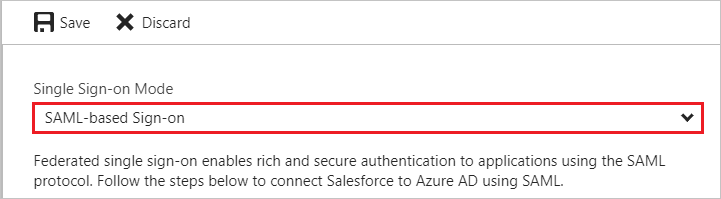
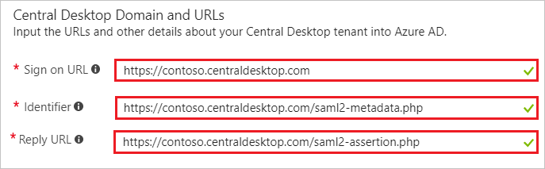
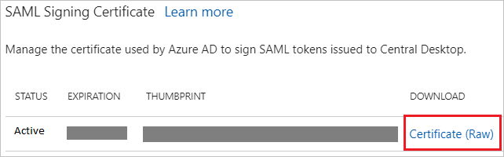

---
title: 'Tutorial: Azure Active Directory integration with Central Desktop | Microsoft Docs'
description: Learn how to configure single sign-on between Azure Active Directory and Central Desktop.
services: active-directory
documentationCenter: na
author: jeevansd
manager: femila
ms.reviewer: joflore

ms.assetid: b805d485-93db-49b4-807a-18d446c7090e
ms.service: active-directory
ms.component: saas-app-tutorial
ms.workload: identity
ms.tgt_pltfrm: na
ms.devlang: na
ms.topic: article
ms.date: 12/08/2017
ms.author: jeedes

---
# Tutorial: Azure Active Directory integration with Central Desktop

In this tutorial, you learn how to integrate Central Desktop with Azure Active Directory (Azure AD).

Integrating Central Desktop with Azure AD provides you with the following benefits:

- You can control in Azure AD who has access to Central Desktop.
- You can enable your users to automatically get signed in to Central Desktop with their Azure AD accounts.
- You can manage your accounts in one central location--the Azure portal.

For more details about SaaS app integration with Azure AD, see [What is application access and single sign-on with Azure Active Directory?](../manage-apps/what-is-single-sign-on.md).

## Prerequisites

To configure Azure AD integration with Central Desktop, you need the following items:

- An Azure AD subscription
- A Central Desktop single sign-on-enabled subscription

> [!NOTE]
> We don't recommend using a production environment to test the steps in this tutorial.

To test the steps in this tutorial, follow these recommendations:

- Don't use your production environment unless it's necessary.
- If you don't already have an Azure AD trial environment, [get a one-month free trial](https://azure.microsoft.com/pricing/free-trial/).

## Scenario description
In this tutorial, you test Azure AD single sign-on in a test environment. The scenario that's outlined in this tutorial consists of two main building blocks:

1. Adding Central Desktop from the gallery
1. Configuring and testing Azure AD single sign-on

## Add Central Desktop from the gallery
To configure the integration of Central Desktop into Azure AD, you need to add Central Desktop from the gallery to your list of managed SaaS apps.

**To add Central Desktop from the gallery, take the following steps:**

1. In the [Azure portal](https://portal.azure.com), in the left pane, select the **Azure Active Directory** icon. 

	![The Azure Active Directory button][1]

1. Go to **Enterprise applications**. Then go to **All applications**.

	![The Enterprise applications blade][2]
	
1. To add new applications, select the **New application** button on the top of the dialog box.

	![The New application button][3]

1. In the search box, type **Central Desktop**. Select **Central Desktop** from the results panel, and then select the **Add** button to add the application.

	

## Configure and test Azure AD single sign-on

In this section, you configure and test Azure AD single sign-on with Central Desktop based on a test user called "Britta Simon."

For single sign-on to work, Azure AD needs to know who the counterpart user in Central Desktop is to a user in Azure AD. In other words, you need to establish a link between an Azure AD user and a related user in Central Desktop.

In Central Desktop, give **Username** the same value as **user name** in Azure AD. Now you have established the link between the two users.

To configure and test Azure AD single sign-on with Central Desktop, you need to complete the following building blocks:

1. [Configure Azure AD single sign-on](#configure-azure-ad-single-sign-on) to enable your users to use this feature.
1. [Create an Azure AD test user](#create-an-azure-ad-test-user) to test Azure AD single sign-on with Britta Simon.
1. [Create a Central Desktop test user](#create-a-central-desktop-test-user) to have a counterpart of Britta Simon in Central Desktop that is linked to the Azure AD representation of user.
1. [Assign the Azure AD test user](#assign-the-azure-ad-test-user) to enable Britta Simon to use Azure AD single sign-on.
1. [Test single sign-on](#test-single-sign-on) to verify that the configuration works.

### Configure Azure AD single sign-on

In this section, you enable Azure AD single sign-on in the Azure portal and configure single sign-on in your Central Desktop application.

**To configure Azure AD single sign-on with Central Desktop, take the following steps:**

1. In the Azure portal, on the **Central Desktop** application integration page, select **Single sign-on**.

	![Configure single sign-on link][4]

1. To enable single sign-on, in the **Single sign-on** dialog box, in the **Mode** drop-down list, select **SAML-based Sign-on**.
 
	

1. In the **Central Desktop Domain and URLs** section, take the following steps:

	

	a. In the **Sign-on URL** box, type a URL with the following pattern: `https://<companyname>.centraldesktop.com`

    b. In the **Identifier** box, type a URL with the following pattern:
	| |
	|--|
	| `https://<companyname>.centraldesktop.com/saml2-metadata.php`|
	| `https://<companyname>.imeetcentral.com/saml2-metadata.php`|

	c. In the **Reply URL** box, type a URL with the following pattern: `https://<companyname>.centraldesktop.com/saml2-assertion.php`    
	 
	> [!NOTE] 
	> These values are not real. Update these values with the actual identifier, reply URL, and sign-on URL. Contact the [Central Desktop client support team](https://imeetcentral.com/contact-us) to get these values. 

1. In the **SAML Signing Certificate** section, select **Certificate**. Then save the certificate file on your computer.

	 

1. Select the **Save** button.

	
	
1. In the **Central Desktop Configuration** section, select **Configure Central Desktop** to open the **Configure sign-on** window. Copy the **Sign-Out URL, SAML Entity ID, and SAML Single Sign-On Service URL** from the **Quick Reference** section.

	 

1. Sign in to your **Central Desktop** tenant.

1. Go to **Settings**. Select **Advanced**, and then select **Single Sign On**.

	

1. On the **Single Sign On Settings** page, take the following steps:

	
	
	a. Select **Enable SAML v2 Single Sign On**.
	
	b. In the **SSO URL** box, paste the **SAML Entity ID** value that you copied from the Azure portal.
	
	c. In the **SSO Login URL** box, paste the **SAML Single Sign-On Service URL** value that you copied from the Azure portal.
	
	d. In the **SSO Logout URL** box, paste the **Sign-Out URL** value that you copied from the Azure portal.

1. In the **Message Signature Verification Method** section, take the following steps:

	
	a. Select **Certificate**.
	
	b. In the **SSO Certificate** list, select **RSH SHA256**.
	
	c. Open your downloaded certificate in Notepad. Then copy the content of certificate and paste it into the **SSO Certificate** field.
		
	d. Select **Display a link to your SAMLv2 login page**.
	
	e. Select **Update**.

> [!TIP]
> You can now read a concise version of these instructions inside the [Azure portal](https://portal.azure.com) while you are setting up the app. After you add this app from the **Active Directory** > **Enterprise Applications** section, select the **Single Sign-On** tab, and then access the embedded documentation through the **Configuration** section at the bottom. You can read more about the embedded documentation feature at [Azure AD embedded documentation]( https://go.microsoft.com/fwlink/?linkid=845985).

### Create an Azure AD test user

The objective of this section is to create a test user in the Azure portal called Britta Simon.

   ![Create an Azure AD test user][100]

**To create a test user in Azure AD, take the following steps:**

1. In the Azure portal, in the left pane, select the **Azure Active Directory** button.

    

1. To display the list of users, go to **Users and groups**. Then select **All users**.

    

1. To open the **User** dialog box, select **Add** at the top of the **All Users** dialog box.

    

1. In the **User** dialog box, take the following steps:

    

    a. In the **Name** box, type **BrittaSimon**.

    b. In the **User name** box, type the email address of user Britta Simon.

    c. Select the **Show Password** check box, and then write down the value that's displayed in the **Password** box.

    d. Select **Create**.
 
### Create a Central Desktop test user

For Azure AD users to be able to sign in, they must be provisioned in the Central Desktop application. This section describes how to create Azure AD user accounts in Central Desktop.

> [!NOTE]
> To provision Azure AD user accounts, you can use any other Central Desktop user account creation tools or APIs that are provided by Central Desktop.

**To provision user accounts to Central Desktop:**

1. Sign in to your Central Desktop tenant.

1. Go to **People** > **Internal Members**.

1. Select **Add Internal Members**.

	
	
1. In the **Email Address of New Members** box, type an Azure AD account that you want to provision, and then select **Next**.

	

1. Select **Add Internal member(s)**.

	
   
   >[!NOTE]
   >The users that you add receive an email that includes a confirmation link for activating their accounts.
   
### Assign the Azure AD test user

In this section, you enable user Britta Simon to use Azure single sign-on by granting them access to Central Desktop.

![Assign the user role][200] 

**To assign Britta Simon to Central Desktop, take the following steps:**

1. In the Azure portal, open the applications view. Go to the directory view, and then go to **Enterprise applications**.

1. Select **All applications**.

	![Assign user][201] 

1. In the applications list, select **Central Desktop**.

	  

1. In the menu on the left, select **Users and groups**.

	![The "Users and groups" link][202]

1. Select the **Add** button. Then select **Users and groups** in the **Add Assignment** dialog box.

	![The Add Assignment pane][203]

1. In the **Users and groups** dialog box, select **Britta Simon** in the **Users** list.

1. In the **Users and groups** dialog box, click the **Select** button.

1. In the  **Add Assignment** dialog box, select the **Assign** button.
	
### Test single sign-on

In this section, test your Azure AD single sign-on configuration by using the access panel.

When you select the Central Desktop tile in the access panel, you automatically get signed in to your Central Desktop application.
For more information about the access panel, see [Introduction to the access panel](../user-help/active-directory-saas-access-panel-introduction.md). 

## Additional resources

* [List of tutorials on how to integrate SaaS Apps with Azure Active Directory](tutorial-list.md)
* [What is application access and single sign-on with Azure Active Directory?](../manage-apps/what-is-single-sign-on.md)

<!--Image references-->

[1]: ./media/central-desktop-tutorial/tutorial_general_01.png
[2]: ./media/central-desktop-tutorial/tutorial_general_02.png
[3]: ./media/central-desktop-tutorial/tutorial_general_03.png
[4]: ./media/central-desktop-tutorial/tutorial_general_04.png

[100]: ./media/central-desktop-tutorial/tutorial_general_100.png

[200]: ./media/central-desktop-tutorial/tutorial_general_200.png
[201]: ./media/central-desktop-tutorial/tutorial_general_201.png
[202]: ./media/central-desktop-tutorial/tutorial_general_202.png
[203]: ./media/central-desktop-tutorial/tutorial_general_203.png

