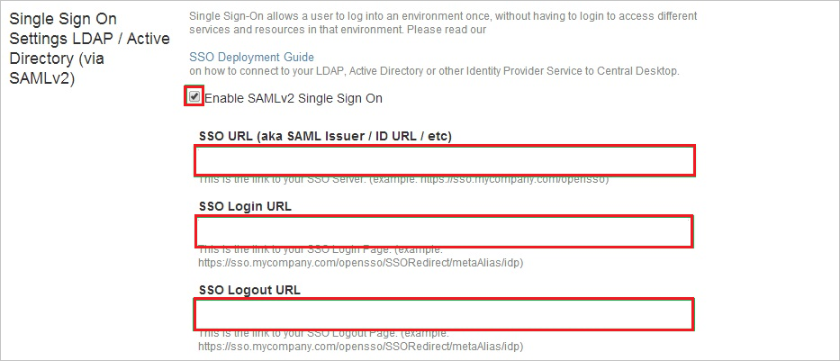
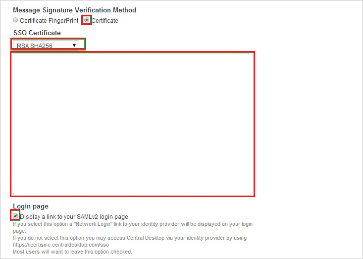

# Tutorial: Microsoft Entra integration with Central Desktop

In this tutorial, you'll learn how to integrate Central Desktop with Microsoft Entra ID. When you integrate Central Desktop with Microsoft Entra ID, you can:

* Control in Microsoft Entra ID who has access to Central Desktop.
* Enable your users to be automatically signed-in to Central Desktop with their Microsoft Entra accounts.
* Manage your accounts in one central location.

## Prerequisites

To get started, you need the following items:

* A Microsoft Entra subscription. If you don't have a subscription, you can get a [free account](https://azure.microsoft.com/free/).
* Central Desktop single sign-on (SSO) enabled subscription.

## Scenario description

In this tutorial, you configure and test Microsoft Entra single sign-on in a test environment.

* Central Desktop supports **SP** initiated SSO.

## Add Central Desktop from the gallery

To configure the integration of Central Desktop into Microsoft Entra ID, you need to add Central Desktop from the gallery to your list of managed SaaS apps.

1. Sign in to the [Microsoft Entra admin center](https://entra.microsoft.com) as at least a [Cloud Application Administrator](../roles/permissions-reference.md#cloud-application-administrator).
1. Browse to **Identity** > **Applications** > **Enterprise applications** > **New application**.
1. In the **Add from the gallery** section, type **Central Desktop** in the search box.
1. Select **Central Desktop** from results panel and then add the app. Wait a few seconds while the app is added to your tenant.

 Alternatively, you can also use the [Enterprise App Configuration Wizard](https://portal.office.com/AdminPortal/home?Q=Docs#/azureadappintegration). In this wizard, you can add an application to your tenant, add users/groups to the app, assign roles, as well as walk through the SSO configuration as well. [Learn more about Microsoft 365 wizards.](/microsoft-365/admin/misc/azure-ad-setup-guides)

## Configure and test Microsoft Entra SSO for Central Desktop

Configure and test Microsoft Entra SSO with Central Desktop using a test user called **B.Simon**. For SSO to work, you need to establish a link relationship between a Microsoft Entra user and the related user in Central Desktop.

To configure and test Microsoft Entra SSO with Central Desktop, perform the following steps:

1. **[Configure Microsoft Entra SSO](#configure-azure-ad-sso)** - to enable your users to use this feature.
    1. **[Create a Microsoft Entra test user](#create-an-azure-ad-test-user)** - to test Microsoft Entra single sign-on with B.Simon.
    1. **[Assign the Microsoft Entra test user](#assign-the-azure-ad-test-user)** - to enable B.Simon to use Microsoft Entra single sign-on.
1. **[Configure Central Desktop SSO](#configure-central-desktop-sso)** - to configure the single sign-on settings on application side.
    1. **[Create Central Desktop test user](#create-central-desktop-test-user)** - to have a counterpart of B.Simon in Central Desktop that is linked to the Microsoft Entra representation of user.
1. **[Test SSO](#test-sso)** - to verify whether the configuration works.

## Configure Microsoft Entra SSO

Follow these steps to enable Microsoft Entra SSO.

1. Sign in to the [Microsoft Entra admin center](https://entra.microsoft.com) as at least a [Cloud Application Administrator](../roles/permissions-reference.md#cloud-application-administrator).
1. Browse to **Identity** > **Applications** > **Enterprise applications** > **Central Desktop** > **Single sign-on**.
1. On the **Select a single sign-on method** page, select **SAML**.
1. On the **Set up single sign-on with SAML** page, click the pencil icon for **Basic SAML Configuration** to edit the settings.

   

1. On the **Basic SAML Configuration** section, perform the following steps:

    a. In the **Identifier** box, type a URL using one of the following patterns:

    | **Identifier** |
    |-------|
    | `https://<companyname>.centraldesktop.com/saml2-metadata.php` |
    | `https://<companyname>.imeetcentral.com/saml2-metadata.php` |

    b. In the **Reply URL** text box, type a URL using the following pattern:
    `https://<companyname>.centraldesktop.com/saml2-assertion.php`

    c. In the **Sign-on URL** text box, type a URL using the following pattern:
    `https://<companyname>.centraldesktop.com`

    > [!NOTE]
    > These values are not real. Update these values with the actual Identifier,Reply URL and Sign on URL. Contact [Central Desktop Client support team](https://imeetcentral.com/contact-us) to get these values. You can also refer to the patterns shown in the **Basic SAML Configuration** section.

1. On the **Set up Single Sign-On with SAML** page, in the **SAML Signing Certificate** section, click **Download** to download the **Certificate (Raw)** from the given options as per your requirement and save it on your computer.

    

6. On the **Set up Central Desktop** section, copy the appropriate URL(s) as per your requirement.

    

### Create a Microsoft Entra test user

In this section, you'll create a test user called B.Simon.

1. Sign in to the [Microsoft Entra admin center](https://entra.microsoft.com) as at least a [User Administrator](../roles/permissions-reference.md#user-administrator).
1. Browse to **Identity** > **Users** > **All users**.
1. Select **New user** > **Create new user**, at the top of the screen.
1. In the **User** properties, follow these steps:
   1. In the **Display name** field, enter `B.Simon`.  
   1. In the **User principal name** field, enter the username@companydomain.extension. For example, `B.Simon@contoso.com`.
   1. Select the **Show password** check box, and then write down the value that's displayed in the **Password** box.
   1. Select **Review + create**.
1. Select **Create**.

### Assign the Microsoft Entra test user

In this section, you'll enable B.Simon to use single sign-on by granting access to Central Desktop.

1. Sign in to the [Microsoft Entra admin center](https://entra.microsoft.com) as at least a [Cloud Application Administrator](../roles/permissions-reference.md#cloud-application-administrator).
1. Browse to **Identity** > **Applications** > **Enterprise applications** > **Central Desktop**.
1. In the app's overview page, select **Users and groups**.
1. Select **Add user/group**, then select **Users and groups** in the **Add Assignment** dialog.
   1. In the **Users and groups** dialog, select **B.Simon** from the Users list, then click the **Select** button at the bottom of the screen.
   1. If you are expecting a role to be assigned to the users, you can select it from the **Select a role** dropdown. If no role has been set up for this app, you see "Default Access" role selected.
   1. In the **Add Assignment** dialog, click the **Assign** button.

## Configure Central Desktop SSO

1. Sign in to your **Central Desktop** tenant.

2. Go to **Settings**. Select **Advanced**, and then select **Single Sign On**.

    

3. On the **Single Sign On Settings** page, perform the following steps:

    

    a. Select **Enable SAML v2 Single Sign On**.

    b. In the **SSO URL** box, paste the **Microsoft Entra Identifier** value that you copied.

    c. In the **SSO Login URL** box, paste the **Login URL** value that you copied.

    d. In the **SSO Logout URL** box, paste the **Logout URL** value that you copied.

4. In the **Message Signature Verification Method** section, perform the following steps:

    

    a. Select **Certificate**.

    b. In the **SSO Certificate** list, select **RSH SHA256**.

    c. Open your downloaded certificate in Notepad. Then copy the content of certificate and paste it into the **SSO Certificate** field.

    d. Select **Display a link to your SAMLv2 login page**.

    e. Select **Update**.

### Create Central Desktop test user

For Microsoft Entra users to be able to sign in, they must be provisioned in the Central Desktop application. This section describes how to create Microsoft Entra user accounts in Central Desktop.

> [!NOTE]
> To provision Microsoft Entra user accounts, you can use any other Central Desktop user account creation tools or APIs that are provided by Central Desktop.

**To provision user accounts to Central Desktop:**

1. Sign in to your Central Desktop tenant.

2. Select **People** and then select **Add Internal Members**.

    

3. In the **Email Address of New Members** box, type a Microsoft Entra account that you want to provision, and then select **Next**.

    

4. Select **Add Internal member(s)**.

    

   > [!NOTE]
   > The users that you add receive an email that includes a confirmation link for activating their accounts.

## Test SSO

In this section, you test your Microsoft Entra single sign-on configuration with following options. 

* Click on **Test this application**, this will redirect to Central Desktop Sign-on URL where you can initiate the login flow. 

* Go to Central Desktop Sign-on URL directly and initiate the login flow from there.

* You can use Microsoft My Apps. When you click the Central Desktop tile in the My Apps, this will redirect to Central Desktop Sign-on URL. For more information about the My Apps, see [Introduction to the My Apps](https://support.microsoft.com/account-billing/sign-in-and-start-apps-from-the-my-apps-portal-2f3b1bae-0e5a-4a86-a33e-876fbd2a4510).

## Next steps

Once you configure Central Desktop you can enforce session control, which protects exfiltration and infiltration of your organization’s sensitive data in real time. Session control extends from Conditional Access. [Learn how to enforce session control with Microsoft Defender for Cloud Apps](/cloud-app-security/proxy-deployment-aad).
