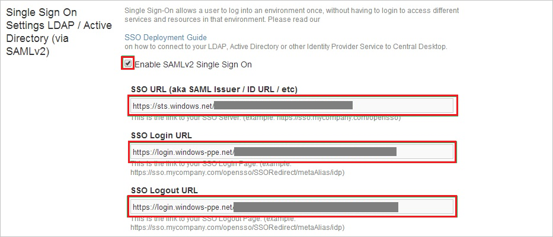
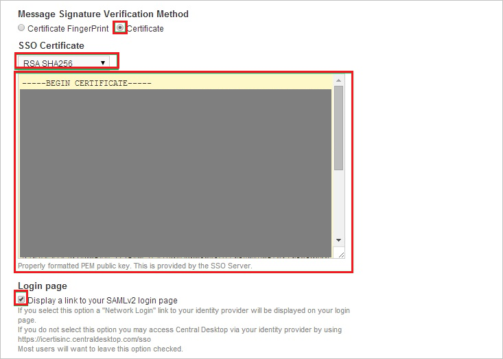
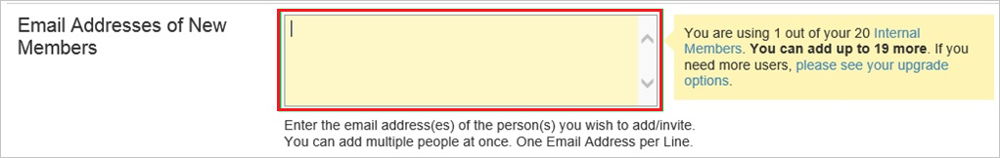

# Tutorial: Azure Active Directory integration with Central Desktop

In this tutorial, you learn how to integrate Central Desktop with Azure Active Directory (Azure AD).
Integrating Central Desktop with Azure AD provides you with the following benefits:

* You can control in Azure AD who has access to Central Desktop.
* You can enable your users to be automatically signed-in to Central Desktop (Single Sign-On) with their Azure AD accounts.
* You can manage your accounts in one central location - the Azure portal.

If you want to know more details about SaaS app integration with Azure AD, see [What is application access and single sign-on with Azure Active Directory](https://docs.microsoft.com/azure/active-directory/active-directory-appssoaccess-whatis).
If you don't have an Azure subscription, [create a free account](https://azure.microsoft.com/free/) before you begin.

## Prerequisites

To configure Azure AD integration with Central Desktop, you need the following items:

* An Azure AD subscription. If you don't have an Azure AD environment, you can get one-month trial [here](https://azure.microsoft.com/pricing/free-trial/)
* Central Desktop single sign-on enabled subscription

## Scenario description

In this tutorial, you configure and test Azure AD single sign-on in a test environment.

* Central Desktop supports **SP** initiated SSO

## Adding Central Desktop from the gallery

To configure the integration of Central Desktop into Azure AD, you need to add Central Desktop from the gallery to your list of managed SaaS apps.

**To add Central Desktop from the gallery, perform the following steps:**

1. In the **[Azure portal](https://portal.azure.com)**, on the left navigation panel, click **Azure Active Directory** icon.

	

2. Navigate to **Enterprise Applications** and then select the **All Applications** option.

	

3. To add new application, click **New application** button on the top of dialog.

	

4. In the search box, type **Central Desktop**, select **Central Desktop** from result panel then click **Add** button to add the application.

	 

## Configure and test Azure AD single sign-on

In this section, you configure and test Azure AD single sign-on with Central Desktop based on a test user called **Britta Simon**.
For single sign-on to work, a link relationship between an Azure AD user and the related user in Central Desktop needs to be established.

To configure and test Azure AD single sign-on with Central Desktop, you need to complete the following building blocks:

1. **[Configure Azure AD Single Sign-On](#configure-azure-ad-single-sign-on)** - to enable your users to use this feature.
2. **[Configure Central Desktop Single Sign-On](#configure-central-desktop-single-sign-on)** - to configure the Single Sign-On settings on application side.
3. **[Create an Azure AD test user](#create-an-azure-ad-test-user)** - to test Azure AD single sign-on with Britta Simon.
4. **[Assign the Azure AD test user](#assign-the-azure-ad-test-user)** - to enable Britta Simon to use Azure AD single sign-on.
5. **[Create Central Desktop test user](#create-central-desktop-test-user)** - to have a counterpart of Britta Simon in Central Desktop that is linked to the Azure AD representation of user.
6. **[Test single sign-on](#test-single-sign-on)** - to verify whether the configuration works.

### Configure Azure AD single sign-on

In this section, you enable Azure AD single sign-on in the Azure portal.

To configure Azure AD single sign-on with Central Desktop, perform the following steps:

1. In the [Azure portal](https://portal.azure.com/), on the **Central Desktop** application integration page, select **Single sign-on**.

    

2. On the **Select a Single sign-on method** dialog, select **SAML/WS-Fed** mode to enable single sign-on.

    

3. On the **Set up Single Sign-On with SAML** page, click **Edit** icon to open **Basic SAML Configuration** dialog.

	

4. On the **Basic SAML Configuration** section, perform the following steps:

    

    a. In the **Sign-on URL** text box, type a URL using the following pattern:
    `https://<companyname>.centraldesktop.com`

    b. In the **Identifier** box, type a URL using the following pattern:
	
    ```http
    https://<companyname>.centraldesktop.com/saml2-metadata.php
    https://<companyname>.imeetcentral.com/saml2-metadata.php
    ```

    c. In the **Reply URL** text box, type a URL using the following pattern:
    `https://<companyname>.centraldesktop.com/saml2-assertion.php`

	> [!NOTE]
	> These values are not real. Update these values with the actual Sign-On URL, Identifier and Reply URL. Contact [Central Desktop Client support team](https://imeetcentral.com/contact-us) to get these values. You can also refer to the patterns shown in the **Basic SAML Configuration** section in the Azure portal.

5. On the **Set up Single Sign-On with SAML** page, in the **SAML Signing Certificate** section, click **Download** to download the **Certificate (Raw)** from the given options as per your requirement and save it on your computer.

	

6. On the **Set up Central Desktop** section, copy the appropriate URL(s) as per your requirement.

	

	a. Login URL

	b. Azure Ad Identifier

	c. Logout URL

### Configure Central Desktop Single Sign-On

1. Sign in to your **Central Desktop** tenant.

2. Go to **Settings**. Select **Advanced**, and then select **Single Sign On**.

	

3. On the **Single Sign On Settings** page, take the following steps:

	

	a. Select **Enable SAML v2 Single Sign On**.

	b. In the **SSO URL** box, paste the **Azure Ad Identifier** value that you copied from the Azure portal.

	c. In the **SSO Login URL** box, paste the **Login URL** value that you copied from the Azure portal.

	d. In the **SSO Logout URL** box, paste the **Logout URL** value that you copied from the Azure portal.

4. In the **Message Signature Verification Method** section, take the following steps:

	
	
	a. Select **Certificate**.

	b. In the **SSO Certificate** list, select **RSH SHA256**.

	c. Open your downloaded certificate in Notepad. Then copy the content of certificate and paste it into the **SSO Certificate** field.

	d. Select **Display a link to your SAMLv2 login page**.

	e. Select **Update**.

### Create an Azure AD test user

The objective of this section is to create a test user in the Azure portal called Britta Simon.

1. In the Azure portal, in the left pane, select **Azure Active Directory**, select **Users**, and then select **All users**.

    

2. Select **New user** at the top of the screen.

    

3. In the User properties, perform the following steps.

    

    a. In the **Name** field enter **BrittaSimon**.
  
    b. In the **User name** field type **brittasimon\@yourcompanydomain.extension**  
    For example, BrittaSimon@contoso.com

    c. Select **Show password** check box, and then write down the value that's displayed in the Password box.

    d. Click **Create**.

### Assign the Azure AD test user

In this section, you enable Britta Simon to use Azure single sign-on by granting access to Central Desktop.

1. In the Azure portal, select **Enterprise Applications**, select **All applications**, then select **Central Desktop**.

	

2. In the applications list, select **Central Desktop**.

	

3. In the menu on the left, select **Users and groups**.

    

4. Click the **Add user** button, then select **Users and groups** in the **Add Assignment** dialog.

    

5. In the **Users and groups** dialog select **Britta Simon** in the Users list, then click the **Select** button at the bottom of the screen.

6. If you are expecting any role value in the SAML assertion then in the **Select Role** dialog select the appropriate role for the user from the list, then click the **Select** button at the bottom of the screen.

7. In the **Add Assignment** dialog click the **Assign** button.

### Create Central Desktop test user

For Azure AD users to be able to sign in, they must be provisioned in the Central Desktop application. This section describes how to create Azure AD user accounts in Central Desktop.

> [!NOTE]
> To provision Azure AD user accounts, you can use any other Central Desktop user account creation tools or APIs that are provided by Central Desktop.

**To provision user accounts to Central Desktop:**

1. Sign in to your Central Desktop tenant.

2. Select **People** and then select **Add Internal Members**.

	

3. In the **Email Address of New Members** box, type an Azure AD account that you want to provision, and then select **Next**.

	

4. Select **Add Internal member(s)**.

	
  
   > [!NOTE]
   > The users that you add receive an email that includes a confirmation link for activating their accounts.

### Test single sign-on

In this section, you test your Azure AD single sign-on configuration using the Access Panel.

When you click the Central Desktop tile in the Access Panel, you should be automatically signed in to the Central Desktop for which you set up SSO. For more information about the Access Panel, see [Introduction to the Access Panel](https://docs.microsoft.com/azure/active-directory/active-directory-saas-access-panel-introduction).

## Additional Resources

- [List of Tutorials on How to Integrate SaaS Apps with Azure Active Directory](https://docs.microsoft.com/azure/active-directory/active-directory-saas-tutorial-list)

- [What is application access and single sign-on with Azure Active Directory?](https://docs.microsoft.com/azure/active-directory/active-directory-appssoaccess-whatis)

- [What is Conditional Access in Azure Active Directory?](https://docs.microsoft.com/azure/active-directory/conditional-access/overview)
