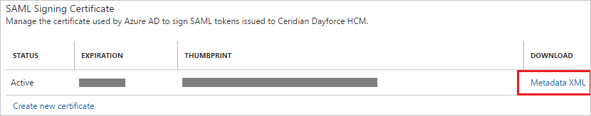

# Tutorial: Azure Active Directory integration with Ceridian Dayforce HCM

In this tutorial, you learn how to integrate Ceridian Dayforce HCM with Azure Active Directory (Azure AD).

Integrating Ceridian Dayforce HCM with Azure AD provides you with the following benefits:

- You can control in Azure AD who has access to Ceridian Dayforce HCM.
- You can enable your users to automatically get signed-on to Ceridian Dayforce HCM (Single Sign-On) with their Azure AD accounts.
- You can manage your accounts in one central location - the Azure portal.

If you want to know more details about SaaS app integration with Azure AD, see [what is application access and single sign-on with Azure Active Directory](../manage-apps/what-is-single-sign-on.md).

## Prerequisites

To configure Azure AD integration with Ceridian Dayforce HCM, you need the following items:

- An Azure AD subscription
- A Ceridian Dayforce HCM single-sign on enabled subscription

> [!NOTE]
> To test the steps in this tutorial, we do not recommend using a production environment.

To test the steps in this tutorial, you should follow these recommendations:

- Do not use your production environment, unless it is necessary.
- If you don't have an Azure AD trial environment, you can [get a one-month trial](https://azure.microsoft.com/pricing/free-trial/).

## Scenario description
In this tutorial, you test Azure AD single sign-on in a test environment. 
The scenario outlined in this tutorial consists of two main building blocks:

1. Adding Ceridian Dayforce HCM from the gallery
1. Configuring and testing Azure AD single sign-on

## Adding Ceridian Dayforce HCM from the gallery
To configure the integration of Ceridian Dayforce HCM into Azure AD, you need to add Ceridian Dayforce HCM from the gallery to your list of managed SaaS apps.

**To add Ceridian Dayforce HCM from the gallery, perform the following steps:**

1. In the **[Azure portal](https://portal.azure.com)**, on the left navigation panel, click **Azure Active Directory** icon. 

	![The Azure Active Directory button][1]

1. Navigate to **Enterprise applications**. Then go to **All applications**.

	![The Enterprise applications blade][2]
	
1. To add new application, click **New application** button on the top of dialog.

	![The New application button][3]

1. In the search box, type **Ceridian Dayforce HCM**, select **Ceridian Dayforce HCM** from result panel then click **Add** button to add the application.

	

## Configure and test Azure AD single sign-on

In this section, you configure and test Azure AD single sign-on with Ceridian Dayforce HCM based on a test user called "Britta Simon".

For single sign-on to work, Azure AD needs to know what the counterpart user in Ceridian Dayforce HCM is to a user in Azure AD. In other words, a link relationship between an Azure AD user and the related user in Ceridian Dayforce HCM needs to be established.

In Ceridian Dayforce HCM, assign the value of the **user name** in Azure AD as the value of the **Username** to establish the link relationship.

To configure and test Azure AD single sign-on with Ceridian Dayforce HCM, you need to complete the following building blocks:

1. **[Configure Azure AD Single Sign-On](#configure-azure-ad-single-sign-on)** - to enable your users to use this feature.
1. **[Create an Azure AD test user](#create-an-azure-ad-test-user)** - to test Azure AD single sign-on with Britta Simon.
1. **[Create a Ceridian Dayforce HCM test user](#create-a-ceridian-dayforce-hcm-test-user)** - to have a counterpart of Britta Simon in Ceridian Dayforce HCM that is linked to the Azure AD representation of user.
1. **[Assign the Azure AD test user](#assign-the-azure-ad-test-user)** - to enable Britta Simon to use Azure AD single sign-on.
1. **[Test single sign-on](#test-single-sign-on)** - to verify whether the configuration works.

### Configure Azure AD single sign-on

In this section, you enable Azure AD single sign-on in the Azure portal and configure single sign-on in your Ceridian Dayforce HCM application.

**To configure Azure AD single sign-on with Ceridian Dayforce HCM, perform the following steps:**

1. In the Azure portal, on the **Ceridian Dayforce HCM** application integration page, click **Single sign-on**.

	![Configure single sign-on link][4]

1. On the **Single sign-on** dialog, select **Mode** as	**SAML-based Sign-on** to enable single sign-on.
 
	

1. On the **Ceridian Dayforce HCM Domain and URLs** section, perform the following steps:

	
	
	a. In the **Sign On URL** textbox, type the URL used by your users to sign-on to your Ceridian Dayforce HCM application.
	
	| Environment | URL |
	| :-- | :-- |
	| For production | `https://sso.dayforcehcm.com/<DayforcehcmNamespace>` |
	| For test | `https://ssotest.dayforcehcm.com/<DayforcehcmNamespace>` |
	
	b. In the **Identifier** textbox, type a URL using the following pattern:
	
	| Environment | URL |
	| :-- | :-- |
	| For production | `https://ncpingfederate.dayforcehcm.com/sp` |
	| For test | `https://fs-test.dayforcehcm.com/sp` |
	
	c. In the **Reply URL** textbox, type the URL used by Azure AD to post the response.
	
	| Environment | URL |
	| :-- | :-- |
	| For production | `https://ncpingfederate.dayforcehcm.com/sp/ACS.saml2` |
	| For test | `https://fs-test.dayforcehcm.com/sp/ACS.saml2` |
	
	> [!NOTE] 
	> These values are not real. Update these values with the actual Identifier, Reply URL and Sign-On URL. Contact [Ceridian Dayforce HCM Client support team](https://www.ceridian.com/support) to get these values.

1. On the **SAML Signing Certificate** section, click **Metadata XML** and then save the metadata file on your computer.

	 

1. Your Ceridian Dayforce HCM application expects the SAML assertions in a specific format. Work with [Ceridian Dayforce HCM support team](https://www.ceridian.com/support) first to identify the correct user identifier. Microsoft recommends using the **"name"** attribute as user identifier. You can manage the values of these attributes from the **User Attributes** section on application integration page. The following screenshot shows an example for this.  

	

1. In the **User Attributes** section on the **Single sign-on** dialog, configure SAML token attribute as shown in the image above and perform the following steps:
	
	| Attribute Name  | Attribute Value |
	| --------------- | -------------------- |    
	| name  | user.extensionattribute2 |	

	a. Click **Add attribute** to open the **Add Attribute** dialog.

	

	
	
	b. In the **Name** textbox, type the attribute name shown for that row.

	c. In the **Value** list, select the user attribute you want to use for your implementation.
	For example, if you want to use the EmployeeID as unique user identifier and you have stored the attribute value in the ExtensionAttribute2, then select **user.extensionattribute2**.
	
	d. Click **Ok**.

1. Click **Save** button.

	
	
1. On the **Ceridian Dayforce HCM Configuration** section, click **Configure Ceridian Dayforce HCM** to open **Configure sign-on** window. Copy the **Sign-Out URL, SAML Entity ID, and SAML Single Sign-On Service URL** from the **Quick Reference section.**

	 

1. To configure single sign-on on **Ceridian Dayforce HCM** side, you need to send the downloaded **Metadata XML** and **Sign-Out URL, SAML Entity ID, and SAML Single Sign-On Service URL** to [Ceridian Dayforce HCM support team](https://www.ceridian.com/support).

> [!TIP]
> You can now read a concise version of these instructions inside the [Azure portal](https://portal.azure.com), while you are setting up the app!  After adding this app from the **Active Directory > Enterprise Applications** section, simply click the **Single Sign-On** tab and access the embedded documentation through the **Configuration** section at the bottom. You can read more about the embedded documentation feature here: [Azure AD embedded documentation]( https://go.microsoft.com/fwlink/?linkid=845985)

### Create an Azure AD test user

The objective of this section is to create a test user in the Azure portal called Britta Simon.

   ![Create an Azure AD test user][100]

**To create a test user in Azure AD, perform the following steps:**

1. In the Azure portal, in the left pane, click the **Azure Active Directory** button.

    

1. To display the list of users, go to **Users and groups**, and then click **All users**.

    

1. To open the **User** dialog box, click **Add** at the top of the **All Users** dialog box.

    

1. In the **User** dialog box, perform the following steps:

    

    a. In the **Name** box, type **BrittaSimon**.

    b. In the **User name** box, type the email address of user Britta Simon.

    c. Select the **Show Password** check box, and then write down the value that's displayed in the **Password** box.

    d. Click **Create**.
 
### Create a Ceridian Dayforce HCM test user

The objective of this section is to create a user called Britta Simon in Ceridian Dayforce HCM. Work with the [Ceridian Dayforce HCM support team](https://www.ceridian.com/support) to get users added in the Ceridian Dayforce HCM application. 

### Assigning the Azure AD test user

In this section, you enable Britta Simon to use Azure single sign-on by granting access to Ceridian Dayforce HCM.

![Assign User][200] 

**To assign Britta Simon to Ceridian Dayforce HCM, perform the following steps:**

1. In the Azure portal, open the applications view, and then navigate to the directory view and go to **Enterprise applications** then click **All applications**.

	![Assign User][201] 

1. In the applications list, select **Ceridian Dayforce HCM**.

	 

1. In the menu on the left, click **Users and groups**.

	![Assign User][202] 

1. Click **Add** button. Then select **Users and groups** on **Add Assignment** dialog.

	![Assign User][203]

1. On **Users and groups** dialog, select **Britta Simon** in the Users list.

1. Click **Select** button on **Users and groups** dialog.

1. Click **Assign** button on **Add Assignment** dialog.

### Assign the Azure AD test user

In this section, you enable Britta Simon to use Azure single sign-on by granting access to Ceridian Dayforce HCM.

![Assign the user role][200] 

**To assign Britta Simon to Ceridian Dayforce HCM, perform the following steps:**

1. In the Azure portal, open the applications view, and then navigate to the directory view and go to **Enterprise applications** then click **All applications**.

	![Assign User][201] 

1. In the applications list, select **Ceridian Dayforce HCM**.

	  

1. In the menu on the left, click **Users and groups**.

	![The "Users and groups" link][202]

1. Click **Add** button. Then select **Users and groups** on **Add Assignment** dialog.

	![The Add Assignment pane][203]

1. On **Users and groups** dialog, select **Britta Simon** in the Users list.

1. Click **Select** button on **Users and groups** dialog.

1. Click **Assign** button on **Add Assignment** dialog.
	
### Test single sign-on

The objective of this section is to test your Azure AD single sign-on configuration using the Access Panel.  
When you click the Ceridian Dayforce HCM tile in the Access Panel, you should get automatically signed-on to your Ceridian Dayforce HCM application. 

## Additional resources

* [List of Tutorials on How to Integrate SaaS Apps with Azure Active Directory](tutorial-list.md)
* [What is application access and single sign-on with Azure Active Directory?](../manage-apps/what-is-single-sign-on.md)

<!--Image references-->

[1]: ./media/ceridiandayforcehcm-tutorial/tutorial_general_01.png
[2]: ./media/ceridiandayforcehcm-tutorial/tutorial_general_02.png
[3]: ./media/ceridiandayforcehcm-tutorial/tutorial_general_03.png
[4]: ./media/ceridiandayforcehcm-tutorial/tutorial_general_04.png

[100]: ./media/ceridiandayforcehcm-tutorial/tutorial_general_100.png

[200]: ./media/ceridiandayforcehcm-tutorial/tutorial_general_200.png
[201]: ./media/ceridiandayforcehcm-tutorial/tutorial_general_201.png
[202]: ./media/ceridiandayforcehcm-tutorial/tutorial_general_202.png
[203]: ./media/ceridiandayforcehcm-tutorial/tutorial_general_203.png

