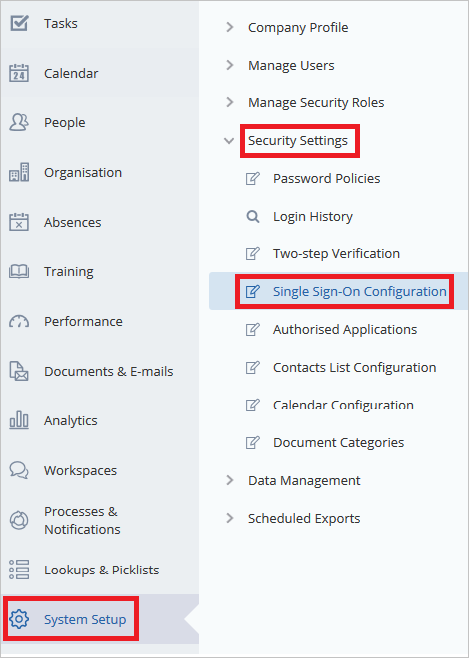
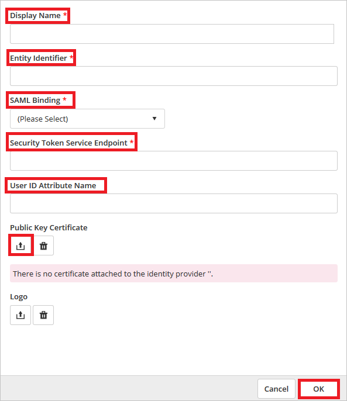
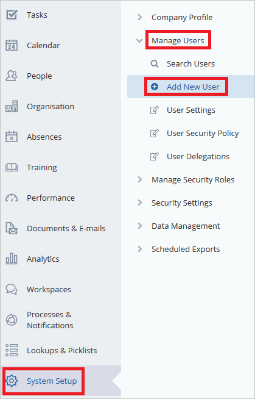
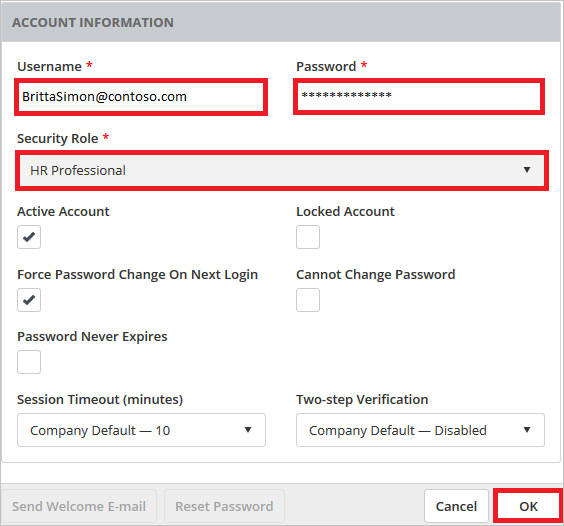
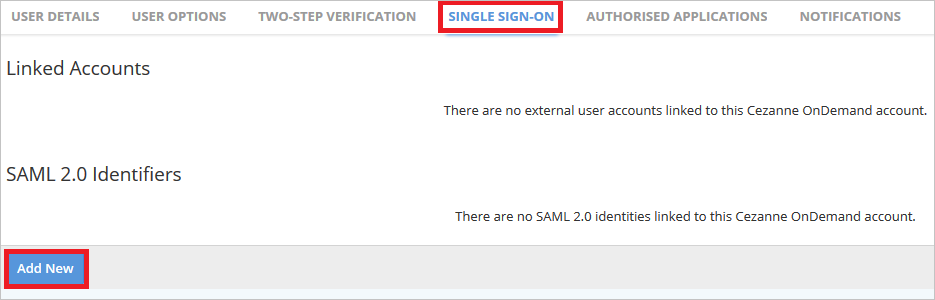
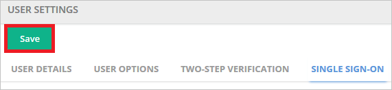

# Tutorial: Azure Active Directory integration with Cezanne HR Software

In this tutorial, you learn how to integrate Cezanne HR Software with Azure Active Directory (Azure AD).
Integrating Cezanne HR Software with Azure AD provides you with the following benefits:

* You can control in Azure AD who has access to Cezanne HR Software.
* You can enable your users to be automatically signed-in to Cezanne HR Software (Single Sign-On) with their Azure AD accounts.
* You can manage your accounts in one central location - the Azure portal.

If you want to know more details about SaaS app integration with Azure AD, see [What is application access and single sign-on with Azure Active Directory](https://docs.microsoft.com/azure/active-directory/active-directory-appssoaccess-whatis).
If you don't have an Azure subscription, [create a free account](https://azure.microsoft.com/free/) before you begin.

## Prerequisites

To configure Azure AD integration with Cezanne HR Software, you need the following items:

* An Azure AD subscription. If you don't have an Azure AD environment, you can get one-month trial [here](https://azure.microsoft.com/pricing/free-trial/)
* Cezanne HR Software single sign-on enabled subscription

## Scenario description

In this tutorial, you configure and test Azure AD single sign-on in a test environment.

* Cezanne HR Software supports **SP** initiated SSO

## Adding Cezanne HR Software from the gallery

To configure the integration of Cezanne HR Software into Azure AD, you need to add Cezanne HR Software from the gallery to your list of managed SaaS apps.

**To add Cezanne HR Software from the gallery, perform the following steps:**

1. In the **[Azure portal](https://portal.azure.com)**, on the left navigation panel, click **Azure Active Directory** icon.

	

2. Navigate to **Enterprise Applications** and then select the **All Applications** option.

	

3. To add new application, click **New application** button on the top of dialog.

	

4. In the search box, type **Cezanne HR Software**, select **Cezanne HR Software** from result panel then click **Add** button to add the application.

	

## Configure and test Azure AD single sign-on

In this section, you configure and test Azure AD single sign-on with Cezanne HR Software based on a test user called **Britta Simon**.
For single sign-on to work, a link relationship between an Azure AD user and the related user in Cezanne HR Software needs to be established.

To configure and test Azure AD single sign-on with Cezanne HR Software, you need to complete the following building blocks:

1. **[Configure Azure AD Single Sign-On](#configure-azure-ad-single-sign-on)** - to enable your users to use this feature.
2. **[Configure Cezanne HR Software Single Sign-On](#configure-cezanne-hr-software-single-sign-on)** - to configure the Single Sign-On settings on application side.
3. **[Create an Azure AD test user](#create-an-azure-ad-test-user)** - to test Azure AD single sign-on with Britta Simon.
4. **[Assign the Azure AD test user](#assign-the-azure-ad-test-user)** - to enable Britta Simon to use Azure AD single sign-on.
5. **[Create Cezanne HR Software test user](#create-cezanne-hr-software-test-user)** - to have a counterpart of Britta Simon in Cezanne HR Software that is linked to the Azure AD representation of user.
6. **[Test single sign-on](#test-single-sign-on)** - to verify whether the configuration works.

### Configure Azure AD single sign-on

In this section, you enable Azure AD single sign-on in the Azure portal.

To configure Azure AD single sign-on with Cezanne HR Software, perform the following steps:

1. In the [Azure portal](https://portal.azure.com/), on the **Cezanne HR Software** application integration page, select **Single sign-on**.

    

2. On the **Select a Single sign-on method** dialog, select **SAML/WS-Fed** mode to enable single sign-on.

    

3. On the **Set up Single Sign-On with SAML** page, click **Edit** icon to open **Basic SAML Configuration** dialog.

	

4. On the **Basic SAML Configuration** section, perform the following steps:

    

	a. In the **Sign on URL** text box, type a URL using the following pattern:
    `https://w3.cezanneondemand.com/CezanneOnDemand/-/<tenantidentifier>`

    b. In the **Identifier (Entity ID)** text box, type the URL:
    `https://w3.cezanneondemand.com/CezanneOnDemand/`

	c. In the **Reply URL** textbox, type a URL using the following pattern: `https://w3.cezanneondemand.com:443/cezanneondemand/-/<tenantidentifier>/Saml/samlp`
	
	> [!NOTE]
	> These values are not real. Update these values with the actual Sign-On URL and Reply URL. Contact [Cezanne HR Software Client support team](https://cezannehr.com/services/support/) to get these values.

5. On the **Set up Single Sign-On with SAML** page, in the **SAML Signing Certificate** section, click **Download** to download the **Certificate (Base64)** from the given options as per your requirement and save it on your computer.

	

6. On the **Set up Cezanne HR Software** section, copy the appropriate URL(s) as per your requirement.

	

	a. Login URL

	b. Azure Ad Identifier

	c. Logout URL

### Configure Cezanne HR Software Single Sign-On

1. In a different web browser window, sign-on to your Cezanne HR Software tenant as an administrator.

2. On the left navigation pane, click **System Setup**. Go to **Security Settings**. Then navigate to **Single Sign-On Configuration**.

	

3. In the **Allow users to log in using the following Single Sign-On (SSO) Service** panel, check the **SAML 2.0** box and select the **Advanced Configuration** option.

	

4. Click **Add New** button.

	

5. Perform the following steps on **SAML 2.0 IDENTITY PROVIDERS** section.

	

	a. Enter the name of your Identity Provider as the **Display Name**.

	b. In the **Entity Identifier** textbox, paste the value of **Azure Ad Identifier** which you have copied from the Azure portal.

	c. Change the **SAML Binding** to 'POST'.

	d. In the **Security Token Service Endpoint** textbox, paste the value of **Login URL** which you have copied from the Azure portal.

	e. In the User ID Attribute Name textbox, enter `http://schemas.xmlsoap.org/ws/2005/05/identity/claims/name`.

	f. Click **Upload** icon to upload the downloaded certificate from Azure portal.

	g. Click the **Ok** button.

6. Click **Save** button.

	

### Create an Azure AD test user

The objective of this section is to create a test user in the Azure portal called Britta Simon.

1. In the Azure portal, in the left pane, select **Azure Active Directory**, select **Users**, and then select **All users**.

    

2. Select **New user** at the top of the screen.

    

3. In the User properties, perform the following steps.

    

    a. In the **Name** field enter **BrittaSimon**.
  
    b. In the **User name** field type **brittasimon\@yourcompanydomain.extension**  
    For example, BrittaSimon@contoso.com

    c. Select **Show password** check box, and then write down the value that's displayed in the Password box.

    d. Click **Create**.

### Assign the Azure AD test user

In this section, you enable Britta Simon to use Azure single sign-on by granting access to Cezanne HR Software.

1. In the Azure portal, select **Enterprise Applications**, select **All applications**, then select **Cezanne HR Software**.

	

2. In the applications list, select **Cezanne HR Software**.

	

3. In the menu on the left, select **Users and groups**.

    

4. Click the **Add user** button, then select **Users and groups** in the **Add Assignment** dialog.

    

5. In the **Users and groups** dialog select **Britta Simon** in the Users list, then click the **Select** button at the bottom of the screen.

6. If you are expecting any role value in the SAML assertion then in the **Select Role** dialog select the appropriate role for the user from the list, then click the **Select** button at the bottom of the screen.

7. In the **Add Assignment** dialog click the **Assign** button.

### Create Cezanne HR Software test user

In order to enable Azure AD users to log into Cezanne HR Software, they must be provisioned into Cezanne HR Software. In the case of Cezanne HR Software, provisioning is a manual task.

**To provision a user account, perform the following steps:**

1. Log into your Cezanne HR Software company site as an administrator.

2. On the left navigation pane, click **System Setup**. Go to **Manage Users**. Then navigate to **Add New User**.

    

3. On **PERSON DETAILS** section, perform below steps:

    

	a. Set **Internal User** as OFF.

	b. In the **First Name** textbox, type the First Name of user like **Britta**.  

	c. In the **Last Name** textbox, type the last Name of user like **Simon**.

	d. In the **E-mail** textbox, type the email address of user like Brittasimon@contoso.com.

4. On **Account Information** section, perform below steps:

    

	a. In the **Username** textbox, type the email of user like Brittasimon@contoso.com.

	b. In the **Password** textbox, type the password of user.

	c. Select **HR Professional** as **Security Role**.

	d. Click **OK**.

5. Navigate to **Single Sign-On** tab and select **Add New** in the **SAML 2.0 Identifiers** area.

	

6. Choose your Identity Provider for the **Identity Provider** and in the text box of **User Identifier**, enter the email address of Britta Simon account.

	

7. Click **Save** button.

	

### Test single sign-on

In this section, you test your Azure AD single sign-on configuration using the Access Panel.

When you click the Cezanne HR Software tile in the Access Panel, you should be automatically signed in to the Cezanne HR Software for which you set up SSO. For more information about the Access Panel, see [Introduction to the Access Panel](https://docs.microsoft.com/azure/active-directory/active-directory-saas-access-panel-introduction).

## Additional Resources

- [List of Tutorials on How to Integrate SaaS Apps with Azure Active Directory](https://docs.microsoft.com/azure/active-directory/active-directory-saas-tutorial-list)

- [What is application access and single sign-on with Azure Active Directory?](https://docs.microsoft.com/azure/active-directory/active-directory-appssoaccess-whatis)

- [What is Conditional Access in Azure Active Directory?](https://docs.microsoft.com/azure/active-directory/conditional-access/overview)
