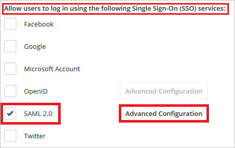
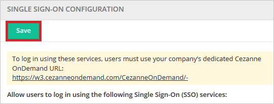
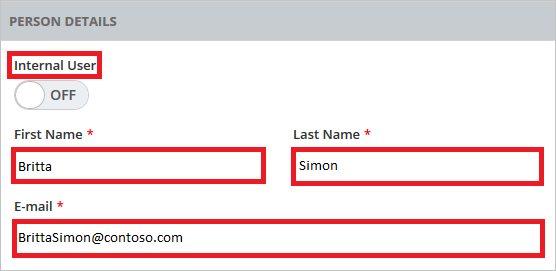
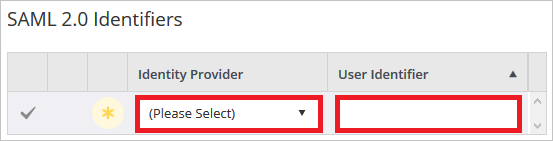

# Tutorial: Microsoft Entra integration with Cezanne HR Software

In this tutorial, you'll learn how to integrate Cezanne HR Software with Microsoft Entra ID. When you integrate Cezanne HR Software with Microsoft Entra ID, you can:

* Control in Microsoft Entra ID who has access to Cezanne HR Software.
* Enable your users to be automatically signed-in to Cezanne HR Software with their Microsoft Entra accounts.
* Manage your accounts in one central location.

## Prerequisites

To get started, you need the following items:

* A Microsoft Entra subscription. If you don't have a subscription, you can get a [free account](https://azure.microsoft.com/free/).
* Cezanne HR Software single sign-on (SSO) enabled subscription.

## Scenario description

In this tutorial, you configure and test Microsoft Entra single sign-on in a test environment.

* Cezanne HR Software supports **SP** initiated SSO.

> [!NOTE]
> Identifier of this application is a fixed string value so only one instance can be configured in one tenant.

## Add Cezanne HR Software from the gallery

To configure the integration of Cezanne HR Software into Microsoft Entra ID, you need to add Cezanne HR Software from the gallery to your list of managed SaaS apps.

1. Sign in to the [Microsoft Entra admin center](https://entra.microsoft.com) as at least a [Cloud Application Administrator](../roles/permissions-reference.md#cloud-application-administrator).
1. Browse to **Identity** > **Applications** > **Enterprise applications** > **New application**.
1. In the **Add from the gallery** section, type **Cezanne HR Software** in the search box.
1. Select **Cezanne HR Software** from results panel and then add the app. Wait a few seconds while the app is added to your tenant.

 Alternatively, you can also use the [Enterprise App Configuration Wizard](https://portal.office.com/AdminPortal/home?Q=Docs#/azureadappintegration). In this wizard, you can add an application to your tenant, add users/groups to the app, assign roles, as well as walk through the SSO configuration as well. [Learn more about Microsoft 365 wizards.](/microsoft-365/admin/misc/azure-ad-setup-guides)

## Configure and test Microsoft Entra SSO for Cezanne HR Software

Configure and test Microsoft Entra SSO with Cezanne HR Software using a test user called **B.Simon**. For SSO to work, you need to establish a link relationship between a Microsoft Entra user and the related user in Cezanne HR Software.

To configure and test Microsoft Entra SSO with Cezanne HR Software, perform the following steps:

1. **[Configure Microsoft Entra SSO](#configure-azure-ad-sso)** - to enable your users to use this feature.
    1. **[Create a Microsoft Entra test user](#create-an-azure-ad-test-user)** - to test Microsoft Entra single sign-on with B.Simon.
    1. **[Assign the Microsoft Entra test user](#assign-the-azure-ad-test-user)** - to enable B.Simon to use Microsoft Entra single sign-on.
1. **[Configure Cezanne HR Software SSO](#configure-cezanne-hr-software-sso)** - to configure the single sign-on settings on application side.
    1. **[Create Cezanne HR Software test user](#create-cezanne-hr-software-test-user)** - to have a counterpart of B.Simon in Cezanne HR Software that is linked to the Microsoft Entra representation of user.
1. **[Test SSO](#test-sso)** - to verify whether the configuration works.

## Configure Microsoft Entra SSO

Follow these steps to enable Microsoft Entra SSO.

1. Sign in to the [Microsoft Entra admin center](https://entra.microsoft.com) as at least a [Cloud Application Administrator](../roles/permissions-reference.md#cloud-application-administrator).
1. Browse to **Identity** > **Applications** > **Enterprise applications** > **Cezanne HR Software** > **Single sign-on**.
1. On the **Select a single sign-on method** page, select **SAML**.
1. On the **Set up single sign-on with SAML** page, click the pencil icon for **Basic SAML Configuration** to edit the settings.

   

1. On the **Basic SAML Configuration** section, perform the following steps:

	a. In the **Sign on URL** text box, type a URL using the following pattern:
    `https://w3.cezanneondemand.com/CezanneOnDemand/-/<tenantidentifier>`

    b. In the **Identifier (Entity ID)** text box, type the URL:
    `https://w3.cezanneondemand.com/CezanneOnDemand/`

	c. In the **Reply URL** textbox, type a URL using the following pattern: `https://w3.cezanneondemand.com:443/cezanneondemand/-/<tenantidentifier>/Saml/samlp`
	
	> [!NOTE]
	> These values are not real. Update these values with the actual Sign-On URL and Reply URL. Contact [Cezanne HR Software Client support team](https://cezannehr.com/services/support/) to get these values.

1. On the **Set up Single Sign-On with SAML** page, in the **SAML Signing Certificate** section, click **Download** to download the **Certificate (Base64)** from the given options as per your requirement and save it on your computer.

	

1. On the **Set up Cezanne HR Software** section, copy the appropriate URL(s) as per your requirement.

	

### Create a Microsoft Entra test user

In this section, you'll create a test user called B.Simon.

1. Sign in to the [Microsoft Entra admin center](https://entra.microsoft.com) as at least a [User Administrator](../roles/permissions-reference.md#user-administrator).
1. Browse to **Identity** > **Users** > **All users**.
1. Select **New user** > **Create new user**, at the top of the screen.
1. In the **User** properties, follow these steps:
   1. In the **Display name** field, enter `B.Simon`.  
   1. In the **User principal name** field, enter the username@companydomain.extension. For example, `B.Simon@contoso.com`.
   1. Select the **Show password** check box, and then write down the value that's displayed in the **Password** box.
   1. Select **Review + create**.
1. Select **Create**.

### Assign the Microsoft Entra test user

In this section, you'll enable B.Simon to use single sign-on by granting access to Cezanne HR Software.

1. Sign in to the [Microsoft Entra admin center](https://entra.microsoft.com) as at least a [Cloud Application Administrator](../roles/permissions-reference.md#cloud-application-administrator).
1. Browse to **Identity** > **Applications** > **Enterprise applications** > **Cezanne HR Software**.
1. In the app's overview page, select **Users and groups**.
1. Select **Add user/group**, then select **Users and groups** in the **Add Assignment** dialog.
   1. In the **Users and groups** dialog, select **B.Simon** from the Users list, then click the **Select** button at the bottom of the screen.
   1. If you are expecting a role to be assigned to the users, you can select it from the **Select a role** dropdown. If no role has been set up for this app, you see "Default Access" role selected.
   1. In the **Add Assignment** dialog, click the **Assign** button.

## Configure Cezanne HR Software SSO

1. In a different web browser window, sign-on to your Cezanne HR Software tenant as an administrator.

2. On the side menu, click **Administration**. Then navigate to **Security Settings** and click on **Single Sign-On**.

	

3. In the **Allow users to log in using the following Single Sign-On (SSO) Service** panel, check the **SAML 2.0** box and select the **Advanced Configuration** option.

	

4. Click **Add New** button.

	

5. Enter the following fields on **SAML 2.0 IDENTITY PROVIDERS** section and click **OK**.

	

	a. **Display Name** - Enter the name of your Identity Provider as the Display Name..

	b. **Entity Identifier** - In the Entity Identifier textbox, paste the value of Microsoft Entra Identifier which you copied previously.

	c. **SAML Binding** - Change the SAML Binding to 'POST'.

	d. **Security Token Service Endpoint** - In the Security Token Service Endpoint textbox, paste the value of Login URL which you copied previously.

	e. **User ID Attribute Name** - In the User ID Attribute Name textbox, enter 'http://schemas.xmlsoap.org/ws/2005/05/identity/claims/emailaddress'.

	f. **Public Key Certificate** - Click Upload icon to upload the downloaded certificate from Azure portal.

6. Click OK.

7. Click Save button. 

	

### Create Cezanne HR Software test user

In order to enable Microsoft Entra users to log into Cezanne HR Software, they must be provisioned into Cezanne HR Software. In the case of Cezanne HR Software, provisioning is a manual task.

**To provision a user account, perform the following steps:**

1. Log into your Cezanne HR Software company site as an administrator.

2. On the side menu, click **Administration**. Then navigate to **Users** and click **Add New User**

    

3. On **PERSON DETAILS** section, perform below steps:

    

	a. Set **Internal User** as OFF.

	b. Enter First Name   

	c. Enter Last Name

	d. Enter E-mail Address.

4. On **Account Information** section, perform below steps:

    

	a. In the **Username** textbox, type the email of user like Brittasimon@contoso.com.

	b. In the **Password** textbox, type the password of user.

	c. Select **HR Professional** as **Security Role**.

	d. Click **OK**.
	

5. Navigate to **Single Sign-On** tab and select **Add New** in the **SAML 2.0 Identifiers** area.

	

6. Choose your Identity Provider for the **Identity Provider** and in the text box of **User Identifier**, enter the user email address.

	

7. Click **Save** button.

	

## Test SSO

In this section, you test your Microsoft Entra single sign-on configuration with following options. 

* Click on **Test this application**, this will redirect to Cezanne HR Software Sign-on URL where you can initiate the login flow. 

* Go to Cezanne HR Software Sign-on URL directly and initiate the login flow from there.

* You can use Microsoft My Apps. When you click the Cezanne HR Software tile in the My Apps, this will redirect to Cezanne HR Software Sign-on URL. For more information about the My Apps, see [Introduction to the My Apps](https://support.microsoft.com/account-billing/sign-in-and-start-apps-from-the-my-apps-portal-2f3b1bae-0e5a-4a86-a33e-876fbd2a4510).

## Next steps

Once you configure Cezanne HR Software you can enforce session control, which protects exfiltration and infiltration of your organization’s sensitive data in real time. Session control extends from Conditional Access. [Learn how to enforce session control with Microsoft Defender for Cloud Apps](/cloud-app-security/proxy-deployment-aad).
