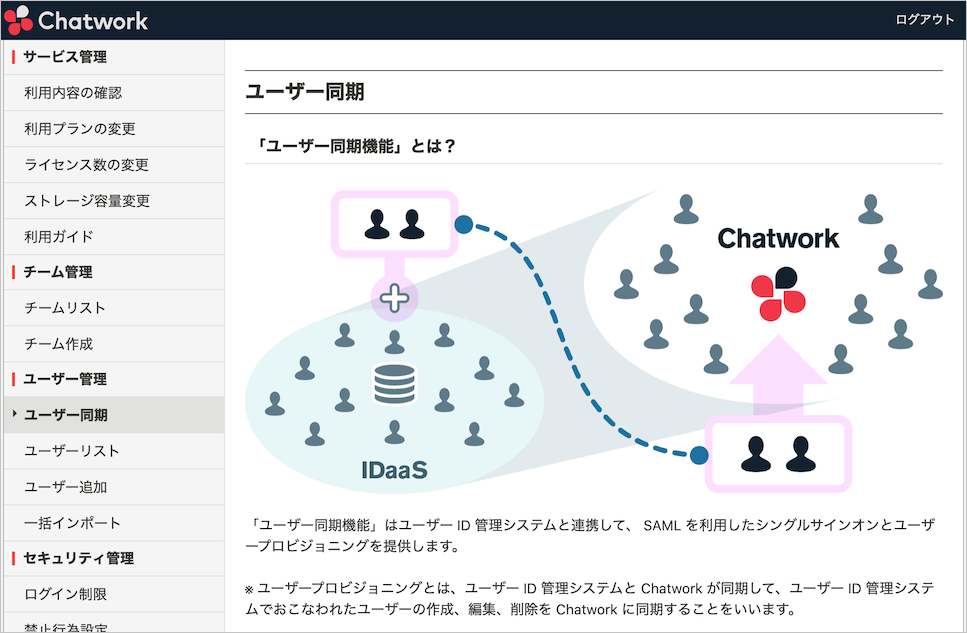
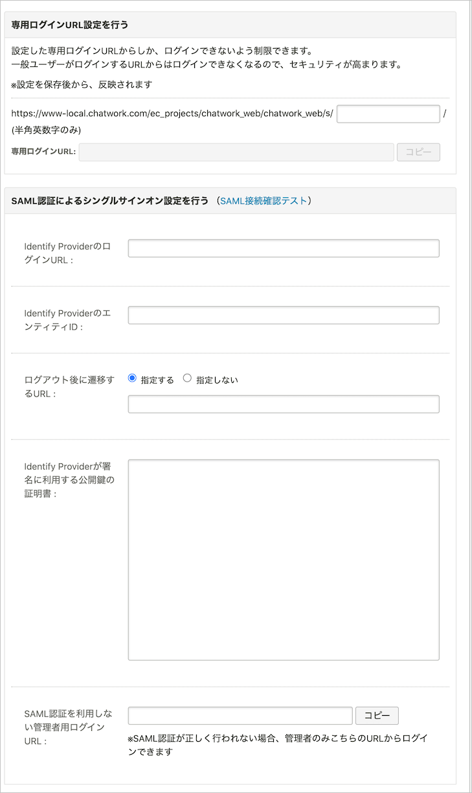
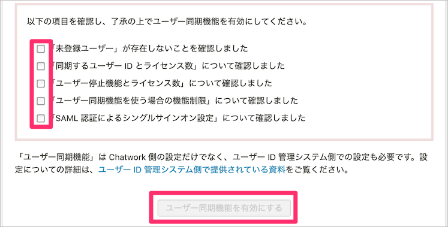
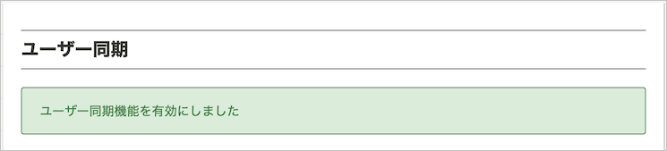
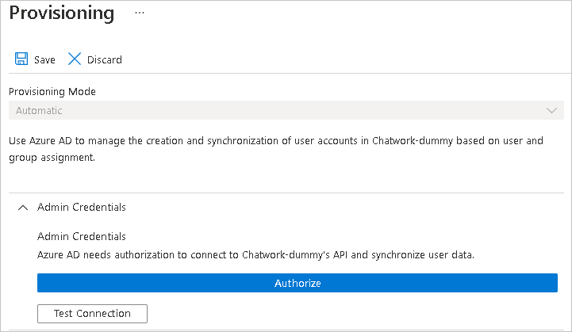

# Tutorial: Configure Chatwork for automatic user provisioning

This tutorial describes the steps you need to perform in both Chatwork and Azure Active Directory (Azure AD) to configure automatic user provisioning. When configured, Azure AD automatically provisions and de-provisions users and groups to [Chatwork](https://corp.chatwork.com/) using the Azure AD Provisioning service. For important details on what this service does, how it works, and frequently asked questions, see [Automate user provisioning and deprovisioning to SaaS applications with Azure Active Directory](../app-provisioning/user-provisioning.md). 

## Capabilities Supported
> [!div class="checklist"]
> * Create users in Chatwork.
> * Remove users in Chatwork when they do not require access anymore.
> * Keep user attributes synchronized between Azure AD and Chatwork.
> * [Single sign-on](chatwork-tutorial.md) to Chatwork (required).

## Prerequisites

The scenario outlined in this tutorial assumes that you already have the following prerequisites:

* [An Azure AD tenant](../develop/quickstart-create-new-tenant.md). 
* A user account in Azure AD with [permission](../roles/permissions-reference.md) to configure provisioning (for example, Application Administrator, Cloud Application administrator, Application Owner, or Global Administrator). 
* A [Chatwork](https://corp.chatwork.com/) tenant.
* A user account in Chatwork with Admin permission.
* Organizations that have contracted Chatwork Enterprise Plan or KDDI Chatwork.

## Step 1. Plan your provisioning deployment
1. Learn about [how the provisioning service works](../app-provisioning/user-provisioning.md).
1. Determine who will be in [scope for provisioning](../app-provisioning/define-conditional-rules-for-provisioning-user-accounts.md).
1. Determine what data to [map between Azure AD and Chatwork](../app-provisioning/customize-application-attributes.md). 

## Step 2. Configure Chatwork to support provisioning with Azure AD

### 1. Open User Provisioning from the Chatwork admin page

Access the Chatwork admin screen as a user with admin rights. If you have administrator privileges, you will be able to access the User Provisioning page.

The User Provisioning page contains notes and restrictions for using the user provisioning feature. Check all the items.

### 2. Configure the SAML login settings.

If you are using Azure AD and user provisioning, you will use your Azure AD ID to log in to Chatwork.

If you are using Azure AD and user provisioning, login to Chatwork using your Azure AD ID. 

### 3. Check the checkboxes after accepting the various items.

Check the checkboxes after accepting the cautions and restrictions for using the user provisioning function.

When all the items are checked, click the "Enable User Provisioning" button.

When the user provisioning function is enabled, a message will appear at the top of the page indicating that it has been enabled.

## Step 3. Add Chatwork from the Azure AD application gallery

Add Chatwork from the Azure AD application gallery to start managing provisioning to Chatwork. If you have previously setup Chatwork for SSO, you can use the same application. However it is recommended that you create a separate app when testing out the integration initially. Learn more about adding an application from the gallery [here](../manage-apps/add-application-portal.md).

## Step 4. Define who will be in scope for provisioning 

The Azure AD provisioning service allows you to scope who will be provisioned based on assignment to the application and or based on attributes of the user / group. If you choose to scope who will be provisioned to your app based on assignment, you can use the following [steps](../manage-apps/assign-user-or-group-access-portal.md) to assign users and groups to the application. If you choose to scope who will be provisioned based solely on attributes of the user or group, you can use a scoping filter as described [here](../app-provisioning/define-conditional-rules-for-provisioning-user-accounts.md). 

* When assigning users and groups to Chatwork, you must select a role other than **Default Access**. Users with the Default Access role are excluded from provisioning and will be marked as not effectively entitled in the provisioning logs. If the only role available on the application is the default access role, you can [update the application manifest](../develop/howto-add-app-roles-in-azure-ad-apps.md) to add other roles. 

* Start small. Test with a small set of users and groups before rolling out to everyone. When scope for provisioning is set to assigned users and groups, you can control this by assigning one or two users or groups to the app. When scope is set to all users and groups, you can specify an [attribute based scoping filter](../app-provisioning/define-conditional-rules-for-provisioning-user-accounts.md). 

## Step 5. Configure automatic user provisioning to Chatwork 

This section guides you through the steps to configure the Azure AD provisioning service to create, update, and disable users and/or groups in Chatwork based on user and/or group assignments in Azure AD.

### To configure automatic user provisioning for Chatwork in Azure AD:

1. Sign in to the [Azure portal](https://portal.azure.com). Select **Enterprise Applications**, then select **All applications**.

	

1. In the applications list, select **Chatwork**.

	

1. Select the **Provisioning** tab.

	

1. Set the **Provisioning Mode** to **Automatic**.

	

1. In the **Admin Credentials** section, click on Authorize, make sure that you enter your Chatwork account's Admin credentials.. Click **Test Connection** to ensure Azure AD can connect to Chatwork. If the connection fails, ensure your Chatwork account has Admin permissions and try again.

   
1. In the **Notification Email** field, enter the email address of a person or group who should receive the provisioning error notifications and select the **Send an email notification when a failure occurs** check box.

	

1. Select **Save**.

1. In the **Mappings** section, select **Synchronize Azure Active Directory Users to Chatwork**.

1. Review the user attributes that are synchronized from Azure AD to Chatwork in the **Attribute-Mapping** section. The attributes selected as **Matching** properties are used to match the user accounts in Chatwork for update operations. If you choose to change the [matching target attribute](../app-provisioning/customize-application-attributes.md), you will need to ensure that the Chatwork API supports filtering users based on that attribute. Select the **Save** button to commit any changes.

   |Attribute|Type|Supported for filtering|
   |---|---|---|
   |userName|String|&check;
   |active|Boolean|   
   |title|String|
   |externalId|String|
   |urn:ietf:params:scim:schemas:extension:enterprise:2.0:User:department|String|
   |urn:ietf:params:scim:schemas:extension:enterprise:2.0:User:organization|String|

1. To configure scoping filters, refer to the following instructions provided in the [Scoping filter tutorial](../app-provisioning/define-conditional-rules-for-provisioning-user-accounts.md).

1. To enable the Azure AD provisioning service for Chatwork, change the **Provisioning Status** to **On** in the **Settings** section.

	

1. Define the users and/or groups that you would like to provision to Chatwork by choosing the desired values in **Scope** in the **Settings** section.

	

1. When you are ready to provision, click **Save**.

	

This operation starts the initial synchronization cycle of all users and groups defined in **Scope** in the **Settings** section. The initial cycle takes longer to perform than subsequent cycles, which occur approximately every 40 minutes as long as the Azure AD provisioning service is running. 

## Step 6. Monitor your deployment
Once you've configured provisioning, use the following resources to monitor your deployment:

* Use the [provisioning logs](../reports-monitoring/concept-provisioning-logs.md) to determine which users have been provisioned successfully or unsuccessfully
* Check the [progress bar](../app-provisioning/application-provisioning-when-will-provisioning-finish-specific-user.md) to see the status of the provisioning cycle and how close it is to completion
* If the provisioning configuration seems to be in an unhealthy state, the application will go into quarantine. Learn more about quarantine states [here](../app-provisioning/application-provisioning-quarantine-status.md).  

## More resources

* [Managing user account provisioning for Enterprise Apps](../app-provisioning/configure-automatic-user-provisioning-portal.md)
* [What is application access and single sign-on with Azure Active Directory?](../manage-apps/what-is-single-sign-on.md)

## Next steps

* [Learn how to review logs and get reports on provisioning activity](../app-provisioning/check-status-user-account-provisioning.md)