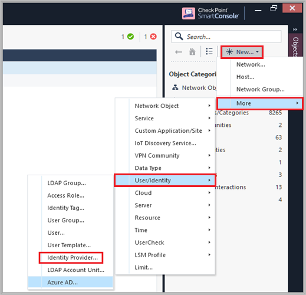
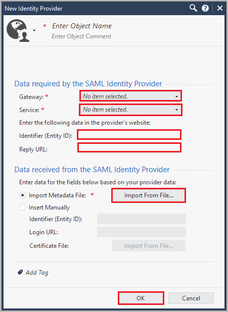
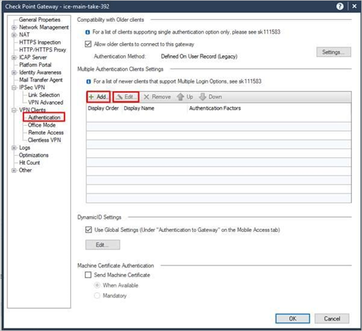
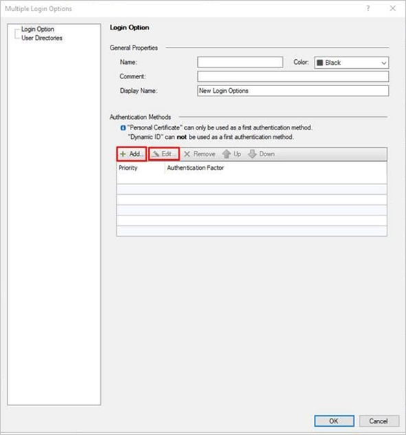
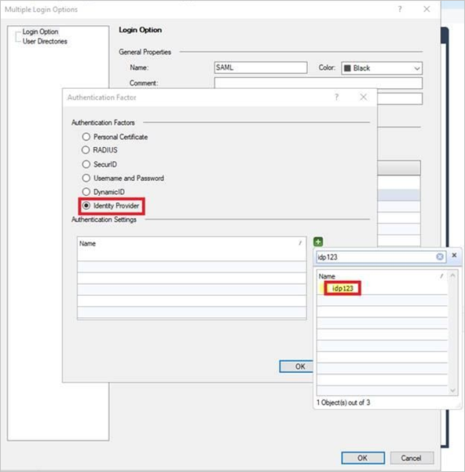
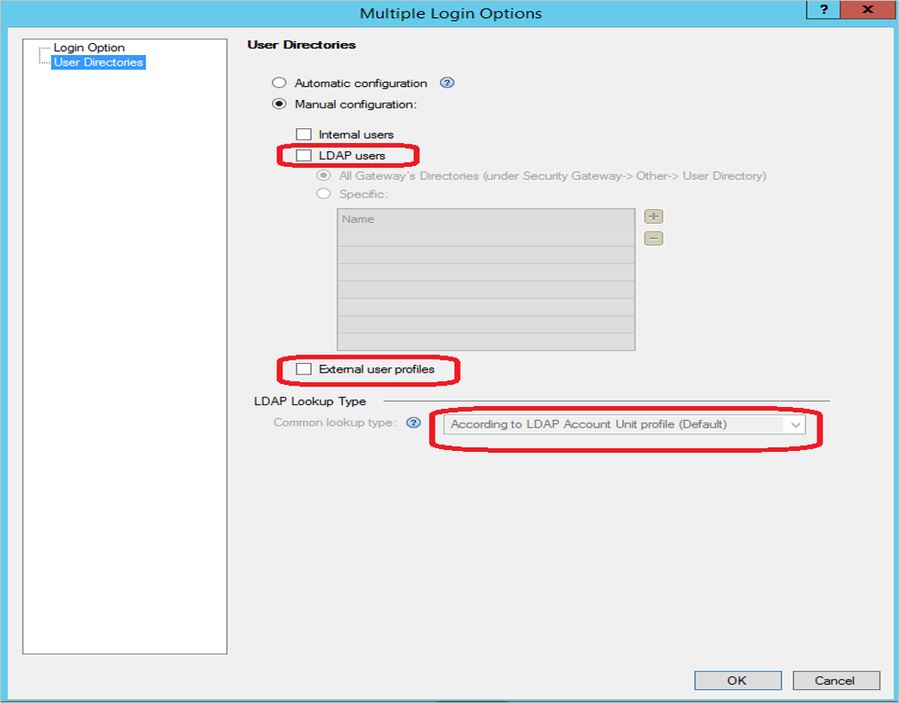
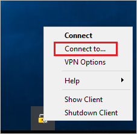
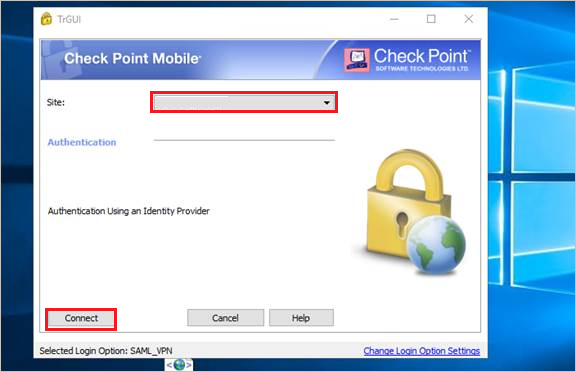

# Tutorial: Microsoft Entra single sign-on (SSO) integration with Check Point Remote Secure Access VPN

In this tutorial, you'll learn how to integrate Check Point Remote Secure Access VPN with Microsoft Entra ID. When you integrate Check Point Remote Secure Access VPN with Microsoft Entra ID, you can:

* Control in Microsoft Entra ID who has access to Check Point Remote Secure Access VPN.
* Enable your users to be automatically signed-in to Check Point Remote Secure Access VPN with their Microsoft Entra accounts.
* Manage your accounts in one central location.

## Prerequisites

To get started, you need the following items:

* A Microsoft Entra subscription. If you don't have a subscription, you can get a [free account](https://azure.microsoft.com/free/).
* Check Point Remote Secure Access VPN single sign-on (SSO) enabled subscription.

## Scenario description

In this tutorial, you configure and test Microsoft Entra SSO in a test environment.

* Check Point Remote Secure Access VPN supports **SP** initiated SSO.

## Adding Check Point Remote Secure Access VPN from the gallery

To configure the integration of Check Point Remote Secure Access VPN into Microsoft Entra ID, you need to add Check Point Remote Secure Access VPN from the gallery to your list of managed SaaS apps.

1. Sign in to the [Microsoft Entra admin center](https://entra.microsoft.com) as at least a [Cloud Application Administrator](../roles/permissions-reference.md#cloud-application-administrator).
1. Browse to **Identity** > **Applications** > **Enterprise applications** > **New application**.
1. In the **Add from the gallery** section, type **Check Point Remote Secure Access VPN** in the search box.
1. Select **Check Point Remote Secure Access VPN** from results panel and then add the app. Wait a few seconds while the app is added to your tenant.

 Alternatively, you can also use the [Enterprise App Configuration Wizard](https://portal.office.com/AdminPortal/home?Q=Docs#/azureadappintegration). In this wizard, you can add an application to your tenant, add users/groups to the app, assign roles, as well as walk through the SSO configuration as well. [Learn more about Microsoft 365 wizards.](/microsoft-365/admin/misc/azure-ad-setup-guides)

## Configure and test Microsoft Entra SSO for Check Point Remote Secure Access VPN

Configure and test Microsoft Entra SSO with Check Point Remote Secure Access VPN using a test user called **B.Simon**. For SSO to work, you need to establish a link relationship between a Microsoft Entra user and the related user in Check Point Remote Secure Access VPN.

To configure and test Microsoft Entra SSO with Check Point Remote Secure Access VPN, perform the following steps:

1. **[Configure Microsoft Entra SSO](#configure-azure-ad-sso)** - to enable your users to use this feature.
    1. **[Create a Microsoft Entra test user](#create-an-azure-ad-test-user)** - to test Microsoft Entra single sign-on with B.Simon.
    1. **[Assign the Microsoft Entra test user](#assign-the-azure-ad-test-user)** - to enable B.Simon to use Microsoft Entra single sign-on.
1. **[Configure Check Point Remote Secure Access VPN SSO](#configure-check-point-remote-secure-access-vpn-sso)** - to enable your users to use this feature.

    1. **[Create Check Point Remote Secure Access VPN test user](#create-check-point-remote-secure-access-vpn-test-user)** - to have a counterpart of B.Simon in Check Point Remote Secure Access VPN that is linked to the Microsoft Entra representation of user.
1. **[Test SSO](#test-sso)** - to verify whether the configuration works.

## Configure Microsoft Entra SSO

Follow these steps to enable Microsoft Entra SSO.

1. Sign in to the [Microsoft Entra admin center](https://entra.microsoft.com) as at least a [Cloud Application Administrator](../roles/permissions-reference.md#cloud-application-administrator).
1. Browse to **Identity** > **Applications** > **Enterprise applications** > **Check Point Remote Secure Access VPN** > **Single sign-on**.
1. On the **Select a single sign-on method** page, select **SAML**.
1. On the **Set up single sign-on with SAML** page, click the pencil icon for **Basic SAML Configuration** to edit the settings.

   

1. On the **Basic SAML Configuration** section, enter the values for the following fields:

    1. In the **Identifier (Entity ID)** text box, type a URL using the following pattern:
    `https://<GATEWAY_IP>/saml-vpn/spPortal/ACS/ID/<IDENTIFIER_UID>`

    1. In the **Reply URL** text box, type a URL using the following pattern:
    `https://<GATEWAY_IP>/saml-vpn/spPortal/ACS/Login/<IDENTIFIER_UID>`

    1. In the **Sign on URL** text box, type a URL using the following pattern:
    `https://<GATEWAY_IP>/saml-vpn/`

    > [!NOTE]
    > These values are not real. Update these values with the actual Identifier, Reply URL and Sign on URL. Contact [Check Point Remote Secure Access VPN Client support team](mailto:support@checkpoint.com) to get these values. You can also refer to the patterns shown in the **Basic SAML Configuration** section.

1. On the **Set up single sign-on with SAML** page, in the **SAML Signing Certificate** section,  find **Federation Metadata XML** and select **Download** to download the certificate and save it on your computer.

    

1. On the **Set up Check Point Remote Secure Access VPN** section, copy the appropriate URL(s) based on your requirement.

    

### Create a Microsoft Entra test user

In this section, you'll create a test user called B.Simon.

1. Sign in to the [Microsoft Entra admin center](https://entra.microsoft.com) as at least a [User Administrator](../roles/permissions-reference.md#user-administrator).
1. Browse to **Identity** > **Users** > **All users**.
1. Select **New user** > **Create new user**, at the top of the screen.
1. In the **User** properties, follow these steps:
   1. In the **Display name** field, enter `B.Simon`.  
   1. In the **User principal name** field, enter the username@companydomain.extension. For example, `B.Simon@contoso.com`.
   1. Select the **Show password** check box, and then write down the value that's displayed in the **Password** box.
   1. Select **Review + create**.
1. Select **Create**.

### Assign the Microsoft Entra test user

In this section, you'll enable B.Simon to use single sign-on by granting access to Check Point Remote Secure Access VPN.

1. Sign in to the [Microsoft Entra admin center](https://entra.microsoft.com) as at least a [Cloud Application Administrator](../roles/permissions-reference.md#cloud-application-administrator).
1. Browse to **Identity** > **Applications** > **Enterprise applications** > **Check Point Remote Secure Access VPN**.
1. In the app's overview page, select **Users and groups**.
1. Select **Add user/group**, then select **Users and groups** in the **Add Assignment** dialog.
   1. In the **Users and groups** dialog, select **B.Simon** from the Users list, then click the **Select** button at the bottom of the screen.
   1. If you are expecting a role to be assigned to the users, you can select it from the **Select a role** dropdown. If no role has been set up for this app, you see "Default Access" role selected.
   1. In the **Add Assignment** dialog, click the **Assign** button.

## Configure Check Point Remote Secure Access VPN SSO

### Configure an External User Profile object

> [!NOTE]
> This section is needed only if you do not want to use an on-premises Active Directory (LDAP).

**Configure a generic user profile in the Legacy SmartDashboard**:

1. In SmartConsole, go to **Manage & Settings > Blades**.

1. In the **Mobile Access** section, click **Configure in SmartDashboard**. The Legacy SmartDashboard opens.

1. In the Network **Objects** pane, and click **Users**.

1. Right-click on an empty space and select **New > External User Profile > Match all users**.

1. Configure the **External User Profile** properties:

    1. On the **General Properties** page:
        * In the **External User Profile** name field, leave the default name `generic`*
        * In the **Expiration Date** field, set the applicable date

    1. On the **Authentication** page:
        * From the **Authentication Scheme** drop-down list, select `undefined`
    1. On the **Location**, **Time**, and **Encryption** pages:
        * Configure other applicable settings
    1. Click **OK**.

1. From the top toolbar, click **Update** (or press Ctrl + S).

1. Close SmartDashboard.

1. In SmartConsole, install the Access Control Policy.

### Configure Remote Access VPN

1. Open the object of the applicable Security Gateway.

1. On the General Properties page, enable the **IPSec VPN** Software Blade.

1. From the left tree, click the **IPSec VPN** page.

1. In the section **This Security Gateway participates in the following VPN communities**, click **Add** and select **Remote Access Community**.

1. From the left tree, click **VPN clients > Remote Access**.

1. Enable **Support Visitor Mode**.

1. From the left tree, click **VPN clients > Office Mode**.

1. Select **Allow Office Mode** and select the applicable Office Mode Method.

1. From the left tree, click **VPN Clients > SAML Portal Settings**.

1. Make sure the Main URL contains the fully qualified domain name of the gateway.
This domain name should end with a DNS suffix registered by your organization.
For example:
`https://gateway1.company.com/saml-vpn`

1. Make sure the certificate is trusted by the end users’ browser.

1. Click **OK**.

### Configure an Identity Provider object

1. Do the following steps for each Security Gateway that participates in Remote Access VPN.

1. In SmartConsole > **Gateways & Servers** view, click **New > More > User/Identity > Identity Provider**.

    

1. Perform the following steps in **New Identity Provider** window.

    

    a. In the **Gateway** field, select the Security Gateway, which needs to perform the SAML authentication.

    b. In the **Service** field, select **Remote Access VPN** from the dropdown.

    c. Copy **Identifier(Entity ID)** value, paste this value into the **Identifier** text box in the **Basic SAML Configuration** section.

    d. Copy **Reply URL** value, paste this value into the **Reply URL** text box in the **Basic SAML Configuration** section.

    e. Select **Import Metadata File** to upload the downloaded **Federation Metadata XML**.

    > [!NOTE]
    > Alternatively you can also select **Insert Manually** to paste manually the **Entity ID** and **Login URL** values into the corresponding fields, and to upload the **Certificate File**.

    f. Click **OK**.

### Configure the Identity Provider as an authentication method

1. Open the object of the applicable Security Gateway.

1. On the **VPN Clients > Authentication** page:

    a. Clear the checkbox **Allow older clients to connect to this gateway**.

    b. Add a new object or edit an existing realm.

    

1. Enter a name and a display name, and add/edit an authentication method:
    In case the Login Option will be use on GWs who participate in MEP, in order to allow smooth user experience the Name should start with `SAMLVPN_` prefix.

    

1. Select the option **Identity Provider**, click the green `+` button and select the applicable Identity Provider object.

    

1. In the Multiple Logon Options window:
From the left pane, click **User Directories** and then select **Manual configuration**.
There are two options:
    1. If you do not want to use an on-premises Active Directory (LDAP), select only External User Profiles and click OK.
    2. If you do want to use an on-premises Active Directory (LDAP), select only LDAP users and in the LDAP Lookup Type select email. Then click OK.

    

1. Configure the required settings in the management database:

    1. Close SmartConsole.

    2. Connect with the GuiDBEdit Tool to the Management Server (see [sk13009](https://supportcenter.checkpoint.com/supportcenter/portal?eventSubmit_doGoviewsolutiondetails&solutionid=sk13009)).

    3. In the top left pane, go to **Edit > Network Objects**.

    4. In the top right pane, select the **Security Gateway object**.

    5. In the bottom pane, go to **realms_for_blades** > **vpn**.

    6. If you do not want to use an on-premises Active Directory (LDAP), set **do_ldap_fetch** to **false** and **do_generic_fetch** to **true**. Then click **OK**. If you do want to use an on-premises Active Directory (LDAP), set **do_ldap_fetch** to **true** and **do_generic_fetch** to **false**. Then click **OK**.

    7. Repeat steps 4 to 6 for all applicable Security Gateways.

    8. Save all changes by selecting **File** > **Save All**.

1. Close the GuiDBEdit Tool.

1. Each Security Gateway and each Software Blade have separate settings. Review the settings in each Security Gateway and each Software Blade that use authentication (VPN, Mobile Access, and Identity Awareness).

    * Make sure to select the option **LDAP users** only for Software Blades that use LDAP.

    * Make sure to select the option **External user profiles** only for Software Blades that do not use LDAP.

1. Install the Access Control Policy on each Security Gateway.

### VPN RA Client Installation and configuration

1. Install the VPN client.

1. Set the Identity Provider browser mode (optional).

    By default, the Windows client uses its embedded browser and the macOS client uses Safari to authenticate on the Identity Provider's portal. For Windows clients, change this behavior to use Internet Explorer instead:

    1. On the client machine, open a plain-text editor as an Administrator.

    2. Open the `trac.defaults` file in the text editor.

       * On 32-bit Windows:

         `%ProgramFiles%\CheckPoint\Endpoint Connect\trac.defaults`

       * On 64-bit Windows:

         `%ProgramFiles(x86)%\CheckPoint\Endpoint Connect\trac.defaults`

    3. Change the `idp_browser_mode` attribute value from `embedded` to `IE`.

    4. Save the file.

    5. Restart the Check Point Endpoint Security VPN client service.

   Open the Windows Command Prompt as an Administrator and run these commands:

   `# net stop TracSrvWrapper`

   `# net start TracSrvWrapper`

1. Start authentication with browser running in background:

    1. On the client machine, open a plain-text editor as an Administrator.

    2. Open the `trac.defaults` file in the text editor.

        * On 32-bit Windows:

          `%ProgramFiles%\CheckPoint\Endpoint Connect\trac.defaults`

        * On 64-bit Windows:

          `%ProgramFiles(x86)%\CheckPoint\Endpoint Connect\trac.defaults`

        * On macOS:

          `/Library/Application Support/Checkpoint/Endpoint Security/Endpoint Connect/trac.defaults`

    3. Change the value of `idp_show_browser_primary_auth_flow` to `false`.

    4. Save the file.

    5. Restart the Check Point Endpoint Security VPN client service.

       * On Windows clients, open the Windows Command Prompt as an Administrator and run these commands:

         `# net stop TracSrvWrapper`

         `# net start TracSrvWrapper`

       * On macOS clients, run:

         `sudo launchctl stop com.checkpoint.epc.service`

         `sudo launchctl start com.checkpoint.epc.service`

### Create Check Point Remote Secure Access VPN test user

In this section, you create a user called Britta Simon in Check Point Remote Secure Access VPN. Work with [Check Point Remote Secure Access VPN support team](mailto:support@checkpoint.com) to add the users in the Check Point Remote Secure Access VPN platform. Users must be created and activated before you use single sign-on.

## Test SSO

1. Open the VPN client and click **Connect to...**.

    

1. Select **Site** from the dropdown and click **Connect**.

    

1. In Microsoft Entra login pop up, sign in using Microsoft Entra credentials which you have created in the **Create a Microsoft Entra test user** section.

## Next steps

Once you configure Check Point Remote Secure Access VPN you can enforce session control, which protects exfiltration and infiltration of your organization’s sensitive data in real time. Session control extends from Conditional Access. [Learn how to enforce session control with Microsoft Defender for Cloud Apps](/cloud-app-security/proxy-deployment-any-app).
