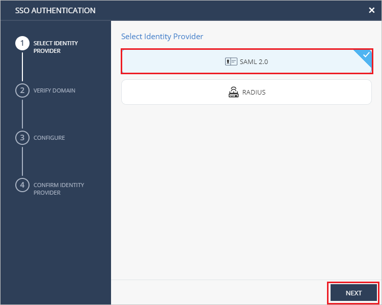
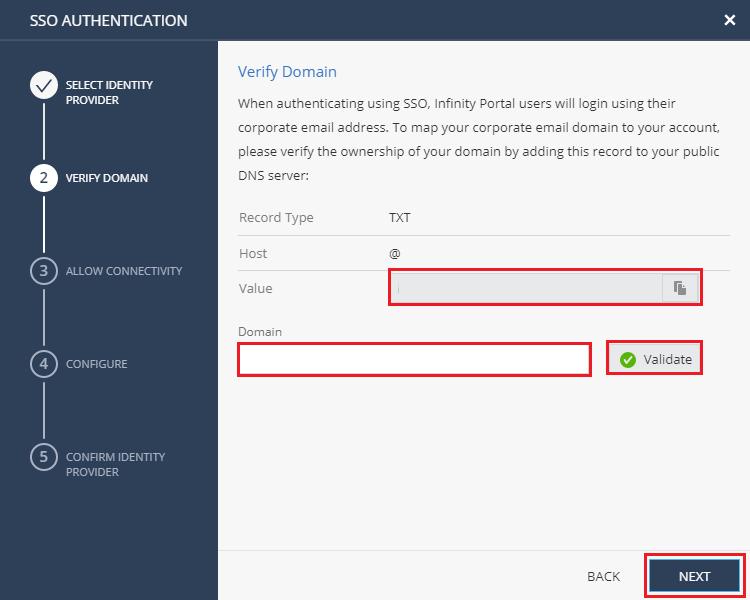
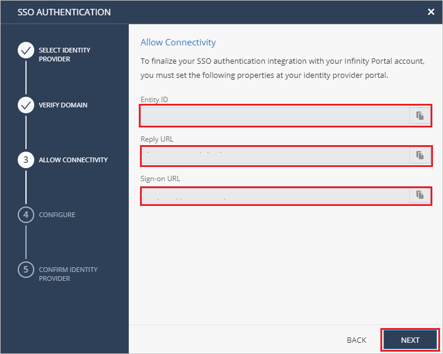
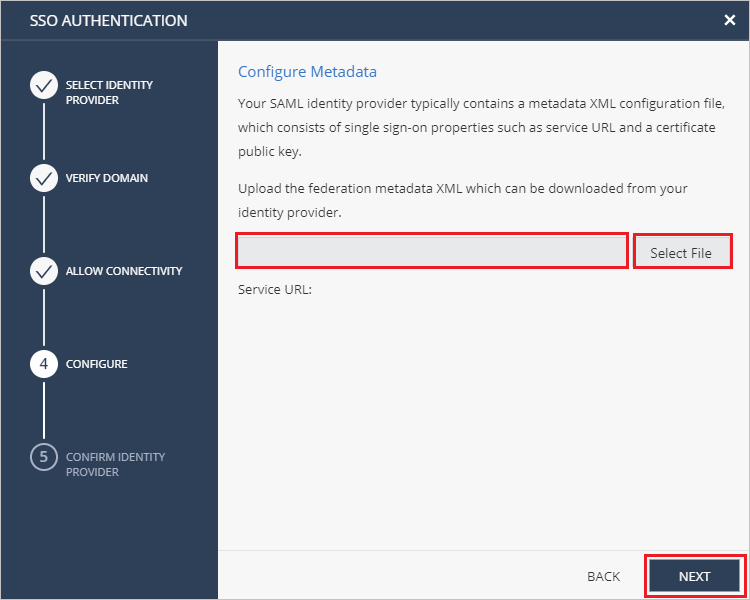
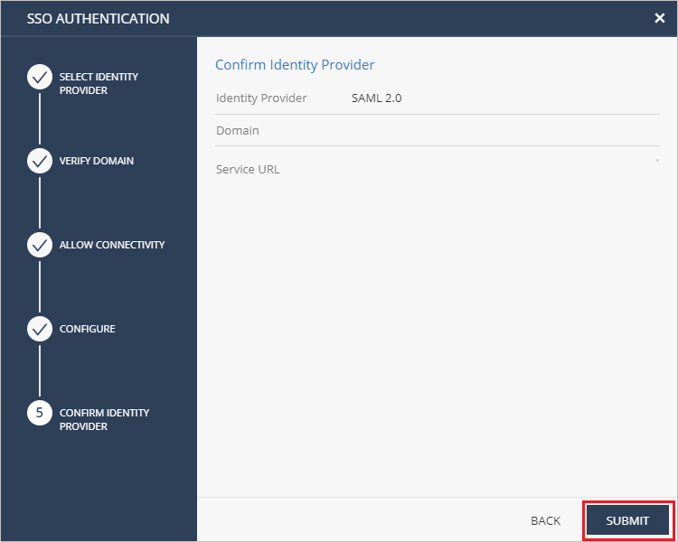

# Tutorial: Microsoft Entra SSO integration with Check Point Infinity Portal

In this tutorial, you'll learn how to integrate Check Point Infinity Portal with Microsoft Entra ID. When you integrate Check Point Infinity Portal with Microsoft Entra ID, you can:

* Control in Microsoft Entra ID who has access to Check Point Infinity Portal.
* Enable your users to be automatically signed-in to Check Point Infinity Portal with their Microsoft Entra accounts.
* Manage your accounts in one central location.

## Prerequisites

To get started, you need the following items:

* A Microsoft Entra subscription. If you don't have a subscription, you can get a [free account](https://azure.microsoft.com/free/).
* Check Point Infinity Portal single sign-on (SSO) enabled subscription.

## Scenario description

In this tutorial, you configure and test Microsoft Entra SSO in a test environment.

* Check Point Infinity Portal supports **SP** initiated SSO.

* Check Point Infinity Portal supports **Just In Time** user provisioning.

> [!NOTE]
> Identifier of this application is a fixed string value so only one instance can be configured in one tenant.

## Add Check Point Infinity Portal from the gallery

To configure the integration of Check Point Infinity Portal into Microsoft Entra ID, you need to add Check Point Infinity Portal from the gallery to your list of managed SaaS apps.

1. Sign in to the [Microsoft Entra admin center](https://entra.microsoft.com) as at least a [Cloud Application Administrator](../roles/permissions-reference.md#cloud-application-administrator).
1. Browse to **Identity** > **Applications** > **Enterprise applications** > **New application**.
1. In the **Add from the gallery** section, type **Check Point Infinity Portal** in the search box.
1. Select **Check Point Infinity Portal** from results panel and then add the app. Wait a few seconds while the app is added to your tenant.

 Alternatively, you can also use the [Enterprise App Configuration Wizard](https://portal.office.com/AdminPortal/home?Q=Docs#/azureadappintegration). In this wizard, you can add an application to your tenant, add users/groups to the app, assign roles, as well as walk through the SSO configuration as well. [Learn more about Microsoft 365 wizards.](/microsoft-365/admin/misc/azure-ad-setup-guides)

## Configure and test Microsoft Entra SSO for Check Point Infinity Portal

Configure and test Microsoft Entra SSO with Check Point Infinity Portal using a test user called **B.Simon**. For SSO to work, you need to establish a link relationship between a Microsoft Entra user and the related user in Check Point Infinity Portal.

To configure and test Microsoft Entra SSO with Check Point Infinity Portal, perform the following steps:

1. **[Configure Microsoft Entra SSO](#configure-azure-ad-sso)** - to enable your users to use this feature.
    1. **[Create a Microsoft Entra test user](#create-an-azure-ad-test-user)** - to test Microsoft Entra single sign-on with B.Simon.
    1. **[Assign the Microsoft Entra test user](#assign-the-azure-ad-test-user)** - to enable B.Simon to use Microsoft Entra single sign-on.
1. **[Configure Check Point Infinity Portal SSO](#configure-check-point-infinity-portal-sso)** - to configure the single sign-on settings on application side.
    1. **[Create Check Point Infinity Portal test user](#create-check-point-infinity-portal-test-user)** - to have a counterpart of B.Simon in Check Point Infinity Portal that is linked to the Microsoft Entra representation of user.
1. **[Test SSO](#test-sso)** - to verify whether the configuration works.

## Configure Microsoft Entra SSO

Follow these steps to enable Microsoft Entra SSO.

1. Sign in to the [Microsoft Entra admin center](https://entra.microsoft.com) as at least a [Cloud Application Administrator](../roles/permissions-reference.md#cloud-application-administrator).
1. Browse to **Identity** > **Applications** > **Enterprise applications** > **Check Point Infinity Portal** > **Single sign-on**.
1. On the **Select a single sign-on method** page, select **SAML**.
1. On the **Set up single sign-on with SAML** page, click the pencil icon for **Basic SAML Configuration** to edit the settings.

   

1. On the **Basic SAML Configuration** section, perform the following steps:

    a. In the **Identifier** text box, type one of the following values:

    | Environment | Identifier |
    |-------------| -------------|
    | EU/US | `cloudinfra.checkpoint.com` |
    | AP | `ap.portal.checkpoint.com` |
    |

    b. In the **Reply URL** text box, type one of the following URLs:

    | Environment | Reply URL |
    |-------------| -------------|
    | EU/US | `https://portal.checkpoint.com/` |
    | AP | `https://ap.portal.checkpoint.com/` |
    |

    c. In the **Sign on URL** text box, type one of the following URLs:

    | Environment | Sign on URL |
    |-------------| -------------|
    | EU/US | `https://portal.checkpoint.com/` |
    | AP | `https://ap.portal.checkpoint.com/` |
    |

1. On the **Set up single sign-on with SAML** page, in the **SAML Signing Certificate** section,  find **Federation Metadata XML** and select **Download** to download the certificate and save it on your computer.

	

1. On the **Set up Check Point Infinity Portal** section, copy the appropriate URL(s) based on your requirement.

	

There are two ways for authorizing users:

* Configure Check Point Infinity Portal application user roles in Azure portal

* Configure Check Point Infinity Portal application user roles in Check Point Infinity Portal

#### Configure Check Point Infinity Portal application user roles in Azure portal

In this section, you'll create Admin and Read-Only roles.

1. From the left pane in the Azure portal, select **App Registration**, select **All applications**, and then select the **Check Point Infinity Portal** application.

2. From the left pane, select **App roles**, click **Create app role** and follow these steps:

   a. In the **Display name** field, enter **Admin**.

   b. In the **Allowed member types**, choose **Users/Groups**.
   
   c. In the **Value** field, enter **admin**.

   d. In the **Description** field, enter **Check Point Infinity Portal Admin role**.

   e. Make sure that the **enable this app role** option is selected.

   f. Click **Apply**.

   g. Click **Create app role** again.

   h. In the **Display name** field, enter **Read-Only**.

   i. In the **Allowed member types**, choose **Users/Groups**.

   j. In the **Value** field, enter **readonly**.

   k. In the **Description** field, enter **Check Point Infinity Portal Admin role**.

   l. Make sure that the **enable this app role** option is selected.

   m. Click **Apply**.

#### Configure Check Point Infinity Portal application user roles in Check Point Infinity Portal

This configuration is applied only to the groups assigned to the Check Point Infinity Portal application in Microsoft Entra ID.

In this section, you’ll create one or more User Groups which will hold the Global and Service roles for the relevant Microsoft Entra groups.

* Copy the ID of the assigned group for use with the Check Point Infinity Portal User Group.
* For User Group configuration, refer to the [Infinity Portal Admin Guide](https://sc1.checkpoint.com/documents/Infinity_Portal/WebAdminGuides/EN/Infinity-Portal-Admin-Guide/Default.htm#cshid=user_groups).

### Create a Microsoft Entra test user

In this section, you'll create a test user called B.Simon.

1. Sign in to the [Microsoft Entra admin center](https://entra.microsoft.com) as at least a [User Administrator](../roles/permissions-reference.md#user-administrator).
1. Browse to **Identity** > **Users** > **All users**.
1. Select **New user** > **Create new user**, at the top of the screen.
1. In the **User** properties, follow these steps:
   1. In the **Display name** field, enter `B.Simon`.  
   1. In the **User principal name** field, enter the username@companydomain.extension. For example, `B.Simon@contoso.com`.
   1. Select the **Show password** check box, and then write down the value that's displayed in the **Password** box.
   1. Select **Review + create**.
1. Select **Create**.

### Assign the Microsoft Entra test user

In this section, you'll enable B.Simon to use single sign-on by granting access to Check Point Infinity Portal.

1. Sign in to the [Microsoft Entra admin center](https://entra.microsoft.com) as at least a [Cloud Application Administrator](../roles/permissions-reference.md#cloud-application-administrator).
1. Browse to **Identity** > **Applications** > **Enterprise applications** > **Check Point Infinity Portal**.
1. In the app's overview page, select **Users and groups**.
1. Select **Add user/group**, then select **Users and groups** in the **Add Assignment** dialog.
   1. In the **Users and groups** dialog, select **B.Simon** from the Users list, then click the **Select** button at the bottom of the screen.
   1. If you are expecting a role to be assigned to the users, you can select it from the **Select a role** dropdown. If no role has been set up for this app, you see "Default Access" role selected.
   1. In the **Add Assignment** dialog, click the **Assign** button.

## Configure Check Point Infinity Portal SSO

1. Log in to your Check Point Infinity Portal company site as an administrator.

2. Navigate to **Global Settings** > **Account Settings** and click **Define** under SSO Authentication.
   
    

3. In the **SSO Authentication** page,  select **SAML 2.0** 
as an **IDENTITY PROVIDER** and click **NEXT**.
     
   

4. In the **VERIFY DOMAIN** section, perform the following steps:

   
 
   a. Copy the DNS record values and add them to the DNS values in your company DNS server. 

   b. Enter your company’s domain name in the **Domain** field and click **Validate**. 

   c. Wait for Check Point to approve the DNS record  update, it might take up to 30 minutes. 

   d. Click **NEXT** once the domain name is validated. 

5. In the **ALLOW CONNECTIVITY** section, perform the following steps:
    
    

   a. Copy **Entity ID** value, paste this value into the **Microsoft Entra Identifier** text box in the Basic SAML Configuration section.

   b. Copy **Reply URL** value, paste this value into the **Reply URL** text box in the Basic SAML Configuration section.

   c. Copy **Sign-on URL** value, paste this value into the **Sign on URL** text box in the Basic SAML Configuration section.
      
   d. Click **NEXT**.

6. In the **CONFIGURE** section, click **Select File** and upload the **Federation Metadata XML** file which you have downloaded and click **NEXT**. 

    

7. In the **CONFIRM IDENTITY PROVIDER** section, review the configurations and click **SUBMIT**.
     
    

### Create Check Point Infinity Portal test user

In this section, a user called Britta Simon is created in Check Point Infinity Portal. Check Point Infinity Portal supports just-in-time user provisioning, which is enabled by default. There is no action item for you in this section. If a user doesn't already exist in Check Point Infinity Portal, a new one is created after authentication.

## Test SSO 

In this section, you test your Microsoft Entra single sign-on configuration with following options. 

* Click on **Test this application**, this will redirect to Check Point Infinity Portal Sign-on URL where you can initiate the login flow. 

* Go to Check Point Infinity Portal Sign-on URL directly and initiate the login flow from there.

* You can use Microsoft My Apps. When you click the Check Point Infinity Portal tile in the My Apps, this will redirect to Check Point Infinity Portal Sign-on URL. For more information about the My Apps, see [Introduction to the My Apps](https://support.microsoft.com/account-billing/sign-in-and-start-apps-from-the-my-apps-portal-2f3b1bae-0e5a-4a86-a33e-876fbd2a4510).

## Next steps

Once you configure Check Point Infinity Portal you can enforce session control, which protects exfiltration and infiltration of your organization’s sensitive data in real time. Session control extends from Conditional Access. [Learn how to enforce session control with Microsoft Defender for Cloud Apps](/cloud-app-security/proxy-deployment-any-app).
