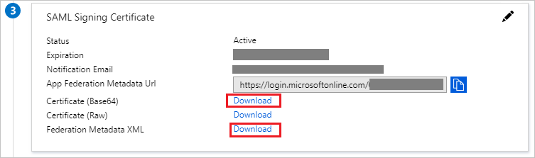

# Tutorial: Microsoft Entra SSO integration with Chronus SAML

In this tutorial, you'll learn how to integrate Chronus SAML with Microsoft Entra ID. When you integrate Chronus SAML with Microsoft Entra ID, you can:

* Control in Microsoft Entra ID who has access to Chronus SAML.
* Enable your users to be automatically signed-in to Chronus SAML with their Microsoft Entra accounts.
* Manage your accounts in one central location.

## Prerequisites

To get started, you need the following items:

* A Microsoft Entra subscription. If you don't have a subscription, you can get a [free account](https://azure.microsoft.com/free/).
* Chronus SAML single sign-on (SSO) enabled subscription.
* Along with Cloud Application Administrator, Application Administrator can also add or manage applications in Microsoft Entra ID.
For more information, see [Azure built-in roles](../roles/permissions-reference.md).

## Scenario description

In this tutorial, you configure and test Microsoft Entra SSO in a test environment.

* Chronus SAML supports **SP and IDP** initiated SSO.
* Chronus SAML supports **Just In Time** user provisioning.

## Add Chronus SAML from the gallery

To configure the integration of Chronus SAML into Microsoft Entra ID, you need to add Chronus SAML from the gallery to your list of managed SaaS apps.

1. Sign in to the [Microsoft Entra admin center](https://entra.microsoft.com) as at least a [Cloud Application Administrator](../roles/permissions-reference.md#cloud-application-administrator).
1. Browse to **Identity** > **Applications** > **Enterprise applications** > **New application**.
1. In the **Add from the gallery** section, type **Chronus SAML** in the search box.
1. Select **Chronus SAML** from results panel and then add the app. Wait a few seconds while the app is added to your tenant.

 Alternatively, you can also use the [Enterprise App Configuration Wizard](https://portal.office.com/AdminPortal/home?Q=Docs#/azureadappintegration). In this wizard, you can add an application to your tenant, add users/groups to the app, assign roles, as well as walk through the SSO configuration as well. [Learn more about Microsoft 365 wizards.](/microsoft-365/admin/misc/azure-ad-setup-guides)

## Configure and test Microsoft Entra SSO for Chronus SAML

Configure and test Microsoft Entra SSO with Chronus SAML using a test user called **B.Simon**. For SSO to work, you need to establish a link relationship between a Microsoft Entra user and the related user in Chronus SAML.

To configure and test Microsoft Entra SSO with Chronus SAML, perform the following steps:

1. **[Configure Microsoft Entra SSO](#configure-azure-ad-sso)** - to enable your users to use this feature.
    1. **[Create a Microsoft Entra test user](#create-an-azure-ad-test-user)** - to test Microsoft Entra single sign-on with B.Simon.
    1. **[Assign the Microsoft Entra test user](#assign-the-azure-ad-test-user)** - to enable B.Simon to use Microsoft Entra single sign-on.
1. **[Configure Chronus SAML SSO](#configure-chronus-saml-sso)** - to configure the single sign-on settings on application side.
    1. **[Create Chronus SAML test user](#create-chronus-saml-test-user)** - to have a counterpart of B.Simon in Chronus SAML that is linked to the Microsoft Entra representation of user.
1. **[Test SSO](#test-sso)** - to verify whether the configuration works.

## Configure Microsoft Entra SSO

Follow these steps to enable Microsoft Entra SSO.

1. Sign in to the [Microsoft Entra admin center](https://entra.microsoft.com) as at least a [Cloud Application Administrator](../roles/permissions-reference.md#cloud-application-administrator).
1. Browse to **Identity** > **Applications** > **Enterprise applications** > **Chronus SAML** > **Single sign-on**.
1. On the **Select a single sign-on method** page, select **SAML**.
1. On the **Set up single sign-on with SAML** page, click the pencil icon for **Basic SAML Configuration** to edit the settings.

   

1. On the **Basic SAML Configuration** section, perform the following steps:

    a. In the **Identifier** textbox, type a value using the following pattern:
    `<CustomerName>.domain.extension`

    b. In the **Reply URL** textbox, type a URL using the following pattern:
    `https://<CustomerName>.domain.extension/session`

1. Click **Set additional URLs** and perform the following steps if you wish to configure the application in **SP** initiated mode:
    
    In the **Sign-on URL** text box, type a URL using the following pattern:
    `https://<CustomerName>.domain.extension/session`

    > [!NOTE]
    > These values are not real. Update these values with the actual Identifier, Reply URL and Sign-on URL. Contact [Chronus SAML Client support team](mailto:support@chronus.com) to get these values. You can also refer to the patterns shown in the Basic SAML Configuration section.

1. On the **Set up single sign-on with SAML** page, in the **SAML Signing Certificate** section,  find **Certificate (Base64)** and select **Download** to download the certificate and save it on your computer.

    

1. On the **Set up Chronus SAML** section, copy the appropriate URL(s) based on your requirement.

    

### Create a Microsoft Entra test user

In this section, you'll create a test user called B.Simon.

1. Sign in to the [Microsoft Entra admin center](https://entra.microsoft.com) as at least a [User Administrator](../roles/permissions-reference.md#user-administrator).
1. Browse to **Identity** > **Users** > **All users**.
1. Select **New user** > **Create new user**, at the top of the screen.
1. In the **User** properties, follow these steps:
   1. In the **Display name** field, enter `B.Simon`.  
   1. In the **User principal name** field, enter the username@companydomain.extension. For example, `B.Simon@contoso.com`.
   1. Select the **Show password** check box, and then write down the value that's displayed in the **Password** box.
   1. Select **Review + create**.
1. Select **Create**.

### Assign the Microsoft Entra test user

In this section, you'll enable B.Simon to use single sign-on by granting access to Chronus SAML.

1. Sign in to the [Microsoft Entra admin center](https://entra.microsoft.com) as at least a [Cloud Application Administrator](../roles/permissions-reference.md#cloud-application-administrator).
1. Browse to **Identity** > **Applications** > **Enterprise applications** > **Chronus SAML**.
1. In the app's overview page, find the **Manage** section and select **Users and groups**.
1. Select **Add user**, then select **Users and groups** in the **Add Assignment** dialog.
1. In the **Users and groups** dialog, select **B.Simon** from the Users list, then click the **Select** button at the bottom of the screen.
1. If you're expecting any role value in the SAML assertion, in the **Select Role** dialog, select the appropriate role for the user from the list and then click the **Select** button at the bottom of the screen.
1. In the **Add Assignment** dialog, click the **Assign** button.

## Configure Chronus SAML SSO

To configure single sign-on on Chronus SAML side, you need to send the downloaded **Certificate (Base64)** and appropriate copied URLs from the application configuration to [Chronus SAML support team](mailto:support@chronus.com). They set this setting to have the SAML SSO connection set properly on both sides.

### Create Chronus SAML test user

In this section, a user called B.Simon is created in Chronus SAML. Chronus SAML supports just-in-time user provisioning, which is enabled by default. There is no action item for you in this section. If a user doesn't already exist in Chronus SAML, a new one is created after authentication.

## Test SSO

In this section, you test your Microsoft Entra single sign-on configuration with following options. 

#### SP initiated:

* Click on **Test this application**, this will redirect to Chronus SAML Sign on URL where you can initiate the login flow.  

* Go to Chronus SAML Sign-on URL directly and initiate the login flow from there.

#### IDP initiated:

* Click on **Test this application**, and you should be automatically signed in to the Chronus SAML for which you set up the SSO. 

You can also use Microsoft My Apps to test the application in any mode. When you click the Chronus SAML tile in the My Apps, if configured in SP mode you would be redirected to the application sign-on page for initiating the login flow and if configured in IDP mode, you should be automatically signed in to the Chronus SAML for which you set up the SSO. For more information about the My Apps, see [Introduction to the My Apps](https://support.microsoft.com/account-billing/sign-in-and-start-apps-from-the-my-apps-portal-2f3b1bae-0e5a-4a86-a33e-876fbd2a4510).

## Next steps

Once you configure Chronus SAML you can enforce session control, which protects exfiltration and infiltration of your organization’s sensitive data in real time. Session control extends from Conditional Access. [Learn how to enforce session control with Microsoft Defender for Cloud Apps](/cloud-app-security/proxy-deployment-aad).
