# Tutorial: Configure Cisco Spark for automatic user provisioning


The objective of this tutorial is to demonstrate the steps to be performed in Cisco Spark and Azure Active Directory (Azure AD) to configure Azure AD to automatically provision and de-provision users to Cisco Spark.


> [!NOTE]
> This tutorial describes a connector built on top of the Azure AD User Provisioning Service. For important details on what this service does, how it works, and frequently asked questions, see [Automate user provisioning and deprovisioning to SaaS applications with Azure Active Directory](../manage-apps/user-provisioning.md).

## Prerequisites

The scenario outlined in this tutorial assumes that you already have the following prerequisites:

*   An Azure AD tenant
*   A Cisco Spark tenant
*   A user account in Cisco Spark with Admin permissions


> [!NOTE]
> The Azure AD provisioning integration relies on the [Cisco Spark Webservice](https://developer.webex.com/getting-started.html), which is available to Cisco Spark teams.

## Adding Cisco Spark from the gallery
Before configuring Cisco Spark for automatic user provisioning with Azure AD, you need to add Cisco Spark from the Azure AD application gallery to your list of managed SaaS applications.

**To add Cisco Spark from the Azure AD application gallery, perform the following steps:**

1. In the **[Azure portal](https://portal.azure.com)**, on the left navigation panel, click on the **Azure Active Directory** icon.

	![The Azure Active Directory button][1]

2. Navigate to **Enterprise applications** > **All applications**.

	![The Enterprise applications Section][2]

3. To add Cisco Spark, click the **New application** button on the top of the dialog.

	![The New application button][3]

4. In the search box, type **Cisco Spark**.

	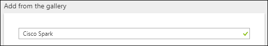

5. In the results panel, select **Cisco Spark**, and then click the **Add** button to add Cisco Spark to your list of SaaS applications.

	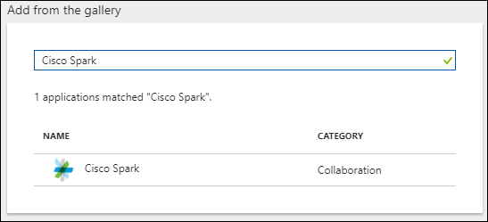

	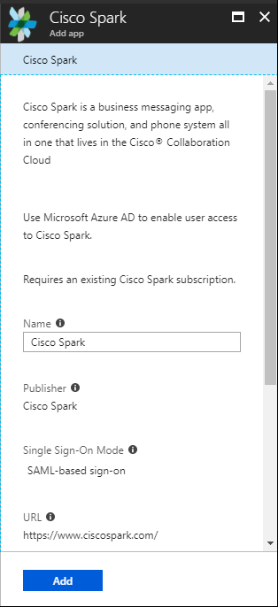

## Assigning users to Cisco Spark

Azure Active Directory uses a concept called "assignments" to determine which users should receive access to selected apps. In the context of automatic user provisioning, only the users and/or groups that have been "assigned" to an application in Azure AD are synchronized.

Before configuring and enabling automatic user provisioning, you should decide which users in Azure AD need access to Cisco Spark. Once decided, you can assign these users to Cisco Spark by following the instructions here:

*   [Assign a user or group to an enterprise app](../manage-apps/assign-user-or-group-access-portal.md)

### Important tips for assigning users to Cisco Spark

*	It is recommended that a single Azure AD user is assigned to Cisco Spark to test the automatic user provisioning configuration. Additional users may be assigned later.

*	When assigning a user to Cisco Spark, you must select any valid application-specific role (if available) in the assignment dialog. Users with the **Default Access** role are excluded from provisioning.

## Configuring automatic user provisioning to Cisco Spark

This section guides you through the steps to configure the Azure AD provisioning service to create, update, and disable users in Cisco Spark based on user assignments in Azure AD.


### To configure automatic user provisioning for Cisco Spark in Azure AD:


1. Sign in to the [Azure portal](https://portal.azure.com) and browse to **Azure Active Directory > Enterprise applications > All applications**.

2. Select Cisco Spark from your list of SaaS applications.

	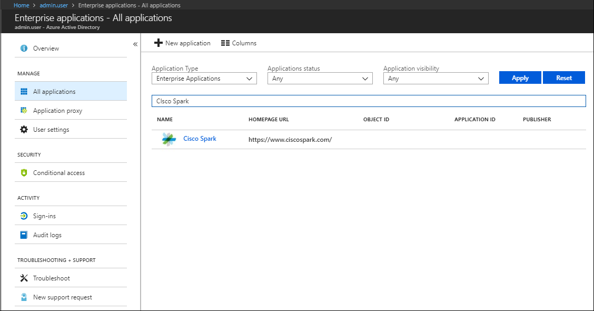

3. Select the **Provisioning** tab.

	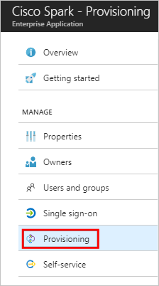

4. Set the **Provisioning Mode** to **Automatic**.

	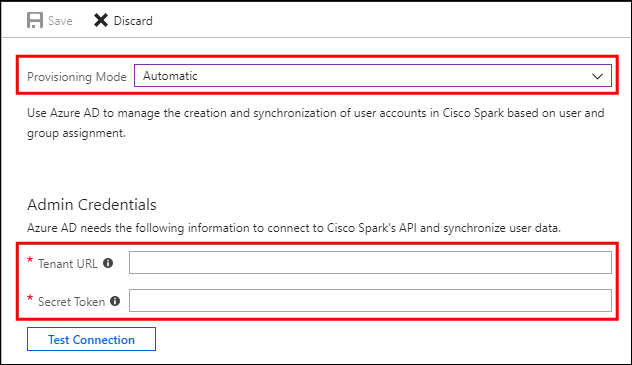

5. Under the **Admin Credentials** section, input the **Tenant URL**, and **Secret Token** of your Cisco Spark's account.

	*   In the **Tenant URL** field, populate the Cisco Spark SCIM API URL for your tenant, which takes the form of `https://api.ciscospark.com/v1/scim/[Tenant ID]/`, where `[Tenant ID]` is an alphanumeric string as described in step 6.

	*   In the **Secret Token** field, populate the Secret Token as described in step 6.

1. The **Tenant ID** and **Secret Token** for your Cisco Spark account can be found by logging into the [Cisco Spark developer site](https://developer.webex.com/) with your Admin account. Once logged in -
	* Go to the [Getting Started page](https://developer.webex.com/getting-started.html)
	* Scroll down to the [Authentication Section](https://developer.webex.com/getting-started.html#authentication)
	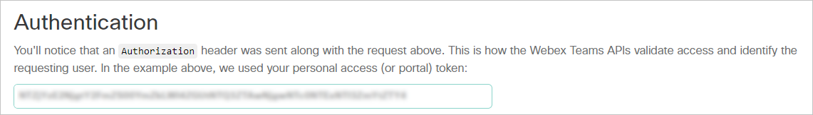
	* The alphanumeric string in the box is your **Secret Token**. Copy this token to the clipboard
	* Go to the [Get My Own Details page](https://developer.webex.com/endpoint-people-me-get.html)
		* Make sure that Test Mode is ON
		* Type the word "Bearer" followed by a space, and then paste the Secret Token into the Authorization field
    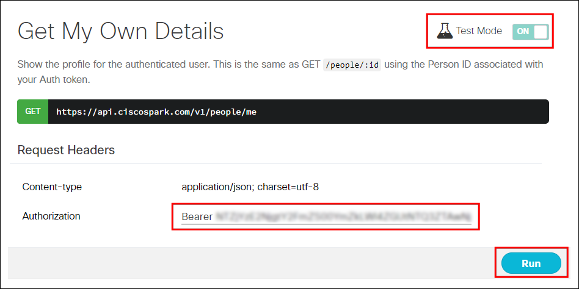
		* Click Run
	* In the response text to the right, the **Tenant ID** appears as "orgId":

	```json
	{
		"id": "(...)",
		"emails": [
			"admin.user@contoso.com"
		],
		"displayName": "John Smith",
		"nickName": "John",
		"orgId": "XXXXXXXXXXXXXXXXXXXXXXXXXXXXXXXXXXXXXXXXXXXXXXXXXXXXXXXXXXXXXXXXXXXXXXXXXXXXXXXXXXXXXXX",
		(...)
	}
	```

1. Upon populating the fields shown in Step 5, click **Test Connection** to ensure Azure AD can connect to Cisco Spark. If the connection fails, ensure your Cisco Spark account has Admin permissions and try again.

	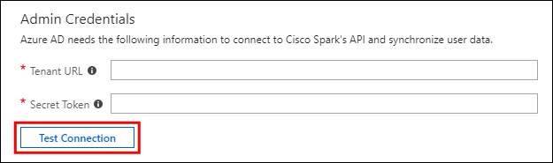

8. In the **Notification Email** field, enter the email address of a person or group who should receive the provisioning error notifications and check the checkbox - **Send an email notification when a failure occurs**.

	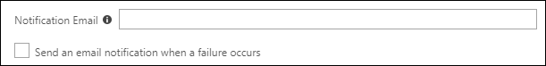

9. Click **Save**.

10. Under the **Mappings** section, select **Synchronize Azure Active Directory Users to Cisco Spark**.

	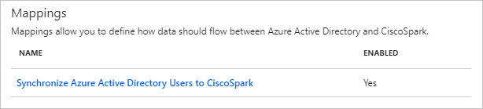

11. Review the user attributes that are synchronized from Azure AD to Cisco Spark in the **Attribute Mapping** section. The attributes selected as **Matching** properties are used to match the user accounts in Cisco Spark for update operations. Select the **Save** button to commit any changes.

	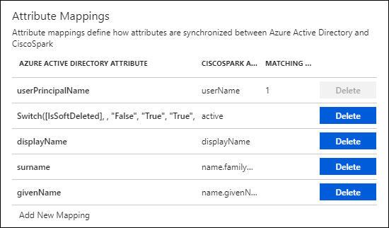

12. To configure scoping filters, refer to the following instructions provided in the [Scoping filter tutorial](../manage-apps/define-conditional-rules-for-provisioning-user-accounts.md).

13. To enable the Azure AD provisioning service for Cisco Spark, change the **Provisioning Status** to **On** in the **Settings** section.

	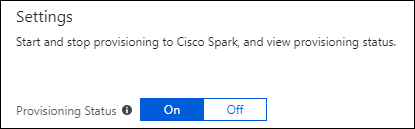

14. Define the users and/or groups that you would like to provision to Cisco Spark by choosing the desired values in **Scope** in the **Settings** section.

	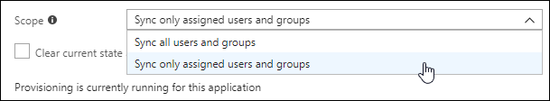

15. When you are ready to provision, click **Save**.

	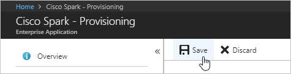


This operation starts the initial synchronization of all users and/or groups defined in **Scope** in the **Settings** section. The initial sync takes longer to perform than subsequent syncs, which occur approximately every 40 minutes as long as the Azure AD provisioning service is running. You can use the **Synchronization Details** section to monitor progress and follow links to provisioning activity report, which describes all actions performed by the Azure AD provisioning service on Cisco Spark.

For more information on how to read the Azure AD provisioning logs, see [Reporting on automatic user account provisioning](../manage-apps/check-status-user-account-provisioning.md).

## Connector Limitations

* Cisco Spark is currently in Cisco's Early Field Testing (EFT) phase. For more information, please contact [Cisco's support team](https://www.webex.co.in/support/support-overview.html). 

## Additional resources

* [Managing user account provisioning for Enterprise Apps](../manage-apps/configure-automatic-user-provisioning-portal.md)
* [What is application access and single sign-on with Azure Active Directory?](../manage-apps/what-is-single-sign-on.md)


## Next steps

* [Learn how to review logs and get reports on provisioning activity](../manage-apps/check-status-user-account-provisioning.md)

<!--Image references-->
[1]: ./media/cisco-spark-provisioning-tutorial/tutorial_general_01.png
[2]: ./media/cisco-spark-provisioning-tutorial/tutorial_general_02.png
[3]: ./media/cisco-spark-provisioning-tutorial/tutorial_general_03.png
