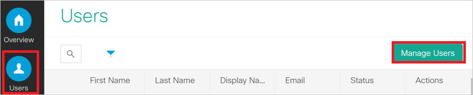
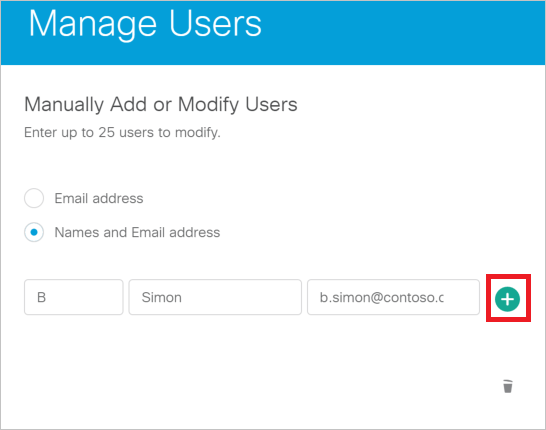

# Tutorial: Azure Active Directory Single sign-on (SSO) integration with Cisco Webex

In this tutorial, you'll learn how to integrate Cisco Webex with Azure Active Directory (Azure AD). When you integrate Cisco Webex with Azure AD, you can:

* Control in Azure AD who has access to Cisco Webex.
* Enable your users to be automatically signed-in to Cisco Webex with their Azure AD accounts.
* Manage your accounts in one central location - the Azure portal.

To learn more about SaaS app integration with Azure AD, see [What is application access and single sign-on with Azure Active Directory](https://docs.microsoft.com/azure/active-directory/active-directory-appssoaccess-whatis).

## Prerequisites

To get started, you need the following items:

* An Azure AD subscription. If you don't have a subscription, you can get a [free account](https://azure.microsoft.com/free/).
* Cisco Webex single sign-on (SSO) enabled subscription.

## Scenario description

In this tutorial, you configure and test Azure AD SSO in a test environment.

* Cisco Webex supports **SP** initiated SSO.
* Cisco Webex supports **Automated** user provisioning.
* Once you configure Cisco Webex you can enforce Session Control, which protect exfiltration and infiltration of your organization’s sensitive data in real-time. Session Control extend from Conditional Access. [Learn how to enforce session control with Microsoft Cloud App Security](https://docs.microsoft.com/cloud-app-security/proxy-deployment-aad)

## Adding Cisco Webex from the gallery

To configure the integration of Cisco Webex into Azure AD, you need to add Cisco Webex from the gallery to your list of managed SaaS apps.

1. Sign in to the [Azure portal](https://portal.azure.com) using either a work or school account, or a personal Microsoft account.
1. On the left navigation pane, select the **Azure Active Directory** service.
1. Navigate to **Enterprise Applications** and then select **All Applications**.
1. To add new application, select **New application**.
1. In the **Add from the gallery** section, type **Cisco Webex** in the search box.
1. Select **Cisco Webex** from results panel and then add the app. Wait a few seconds while the app is added to your tenant.

## Configure and test Azure AD single sign-on for Cisco Webex

Configure and test Azure AD SSO with Cisco Webex using a test user called **B.Simon**. For SSO to work, you need to establish a link relationship between an Azure AD user and the related user in Cisco Webex.

To configure and test Azure AD SSO with Cisco Webex, complete the following building blocks:

1. **[Configure Azure AD SSO](#configure-azure-ad-sso)** to enable your users to use this feature.
	1. **[Create an Azure AD test user](#create-an-azure-ad-test-user)** to test Azure AD single sign-on with B.Simon.
	1. **[Assign the Azure AD test user](#assign-the-azure-ad-test-user)** to enable B.Simon to use Azure AD single sign-on.
2. **[Configure Cisco Webex](#configure-cisco-webex)** to configure the SSO settings on application side.
	1. **[Create Cisco Webex test user](#create-cisco-webex-test-user)** to have a counterpart of B.Simon in Cisco Webex that is linked to the Azure AD representation of user.
3. **[Test SSO](#test-sso)** to verify whether the configuration works.

### Configure Azure AD SSO

Follow these steps to enable Azure AD SSO in the Azure portal.

1. In the [Azure portal](https://portal.azure.com/), on the **Cisco Webex** application integration page, find the **Manage** section and select **Single sign-on**.
1. On the **Select a Single sign-on method** page, select **SAML**.
1. On the **Set up Single Sign-On with SAML** page, click the edit/pen icon for **Basic SAML Configuration** to edit the settings.

   

4. On the **Basic SAML Configuration** section, upload the downloaded **Service Provider metadata** file and configure the application by performing the following steps:

	>[!Note]
	>You will get the Service Provider Metadata file from the **Configure Cisco Webex** section, which is explained later in the tutorial. 

	a. Click **Upload metadata file**.

	b. Click on **folder logo** to select the metadata file and click **Upload**.

	c. After successful completion of uploading Service Provider metadata file the **Identifier** and **Reply URL** values get auto populated in **Basic SAML Configuration** section:

	In the **Sign on URL** textbox, paste the value of **Reply URL**, which gets autofilled by SP metadata file upload.

1. Cisco Webex application expects the SAML assertions in a specific format, which requires you to add custom attribute mappings to your SAML token attributes configuration. The following screenshot shows the list of default attributes.

	

1. In addition to above, Cisco Webex application expects few more attributes to be passed back in SAML response which are shown below. These attributes are also pre populated but you can review them as per your requirements.
  
	| Name |  Source Attribute|
	| ---------------|--------- |
	| uid | user.userprincipalname |

1. On the **Set up Single Sign-On with SAML** page, in the **SAML Signing Certificate** section, find **Federation Metadata XML** and select **Download** to download the certificate and save it on your computer.

   

1. On the **Set up Cisco Webex** section, copy the appropriate URL(s) based on your requirement.

   

### Create an Azure AD test user

In this section, you'll create a test user in the Azure portal called B.Simon.

1. From the left pane in the Azure portal, select **Azure Active Directory**, select **Users**, and then select **All users**.
1. Select **New user** at the top of the screen.
1. In the **User** properties, follow these steps:
   1. In the **Name** field, enter `B.Simon`.  
   1. In the **User name** field, enter the username@companydomain.extension. For example, `B.Simon@contoso.com`.
   1. Select the **Show password** check box, and then write down the value that's displayed in the **Password** box.
   1. Click **Create**.

### Assign the Azure AD test user

In this section, you'll enable B.Simon to use Azure single sign-on by granting access to Cisco Webex.

1. In the Azure portal, select **Enterprise Applications**, and then select **All applications**.
1. In the applications list, select **Cisco Webex**.
1. In the app's overview page, find the **Manage** section and select **Users and groups**.

   

1. Select **Add user**, then select **Users and groups** in the **Add Assignment** dialog.

	

1. In the **Users and groups** dialog, select **B.Simon** from the Users list, then click the **Select** button at the bottom of the screen.
1. In the **Add Assignment** dialog, click the **Assign** button.

## Configure Cisco Webex

1. To automate the configuration within Cisco Webex, you need to install **My Apps Secure Sign-in browser extension** by clicking **Install the extension**.

	

2. After adding extension to the browser, click on **Set up Cisco Webex** will direct you to the Cisco Webex application. From there, provide the admin credentials to sign into Cisco Webex. The browser extension will automatically configure the application for you and automate steps 3-8.

	

3. If you want to setup Cisco Webex manually, sign in to [Cisco Cloud Collaboration Management](https://admin.ciscospark.com/) with your full administrator credentials.

4. Select **Settings** and under the **Authentication** section, click **Modify**.

    
  
5. Select **Integrate a 3rd-party identity provider. (Advanced)** and go to the next screen.

6. On the **Import Idp Metadata** page, either drag and drop the Azure AD metadata file onto the page or use the file browser option to locate and upload the Azure AD metadata file. Then, select **Require certificate signed by a certificate authority in Metadata (more secure)** and click **Next**.

	

7. Select **Test SSO Connection**, and when a new browser tab opens, authenticate with Azure AD by signing in.

8. Return to the **Cisco Cloud Collaboration Management** browser tab. If the test was successful, select **This test was successful. Enable Single Sign-On option** and click **Next**.

### Create Cisco Webex test user

In this section, you create a user called B.Simon in Cisco Webex. In this section, you create a user called B.Simon in Cisco Webex.

1. Go to the [Cisco Cloud Collaboration Management](https://admin.ciscospark.com/) with your full administrator credentials.

2. Click **Users** and then **Manage Users**.
   
     

3. In the **Manage User** window, select **Manually add or modify users** and click **Next**.

4. Select **Names and Email address**. Then, fill out the textbox as follows:

     

	a. In the **First Name** textbox, type first name of user like **B**.

	b. In the **Last Name** textbox, type last name of user like **Simon**.

	c. In the **Email address** textbox, type email address of user like b.simon@contoso.com.

5. Click the plus sign to add B.Simon. Then, click **Next**.

6. In the **Add Services for Users** window, click **Save** and then **Finish**.

## Test SSO

When you select the Cisco Webex tile in the Access Panel, you should be automatically signed in to the Cisco Webex for which you set up SSO. For more information about the Access Panel, see [Introduction to the Access Panel](https://docs.microsoft.com/azure/active-directory/active-directory-saas-access-panel-introduction).

## Additional Resources

- [List of Tutorials on How to Integrate SaaS Apps with Azure Active Directory](https://docs.microsoft.com/azure/active-directory/active-directory-saas-tutorial-list)

- [What is application access and single sign-on with Azure Active Directory?](https://docs.microsoft.com/azure/active-directory/active-directory-appssoaccess-whatis)

- [What is conditional access in Azure Active Directory?](https://docs.microsoft.com/azure/active-directory/conditional-access/overview)

- [Try Cisco Webex with Azure AD](https://aad.portal.azure.com)

- [What is session control in Microsoft Cloud App Security?](https://docs.microsoft.com/cloud-app-security/proxy-intro-aad)

- [How to protect Cisco Webex with advanced visibility and controls](https://docs.microsoft.com/cloud-app-security/protect-webex)