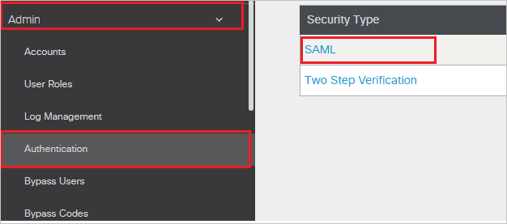
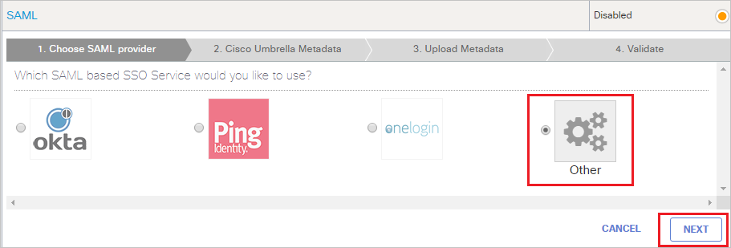
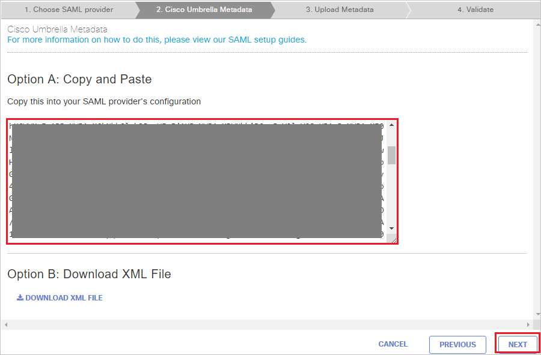
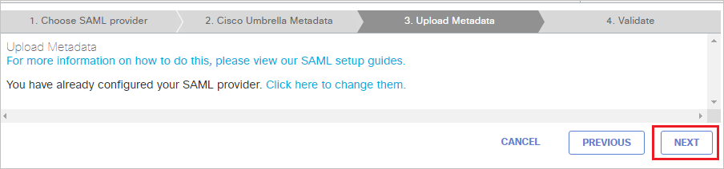
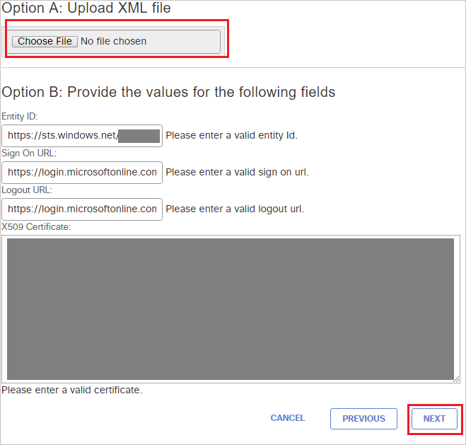

# Tutorial: Azure Active Directory integration with Cisco Umbrella

In this tutorial, you learn how to integrate Cisco Umbrella with Azure Active Directory (Azure AD).
Integrating Cisco Umbrella with Azure AD provides you with the following benefits:

* You can control in Azure AD who has access to Cisco Umbrella.
* You can enable your users to be automatically signed-in to Cisco Umbrella (Single Sign-On) with their Azure AD accounts.
* You can manage your accounts in one central location - the Azure portal.

If you want to know more details about SaaS app integration with Azure AD, see [What is application access and single sign-on with Azure Active Directory](https://docs.microsoft.com/azure/active-directory/active-directory-appssoaccess-whatis).
If you don't have an Azure subscription, [create a free account](https://azure.microsoft.com/free/) before you begin.

## Prerequisites

To configure Azure AD integration with Cisco Umbrella, you need the following items:

* An Azure AD subscription. If you don't have an Azure AD environment, you can get one-month trial [here](https://azure.microsoft.com/pricing/free-trial/)
* Cisco Umbrella single sign-on enabled subscription

## Scenario description

In this tutorial, you configure and test Azure AD single sign-on in a test environment.

* Cisco Umbrella supports **SP and IDP** initiated SSO

## Adding Cisco Umbrella from the gallery

To configure the integration of Cisco Umbrella into Azure AD, you need to add Cisco Umbrella from the gallery to your list of managed SaaS apps.

**To add Cisco Umbrella from the gallery, perform the following steps:**

1. In the **[Azure portal](https://portal.azure.com)**, on the left navigation panel, click **Azure Active Directory** icon.

	

2. Navigate to **Enterprise Applications** and then select the **All Applications** option.

	

3. To add new application, click **New application** button on the top of dialog.

	

4. In the search box, type **Cisco Umbrella**, select **Cisco Umbrella** from result panel then click **Add** button to add the application.

	 

## Configure and test Azure AD single sign-on

In this section, you configure and test Azure AD single sign-on with [Application name] based on a test user called **Britta Simon**.
For single sign-on to work, a link relationship between an Azure AD user and the related user in [Application name] needs to be established.

To configure and test Azure AD single sign-on with [Application name], you need to complete the following building blocks:

1. **[Configure Azure AD Single Sign-On](#configure-azure-ad-single-sign-on)** - to enable your users to use this feature.
2. **[Configure Cisco Umbrella Single Sign-On](#configure-cisco-umbrella-single-sign-on)** - to configure the Single Sign-On settings on application side.
3. **[Create an Azure AD test user](#create-an-azure-ad-test-user)** - to test Azure AD single sign-on with Britta Simon.
4. **[Assign the Azure AD test user](#assign-the-azure-ad-test-user)** - to enable Britta Simon to use Azure AD single sign-on.
5. **[Create Cisco Umbrella test user](#create-cisco-umbrella-test-user)** - to have a counterpart of Britta Simon in Cisco Umbrella that is linked to the Azure AD representation of user.
6. **[Test single sign-on](#test-single-sign-on)** - to verify whether the configuration works.

### Configure Azure AD single sign-on

In this section, you enable Azure AD single sign-on in the Azure portal.

To configure Azure AD single sign-on with [Application name], perform the following steps:

1. In the [Azure portal](https://portal.azure.com/), on the **Cisco Umbrella** application integration page, select **Single sign-on**.

    

2. On the **Select a Single sign-on method** dialog, select **SAML/WS-Fed** mode to enable single sign-on.

    

3. On the **Set up Single Sign-On with SAML** page, click **Edit** icon to open **Basic SAML Configuration** dialog.

	

4. On the **Basic SAML Configuration** section, the user does not have to perform any step as the app is already pre-integrated with Azure.

    

	a. If you wish to configure the application in **SP** intiated mode, perform the following steps:

    b. Click **Set additional URLs**.

    c. In the **Sign-on URL** textbox, type a URL: `https://login.umbrella.com/sso`

5. On the **Set up Single Sign-On with SAML** page, in the **SAML Signing Certificate** section, click **Download** to download the **Metadata XML** from the given options as per your requirement and save it on your computer.

	

6. On the **Set up Cisco Umbrella** section, copy the appropriate URL(s) as per your requirement.

	

	a. Login URL

	b. Azure Ad Identifier

	c. Logout URL

### Configure Cisco Umbrella Single Sign-On

1. In a different browser window, sign-on to your Cisco Umbrella company site as administrator.

2. From the left side of menu, click **Admin** and navigate to **Authentication** and then click on **SAML**.

	

3. Choose **Other** and click on **NEXT**.

	

4. On the **Cisco Umbrella Metadata**, page, click **NEXT**.

	

5. On the **Upload Metadata** tab, if you had pre-configured SAML, select **Click here to change them** option and follow the below steps.

	

6. In the **Option A: Upload XML file**,  upload the **Federation Metadata XML** file that you downloaded from the Azure portal and after uploading metadata the below values get auto populated automatically then click **NEXT**.

	

7. Under **Validate SAML Configuration** section, click **TEST YOUR SAML CONFIGURATION**.

	

8. Click **SAVE**.

### Create an Azure AD test user

The objective of this section is to create a test user in the Azure portal called Britta Simon.

1. In the Azure portal, in the left pane, select **Azure Active Directory**, select **Users**, and then select **All users**.

    

2. Select **New user** at the top of the screen.

    

3. In the User properties, perform the following steps.

    

    a. In the **Name** field enter **BrittaSimon**.
  
    b. In the **User name** field type **brittasimon\@yourcompanydomain.extension**  
    For example, BrittaSimon@contoso.com

    c. Select **Show password** check box, and then write down the value that's displayed in the Password box.

    d. Click **Create**.

### Assign the Azure AD test user

In this section, you enable Britta Simon to use Azure single sign-on by granting access to Cisco Umbrella.

1. In the Azure portal, select **Enterprise Applications**, select **All applications**, then select **Cisco Umbrella**.

	

2. In the applications list, type and select **Cisco Umbrella**.

	

3. In the menu on the left, select **Users and groups**.

    

4. Click the **Add user** button, then select **Users and groups** in the **Add Assignment** dialog.

    

5. In the **Users and groups** dialog select **Britta Simon** in the Users list, then click the **Select** button at the bottom of the screen.

6. If you are expecting any role value in the SAML assertion then in the **Select Role** dialog select the appropriate role for the user from the list, then click the **Select** button at the bottom of the screen.

7. In the **Add Assignment** dialog click the **Assign** button.

### Create Cisco Umbrella test user

To enable Azure AD users to log in to Cisco Umbrella, they must be provisioned into Cisco Umbrella.  
In the case of Cisco Umbrella, provisioning is a manual task.

**To provision a user account, perform the following steps:**

1. In a different browser window, sign-on to your Cisco Umbrella company site as administrator.

2. From the left side of menu, click **Admin** and navigate to **Accounts**.

	

3. On the **Accounts** page, click on **Add** on the top right side of the page and perform the following steps.

	

    a. In the **First Name** field, enter the firstname like **Britta**.

	b. In the **Last Name** field, enter the lastname like **simon**.

	c. From the **Choose Delegated Admin Role**, select your role.
  
    d. In the **Email Address** field, enter the emailaddress of user like **brittasimon\@contoso.com**.

    e. In the **Password** field, enter your password.

	f. In the **Confirm Password** field, re-enter your password.

    g. Click **CREATE**.

### Test single sign-on

In this section, you test your Azure AD single sign-on configuration using the Access Panel.

When you click the Cisco Umbrella tile in the Access Panel, you should be automatically signed in to the Cisco Umbrella for which you set up SSO. For more information about the Access Panel, see [Introduction to the Access Panel](https://docs.microsoft.com/azure/active-directory/active-directory-saas-access-panel-introduction).

## Additional Resources

- [List of Tutorials on How to Integrate SaaS Apps with Azure Active Directory](https://docs.microsoft.com/azure/active-directory/active-directory-saas-tutorial-list)

- [What is application access and single sign-on with Azure Active Directory?](https://docs.microsoft.com/azure/active-directory/active-directory-appssoaccess-whatis)

- [What is Conditional Access in Azure Active Directory?](https://docs.microsoft.com/azure/active-directory/conditional-access/overview)
