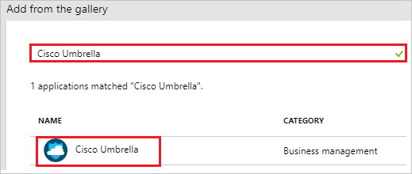
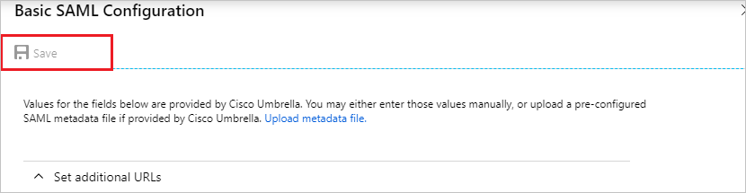
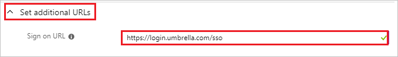
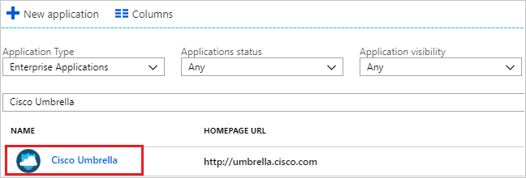

# Tutorial: Azure Active Directory integration with Cisco Umbrella

In this tutorial, you learn how to integrate Cisco Umbrella with Azure Active Directory (Azure AD).

Integrating Cisco Umbrella with Azure AD provides you with the following benefits:

- You can control in Azure AD who has access to Cisco Umbrella.
- You can enable your users to automatically get signed-on to Cisco Umbrella (Single Sign-On) with their Azure AD accounts.
- You can manage your accounts in one central location - the Azure portal.

If you want to know more details about SaaS app integration with Azure AD, see [what is application access and single sign-on with Azure Active Directory](../manage-apps/what-is-single-sign-on.md)

## Prerequisites

To configure Azure AD integration with Cisco Umbrella, you need the following items:

- An Azure AD subscription
- A Cisco Umbrella single sign-on enabled subscription

> [!NOTE]
> To test the steps in this tutorial, we do not recommend using a production environment.

To test the steps in this tutorial, you should follow these recommendations:

- Do not use your production environment, unless it is necessary.
- If you don't have an Azure AD trial environment, you can [get a one-month trial](https://azure.microsoft.com/pricing/free-trial/).

## Scenario description

In this tutorial, you test Azure AD single sign-on in a test environment. 
The scenario outlined in this tutorial consists of two main building blocks:

1. Adding Cisco Umbrella from the gallery
2. Configuring and testing Azure AD single sign-on

## Adding Cisco Umbrella from the gallery

To configure the integration of Cisco Umbrella into Azure AD, you need to add Cisco Umbrella from the gallery to your list of managed SaaS apps.

**To add Cisco Umbrella from the gallery, perform the following steps:**

1. In the **[Azure portal](https://portal.azure.com)**, on the left navigation panel, click **Azure Active Directory** icon. 

	![The Azure Active Directory button][1]

2. Navigate to **Enterprise applications**. Then go to **All applications**.

	![The Enterprise applications blade][2]

3. To add new application, click **New application** button on the top of dialog.

	![The New application button][3]

4. In the search box, type **Cisco Umbrella**, select **Cisco Umbrella** from result panel then click **Add** button to add the application.

	

## Configure and test Azure AD single sign-on

In this section, you configure and test Azure AD single sign-on with Cisco Umbrella based on a test user called "Britta Simon".

For single sign-on to work, Azure AD needs to know what the counterpart user in Cisco Umbrella is to a user in Azure AD. In other words, a link relationship between an Azure AD user and the related user in Cisco Umbrella needs to be established.

To configure and test Azure AD single sign-on with Cisco Umbrella, you need to complete the following building blocks:

1. **[Configuring Azure AD Single Sign-On](#configuring-azure-ad-single-sign-on)** - to enable your users to use this feature.
2. **[Creating an Azure AD test user](#creating-an-azure-ad-test-user)** - to test Azure AD single sign-on with Britta Simon.
3. **[Creating a Cisco Umbrella test user](#creating-a-cisco-umbrella-test-user)** - to have a counterpart of Britta Simon in Cisco Umbrella that is linked to the Azure AD representation of user.
4. **[Assigning the Azure AD test user](#assigning-the-azure-ad-test-user)** - to enable Britta Simon to use Azure AD single sign-on.
5. **[Testing single sign-on](#testing-single-sign-on)** - to verify whether the configuration works.

### Configuring Azure AD single sign-on

In this section, you enable Azure AD single sign-on in the Azure portal and configure single sign-on in your Cisco Umbrella application.

**To configure Azure AD single sign-on with Cisco Umbrella, perform the following steps:**

1. In the Azure portal, on the **Cisco Umbrella** application integration page, click **Single sign-on**.

	![Configure single sign-on link][4]

2. On the **Select a Single sign-on method** dialog, Click **Select** for **SAML** mode to enable single sign-on.

    

3. On the **Set up Single Sign-On with SAML** page, click **Edit** icon to open **Basic SAML Configuration** dialog.

	

4. On the **Basic SAML Configuration** section, the user does not have to perform any step as the app is already pre-integrated with Azure.

	

	a. If you wish to configure the application in **SP** intiated mode, perform the following steps:

	b. Click **set additional URLs**.

    c. In the **Sign-on URL** textbox, type a URL: `https://login.umbrella.com/sso`

	

5. On the **SAML Signing Certificate** page, in the **SAML Signing Certificate** section, click **Download** to download **Federation Metadata XML** and then save certificate file on your computer.

	 

6. On the **Set up Cisco Umbrella** section, copy the appropriate URL as per your requirement.

	a. Login URL

	b. Azure AD Identifier

	c. Logout URL

	

7. In a different browser window, sign-on to your Cisco Umbrella company site as administrator.

8.  From the left side of menu, click **Admin** and navigate to **Authentication** and then click on **SAML**.

	

9. Choose **Other** and click on **NEXT**.

	

10. In the textbox of **Option A: Copy and Paste**,  paste the content of **Federation Metadata XML** file that you downloaded from the Azure portal and click **NEXT**.

	

11. On the **Upload metadata** page, click **NEXT**.

	

12. Under **Validate SAML Configuration** section, click **TEST YOUR SAML CONFIGURATION**.

	

13. Click **SAVE**.

### Creating an Azure AD test user

The objective of this section is to create a test user in the Azure portal called Britta Simon.

1. In the Azure portal, in the left pane, select **Azure Active Directory**, select **Users**, and then select **All users**.

	![Create Azure AD User][100]

2. Select **New user** at the top of the screen.

	 

3. In the User properties, perform the following steps.

	

    a. In the **Name** field, enter **BrittaSimon**.
  
    b. In the **User name** field, type **brittasimon@yourcompanydomain.extension**  
    For example, BrittaSimon@contoso.com

    c. Select **Properties**, select the **Show password** check box, and then write down the value that's displayed in the Password box.

    d. Select **Create**.

### Creating a Cisco Umbrella test user

To enable Azure AD users to log in to Cisco Umbrella, they must be provisioned into Cisco Umbrella.  
In the case of Cisco Umbrella, provisioning is a manual task.

**To provision a user account, perform the following steps:**

1. In a different browser window, sign-on to your Cisco Umbrella company site as administrator.

2.  From the left side of menu, click **Admin** and navigate to **Accounts**.

	

3. On the **Accounts** page, click on **Add** on the top right side of the page and perform the following steps.

	

    a. In the **First Name** field, enter the firstname like **Britta**.

	b. In the **Last Name** field, enter the lastname like **simon**.

	c. From the **Choose Delegated Admin Role**, select your role.
  
    d. In the **Email Address** field, enter the emailaddress of user like **brittasimon@contoso.com**.

    e. In the **Password** field, enter your password.

	f. In the **Confirm Password** field, re-enter your password.

    g. Click **CREATE**.

### Assigning the Azure AD test user

In this section, you enable Britta Simon to use Azure single sign-on by granting access to Cisco Umbrella.

1. In the Azure portal, select **Enterprise Applications**, select **All applications**.

	![Assign User][201]

2. In the applications list, select **Cisco Umbrella**.

	

3. In the menu on the left, click **Users and groups**.

	![Assign User][202]

4. Click **Add** button. Then select **Users and groups** on **Add Assignment** dialog.

	![Assign User][203]

5. In the **Users and groups** dialog select **Britta Simon** in the Users list, then click the **Select** button at the bottom of the screen.

6. In the **Add Assignment** dialog select the **Assign** button.

### Testing single sign-on

In this section, you test your Azure AD single sign-on configuration using the Access Panel.

When you click the Cisco Umbrella tile in the Access Panel, you should get automatically signed-on to your Cisco Umbrella application.
For more information about the Access Panel, see [Introduction to the Access Panel](../user-help/active-directory-saas-access-panel-introduction.md).

## Additional resources

* [List of Tutorials on How to Integrate SaaS Apps with Azure Active Directory](tutorial-list.md)
* [What is application access and single sign-on with Azure Active Directory?](../manage-apps/what-is-single-sign-on.md)

<!--Image references-->

[1]: common/tutorial_general_01.png
[2]: common/tutorial_general_02.png
[3]: common/tutorial_general_03.png
[4]: common/tutorial_general_04.png

[100]: common/tutorial_general_100.png

[201]: common/tutorial_general_201.png
[202]: common/tutorial_general_202.png
[203]: common/tutorial_general_203.png
