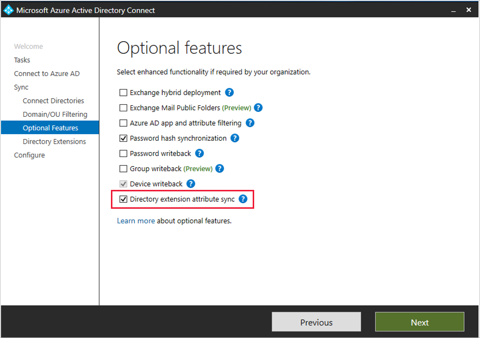
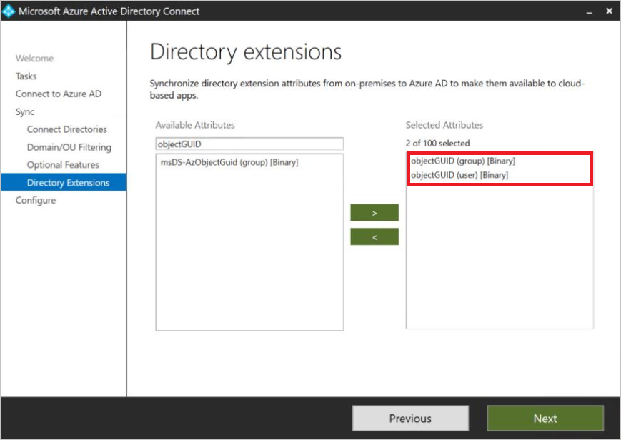
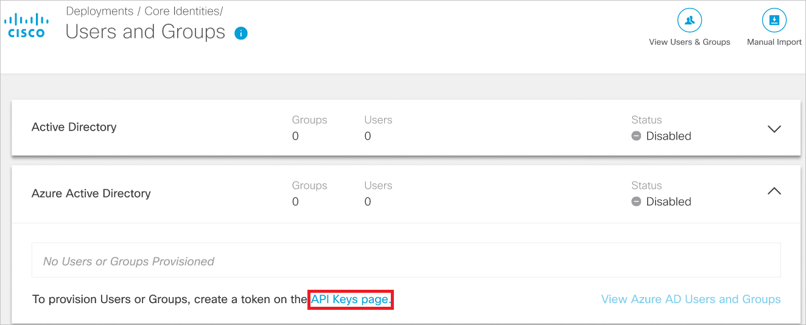
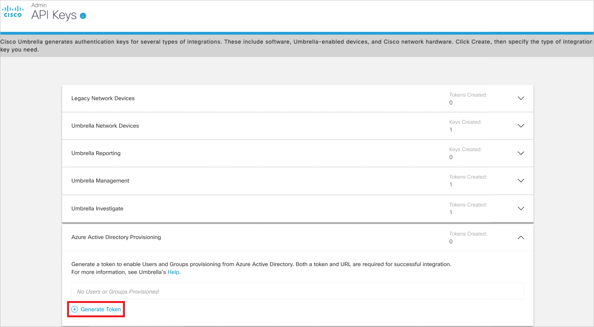

# Tutorial: Configure Cisco Umbrella User Management for automatic user provisioning

This tutorial describes the steps you need to perform in both Cisco Umbrella User Management and Azure Active Directory (Azure AD) to configure automatic user provisioning. When configured, Azure AD automatically provisions and de-provisions users and groups to [Cisco Umbrella User Management](https://umbrella.cisco.com/) using the Azure AD Provisioning service. For important details on what this service does, how it works, and frequently asked questions, see [Automate user provisioning and deprovisioning to SaaS applications with Azure Active Directory](../app-provisioning/user-provisioning.md). 

## Capabilities Supported
> [!div class="checklist"]
> * Create users in Cisco Umbrella User Management
> * Remove users in Cisco Umbrella User Management when they do not require access anymore
> * Keep user attributes synchronized between Azure AD and Cisco Umbrella User Management
> * Provision groups and group memberships in Cisco Umbrella User Management

## Prerequisites

The scenario outlined in this tutorial assumes that you already have the following prerequisites:

* [An Azure AD tenant](../develop/quickstart-create-new-tenant.md) 
* A user account in Azure AD with [permission](../roles/permissions-reference.md) to configure provisioning (e.g. Application Administrator, Cloud Application administrator, Application Owner, or Global Administrator). 
* A [Cisco Umbrella subscription](https://signup.umbrella.com).
* A user account in Cisco Umbrella with full admin permissions.

## Step 1. Plan your provisioning deployment
1. Learn about [how the provisioning service works](../app-provisioning/user-provisioning.md).
2. Determine who will be in [scope for provisioning](../app-provisioning/define-conditional-rules-for-provisioning-user-accounts.md).
3. Determine what data to [map between Azure AD and Cisco Umbrella User Management](../app-provisioning/customize-application-attributes.md). 

## Step 2. Import ObjectGUID attribute via Azure AD Connect (Optional)
If you have previously provisioned user and group identities from on-premise AD to Cisco Umbrella and would now like to provision the same users and groups from Azure AD, you will need to synchronize the ObjectGUID attribute so that previously provisioned identities persist in the Umbrella policy.

> [!NOTE]
> The on-premise Umbrella AD Connector should be turned off before importing the ObjectGUID attribute.
  
When using Microsoft Azure AD Connect, the ObjectGUID attribute of users and groups is not synchronized from on-premise AD to Azure AD by default. To synchronize this attribute, enable the optional **Directory Extension attribute sync** and select the objectGUID attributes for groups and users.  

   

> [!NOTE]
> The search under **Available Attributes** is case sensitive.

   

## Step 3. Configure Cisco Umbrella User Management to support provisioning with Azure AD

1. Log in to [Cisco Umbrella dashboard](https://login.umbrella.com ). Navigate to **Deployments** > **Core Identities** > **Users and Groups**.

2. If the import mechanism is set to Manual import, click on **Import from IdP** to switch the import mechanism. 
  
3. Expand the Azure Active Directory card and click on the **API Keys page**.

   

4. Expand the Azure Active Directory card on the API Keys page and click on **Generate Token**.

   

5. The generated token will be displayed only once. Copy and save the URL and the token. These values will be entered in the **Tenant URL** and **Secret Token** fields respectively in the Provisioning tab of your Cisco Umbrella User Management application in the Azure portal.  

## Step 4. Add Cisco Umbrella User Management from the Azure AD application gallery

Add Cisco Umbrella User Management from the Azure AD application gallery to start managing provisioning to Cisco Umbrella User Management. Learn more about adding an application from the gallery [here](../manage-apps/add-application-portal.md). 

## Step 5. Define who will be in scope for provisioning 

The Azure AD provisioning service allows you to scope who will be provisioned based on assignment to the application and or based on attributes of the user / group. If you choose to scope who will be provisioned to your app based on assignment, you can use the following [steps](../manage-apps/assign-user-or-group-access-portal.md) to assign users and groups to the application. If you choose to scope who will be provisioned based solely on attributes of the user or group, you can use a scoping filter as described [here](../app-provisioning/define-conditional-rules-for-provisioning-user-accounts.md). 

* When assigning users and groups to Cisco Umbrella User Management, you must select a role other than **Default Access**. Users with the Default Access role are excluded from provisioning and will be marked as not effectively entitled in the provisioning logs. If the only role available on the application is the default access role, you can [update the application manifest](../develop/howto-add-app-roles-in-azure-ad-apps.md) to add additional roles. 

* Start small. Test with a small set of users and groups before rolling out to everyone. When scope for provisioning is set to assigned users and groups, you can control this by assigning one or two users or groups to the app. When scope is set to all users and groups, you can specify an [attribute based scoping filter](../app-provisioning/define-conditional-rules-for-provisioning-user-accounts.md). 

## Step 6. Configure automatic user provisioning to Cisco Umbrella User Management 

This section guides you through the steps to configure the Azure AD provisioning service to create, update, and disable users and/or groups in Cisco Umbrella User Management based on user and/or group assignments in Azure AD.

### To configure automatic user provisioning for Cisco Umbrella User Management in Azure AD:

1. Sign in to the [Azure portal](https://portal.azure.com). Select **Enterprise Applications**, then select **All applications**.

	

2. In the applications list, select **Cisco Umbrella User Management**.

	

3. Select the **Provisioning** tab.

	

4. Set the **Provisioning Mode** to **Automatic**.

	

5. Under the **Admin Credentials** section, input your Cisco Umbrella User Management Tenant URL and Secret Token. Click **Test Connection** to ensure Azure AD can connect to Cisco Umbrella User Management. If the connection fails, ensure your Cisco Umbrella User Management account has Admin permissions and try again.

 	

6. In the **Notification Email** field, enter the email address of a person or group who should receive the provisioning error notifications and select the **Send an email notification when a failure occurs** check box.

	

7. Select **Save**.

8. Under the **Mappings** section, select **Synchronize Azure Active Directory Users to Cisco Umbrella User Management**.

9. Review the user attributes that are synchronized from Azure AD to Cisco Umbrella User Management in the **Attribute-Mapping** section. The attributes selected as **Matching** properties are used to match the user accounts in Cisco Umbrella User Management for update operations. If you choose to change the [matching target attribute](../app-provisioning/customize-application-attributes.md), you will need to ensure that the Cisco Umbrella User Management API supports filtering users based on that attribute. Select the **Save** button to commit any changes.

   |Attribute|Type|Supported for Filtering|
   |---|---|---|
   |userName|String|&check;|
   |externalId|String|
   |active|Boolean|
   |displayName|String|
   |name.givenName|String|
   |name.familyName|String|
   |name.formatted|String|
   |urn:ietf:params:scim:schemas:extension:ciscoumbrella:2.0:User:nativeObjectId|String|

> [!NOTE]
> If you have imported the objectGUID attribute for users via Azure AD Connect (refer Step 2), add a mapping from objectGUID to urn:ietf:params:scim:schemas:extension:ciscoumbrella:2.0:User:nativeObjectId.

10. Under the **Mappings** section, select **Synchronize Azure Active Directory Groups to Cisco Umbrella User Management**.

11. Review the group attributes that are synchronized from Azure AD to Cisco Umbrella User Management in the **Attribute-Mapping** section. The attributes selected as **Matching** properties are used to match the groups in Cisco Umbrella User Management for update operations. Select the **Save** button to commit any changes.

      |Attribute|Type|Supported for Filtering|
      |---|---|---|
      |displayName|String|&check;|
      |externalId|String|
      |members|Reference|
      |urn:ietf:params:scim:schemas:extension:ciscoumbrella:2.0:Group:nativeObjectId|String|

> [!NOTE]
> If you have imported the objectGUID attribute for groups via Azure AD Connect (refer Step 2), add a mapping from objectGUID to urn:ietf:params:scim:schemas:extension:ciscoumbrella:2.0:Group:nativeObjectId.

12. To configure scoping filters, refer to the following instructions provided in the [Scoping filter tutorial](../app-provisioning/define-conditional-rules-for-provisioning-user-accounts.md).

13. To enable the Azure AD provisioning service for Cisco Umbrella User Management, change the **Provisioning Status** to **On** in the **Settings** section.

	

14. Define the users and/or groups that you would like to provision to Cisco Umbrella User Management by choosing the desired values in **Scope** in the **Settings** section.

	

15. When you are ready to provision, click **Save**.

	

This operation starts the initial synchronization cycle of all users and groups defined in **Scope** in the **Settings** section. The initial cycle takes longer to perform than subsequent cycles, which occur approximately every 40 minutes as long as the Azure AD provisioning service is running. 

## Step 7. Monitor your deployment
Once you've configured provisioning, use the following resources to monitor your deployment:

1. Use the [provisioning logs](../reports-monitoring/concept-provisioning-logs.md) to determine which users have been provisioned successfully or unsuccessfully
2. Check the [progress bar](../app-provisioning/application-provisioning-when-will-provisioning-finish-specific-user.md) to see the status of the provisioning cycle and how close it is to completion
3. If the provisioning configuration seems to be in an unhealthy state, the application will go into quarantine. Learn more about quarantine states [here](../app-provisioning/application-provisioning-quarantine-status.md).  

## Connector Limitations
* Cisco Umbrella User Management supports provisioning a maximum of 200 groups. Any groups beyond this number that are in scope may not be provisioned to Cisco Umbrella. 

## Additional resources

* [Managing user account provisioning for Enterprise Apps](../app-provisioning/configure-automatic-user-provisioning-portal.md)
* [What is application access and single sign-on with Azure Active Directory?](../manage-apps/what-is-single-sign-on.md)

## Next steps

* [Learn how to review logs and get reports on provisioning activity](../app-provisioning/check-status-user-account-provisioning.md)