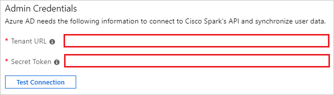
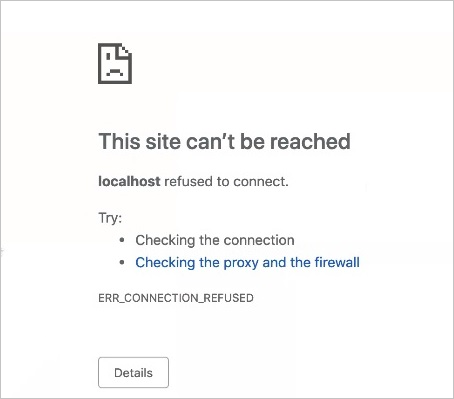
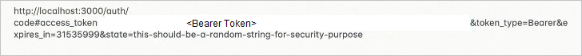
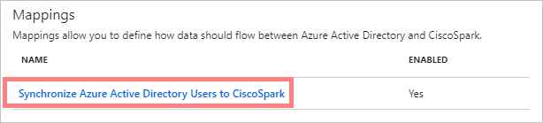

# Tutorial: Configure Cisco Webex for automatic user provisioning

The objective of this tutorial is to demonstrate the steps to be performed in Cisco Webex  and Azure Active Directory (Azure AD) to configure Azure AD to automatically provision and de-provision users to Cisco Webex.

> [!NOTE]
> This tutorial describes a connector built on top of the Azure AD User Provisioning Service. For important details on what this service does, how it works, and frequently asked questions, see [Automate user provisioning and deprovisioning to SaaS applications with Azure Active Directory](../app-provisioning/user-provisioning.md).
>
> This connector is currently in Preview. For more information on the general Microsoft Azure terms of use for Preview features, see [Supplemental Terms of Use for Microsoft Azure Previews](https://azure.microsoft.com/support/legal/preview-supplemental-terms/).

## Prerequisites

The scenario outlined in this tutorial assumes that you already have the following prerequisites:

* An Azure AD tenant.
* [A Cisco Webex tenant](https://www.webex.com/pricing/index.html).
* A user account in Cisco Webex  with Admin permissions.

## Adding Cisco Webex from the gallery

Before configuring Cisco Webex for automatic user provisioning with Azure AD, you need to add Cisco Webex from the Azure AD application gallery to your list of managed SaaS applications.

**To add Cisco Webex from the Azure AD application gallery, perform the following steps:**

1. In the **[Azure portal](https://portal.azure.com)**, on the left navigation panel, click **Azure Active Directory** icon.

    

2. Navigate to **Enterprise Applications** and then select the **All Applications** option.

    

3. To add new application, click **New application** button on the top of dialog.

    

4. In the search box, type **Cisco Webex**, select **Cisco Webex** from result panel then click **Add** button to add the application.

    

## Assigning users to Cisco Webex

Azure Active Directory uses a concept called "assignments" to determine which users should receive access to selected apps. In the context of automatic user provisioning, only the users and/or groups that have been "assigned" to an application in Azure AD are synchronized.

Before configuring and enabling automatic user provisioning, you should decide which users in Azure AD need access to Cisco Webex. Once decided, you can assign these users to Cisco Webex by following the instructions here:

* [Assign a user or group to an enterprise app](../manage-apps/assign-user-or-group-access-portal.md)

### Important tips for assigning users to Cisco Webex

* It is recommended that a single Azure AD user is assigned to Cisco Webex to test the automatic user provisioning configuration. Additional users may be assigned later.

* When assigning a user to Cisco Webex, you must select any valid application-specific role (if available) in the assignment dialog. Users with the **Default Access** role are excluded from provisioning.

## Configuring automatic user provisioning to Cisco Webex

This section guides you through the steps to configure the Azure AD provisioning service to create, update, and disable users in Cisco Webex based on user assignments in Azure AD.

### To configure automatic user provisioning for Cisco Webex in Azure AD:

1. Sign in to the [Azure portal](https://portal.azure.com) and select **Enterprise Applications**, select **All applications**, then select **Cisco Webex**.

    

2. In the applications list, select **Cisco Webex**.

    

3. Select the **Provisioning** tab.

    

4. Set the **Provisioning Mode** to **Automatic**.

    

5. Under the **Admin Credentials** section, input the **Tenant URL**, and **Secret Token** of your Cisco Webex account.

    

6.  In the **Tenant URL** field, enter a value in the form of `https://api.ciscoweb.com/v1/scim/[OrgId]`. To obtain `[OrgId]`, sign into your [Cisco Webex Control Hub](https://admin.webex.com/login). Click on your organization name on the bottom left and copy the value from **Organization ID**. 

    * To obtain the value for **Secret Token**, navigate to this [URL](https://idbroker.webex.com/idb/saml2/jsp/doSSO.jsp?type=login&goto=https%3A%2F%2Fidbroker.webex.com%2Fidb%2Foauth2%2Fv1%2Fauthorize%3Fresponse_type%3Dtoken%26client_id%3DC4ca14fe00b0e51efb414ebd45aa88c1858c3bfb949b2405dba10b0ca4bc37402%26redirect_uri%3Dhttp%253A%252F%252Flocalhost%253A3000%252Fauth%252Fcode%26scope%3Dspark%253Apeople_read%2520spark%253Apeople_write%2520Identity%253ASCIM%26state%3Dthis-should-be-a-random-string-for-security-purpose). From the webex sign in page that appears, sign in with the full Cisco Webex admin account for your organization. An error page appears saying that the site can't be reached, but this is normal.

        
 
    * Copy the value of the generated bearer token from the URL as highlighted below. This token is valid for 365 days.
        
        

7. Upon populating the fields shown in Step 5, click **Test Connection** to ensure Azure AD can connect to Cisco Webex. If the connection fails, ensure your Cisco Webex account has Admin permissions and try again.

    
   
8. In the **Notification Email** field, enter the email address of a person or group who should receive the provisioning error notifications and check the checkbox - **Send an email notification when a failure occurs**.

    

9. Click **Save**.

10. Under the **Mappings** section, select **Synchronize Azure Active Directory Users to Cisco Webex**.

    

11. Review the user attributes that are synchronized from Azure AD to Cisco Webex in the **Attribute Mapping** section. The attributes selected as **Matching** properties are used to match the user accounts in Cisco Webex for update operations. Select the **Save** button to commit any changes.

    

12. To configure scoping filters, refer to the following instructions provided in the [Scoping filter tutorial](../app-provisioning/define-conditional-rules-for-provisioning-user-accounts.md).

13. To enable the Azure AD provisioning service for Cisco Webex, change the **Provisioning Status** to **On** in the **Settings** section.

    

14. Define the users and/or groups that you would like to provision to Cisco Webex by choosing the desired values in **Scope** in the **Settings** section.

    

15. When you are ready to provision, click **Save**.

    

This operation starts the initial synchronization of all users and/or groups defined in **Scope** in the **Settings** section. The initial sync takes longer to perform than subsequent syncs, which occur approximately every 40 minutes as long as the Azure AD provisioning service is running. You can use the **Synchronization Details** section to monitor progress and follow links to provisioning activity report, which describes all actions performed by the Azure AD provisioning service on Cisco Webex.

For more information on how to read the Azure AD provisioning logs, see [Reporting on automatic user account provisioning](../app-provisioning/check-status-user-account-provisioning.md).

## Connector limitations

* Cisco Webex is currently in Cisco's Early Field Testing (EFT) phase. For more information, please contact [Cisco's support team](https://www.webex.co.in/support/support-overview.html). 
* For more information on Cisco Webex configuration, refer to the Cisco documentation [here](https://help.webex.com/en-us/aumpbz/Synchronize-Azure-Active-Directory-Users-into-cisco-webex-Control-Hub).

## Additional resources

* [Managing user account provisioning for Enterprise Apps](../app-provisioning/configure-automatic-user-provisioning-portal.md)
* [What is application access and single sign-on with Azure Active Directory?](../manage-apps/what-is-single-sign-on.md)

## Next steps

* [Learn how to review logs and get reports on provisioning activity](../app-provisioning/check-status-user-account-provisioning.md)