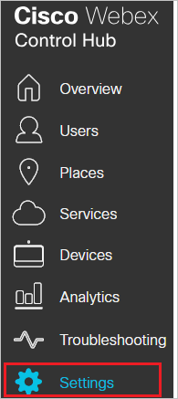
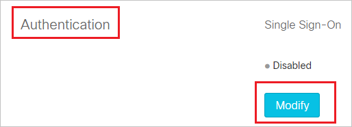
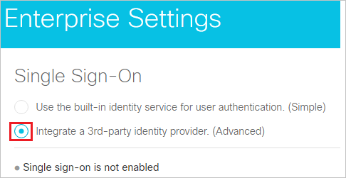
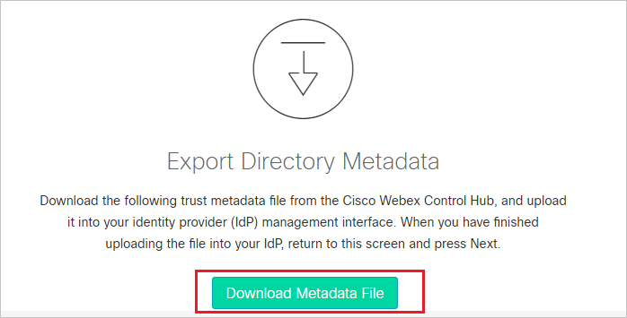
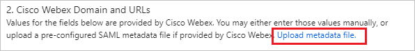
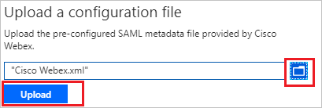
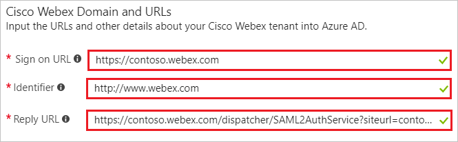
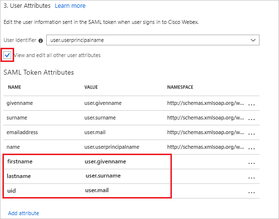
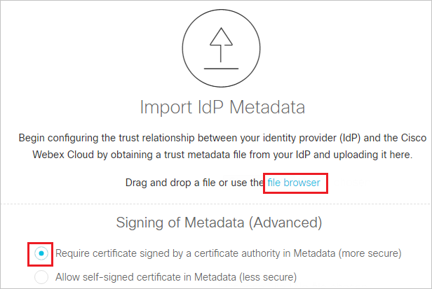

# Tutorial: Azure Active Directory integration with Cisco Webex

In this tutorial, you learn how to integrate Cisco Webex with Azure Active Directory (Azure AD).

Integrating Cisco Webex with Azure AD provides you with the following benefits:

- You can control in Azure AD who has access to Cisco Webex.
- You can enable your users to automatically get signed in to Cisco Webex with their Azure AD accounts.
- You can manage your accounts in one central location--the Azure portal.

For more details about SaaS app integration with Azure AD, see [What is application access and single sign-on with Azure Active Directory?](../manage-apps/what-is-single-sign-on.md).

## Prerequisites

To configure Azure AD integration with Cisco Webex, you need the following items:

- An Azure AD subscription
- A Cisco Webex single sign-on-enabled subscription

> [!NOTE]
> We don't recommend using a production environment to test the steps in this tutorial.

To test the steps in this tutorial, follow these recommendations:

- Don't use your production environment unless it's necessary.
- If you don't have an Azure AD trial environment, you can [get a one-month free trial](https://azure.microsoft.com/pricing/free-trial/).

## Scenario description
In this tutorial, you test Azure AD single sign-on in a test environment. 
The scenario outlined in this tutorial consists of two main building blocks:

1. Adding Cisco Webex from the gallery
2. Configuring and testing Azure AD single sign-on

## Add Cisco Webex from the gallery
To configure the integration of Cisco Webex into Azure AD, you need to add Cisco Webex from the gallery to your list of managed SaaS apps.

**To add Cisco Webex from the gallery, take the following steps:**

1. In the [Azure portal](https://portal.azure.com), in the left pane, select the **Azure Active Directory** icon. 

	![The Azure Active Directory button][1]

2. Go to **Enterprise applications**. Then go to **All applications**.

	![The Enterprise applications blade][2]
	
3. To add a new application, select the **New application** button on the top of the dialog box.

	![The New application button][3]

4. In the search box, type **Cisco Webex**. 

5. Select **Cisco Webex** from the results panel. Then select the **Add** button to add the application.

	

## Configure and test Azure AD single sign-on

In this section, you configure and test Azure AD single sign-on with Cisco Webex based on a test user called "Britta Simon."

For single sign-on to work, Azure AD needs to know who the counterpart user in Cisco Webex is to a user in Azure AD. In other words, you need to establish a link between an Azure AD user and a related user in Cisco Webex.

In Cisco Webex, give the value **Username** the same value as **user name** in Azure AD. Now you have established the link between the two users. 

To configure and test Azure AD single sign-on with Cisco Webex, complete the following building blocks:

1. [Configure Azure AD single sign-on](#configure-azure-ad-single-sign-on) to enable your users to use this feature.
2. [Create an Azure AD test user](#create-an-azure-ad-test-user) to test Azure AD single sign-on with Britta Simon.
3. [Create a Cisco Webex test user](#create-a-cisco-webex-test-user) to have a counterpart of Britta Simon in Cisco Webex that is linked to the Azure AD representation of user.
4. [Assign the Azure AD test user](#assign-the-azure-ad-test-user) to enable Britta Simon to use Azure AD single sign-on.
5. [Test single sign-on](#test-single-sign-on) to verify that the configuration works.

### Configure Azure AD single sign-on

In this section, you enable Azure AD single sign-on in the Azure portal and configure single sign-on in your Cisco Webex application.

**To configure Azure AD single sign-on with Cisco Webex, take the following steps:**

1. In the Azure portal, on the **Cisco Webex** application integration page, select **Single sign-on**.

	![Configure single sign-on link][4]

2. To enable single sign-on, in the **Single sign-on** dialog box, in the **Mode** drop-down list, select **SAML-based Sign-on**.
 
	

3. In a different web browser window, sign in to your Cisco Webex company site as an administrator.

4. Click **Settings** from the left of the menu.

	

5. On the settings page scroll down under the **Authentication** section, click **Modify**.

	

6. Select **Integrate a 3rd-party identity provider. (Advanced)** and go to the next screen.

	

7. On the **Export Directory Metadata** page, click **Download Metadata File** to download the metadata file.

	

8. In the Azure portal, under the **Cisco Webex Domain and URLs** section, upload the downloaded **Service Provider metadata file** and configure the application by performing the following steps:

	a. Click **Upload metadata file**.

	

	b. Click on **folder logo** to select the metadata file and click **Upload**.

	

	c. After successful completion of uploading **Service Provider metadata file** the **Identifier** and **Reply URL** values get auto populated in **Cisco Webex Domain and URLs** section textbox as shown below:

	

	d. In the **Sign-on URL** box, type a URL with the following pattern: `https://<SUBDOMAIN>.webex.com/`
	 
	> [!NOTE] 
	> These values are not real. Update these values with the actual Sign on URL. Contact [Cisco Webex Client support team](https://www.webex.co.in/support/support-overview.html) to get these values.

9. Cisco Webex application expects the SAML assertions to contain specific attributes. Configure the following attributes  for this application. You can manage the values of these attributes from the **User Attributes** section on application integration page. The following screenshot shows an example for this.
	
	 

10. In the **User Attributes** section on the **Single sign-on** dialog, configure SAML token attribute as shown in the image above and perform the following steps:
	
	|  Attribute Name  | Attribute Value |
	| --------------- | -------------------- |    
	|   firstname    | user.givenname |
	|   lastname    | user.surname |
	|   uid    | user.mail |

	a. Click **Add attribute** to open the **Add Attribute** dialog.

	

	
	
	b. In the **Name** textbox, type the attribute name shown for that row.
	
	c. From the **Value** list, type the attribute value shown for that row.
	
	d. Click **Ok**.

11. On the **SAML Signing Certificate** section, select **Metadata XML**, and then save the metadata file on your computer.

	 

12. Select **Save**.

	
	
13. On the Cisco Webex company site administrator page, use the file browser option to locate and upload the Azure AD metadata file. Then, select **Require certificate signed by a certificate authority in Metadata (more secure)** and go to next screen. 

	

14. Select **Test SSO Connection**, and when a new browser tab opens, authenticate with Azure AD by signing in.

15. Return to the **Cisco Cloud Collaboration Management** browser tab. If the test was successful, select **This test was successful. Enable Single Sign-On option** and click **Save**.

### Create an Azure AD test user

The objective of this section is to create a test user in the Azure portal called Britta Simon.

   ![Create an Azure AD test user][100]

**To create a test user in Azure AD, perform the following steps:**

1. In the Azure portal, in the left pane, select the **Azure Active Directory** button.

    

2. To display the list of users, go to **Users and groups**, and then select **All users**.

    

3. To open the **User** dialog box, select **Add** at the top of the **All Users** dialog box.

    

4. In the **User** dialog box, take the following steps:

    

    a. In the **Name** box, type **BrittaSimon**.

    b. In the **User name** box, type the email address of user Britta Simon.

    c. Select the **Show Password** check box, and then write down the value that's displayed in the **Password** box.

    d. Select **Create**.
 
### Create a Cisco Webex test user

The objective of this section is to create a user called Britta Simon in Cisco Webex. Cisco Webex supports just-in-time provisioning and automatic user provisioning, which is by default enabled. You can find more details [here](https://docs.microsoft.com/azure/active-directory/saas-apps/cisco-webex-provisioning-tutorial) on how to configure automatic user provisioning.

### Assign the Azure AD test user

In this section, you enable the user Britta Simon to use Azure single sign-on by granting them access to Cisco Webex.

![Assign the user role][200] 

**To assign Britta Simon to Cisco Webex, take the following steps:**

1. In the Azure portal, open the applications view. Next, go to the directory view, and then to **Enterprise applications**.  

2. Select **All applications**.

	![Assign user][201] 

3. In the applications list, select **Cisco Webex**.

	  

3. In the menu on the left, select **Users and groups**.

	![The "Users and groups" link][202]

4. Select the **Add** button. Then select **Users and groups** in the  **Add Assignment** dialog box.

	![The Add Assignment pane][203]

5. In the **Users and groups** dialog box, select **Britta Simon** in the **Users** list.

6. In the **Users and groups** dialog box, click the **Select** button.

7. Select the **Assign** button in the **Add Assignment** dialog box.
	
### Test single sign-on

In this section, you test your Azure AD single sign-on configuration by using the access panel.

When you select the Cisco Webex tile in the access panel, you automatically get signed in to your Cisco Webex application.

For more information about the access panel, see [Introduction to the access panel](../user-help/active-directory-saas-access-panel-introduction.md). 

## Additional resources

* [List of tutorials on how to integrate SaaS Apps with Azure Active Directory](tutorial-list.md)
* [What is application access and single sign-on with Azure Active Directory?](../manage-apps/what-is-single-sign-on.md)

<!--Image references-->

[1]: ./media/cisco-webex-tutorial/tutorial_general_01.png
[2]: ./media/cisco-webex-tutorial/tutorial_general_02.png
[3]: ./media/cisco-webex-tutorial/tutorial_general_03.png
[4]: ./media/cisco-webex-tutorial/tutorial_general_04.png

[100]: ./media/cisco-webex-tutorial/tutorial_general_100.png

[200]: ./media/cisco-webex-tutorial/tutorial_general_200.png
[201]: ./media/cisco-webex-tutorial/tutorial_general_201.png
[202]: ./media/cisco-webex-tutorial/tutorial_general_202.png
[203]: ./media/cisco-webex-tutorial/tutorial_general_203.png

