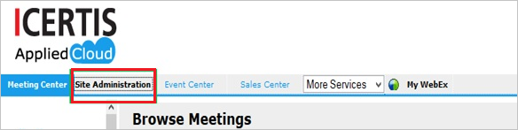
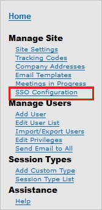
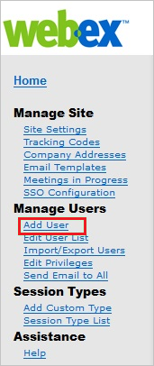
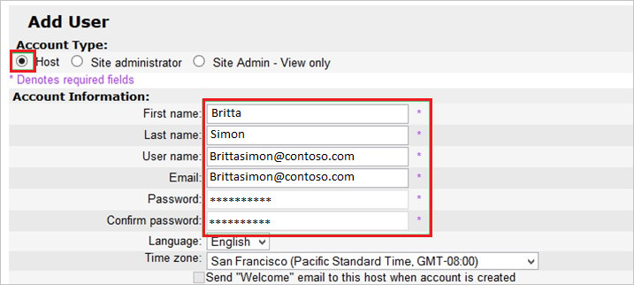

---
title: 'Tutorial: Azure Active Directory integration with Cisco Webex | Microsoft Docs'
description: Learn how to configure single sign-on between Azure Active Directory and Cisco Webex.
services: active-directory
documentationCenter: na
author: jeevansd
manager: femila
ms.reviewer: joflore

ms.assetid: 26704ca7-13ed-4261-bf24-fd6252e2072b
ms.service: active-directory
ms.component: saas-app-tutorial
ms.workload: identity
ms.tgt_pltfrm: na
ms.devlang: na
ms.topic: article
ms.date: 12/08/2017
ms.author: jeedes

---
# Tutorial: Azure Active Directory integration with Cisco Webex

In this tutorial, you learn how to integrate Cisco Webex with Azure Active Directory (Azure AD).

Integrating Cisco Webex with Azure AD provides you with the following benefits:

- You can control in Azure AD who has access to Cisco Webex.
- You can enable your users to automatically get signed in to Cisco Webex with their Azure AD accounts.
- You can manage your accounts in one central location--the Azure portal.

For more details about SaaS app integration with Azure AD, see [What is application access and single sign-on with Azure Active Directory?](../manage-apps/what-is-single-sign-on.md).

## Prerequisites

To configure Azure AD integration with Cisco Webex, you need the following items:

- An Azure AD subscription
- A Cisco Webex single sign-on-enabled subscription

> [!NOTE]
> We don't recommend using a production environment to test the steps in this tutorial.

To test the steps in this tutorial, follow these recommendations:

- Don't use your production environment unless it's necessary.
- If you don't have an Azure AD trial environment, you can [get a one-month free trial](https://azure.microsoft.com/pricing/free-trial/).

## Scenario description
In this tutorial, you test Azure AD single sign-on in a test environment. 
The scenario outlined in this tutorial consists of two main building blocks:

1. Adding Cisco Webex from the gallery
1. Configuring and testing Azure AD single sign-on

## Add Cisco Webex from the gallery
To configure the integration of Cisco Webex into Azure AD, you need to add Cisco Webex from the gallery to your list of managed SaaS apps.

**To add Cisco Webex from the gallery, take the following steps:**

1. In the [Azure portal](https://portal.azure.com), in the left pane, select the **Azure Active Directory** icon. 

	![The Azure Active Directory button][1]

1. Go to **Enterprise applications**. Then go to **All applications**.

	![The Enterprise applications blade][2]
	
1. To add a new application, select the **New application** button on the top of the dialog box.

	![The New application button][3]

1. In the search box, type **Cisco Webex**. 

1. Select **Cisco Webex** from the results panel. Then select the **Add** button to add the application.

	

## Configure and test Azure AD single sign-on

In this section, you configure and test Azure AD single sign-on with Cisco Webex based on a test user called "Britta Simon."

For single sign-on to work, Azure AD needs to know who the counterpart user in Cisco Webex is to a user in Azure AD. In other words, you need to establish a link between an Azure AD user and a related user in Cisco Webex.

In Cisco Webex, give the value **Username** the same value as **user name** in Azure AD. Now you have established the link between the two users. 

To configure and test Azure AD single sign-on with Cisco Webex, complete the following building blocks:

1. [Configure Azure AD single sign-on](#configure-azure-ad-single-sign-on) to enable your users to use this feature.
1. [Create an Azure AD test user](#create-an-azure-ad-test-user) to test Azure AD single sign-on with Britta Simon.
1. [Create a Cisco Webex test user](#create-a-cisco-webex-test-user) to have a counterpart of Britta Simon in Cisco Webex that is linked to the Azure AD representation of user.
1. [Assign the Azure AD test user](#assign-the-azure-ad-test-user) to enable Britta Simon to use Azure AD single sign-on.
1. [Test single sign-on](#test-single-sign-on) to verify that the configuration works.

### Configure Azure AD single sign-on

In this section, you enable Azure AD single sign-on in the Azure portal and configure single sign-on in your Cisco Webex application.

**To configure Azure AD single sign-on with Cisco Webex, take the following steps:**

1. In the Azure portal, on the **Cisco Webex** application integration page, select **Single sign-on**.

	![Configure single sign-on link][4]

1. To enable single sign-on, in the **Single sign-on** dialog box, in the **Mode** drop-down list, select **SAML-based Sign-on**.
 
	

1. In the **Cisco Webex Domain and URLs** section, take the following steps:

	

	a. In the **Sign-on URL** box, type a URL with the following pattern: `https://<subdomain>.webex.com`

    b. In the **Identifier** box, type the URL `http://www.webex.com`.

	c. In the **Reply URL** box, type a URL with the following pattern: `https://company.webex.com/dispatcher/SAML2AuthService?siteurl=company`
	 
	> [!NOTE] 
	> These values are not real. Update these values with the actual reply URL and sign-on URL. Contact [Cisco Webex Client support team](https://www.webex.co.in/support/support-overview.html) to get these values. 

1. On the **SAML Signing Certificate** section, select **Metadata XML**, and then save the metadata file on your computer.

	 

1. Select **Save**.

	
	
1. In the **Cisco Webex Configuration** section, select **Configure Cisco Webex** to open the **Configure sign-on** window. Copy the **Sign-Out URL**, **SAML Entity ID**, and **SAML Single Sign-On Service URL** from the **Quick Reference** section.

	 

1. In a different web browser window, sign in to your Cisco Webex company site as an administrator.

1. From the menu on the top, select **Site Administration**.

	

1. In the **Manage Site** section, select **SSO Configuration**.
   
	

1. In the **Federated Web SSO Configuration** section, take the following steps:
   
	  

	a. In the **Federation Protocol** list, select **SAML 2.0**.

	b. For **SSO profile**, select **SP Initiated**.

	c. Open your downloaded certificate in Notepad, and then copy the content.

	d. Select **Import SAML Metadata**, and then paste the copied content of the certificate.

	e. In the **Issuer for SAML (IdP ID)** box, paste the value of the **SAML Entity ID** that you copied from the Azure portal.

	f. In the **Customer SSO Service Login URL** box, paste **SAML Single Sign-On Service URL**, which you copied from the Azure portal.

	g. From the **NameID Format** list, select **Email address**.

	h. In the **AuthnContextClassRef** box, type **urn:oasis:names:tc:SAML:2.0:ac:classes:Password**.

	i. In the **Customer SSO Service Logout URL** box, paste **Sign-Out URL**, which you copied from the Azure portal.
   
	j. Select **Update**.

> [!TIP]
> You can now read a concise version of these instructions inside the [Azure portal](https://portal.azure.com) while you are setting up the app. After you add this app from the **Active Directory** > **Enterprise Applications** section, select the **Single Sign-On** tab, and then access the embedded documentation through the **Configuration** section at the bottom. You can read more about the embedded documentation feature at [Azure AD embedded documentation](https://go.microsoft.com/fwlink/?linkid=845985).

### Create an Azure AD test user

The objective of this section is to create a test user in the Azure portal called Britta Simon.

   ![Create an Azure AD test user][100]

**To create a test user in Azure AD, perform the following steps:**

1. In the Azure portal, in the left pane, select the **Azure Active Directory** button.

    

1. To display the list of users, go to **Users and groups**, and then select **All users**.

    

1. To open the **User** dialog box, select **Add** at the top of the **All Users** dialog box.

    

1. In the **User** dialog box, take the following steps:

    

    a. In the **Name** box, type **BrittaSimon**.

    b. In the **User name** box, type the email address of user Britta Simon.

    c. Select the **Show Password** check box, and then write down the value that's displayed in the **Password** box.

    d. Select **Create**.
 
### Create a Cisco Webex test user

To enable Azure AD users to sign in to Cisco Webex, they must be provisioned in Cisco Webex. In the case of Cisco Webex, provisioning is a manual task.

**To provision a user account, take the following steps:**

1. Sign in to your **Cisco Webex** tenant.

1. Go to **Manage Users** > **Add User**.
   
	

1. In the **Add User** section, take the following steps:
   
	   

	a. For **Account Type**, select **Host**.

	b. In the **First name** box, type the first name of the user (in this case, **Britta**).

	c. In the **Last name** box, type the last name of the user (in this case, **Simon**).

	d. In the **Username** box, type the email of the user (in this case, **Brittasimon@contoso.com**).

	e. In the **Email** box, type the email address of the user (in this case, **Brittasimon@contoso.com**).

	f. In the **Password** box, type the user's password.

	g. In the **Confirm** Password box, reenter the user's password.

	h. Select **Add**.

>[!NOTE]
>You can use any other Cisco Webex user account creation tools or APIs that are provided by Cisco Webex to provision Azure AD user accounts. 

### Assign the Azure AD test user

In this section, you enable the user Britta Simon to use Azure single sign-on by granting them access to Cisco Webex.

![Assign the user role][200] 

**To assign Britta Simon to Cisco Webex, take the following steps:**

1. In the Azure portal, open the applications view. Next, go to the directory view, and then to **Enterprise applications**.  

1. Select **All applications**.

	![Assign user][201] 

1. In the applications list, select **Cisco Webex**.

	  

1. In the menu on the left, select **Users and groups**.

	![The "Users and groups" link][202]

1. Select the **Add** button. Then select **Users and groups** in the  **Add Assignment** dialog box.

	![The Add Assignment pane][203]

1. In the **Users and groups** dialog box, select **Britta Simon** in the **Users** list.

1. In the **Users and groups** dialog box, click the **Select** button.

1. Select the **Assign** button in the **Add Assignment** dialog box.
	
### Test single sign-on

In this section, you test your Azure AD single sign-on configuration by using the access panel.

When you select the Cisco Webex tile in the access panel, you automatically get signed in to your Cisco Webex application.

For more information about the access panel, see [Introduction to the access panel](../user-help/active-directory-saas-access-panel-introduction.md). 

## Additional resources

* [List of tutorials on how to integrate SaaS Apps with Azure Active Directory](tutorial-list.md)
* [What is application access and single sign-on with Azure Active Directory?](../manage-apps/what-is-single-sign-on.md)

<!--Image references-->

[1]: ./media/cisco-webex-tutorial/tutorial_general_01.png
[2]: ./media/cisco-webex-tutorial/tutorial_general_02.png
[3]: ./media/cisco-webex-tutorial/tutorial_general_03.png
[4]: ./media/cisco-webex-tutorial/tutorial_general_04.png

[100]: ./media/cisco-webex-tutorial/tutorial_general_100.png

[200]: ./media/cisco-webex-tutorial/tutorial_general_200.png
[201]: ./media/cisco-webex-tutorial/tutorial_general_201.png
[202]: ./media/cisco-webex-tutorial/tutorial_general_202.png
[203]: ./media/cisco-webex-tutorial/tutorial_general_203.png

