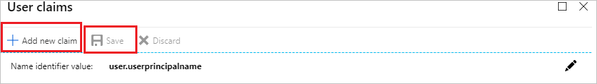
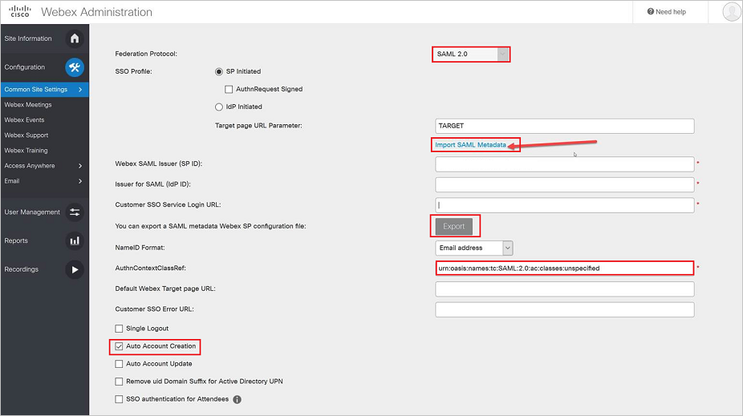
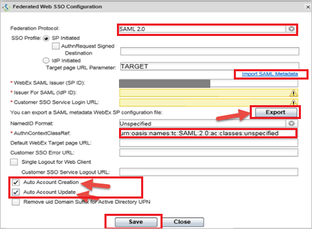

# Tutorial: Azure Active Directory integration with Cisco Webex Meetings

In this tutorial, you learn how to integrate Cisco Webex Meetings with Azure Active Directory (Azure AD).
Integrating Cisco Webex Meetings with Azure AD provides you with the following benefits:

* You can control in Azure AD who has access to Cisco Webex Meetings.
* You can enable your users to be automatically signed-in to Cisco Webex Meetings (Single Sign-On) with their Azure AD accounts.
* You can manage your accounts in one central location - the Azure portal.

If you want to know more details about SaaS app integration with Azure AD, see [What is application access and single sign-on with Azure Active Directory](https://docs.microsoft.com/azure/active-directory/active-directory-appssoaccess-whatis).
If you don't have an Azure subscription, [create a free account](https://azure.microsoft.com/free/) before you begin.

## Prerequisites

To configure Azure AD integration with Cisco Webex Meetings, you need the following items:

* An Azure AD subscription. If you don't have an Azure AD environment, you can get one-month trial [here](https://azure.microsoft.com/pricing/free-trial/)
* Cisco Webex Meetings single sign-on enabled subscription

## Scenario description

In this tutorial, you configure and test Azure AD single sign-on in a test environment.

* Cisco Webex Meetings supports **SP** initiated SSO

* Cisco Webex Meetings supports **Just In Time** user provisioning

## Adding Cisco Webex Meetings from the gallery

To configure the integration of Cisco Webex Meetings into Azure AD, you need to add Cisco Webex Meetings from the gallery to your list of managed SaaS apps.

**To add Cisco Webex Meetings from the gallery, perform the following steps:**

1. In the **[Azure portal](https://portal.azure.com)**, on the left navigation panel, click **Azure Active Directory** icon.

	

2. Navigate to **Enterprise Applications** and then select the **All Applications** option.

	

3. To add new application, click **New application** button on the top of dialog.

	

4. In the search box, type **Cisco Webex Meetings**, select **Cisco Webex Meetings** from result panel then click **Add** button to add the application.

	 

## Configure and test Azure AD single sign-on

In this section, you configure and test Azure AD single sign-on with Cisco Webex Meetings based on a test user called **Britta Simon**.
For single sign-on to work, a link relationship between an Azure AD user and the related user in Cisco Webex Meetings needs to be established.

To configure and test Azure AD single sign-on with Cisco Webex Meetings, you need to complete the following building blocks:

1. **[Configure Azure AD Single Sign-On](#configure-azure-ad-single-sign-on)** - to enable your users to use this feature.
2. **[Configure Cisco Webex Meetings Single Sign-On](#configure-cisco-webex-meetings-single-sign-on)** - to configure the Single Sign-On settings on application side.
3. **[Create an Azure AD test user](#create-an-azure-ad-test-user)** - to test Azure AD single sign-on with Britta Simon.
4. **[Assign the Azure AD test user](#assign-the-azure-ad-test-user)** - to enable Britta Simon to use Azure AD single sign-on.
5. **[Create Cisco Webex Meetings test user](#create-cisco-webex-meetings-test-user)** - to have a counterpart of Britta Simon in Cisco Webex Meetings that is linked to the Azure AD representation of user.
6. **[Test single sign-on](#test-single-sign-on)** - to verify whether the configuration works.

### Configure Azure AD single sign-on

In this section, you enable Azure AD single sign-on in the Azure portal.

To configure Azure AD single sign-on with Cisco Webex Meetings, perform the following steps:

1. In the [Azure portal](https://portal.azure.com/), on the **Cisco Webex Meetings** application integration page, select **Single sign-on**.

    

2. On the **Select a Single sign-on method** dialog, select **SAML/WS-Fed** mode to enable single sign-on.

    

3. In the Azure portal, On the **Set up Single Sign-On with SAML** page, click **Edit** icon to open **Basic SAML Configuration** dialog.

	

4. On the **Basic SAML Configuration** section, upload the downloaded **Service Provider metadata** file and configure the application by performing the following steps:

	>[!Note]
	>You will get the Service Provider Metadata file, which is explained later in the **Configure Cisco Webex Meetings Single Sign-On** section of the tutorial. 

	a. Click **Upload metadata file**.

    

	b. Click on **folder logo** to select the metadata file and click **Upload**.

	

	c. After successful completion of uploading Service Provider metadata file the **Identifier** and **Reply URL** values get auto populated in **Basic SAML Configuration** section:

	

	In the **Sign on URL** textbox, paste the value of **Reply URL** which gets auto-filled by SP metadata file upload.

5. Cisco Webex Meetings application expects the SAML assertions in a specific format, which requires you to add custom attribute mappings to your SAML token attributes configuration. The following screenshot shows the list of default attributes. Click on **Edit** icon to add the attributes.

	

6. Delete the default attributes from **User claims** section and Cisco Webex Meetings application expects few more attributes to be passed back in SAML response. In the **User Claims** section on the **User Attributes** dialog, perform the following steps to add SAML token attribute as shown in the below table:
    
	| Name | Source Attribute|
	| ---------------|  --------- |
	|   firstname    | user.givenname |
	|   lastname    | user.surname |
	|   email       | user.mail |
	|   uid    | user.mail |

	a. Click **Add new claim** to open the **Manage user claims** dialog.

	

	

	b. In the **Name** textbox, type the attribute name shown for that row.

	c. Leave the **Namespace** blank.

	d. Select Source as **Attribute**.

	e. From the **Source attribute** list, type the attribute value shown for that row.

	f. Click **Ok**

	g. Click **Save**.

7. On the **Set up Single Sign-On with SAML** page, in the **SAML Signing Certificate** section, click **Download** to download the **Federation Metadata XML** from the given options as per your requirement and save it on your computer.

	

8. On the **Set up Cisco Webex Meetings** section, copy the appropriate URL(s) as per your requirement.

	

	a. Login URL

	b. Azure AD Identifier

	c. Logout URL

### Configure Cisco Webex Meetings Single Sign-On

1. Go to [Cisco Cloud Collaboration Management](https://www.webex.com/go/connectadmin) with your administration credentials.

2. Go to **Security Settings** and navigate to **Federated Web SSO Configuration**.
 
	

3. On the **Federated Web SSO Configuration** perform the following steps:

	

	a. In the Federation Protocol textbox, type the name of your protocol.

	b. Click on **Import SAML Metadata** link to upload the metadata file, which you have downloaded from Azure portal.

	c. Click on **Export** button to download the Service Provider Metadata file and upload it in the **Basic SAML Configuration** section on Azure portal.

	d. In the **AuthContextClassRef** textbox, type `urn:oasis:names:tc:SAML:2.0:ac:classes:unspecified` and if you want to enable the MFA using Azure AD type the two values like `urn:oasis:names:tc:SAML:2.0:ac:classes:PasswordProtectedTransport;urn:oasis:names:tc:SAML:2.0:ac:classes:X509`

	e. Select **Auto Account Creation**.

	>[!NOTE]
	>For enabling **just-in-time** user provisioning you need to check the **Auto Account Creation**. In addition to that SAML token attributes need to be passed in the SAML response.

	f. Click **Save**. 

### Create an Azure AD test user

The objective of this section is to create a test user in the Azure portal called Britta Simon.

1. In the Azure portal, in the left pane, select **Azure Active Directory**, select **Users**, and then select **All users**.

    

2. Select **New user** at the top of the screen.

    

3. In the User properties, perform the following steps.

    

    a. In the **Name** field enter **BrittaSimon**.
  
    b. In the **User name** field type **brittasimon\@yourcompanydomain.extension**  
    For example, BrittaSimon@contoso.com

    c. Select **Show password** check box, and then write down the value that's displayed in the Password box.

    d. Click **Create**.

### Assign the Azure AD test user

In this section, you enable Britta Simon to use Azure single sign-on by granting access to Cisco Webex Meetings.

1. In the Azure portal, select **Enterprise Applications**, select **All applications**, then select **Cisco Webex Meetings**.

	

2. In the applications list, select **Cisco Webex Meetings**.

	

3. In the menu on the left, select **Users and groups**.

    

4. Click the **Add user** button, then select **Users and groups** in the **Add Assignment** dialog.

    

5. In the **Users and groups** dialog select **Britta Simon** in the Users list, then click the **Select** button at the bottom of the screen.

6. If you are expecting any role value in the SAML assertion then in the **Select Role** dialog select the appropriate role for the user from the list, then click the **Select** button at the bottom of the screen.

7. In the **Add Assignment** dialog click the **Assign** button.

### Create Cisco Webex Meetings test user

The objective of this section is to create a user called Britta Simon in Cisco Webex Meetings. Cisco Webex Meetings supports **just-in-time** provisioning, which is by default enabled. There is no action item for you in this section. If a user doesn't already exist in Cisco Webex Meetings, a new one is created when you attempt to access Cisco Webex Meetings.

### Test single sign-on

In this section, you test your Azure AD single sign-on configuration using the Access Panel.

When you click the Cisco Webex Meetings tile in the Access Panel, you should be automatically signed in to the Cisco Webex Meetings for which you set up SSO. For more information about the Access Panel, see [Introduction to the Access Panel](https://docs.microsoft.com/azure/active-directory/active-directory-saas-access-panel-introduction).

## Additional Resources

- [List of Tutorials on How to Integrate SaaS Apps with Azure Active Directory](https://docs.microsoft.com/azure/active-directory/active-directory-saas-tutorial-list)

- [What is application access and single sign-on with Azure Active Directory?](https://docs.microsoft.com/azure/active-directory/active-directory-appssoaccess-whatis)

- [What is Conditional Access in Azure Active Directory?](https://docs.microsoft.com/azure/active-directory/conditional-access/overview)

