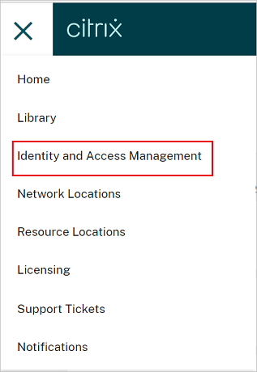
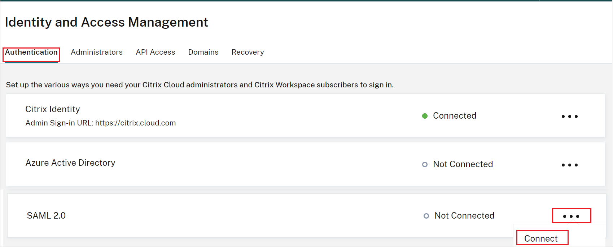
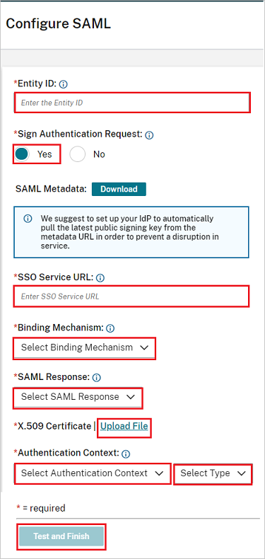

# Tutorial: Azure Active Directory single sign-on (SSO) integration with Citrix Cloud SAML SSO

In this tutorial, you'll learn how to integrate Citrix Cloud SAML SSO with Azure Active Directory (Azure AD). When you integrate Citrix Cloud SAML SSO with Azure AD, you can:

* Control in Azure AD who has access to Citrix Cloud SAML SSO.
* Enable your users to be automatically signed-in to Citrix Cloud SAML SSO with their Azure AD accounts.
* Manage your accounts in one central location - the Azure portal.

## Prerequisites

To get started, you need the following items:

* An Azure AD subscription. If you don't have a subscription, you can get a [free account](https://azure.microsoft.com/free/).
* A Citrix Cloud subscription. If you don’t have a subscription, sign up for one. 

## Scenario description

In this tutorial, you configure and test Azure AD SSO in a test environment.

* Citrix Cloud SAML SSO supports **SP** initiated SSO.

> [!NOTE]
> Identifier of this application is a fixed string value so only one instance can be configured in one tenant.

## Add Citrix Cloud SAML SSO from the gallery

To configure the integration of Citrix Cloud SAML SSO into Azure AD, you need to add Citrix Cloud SAML SSO from the gallery to your list of managed SaaS apps.

1. Sign in to the Azure portal using either a work or school account, or a personal Microsoft account.
1. On the left navigation pane, select the **Azure Active Directory** service.
1. Navigate to **Enterprise Applications** and then select **All Applications**.
1. To add new application, select **New application**.
1. In the **Add from the gallery** section, type **Citrix Cloud SAML SSO** in the search box.
1. Select **Citrix Cloud SAML SSO** from results panel and then add the app. Wait a few seconds while the app is added to your tenant.

## Configure and test Azure AD SSO for Citrix Cloud SAML SSO

Configure and test Azure AD SSO with Citrix Cloud SAML SSO using a test user called **B.Simon**. For SSO to work, you need to establish a link relationship between an Azure AD user and the related user in Citrix Cloud SAML SSO.This user must also exist in your Active Directory that is synced with Azure AD Connect to your Azure AD subscription.

To configure and test Azure AD SSO with Citrix Cloud SAML SSO, perform the following steps:

1. **[Configure Azure AD SSO](#configure-azure-ad-sso)** - to enable your users to use this feature.
    1. **[Create an Azure AD test user](#create-an-azure-ad-test-user)** - to test Azure AD single sign-on with B.Simon.
    1. **[Assign the Azure AD test user](#assign-the-azure-ad-test-user)** - to enable B.Simon to use Azure AD single sign-on.
1. **[Configure Citrix Cloud SAML SSO](#configure-citrix-cloud-saml-sso)** - to configure the single sign-on settings on application side.
1. **[Test SSO](#test-sso)** - to verify whether the configuration works.

## Configure Azure AD SSO

Follow these steps to enable Azure AD SSO in the Azure portal.

1. In the Azure portal, on the **Citrix Cloud SAML SSO** application integration page, find the **Manage** section and select **single sign-on**.
1. On the **Select a single sign-on method** page, select **SAML**.
1. On the **Set up single sign-on with SAML** page, click the pencil icon for **Basic SAML Configuration** to edit the settings.

   

1. On the **Basic SAML Configuration** section, perform the following step:

    In the **Sign-on URL** text box, type a URL using the following pattern:
    `https://<SUBDOMAIN>.cloud.com`

	> [!NOTE]
	> The value is not real. Update the value with your Citrix Workspace URL. Access your Citrix Cloud account to get the value. You can also refer to the patterns shown in the **Basic SAML Configuration** section in the Azure portal.

1. Citrix Cloud SAML SSO application expects the SAML assertions in a specific format, which requires you to add custom attribute mappings to your SAML token attributes configuration. The following screenshot shows the list of default attributes.

	

1. In addition to above, Citrix Cloud SAML SSO application expects few more attributes to be passed back in SAML response which are shown below. These attributes are also pre-populated but you can review them as per your requirements.The values passed in the SAML response should map to the Active Directory attributes of the user.
	
	| Name | Source Attribute |
	| -----|-----|
	| cip_sid | user.onpremisesecurityidentifier |
	| cip_upn | user.userprincipalname |
	| cip_oid | ObjectGUID (Extension Attribute ) |
	| cip_email | user.mail |
	| displayName | user.displayname |

	> [!NOTE]
	> ObjectGUID must be configured manually according to your requirements.

1. On the **Set up single sign-on with SAML** page, in the **SAML Signing Certificate** section,  find **Certificate (PEM)** and select **Download** to download the certificate and save it on your computer.

	

1. On the **Set up Citrix Cloud SAML SSO** section, copy the appropriate URL(s) based on your requirement.

	

### Create an Azure AD test user

In this section, you'll create a test user in the Azure portal called B.Simon.

1. From the left pane in the Azure portal, select **Azure Active Directory**, select **Users**, and then select **All users**.
1. Select **New user** at the top of the screen.
1. In the **User** properties, follow these steps:
   1. In the **Name** field, enter `B.Simon`.  
   1. In the **User name** field, enter the username@companydomain.extension. For example, `B.Simon@contoso.com`.
   1. Select the **Show password** check box, and then write down the value that's displayed in the **Password** box.
   1. Click **Create**.

	> [!NOTE]
	> This user needs to be synced from an Active Directory. For SSO to work, you need to establish a link relationship between an Azure AD user and the related user in Citrix Cloud SAML SSO.
	
### Assign the Azure AD test user

In this section, you'll enable B.Simon to use Azure single sign-on by granting access to Citrix Cloud SAML SSO.

1. In the Azure portal, select **Enterprise Applications**, and then select **All applications**.
1. In the applications list, select **Citrix Cloud SAML SSO**.
1. In the app's overview page, find the **Manage** section and select **Users and groups**.
1. Select **Add user**, then select **Users and groups** in the **Add Assignment** dialog.
1. In the **Users and groups** dialog, select **B.Simon** from the Users list, then click the **Select** button at the bottom of the screen.
1. If you are expecting a role to be assigned to the users, you can select it from the **Select a role** dropdown. If no role has been set up for this app, you see "Default Access" role selected.
1. In the **Add Assignment** dialog, click the **Assign** button.

## Configure Citrix Cloud SAML SSO

1. Log in to your Citrix Cloud SAML SSO company site as an administrator.

1. Navigate to the Citrix Cloud menu and select **Identity and Access Management**.

	 

1. Under **Authentication**, locate **SAML 2.0** and select **Connect** from the ellipsis menu.

	

1. In the **Configure SAML** page, perform the following steps.

	

	a. In the **Entity ID** textbox, paste the **Azure AD Identifier** value which you have copied from the Azure portal.

	b. In the **Sign Authentication Request**, select **No**.

	c. In the **SSO Service URL** textbox, paste the **Login URL** value which you have copied from the Azure portal.

	d. Select **Binding Mechanism** from the drop down, you can select either **HTTP-POST** or **HTTP-Redirect** binding.

	e. Under **SAML Response**, select **Sign Either Response or Assertion** from the dropdown.

	f. Upload the **Certificate (PEM)** from the Azure portal into the **X.509 Certificate** section.

	g. In the **Authentication Context**, select **Unspecified** and **Exact**  from the dropdown.

	h. Click **Test and Finish**.

## Test SSO 

In this section, you test your Azure AD single sign-on configuration with following options. 

* Access your Citrix Workspace URL directly and initiate the login flow from there.

* Log in with your AD-Synced Active Directory user into your Citrix Workspace to complete the test.

## Next steps

Once you configure Citrix Cloud SAML SSO you can enforce session control, which protects exfiltration and infiltration of your organization’s sensitive data in real time. Session control extends from Conditional Access. [Learn how to enforce session control with Microsoft Cloud App Security](/cloud-app-security/proxy-deployment-aad).